## Introduction

The United Nations (UN) 
[Global Working Group (GWG) on Big Data for Official Statistics](https://unstats.un.org/bigdata/) 
was created in 2014, as an outcome of the 45th
meeting of the UN Statistical Commission. In accordance with its terms
of reference, a major focus of the UN GWG is the promotion of capability
building and training in the use of Big Data sources. One of the GWG
Task Teams (TT) in Big Data sources is the 
[Satellite Imagery TT](https://unstats.un.org/bigdata/task-teams/earth-observation/).

The inaugural TT on Satellite Imagery and Geo-Spatial Data was
established in 2015 and chaired by the Australian Bureau of Statistics,
Australia. Members included Australia (Australian Bureau of Statistics
(ABS), Commonwealth Scientific and Industrial Research Organisation
(CSIRO), Australian Research Council Centre of Excellence For
Mathematical and Statistical Frontiers (ACEMS), Queensland University of
Technology (QUT)), Colombia (National Administrative Department of
Statistics, Departamento Administrativo Nacional de Estadística (DANE)),
Mexico (International Telecommunication Union (ITU)), Google, IBM
Research, the United Nations Statistics Division (UNSD) and Queensland
Department of Science, Information Technology and Innovation (DSITI) was
also an active member through Dr Michael Schmidt.

The final report by this team was published in 2017 as a 
[Handbook](https://unstats.un.org/bigdata/task-teams/earth-observation/UNGWG_Satellite_Task_Team_Report_WhiteCover.pdf).
This handbook provides an introduction to the use of
EO data for official statistics intended for new users. It includes
types of sources available, examples of using EO data to compile the
indicators for SDGs and methodologies for producing statistics from this
type of data. It also summarises the results of four pilot projects
produced by United Nations Satellite Imagery and Geospatial Data Task
Team members to explore the feasibility of using EO data for official
statistics, and additionally, other relevant and useful case studies.
Supplementary material includes a methodology literature review. In the
final chapter, guidelines are presented for National Statistical Offices
to consider and refer to when considering whether to use EO data in
producing official statistics, and issues to consider throughout the
implementation and output processes. An expanded summary of the contents
of this report is in the Appendix.

One of the goals of the Handbook, and indeed one of the highest
priorities of the UN GWG on Big Data for official statistics, is the
provision of training in the various areas of big data and data science,
and in particular in the area of earth observation data for agricultural
production statistics for evidence-based decision making in support of
national policies and international agreements. This is in support of
the Sustainable Development Goal (SGD) 2, Target 2.4: "by 2030, ensure
sustainable food production systems and implement resilient agricultural
practices that increase productivity and production, that help maintain
ecosystems, that strengthen capacity for adaptation to climate change,
extreme weather, drought, flooding and other disasters and that
progressively improve land and soil quality".

While training is a unilateral goal of the GWG and the TT, the conundrum
is that the audience for relevant training programs is very diverse,
ranging from beginners wishing to gain awareness or become highly
skilled, to skilled professionals wishing to upgrade their expertise in
specific facets of their work. This motivates more personalized
approaches to training, as opposed to a "one size fits all" approach.

Although bespoke courses can be developed, many individuals and entities
lack time, funding and skills to pursue this approach. Hence it is
beneficial to take advantage of the many courses on aspects of earth
observation data that are available online. However, the plethora of
courses is both a blessing and a curse. These courses range from easy to
advanced, conceptual to technical, and vary greatly by time to
completion and workload. They also range across topics, covering issues
such as access, management, analysis and interpretation. Moreover, the
courses are offered by a very wide range of providers with diverse
reputations and range widely in fee structures. As a result, an
individual or organization seeking to make use of this wealth of
potential online training can spend an enormous amount of time sifting
through the options to identify courses that most suit their needs and
expectations.

A solution to this conundrum that was developed by the authors for the
UN GWG TT was the development of a Personalised Learning Program (PLP).
The PLP provides a framework for identifying an individual's current
skill levels, learning ambitions and training parameters, and creating a
suite of online courses that will provide a bridge between "where they
are at now" and "where they want to be" in terms of their skills.

This chapter provides a brief overview of the Personalised Learning
Program for training in the use of earth observation data for official
statistics. Although not discussed here, the PLP Framework can be
applied more generally to other training needs.

## Overview of PLP Framework

The PLP Framework is a digital infrastructure that links four main
components:

* PLP 1: User Profiles
* PLP 2: Knowledge Areas
* PLP 3: Learning Modules within the Knowledge Areas
* PLP4: Catalogue of Online Courses for each Learning Module

The digital infrastructure creates an individualised linkage of a user's
needs, identified through PLP1 and PLP2, with relevant modules and
courses identified through PLP3 and PLP4. The recommended program of
courses is compiled as a "shopping basket" that the user can then assess
and personalise according to their preferences.

The PLP is accessed through a web-based interface that is displayed on
the [UN GWG website](https://unstats.un.org/bigdata/task-teams/training/catalog/). The webpage provides the following options
relevant to the PLP:

* Learning paths: identify resources that correspond to your personal
work setting, current knowledge and planned goals.

* Search the Training Catalog: allows a direct search of resources
(courses and materials) that help to develop skills for using big data
sources in the production of official statistics.

The website also provides the capacity for updating and evaluating
courses through the following options:

* Keeping the catalog updated: Big Data is a very dynamic field. New
needs and opportunities for training constantly emerge. To help us
keep the catalog up to date, you are encouraged to inform us about new
courses or materials that you have encountered and validate existing
information.

* Course evaluations: You are encouraged to provide feedback on
courses/materials listed in this catalog. Your feedback will help us
to improve the selection of courses in the catalog and provide
guidance to course developers.

Other products available on the GWG website that are complementary to
the PLP include the following:

* A Big Data Maturity Matrix: a self-assessment tool to help
statistical offices understand the extent to which they have developed
big data infrastructure and applications and to identify its strengths
and weaknesses from which a development plan or road map may be
produced.
* Big Data Competency Framework: provides the basis for linking
training resources to existing and needed skills for the use of big
data and identification of skill gaps, forming the basis for
determining the personal learning paths.

## PLP 1: User Profiles

In the design phase, a suite of user profiles was co-developed with TT
partners to ensure that the PLP would meet the needs of diverse users.
The user profiles included roles, professional background, use cases and
(where relevant) expected software and programming skills.

An example of the user profiles is displayed in @tbl-user-profiles. Three roles are
illustrated -- Manager (M), Data Scientist (D) and GIS Expert (G) --
with associated technical skills described in the professional
background, software and programming columns. The software refers to the
digital products provided to those enrolled in the course -- FO and FD
refer to free software platforms available for online or desktop,
respectively, and CO and CD refer to commercial online and desktop
software for which course providers distribute a temporary license.

|     Role    |     Professional Background    |     ID    |     Use Case                                                                                                                                                                   |     Software    |     Programming language    |
|-------------|----------------------------------|-----------|--------------------------------------------------------------------------------------------------------------------------------------------------------------------------------|------------------|-----------------------------|
|     M       |     All                          |     E1    |     EO and GIS for agricultural statistics: high   level introduction to the new technology and paradigm shift provided by Big   Data, Cloud Computing and Machine learning    |     NA           |     NA                      |
|     M/G     |                                  |     E2    |     Basics of GIS: raster and vector mode data;   Georeferencing statistical data and production of maps; WebGis Dashboards and   Web Gis apps  (e.g. Story maps)              |     NA           |     NA                      |
|     G       |                                  |     E3    |     Land cover mapping Supervised methods desktop   users                                                                                                                      |     FD/CD        |     NA/Python               |
|     G       |                                  |     E4    |     Crop mapping    Supervised methods desktop users                                                                                                                           |     FD/CD        |     NA/Python               |
|     G       |                                  |     E5    |     Development of web-gis apps and   dashboards                                                                                                                               |     CD/CO        |     NA/Python               |
|     G       |                                  |     E6    |     Extracting land cover and land use statistics   from available GIS sources (e.g Forest and Crop cover from ESA maps)                                                       |     CD/CO        |     NA/Python               |
|     G/D     |                                  |     E7    |     Field data collection - Best practices,   GPS,  field spectrometer                                                                                                         |                  |                             |
|     G/D     |     All                          |     M1    |     Land cover mapping using optical data in   Google Earth Engine/R/Python                                                                                                    |     FO           |     Python/R/Javascript     |
|     G/D     |                                  |     M2    |     Crop type mapping using optical data in Google   Earth Engine/R/Python                                                                                                     |     FO           |     Python/R/Javascript     |
|     G/D     |                                  |     M3    |     Crop type mapping using unsupervised method in   Google Earth Engine/R/Python                                                                                              |     FO           |     Python/R/Javascript     |
|     G/D     |                                  |     M4    |     Crop type mapping using unsupervised method in   Google Earth Engine/R/Python                                                                                              |     CD           |     Python/R/Javascript     |
|     G/D     |                                  |     M5    |     Field data collection with drones                                                                                                                                          |     CD           |     N/A                     |
|     G/D     |     All                          |     A1    |     Classification using Optical and SAR   supervised                                                                                                                          |     any          |     Python/R/Javascript     |
|     G/D     |                                  |     A2    |     Classification using Optical and SAR   unsupervised                                                                                                                        |     any          |     Python/R/Javascript     |
|     G/D     |                                  |     A3    |     Fourier transform and Principal Component   analysis                                                                                                                       |     any          |     Python/R/Javascript     |
|     G/D     |                                  |     A4    |     Crop type mapping using Optical and SAR                                                                                                                                    |     any          |     Python/R/Javascript     |
|     G/D     |                                  |     A5    |     Convolutional network and Deep Learning - Land   cover and Crop mapping                                                                                                    |     any          |     Python/R/Javascript     |
|     G/D     |                                  |     A6    |     Working with hyperspectral data                                                                                                                                            |     any          |     Python/R/Javascript     |
: Illustration of co-developed user profiles. {#tbl-user-profiles}


## PLP 2: Knowledge Areas

Based on the user profiles, five essential knowledge areas for working
with earth observation data are identified in the PLP -- designed to
cover all aspects of working with Earth Observations data. These are
displayed in @fig-1-learning below.

```{r}
#| echo: FALSE
#| label: fig-1-learning
#| out-width: 50%
#| fig-cap: |
#|  Knowledge areas for technical engagement with EO for agricultural statistics. 
#| fig-align: center
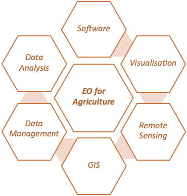
```

## PLP 3: Learning Modules with Knowledge Areas

For each of the five knowledge areas, Introductory, Intermediate and
Advanced modules are identified in the PLP. The overall structure of the
Knowledge Framework comprising the Knowledge Areas and corresponding
Modules is depicted in @fig-2-learning, with a break-out diagram for one of the
Knowledge Areas -- Remote Sensing -- provided in @fig-3-learning for
readability. The Modules are linked to a series of questions
corresponding to skills that were identified as important in the
development of the User Profiles. The questions corresponding to the
Remote Sensing Modules are depicted in @fig-4-learning.

```{r}
#| echo: FALSE
#| label: fig-2-learning
#| out-width: 90%
#| fig-cap: |
#|  Depiction of Knowledge Framework comprising five Knowledge Areas and  corresponding Learning Modules at Introductory, Intermediate and Advanced levels. 
#| fig-align: center
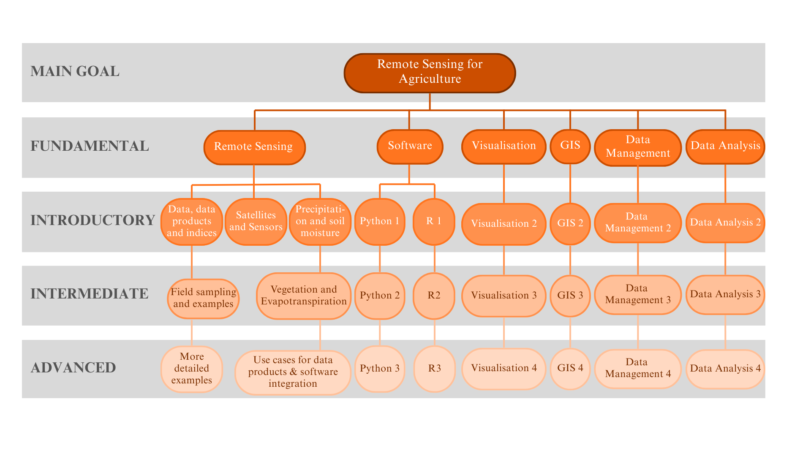
```

```{r}
#| echo: FALSE
#| label: fig-3-learning
#| out-width: 100%
#| fig-cap: |
#|  Details of Learning Modules in the Remote Sensing Knowledge Area. 
#| fig-align: center
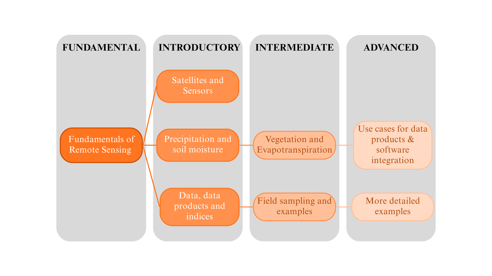
```

```{r}
#| echo: FALSE
#| label: fig-4-learning
#| out-width: 100%
#| fig-cap: |
#|  Examples of underpinning questions linking the Modules in the Remote Sensing Knowledge Area to the skills expected in the User Profile. 
#| fig-align: center
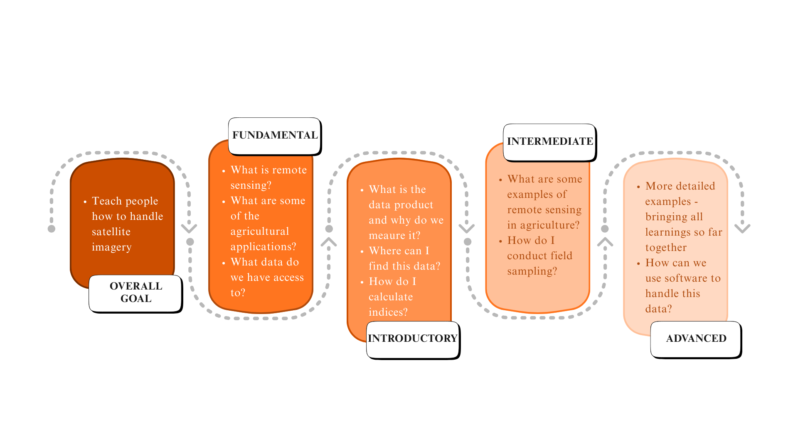
```

## PLP4: Catalogue of Online Courses for each Module**

The PLP is underpinned by a detailed catalogue of relevant online
courses that were available at the time of development (2021). Courses
were required to satisfy the following criteria:

* clearly relevant to a Knowledge Area

* from a well-known provider

* clearly specified the course details, including the target level
(fundamental to advanced), time required to complete the course,
course content, required software and pre-requisites.

* access to free fee options

Metadata for each course was developed to include the Knowledge Area,
the relevant Module(s), the relevant user profiles (manager, data
scientist, GIS expert) and an ID based on training/difficulty level (see
@tbl-user-profiles), as well as the course details as described above. The metadata
files were then collated as searchable entries in the PLP catalogue.

## Putting it all together

The overall PLP invites a user to identify their current skill level on
a scale of 1-5 (1 basic, 5 advanced) for each of the five Knowledge
Areas. They are then invited to identify the skill level that they would
like to achieve through the learning program, using the same scale. An
automated search of the PLP catalogue is then undertaken to satisfy the
pathway from current to desired skill levels in the relevant Knowledge
Areas. The results are returned as a list of Recommended Courses which
the user can choose to add to their "shopping basket". The user can then
return to the search options for further courses or access their
Learning Basket for a completed program of courses that are designed to
meet their individual learning needs. This process is depicted in 
@fig-5-learning.

```{r}
#| echo: FALSE
#| label: fig-5-learning
#| out-width: 100%
#| fig-cap: |
#|  Conceptual workflow for the PLP. 
#| fig-align: center
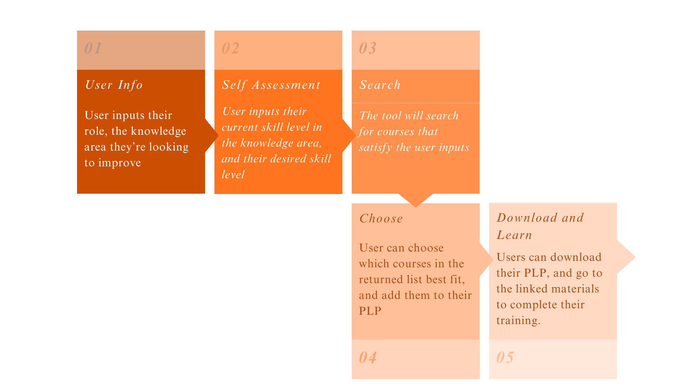
```

A representation of the self-assessment interface is depicted in @fig-6-learning.

```{r}
#| echo: FALSE
#| label: fig-6-learning
#| out-width: 90%
#| fig-cap: |
#|  The PLP process depends heavily on a user's self-assessment and the stored metadata on each course, to ensure a relevant list of courses is returned. 
#| fig-align: center
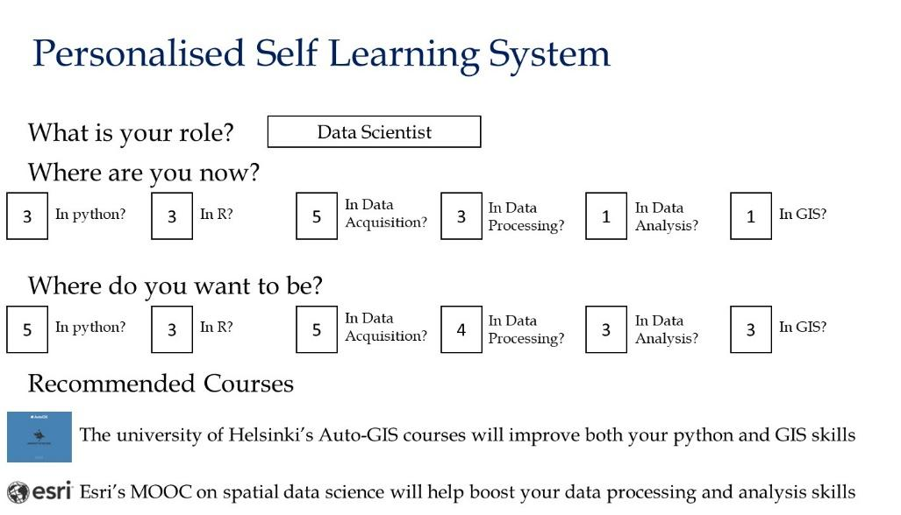
```

## Digital Infrastructure

The PLP is available online through two portals: 
a [UN TT webpage](https://unstats.un.org/bigdata/task-teams/training/catalog/LearningPath) and an [R Shiny app](https://qutschoolofmaths.shinyapps.io/uncoursetoolapp/). 
A public [github repository](https://github.com/AmyStringer/UNCourseTool) contains relevant material underpinning these platforms.

Both portals have similar user interfaces. The UN TT webpage that
displays the PLP tool is shown in @fig-7-learning. Notwithstanding this
external similarity, there is quite a difference between the catalogue
of courses in the two repositories. For example, none of the remote
sensing courses are on the UN TT webpage. The reader is recommended to
inspect both platforms for more complete information.

```{r}
#| echo: FALSE
#| label: fig-7-learning
#| out-width: 90%
#| fig-cap: |
#|  PLP for training in the use of earth observation data for agricultural statistics, displayed in the UN GWG website.
#| fig-align: center
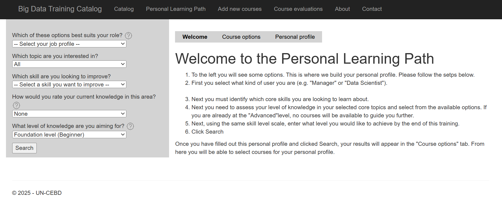
```


At the time of writing this chapter, the GWG Training Catalogue
comprises 268 courses/materials relevant to training in Big Data and
official statistics. This is a broader selection of material than is
available through the PLP since not all the entries are online courses
related to earth observation and agricultural statistics.

In addition to the interface to the PLP Catalogue described above, the
catalogue entries can be searched directly by entering key words or
phrases for relevant courses/materials. A blank field enables the
display of all entries. For example, the entries returned from a search
using the keyword 'satellite' are shown in Table 2.

As well as a basic search, an advanced search of the Catalogue enables
selection of the following: language, provider name, provider type (all,
academic/commercial, national/international), gives certificate, cost,
type (part of program or specialisation, handbook, modular program,
summer session, webinar), synchronous/asynchronous/hybrid, length,
availability (when the course is run).

An option is also provided to add a course to the Catalogue.

|     ID     |     Title                                                                                                               |     Provider    |     Language            |     Details Link    |
|------------|-------------------------------------------------------------------------------------------------------------------------|-----------------|-------------------------|---------------------|
|     202    |     Agricultural Crop Classification with Synthetic Aperture Radar   and Optical Remote Sensing                         |     NASA        |     English; Spanish    |     Details         |
|     204    |     Satellite Remote Sensing for Agricultural Applications                                                              |     NASA        |     English             |     Details         |
|     206    |     Land Cover Classification with Satellite Imagery                                                                    |     NASA        |     English; Spanish    |     Details         |
|     208    |     Introduction to synthetic aperture radar                                                                            |     NASA        |     English; Spanish    |     Details         |
|     209    |     Applications of Remote Sensing for Monitoring the Water Budget   Within River Basins                                |     NASA        |     English; Spanish    |     Details         |
|     210    |     Groundwater Monitoring using Observations from NASA’s Gravity   Recovery and Climate Experiment (GRACE) Missions    |     NASA        |     English             |     Details         |
|     211    |     Remote Sensing of Coastal Ecosystems                                                                                |     NASA        |     English; Spanish    |     Details         |
|     214    |     Introduction to Global Precipitation Measurement (GPM) Data and   Applications                                      |     NASA        |     English; Spanish    |     Details         |
|     215    |     Accuracy Assessment of a Land Cover Classification                                                                  |     NASA        |     English             |     Details         |
|     216    |     Investigating Time Series of Satellite Imagery                                                                      |     NASA        |     English; Spanish    |     Details         |
|     217    |     Applications of GPM IMERG Reanalysis for Assessing Extreme Dry   and Wet Periods                                    |     NASA        |     English             |     Details         |
|     218    |     Change Detection for Land Cover Mapping                                                                             |     NASA        |     English             |     Details         |
|     220    |     Creating and Using Normalized Difference Vegetation Index (NDVI)   from Satellite Imagery                           |     NASA        |     English             |     Details         |
|     253    |     GIS Specialization                                                                                                  |     UC Davis    |     English             |     Details         |
|     291    |     Tourism Satellite Accounts                                                                                          |     Eurostat    |     English             |     Details         |
|     292    |     Introduction to statistics production with the use of   geographical information systems (GIS)                      |     EFTA        |     English             |     Details         |
: Example of search of Training Catalog using the keyword 'satellite'. 16 entries returned from the UN TT webpage. Note that more courses are available through the RShiny app. {#tbl-courses}

## Case Study: Crop mapping using the Sen2Agri toolbox

The Sen2Agri toolbox developed by Pierre Defourny, Sophie Bontemps 
and their team at UC Louvain is a
user-friendly software that allows for automatic acquisition and
preprocessing of EO data, manual upload of in-situ data, and production
of crop maps using a Random Forest classifier. It can run both locally
and on the Cloud. A cameo of the Sen2Agri process is shown in 
@fig-8-learning.

```{r}
#| echo: FALSE
#| label: fig-8-learning
#| out-width: 90%
#| fig-cap: |
#|  Process map underpinning the Sen2Agri tool box. 
#| fig-align: center
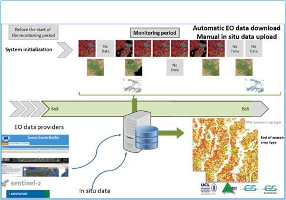
```


A program that could be implemented for training in the use of Sen2Agri
is shown in @fig-9-learning.


```{r}
#| echo: FALSE
#| label: fig-9-learning
#| out-width: 90%
#| fig-cap: |
#|  Self learning program for the case study. 
#| fig-align: center
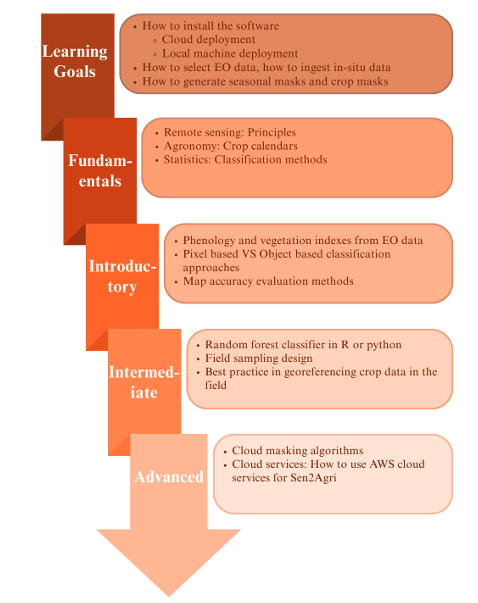
```

## Discussion and Future Work

This chapter has described the Personalised Learning Program (PLP)
developed for the United Nations Global Working Group (Big Data) Task
Team on the use of earth observation data for agricultural statistics.
The PLP is publicly available on the UN GWG website.

The appeal of the PLP is the ability to quickly identify trusted courses
that bridge the gap between a user's current and desired skill levels in
key knowledge areas. The courses recommended by the PLP are tailored to
the type of user (manager, data scientist, GIS expert).

The PLP is underpinned by a searchable catalogue that comprises metadata
on a large suite of courses identified as relevant to the five knowledge
areas. This list was obtained through extensive manual searches at the
time of development. Users are invited to update and expand the courses
listed in the catalogue and provide feedback on the merit of any courses
undertaken.

The field of big data in general, and remote sensing/earth observation
in particular, is growing enormously. Correspondingly, there is an
explosion in online courses in general, and in the area relevant to the
PLP in particular. Although the current PLP catalogue is valuable, it
has much more value if the entries are regularly checked to ensure that
courses are still available, and a comprehensive search of potential new
courses is undertaken. The advent of Large Language Models (LLMs) such
as ChatGPT provide a convenient way to perform these updates. LLMs also
provide an alternative method for extracting training needs from users
and delivering training options. This potential has not been pursued
here but is a worthy future project.

A related worthy project is the use of the Training Catalogue and the
PLP to create expanded 'spines' of training programs. The spine is made
up of the higher-level topics, or knowledge areas and shows how they
break down into recommended courses. An example is shown in @fig-10-learning
with the spine now comprising vegetation, soil moisture, precipitation
and evapotranspiration, in addition to the existing Knowledge Areas of
Remote Sensing, Visualisation and Software Fundamentals. An example of a
potential corresponding Spine course is shown in @fig-11-learning.

```{r}
#| echo: FALSE
#| label: fig-10-learning
#| out-width: 90%
#| fig-cap: |
#|  Example of future 'spine' that could be developed as an expansion of the PLP. Orange boxes form the spine and some recommendations for further reading are provided for each topic. 
#| fig-align: center
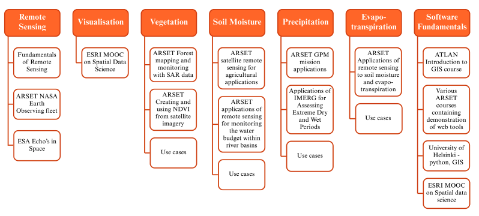
```


```{r}
#| echo: FALSE
#| label: fig-11-learning
#| out-width: 90%
#| fig-cap: |
#|  Example of a spine course. 
#| fig-align: center
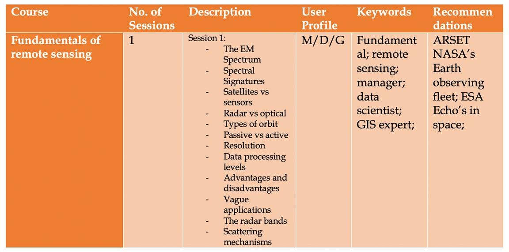
```

A range of valuable training online and in-person courses on earth
observation data and agricultural statistics is also provided at
national and regional levels by entities such as the UN Regional Hubs.
These courses are currently not included in the PLP Catalogue, but they
should be.

As detailed above, the UN website also includes a Maturity Matrix
and Competency Framework. These documents provide excellent support
material for organisations and are also highly recommended reading for
individuals.

A final note is that the current PLP does not provide certification or
credentialing. These issues have been discussed extensively by other UN
Task Teams. Interested readers are referred to the webpage for the 
[Task Team on Training, Competencies and Capacity Building](https://unstats.un.org/bigdata/task-teams/training/index.cshtml).

## Appendix: Summary of White Paper, "Earth Observations for Official Statistics 2017"{-}

In 2017 a white paper was published by the United Nations Task Team on
Satellite Imagery and Geospatial Data titled 
["Earth Observation for Official Statistics"](https://unstats.un.org/bigdata/task-teams/earth-observation/UNGWG_Satellite_Task_Team_Report_WhiteCover.pdf). 
This white paper, intended as a handbook, was
written by an interdisciplinary team of members of the United Nations
Task Team on Satellite Imagery and Geospatial Data. Led by the
Australian Bureau of Statistics and Chief Methodologist Dr Siu-Ming Tam
as then chair of the task team, the intention was to provide a guide for
National Statistical Offices considering using satellite imagery (known
as earth observations) data for official statistics. It was an intended
input to the United Nation Global Working Group on Big Data for Official
Statistics report to the United Nations Statistical Commission for 2017.

Here we provide a brief summary of each of the substantive chapters
(2-5, Chapter 1 is introduction and overview and Chapter 6 is a
conclusion).

**Chapter 2- Data sources** (lead authors Dr Arnold Dekker, Dr Alex Held
and Ms Flora Kerblat from CSIRO, Australia). This chapter introduces
types of earth observation systems (low, medium and geostationary) and
provides a detailed overview of freely available satellite sensor data
current as at 2017. It describes categories of methods for analysing
these data (empirical, semi-empirical, physics-based, object based image
analysis (OBIA) methods and artificial intelligence (AI) and machine
learning methods. It includes case study examples, such as the
Geoscience Australia data cube, which provided proof of concept for
additional CEOS datacubes, and examples of United Nations Sustainable
Development Goals (SDGs) that can be monitored using earth observation
data. This chapter distinguishes between unprocessed earth observation
data and analysis ready data and discusses validity of different data
and assessing whether it is fit for purpose. Importantly, the chapter
provides mapping between statistician and earth observations scientist
definitions of: Relevance, Timeliness, Accuracy, Coherence,
Interpretability, and Accessibility, and add two additional definitions
from the EO discipline; integrity and utility for assessing EO data
quality for use in official statistics1(Table 2).

**Chapter 3- Methodology** (lead authors Jacinta Holloway-Brown
(Australian Bureau of Statistics) and Kerrie Mengersen (Queensland
University of Technology, Australia). This chapter provides a general
three step approach to analysing earth observation data and big data
more broadly, including data selection and management, (step 1:
pre-processing), selecting analytic aim and method (step 2- analysis)
and critically assessing results and performing accuracy assessment
(step 3- evaluation)1. It describes potential software products and
provides an overview of the UN FAO accuracy assessment approach for map
data. Importantly, it provides an extensive literature review and
detailed summary of statistical machine learning methods suited to
analysing earth observation data. These are categorised into four main
analytic aims: classification, clustering, regression and dimension
reduction. Classification methods include logistic and multinomial
regression (generalised linear models), support vector machines, neural
networks, classification trees, k-nearest neighbours and intra- or
sub-pixel classification. Clustering methods include mixture models,
k-means and agglomerative clustering. Regression methods include linear
regression and extensions, regression trees and variations such as
random forests, state space models, neural networks, spectral angle
classification and functional analysis. Finally, dimension reduction
methods include functional data analysis and principal components
analysis.

**Chapter 4 - Pilot projects and case studies** (Authorship listed on
each pilot project and case study). This chapter provides examples to
demonstrate how Earth Observation data is being used in practice by NSOs
and industry. It summarises three pilot projects produced by Task Team
members; Australian Bureau of Statistics (ABS), Australia, Instituto
Nacional de Estadística Geografíca e Informática (INEGI), Mexico,
Departamento Administrativo Nacional de Estadistica (DANE), Colombia and
Google. These are as follows:

*Pilot Project 1:* Application of satellite imagery data in the
production of agricultural statistics, undertaken by the Australian
Bureau of Statistics (ABS). Authorship led by Jennifer Marley, Ryan
Defina, Kate Traeger, Daniel Elazar, Anura Amarasinghe and Gareth Biggs.

*Pilot Project 2:* Study on Skybox Commodity Inventory Assessment, led
by UNSD and undertaken by Google. Authorship led by Patrick Dunagan.

*Pilot Study 3:* Study on the use of satellite images to calculate
statistics on land cover and land use, undertaken by Departamento
Administrativo Nacional de Estadistica (DANE), Colombia. Authorship led
by Sandra Yaneth Rodriquez.

Additionally, this chapter describes five case studies. Each pilot
project and case study includes information about the data
specifications, data processing, data selection and any quality issues.

*Case Study 1:* an evaluation of the implementation of various machine
learning techniques for analysis of EO data for crop classification,
undertaken by Queensland University of Technology (QUT) Australia.
Authorship led by Brigitte Colin, Benjamin Fitzpatrick and Kerrie
Mengersen (QUT).

*Case Studies 2 and 3:* two published implementations of EO data
analyses for estimation of crop yield. Case study 2 by Gao et al (2017)
titled 'Toward mapping crop progress at field scales through fusion of
Landsat and MODIS imagery'2. Case study 3 by Yeom and Kim (2015) titled
'Comparison of NDVIs from GOCI and MODIS Data towards Improved
Assessment of Crop Temporal Dynamics in the Case of Paddy Rice'3.

*Case Studies 4 and 5:* Two fully operational methods developed for the
analysis of EO data to derive official statistics. Case study 4 by
Queensland Department of Science, Information Technology and Innovation
(DSITI), Australia is titled 'An Operational Framework for large area
mapping of past and present cropping activity using seasonal Landsat
images and time series metrics'. Authorship led by Matthew Pringle and
Michael Schmidt (DSITI).

*Case study 5:* by Statistics Canada is titled 'An operational approach
to integrated crop yield modelling using remote sensing, agroclimatic
data and survey data'. Authorship led by Statistics Canada.

**Chapter 5- Recommendations** (lead authors Jacinta Holloway-Brown and
Siu-Ming Tam). This chapter provides guidelines and issues for National
Statistical Offices to consider when deciding to implement earth
observations data sources into their statistical production processes.
It describes potential applications of EO for official statistics, such
as partial data substitution and generating new insights. It includes a
cost-benefit analysis guide specific to the use of Big Data by Tam
(co-author of Chapter 5) and guidance on selecting an appropriate EO
dataset based on advice by CSIRO, Australia. Practical considerations
such as minimum data requirements (@fig-12-learning), data access and ownership,
quality assessment and output dissemination are also described. Finally,
this chapter provides further recommendations for practitioners working
with EO data for the first time such as identifying skills, undertaking
training, engaging with the public around privacy perceptions and
disseminating results and sharing experience through global channels
such as the United Nations Task Teams and broader Global Working Groups
to foster innovation and collective best practice.

```{r}
#| echo: FALSE
#| label: fig-12-learning
#| out-width: 90%
#| fig-cap: |
#|  Assessing data source against minimum data requirements for the use of EO data. 
#| fig-align: center
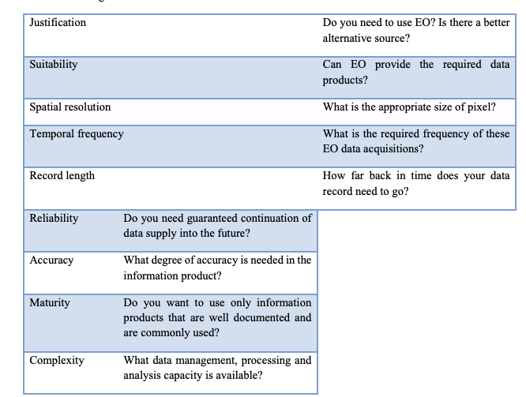
```


Supplementary material includes a methodology literature review, and the
full reports of the pilot projects.
