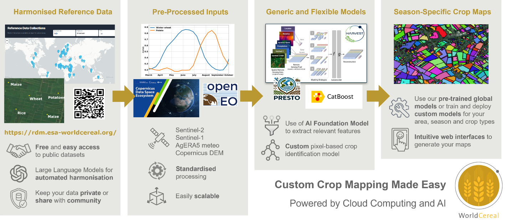
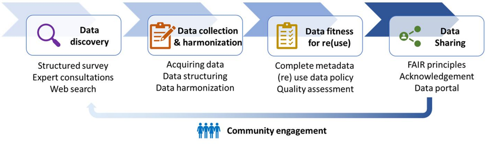
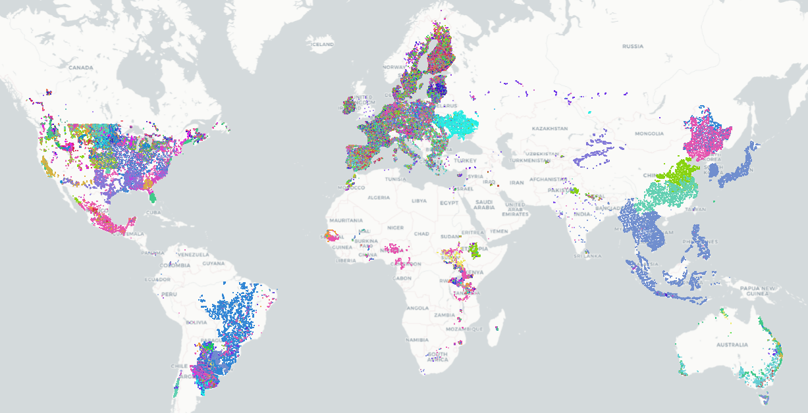
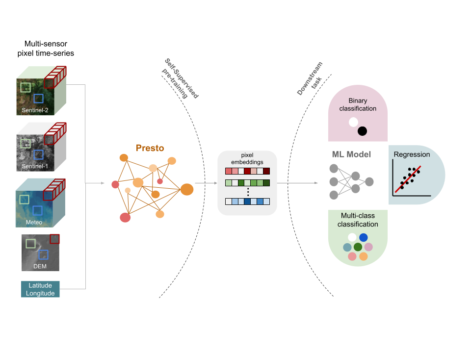
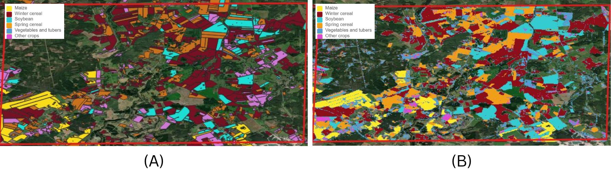

## Introduction

Reliable, timely information on what crops are grown where and when, is vital for national and global food security @BeckerReshef2023. For national statistical offices (NSOs), such data underpin production estimates, food balance sheets, and policy decisions. Yet, accurate crop statistics remain difficult to obtain. Field surveys and administrative reports are costly, slow, and often incomplete. In many countries, especially where smallholder farming dominates, data collection is further constrained by fragmented landscapes and limited budgets.

Earth observation (EO) has become an important complement to traditional data sources, particularly since the advent of free and open high resolution (10 m) radar and optical data from the Copernicus Sentinel-1 and -2 missions in 2017. @Zhang2025 provide an exhaustive overview of recent EO-based crop mapping initiatives, both at global and regional scale. Most crop mapping applications to date have been case-specific: models are typically developed for the most dominant crops in a single country, trained on a single year using local ground truth data, tuned to local conditions, and are rarely transferable. Several global maps for individual crops have been released, but because training data and models are not disclosed, these efforts cannot easily be reproduced or extended.

Two obstacles have limited broader uptake. First, reference data -- the ground truth needed to train and validate models -- are scarce, heterogeneous and often closed-source. Second, models are difficult to transfer in space and time: a classifier trained on maize in Argentina may perform poorly in Ethiopia, or even in Argentina in a different year. For NSOs, this means EO-based crop mapping approaches and derived maps often lack the consistency and reliability needed for official statistics.

The [WorldCereal](https://esa-worldcereal.org/en) project, funded by the European Space Agency, was launched in 2020 to overcome these barriers. Its ambition is to create an open, scalable, and reproducible local-to-global crop mapping system (@fig-1). It rests on two pillars. The first is harmonised reference data, managed through the *WorldCereal Reference Data Module* (RDM). The second is a transferable classification system that converts satellite time series into crop maps. The first version (v1, 2023) used expert-defined features and machine learning to produce the world's first global seasonal crop maps at 10 m resolution for 2021 @VanTricht2023b. The second version (v2) replaces expert features with machine-learned features, so-called embeddings, using a geospatial foundation model, improving transferability across regions and seasons @Butsko2025. In addition, WorldCereal is designed with usability in mind. A web-based [Processing Hub](https://hub.esa-worldcereal.org/home) lets users generate their own maps by selecting a region and season of interest, without coding. Users can also add their own - private - reference data to further tailor outputs to their specific needs. By doing so, users can benefit from globally learned crop-specific representations of satellite data and finetune it to their local needs with their own data.

```{r}
#| echo: FALSE
#| eval: TRUE
#| label: fig-1
#| out-width: 100%
#| fig-cap: Main components and features of the WorldCereal crop mapping system
#| fig-align: center

```

For NSOs, WorldCereal offers a way to complement and strengthen agricultural statistics. By providing consistent, timely, and spatially detailed crop maps, it enables more accurate production estimates and supports early warning of food shortages. Importantly, all data, models, and workflows are transparent and reproducible. In the following sections, we describe the two pillars of the system and illustrate, through two experiments, temporal robustness and spatial transferability, key challenges for official statistics.

## Reference Data: The WorldCereal RDM {#sec-reference-data}

The *WorldCereal Reference Data Module* (RDM; @Karanam2024) addresses one of the biggest bottlenecks in crop mapping: the lack of accessible, harmonised reference data. Many crop type data collection campaigns have been initiated in the past, but typically remain disconnected, each characterized by its own data formats, nomenclature, license and access point. WorldCereal has set up a community driven framework for reference data collection and re-use, covering data discovery, collection, harmonization, documentation, quality assessment and publication (@fig-2, @Boogaard2023).

```{r}
#| echo: FALSE
#| eval: TRUE
#| label: fig-2
#| out-width: 100%
#| fig-cap: WorldCereal conceptual framework on reference data for crop mapping (adopted from @Boogaard2023).
#| fig-align: center

```

The RDM integrates data from diverse sources including field surveys, parcel registration systems, citizen science platforms like LACO-Wiki and Geo-Wiki, and institutional contributions from GEOGLAM JECAM sites, CGIAR centers, and NASA Harvest. All records are harmonised to a common crop and land cover legend, enriched with metadata, and assigned a confidence score reflecting spatial, temporal, and thematic quality. High-quality data, such as farmer declarations, receive the strongest scores, while crowd-sourced observations are more variable. These scores can be used to weight samples during model training.

New data can be added through an intuitive web interface, where organisations and individuals upload datasets that are automatically harmonised. Contributors decide whether their data remain private, can be used for training the official WorldCereal algorithms, or are published openly. This flexibility encourages sharing while respecting ownership.

The RDM can be accessed via a [web portal](https://rdm.esa-worldcereal.org/) or an [API](https://rdm.esa-worldcereal.org/api) for integration into processing workflows. Furthermore, a dedicated [Jupyter Notebook](https://github.com/WorldCereal/worldcereal-classification/blob/main/notebooks/worldcereal_RDM_demo.ipynb) allows anyone to interactively explore, access, filter and download the publicly available data. Finally, individual datasets are also published on Zenodo to ensure long-term availability @Boogaard2025. By end of 2025, the RDM contained close to 111 million harmonised observations on land cover and crop type, spread across 159 datasets (@fig-3). For NSOs, the RDM reduces the cost of collecting training data, allows them to contribute national datasets while retaining control, and enhances comparability of crop statistics across countries. In short, it is the backbone of WorldCereal: a trusted, continuously growing library of reference data ensuring both global scalability and local customizability.

```{r}
#| echo: FALSE
#| eval: TRUE
#| label: fig-3
#| out-width: 100%
#| fig-cap: |
#|   Overview of public data availability in the WorldCereal Reference Data Module -- status October 2025. Points are colored according to crop type label.
#| fig-align: center

```

## Classification System: From Expert Features to Foundation Models

The second pillar of WorldCereal is its classification system -- the algorithms that transform satellite time series into crop maps. The first version, developed in 2021, relied on expert-defined temporal and spectral features from Sentinel-1 and Sentinel-2 imagery, combined with auxiliary data such as elevation and meteorological variables @VanTricht2023a. These features were used to train a CatBoost classification model, a gradient-boosted decision tree algorithm. The system successfully produced the first global seasonal crop maps at 10 m resolution @VanTricht2023b, demonstrating the feasibility of large-scale crop mapping. However, while accurate in regions with ample training data, its transferability to data-scarce regions was limited @Lesiv2024.

### The promise of geospatial foundation models {#sec-foundational-model}

The evolution of WorldCereal into its second phase coincided with a turning point in Earth Observation: the emergence of geospatial foundation models (@Tseng2023; @Klemmer2023). As discussed in @sec-reference-data, the limited availability and restricted sharing of labelled reference data remain key bottlenecks for large-scale agricultural mapping. In contrast, petabytes of multi-sensor satellite imagery are freely accessible yet largely unlabelled. Foundation models bridge this gap by learning generic representations from unlabelled data and transferring them to specific mapping tasks with only limited labelled samples. Their purpose is to reduce the dependency of operational mapping systems on extensive, curated reference datasets, and to overcome the supervised-learning dependency on large, localised training samples.

For a global, operational-scale system such as WorldCereal, this potential is highly attractive, but it also raises strict requirements which is why to date, geospatial foundation models have rarely been deployed operationally and with success. According to our deployment protocol, requirement-setting is Step 1 in operationalising a foundation model (adapted from @Butsko2025). The key requirements defined for the WorldCereal crop mapping application include:

- **Computationally friendly**: The system must run within constrained compute budgets, memory footprints and latency bounds typical of production workflows, rather than purely research-scale setups. It must also support seasonal re-runs and global coverage without prohibitive costs. Lightweight finetuning or downstream application by users is key to successfully bring the power of these models to individual users.

- **Operationally deployable**: The model must be robust, maintainable and suitable for an operational environment (not just a research prototype). This means predictable performance across regions and seasons, minimal manual tuning, reproducibility, monitoring and support for production-grade workflows.

- **Easy ingestion into an existing mature framework**: WorldCereal already builds on a mature processing architecture, workflows and modules. Any new foundation model must integrate smoothly into such a workflow, enabling reuse of existing preprocessing, classification downstream layers, cloud infrastructure and user-interfaces, with minimal re-engineering.

- **Spatial and temporal generalisation**: Since the system must map globally and seasonally, the chosen model must generalise across geography (diverse agro-ecological zones) and time (across years, changing climate conditions, changes in satellite data availability).

- **Data efficiency and adaptability**: Because labelled training data remain limited in many regions, the model must be able to fine-tune or adapt with only a small number of local samples, and still deliver acceptable accuracy.

Rather than adopting a foundation model purely on promise, WorldCereal Phase II therefore undertook a rigorous benchmarking campaign to assess whether existing geospatial foundation models could satisfy all of these requirements. This campaign involved integrating such model into the classification pipeline, fine-tuning it with available reference data, and evaluating its performance across diverse agro-ecological zones, with particular attention to compute cost, runtime behaviour, robustness of transfer (across space and time), and integration into the existing system.

### Integrating Presto in WorldCereal

During development, several foundation models were evaluated that had been released at that time (e.g. SatMAE, CROMA, ScaleMAE, Presto), and Presto was selected for its efficiency, open-source availability, and compatibility with the WorldCereal processing architecture, aligning well with our requirements listed in Section @sec-foundational-model. Presto, developed by NASA Harvest, is a lightweight transformer-based feature extractor pre-trained on global Sentinel-1/2 time series enriched with topography and meteorology (@fig-4). It learns generalizable patterns without requiring labels, and its embeddings can be fine-tuned with relatively few reference samples, significantly improving robustness where data are scarce.

```{r}
#| echo: FALSE
#| eval: TRUE
#| label: fig-4
#| out-width: 100%
#| fig-cap: |
#|   Conceptual representation of the Presto geospatial foundation model, extracting condensed and highly informative pixel-based embeddings which can be used in a variety of downstream supervised learning tasks requiring limited reference data.
#| fig-align: center

```

Importantly, the WorldCereal system has been designed modularly, allowing future integration of alternative foundation models that produce similar spatio-temporal embeddings with minimal adaptation effort.

The embeddings generated by such models capture recurring spectral--temporal patterns of vegetation dynamics and can be used in complementary ways:

- as frozen feature vectors driving a lightweight downstream classifier,

- after an additional self-supervised alignment step to adapt to regional data distributions, or

- through end-to-end fine-tuning when computational resources and labels are available.

This flexibility enables the same pretrained backbone to support both global production models and national implementations enhanced with local reference data. NSOs and other users can thus retrain lightweight classifiers for their own regions, combining the robustness of a global pretraining with the adaptability needed for national statistical applications.

Extensive experiments on cropland and crop type mapping in @Butsko2025 confirm the strong spatial and temporal generalization achieved through such pretraining. Compared to both the Phase I feature-engineered baseline and CatBoost classifiers trained directly on raw satellite time-series, foundation-model variants consistently deliver higher accuracy and more stable performance when transferred across regions and years (@tbl-f1-scores). An additional self-supervised learning (SSL) step prior to model finetuning to make the model accustomed to specific pre-processing routines did not yield an increase in performance. Even when only a small portion of local data is available for fine-tuning, the pretrained representations preserve most of their predictive power, demonstrating the value of general knowledge distilled from global unlabelled imagery.

```{r}
#| label: tbl-f1-scores
#| tbl-cap: |
#|    F1 scores for the binary cropland classification task of different model set-ups (rows), measured across three splits (columns) -- adopted from @Butsko2025
#| echo: false
#| eval: true

data_raw <- tibble::tribble(
  ~Method, ~Random, ~Geographic, ~Temporal,
  "Baseline (feature engineering)", 0.856, 0.810, 0.830,
  "Unprocessed CatBoost", 0.828, 0.777, 0.874,
  "Finetuned Presto-Rnd", 0.810, 0.705, 0.806,
  "Finetuned Presto", 0.861, 0.829, 0.886,
  "SSL + Finetuned Presto", 0.861, 0.826, 0.884
)

cols_to_bold <- c(2, 3, 4)

data_formatted <- data_raw |> 
  dplyr::mutate(
    dplyr::across(
      .cols = dplyr::all_of(cols_to_bold), # Columns 2, 3, 4
      .fns = ~ kableExtra::cell_spec(
        x = .x, 
        bold = (.x == max(.x)) 
      )
    )
  )

output_col_names <- c("Method/Model", "Random", "Geographic", "Temporal")

data_formatted |>
  knitr::kable(
    format = "html",
    col.names = output_col_names,
    align = c("l", "c", "c", "c"),
    escape = FALSE
  ) |>
  kableExtra::kable_styling(
    bootstrap_options = c("striped", "hover", "condensed", "responsive"),
    full_width = FALSE
  ) |>
  kableExtra::row_spec(
    row = 4:5, 
    extra_css = "border-top: 1px solid black;",
    background = "#F0F0F0"
  )
```

Together, these advances make the WorldCereal v2 classification system more scalable, transferable, and user-friendly, while remaining computationally efficient and deployable on standard cloud infrastructure. The next section illustrates how these principles materialize in practice through two use cases focused on temporal robustness and spatial transferability, showing how a foundation-model backbone underpins reliable crop-mapping results.

## Real world demonstration {#demonstration}

Two experiments illustrate the robustness and transferability of the new WorldCereal classification system. They focus on temporal and spatial challenges, with technical details available in the [accompanying notebook](https://github.com/WorldCereal/worldcereal-classification/blob/main/notebooks/UN_handbook/WorldCereal_crop_mapping_demo.ipynb). All experiments have been conducted in Europe, covering the following crop types: maize, rapeseed, sunflower, vegetables & tubers (combination of vegetables, potatoes and sugar beet), spring cereals, winter cereals and other crops. The latter is comprised of fibre crops such as cotton, leguminous crops (peas, beans, alfalfa, clover) and temporary grasslands. Cereals are defined here as a combination of wheat, barley and rye.

The first experiment covers temporal robustness. A model trained on reference data from France covering multiple years (2018, 2019, 2020 and 2022) was applied to an unseen year (2021). Results are provided in @tbl-overall-scores and illustrate that Presto enables decent transfer across years, even to years not represented in the training data (compare columns 1 and 2). This illustrates the key benefit of having multi-year representation in the training data.

The second experiment examines spatial transferability. The same model trained on multi-year data from France is applied to Latvia, more than 2,500 km to the north east of France. As expected, performance drops when moving to an area with different climatological and agricultural characteristics (@tbl-overall-scores, column 3). Yet, by gradually adding even small amounts of local reference data, accuracy improves significantly. The initial overall F1 score of 0.65 improved to 0.73 upon adding just 500 Latvian samples, to 0.75 when adding 1000 samples and reached 0.79 upon adding 3000 samples. Improvements were observed across all crop types (@tbl-overall-scores, column 4). Despite having F1 scores below 0.80, @fig-5 shows a good match between the generated crop type map and validation data for a small area located near the town of Vilani in the Latgale region, Latvia. This demonstrates the value of combining global knowledge embedded in foundation models with targeted national inputs. For NSOs, the implication is clear: even modest investments in local reference data can greatly enhance national crop maps.

```{r}
#| label: tbl-overall-scores
#| tbl-cap: |
#|    Overall and crop type specific F1 scores for temporal and spatial transferability experiments conducted based on training data from France and Latvia.
#| echo: false
#| eval: true

data <- tibble::tribble(
  ~`Evaluation dataset ->`, ~`France multi-year`, ~`France 2021`, ~`Latvia 2021`, ~`France + Latvia (1000) Latvia 2021`,
  "Maize", "0.87", "0.84", "0.77", "0.85",
  "Rapeseed", "0.93", "0.89", "0.81", "0.86",
  "Spring cereals", "0.76", "0.77", "0.65", "0.71",
  "Sunflower", "0.84", "0.82", "/", "/",
  "Vegetables and tubers", "0.84", "0.83", "0.58", "0.65",
  "Winter cereals", "0.84", "0.85", "0.78", "0.85",
  "Other crops", "0.77", "0.76", "0.29", "0.59",
  "Overall", "0.83", "0.82", "0.65", "0.75"
)

colnames(data) <- c("Dataset", "France_MY", "France_21", "Latvia_21", "France_Latvia_21")
header_group <- c(" " = 1, "Multi-year France (18, 19, 20, 22)" = 3, "Multi-year France + Latvia (1000)" = 1)

# The 'Overall' row is the 8th row.
overall_row_number <- 8

# Apply bold formatting using kableExtra::cell_spec()
data_formatted <- data |>
  # Apply bolding to the first column (Dataset)
  dplyr::mutate(
    Dataset = kableExtra::cell_spec(
      x = Dataset,
      bold = (dplyr::row_number() == overall_row_number)
    )
  ) |>
  # Apply bolding to the result columns (2 through 5)
  dplyr::mutate(
    dplyr::across(
      .cols = c(France_MY, France_21, Latvia_21, France_Latvia_21),
      .fns = ~ kableExtra::cell_spec(
        x = .x,
        bold = (dplyr::row_number() == overall_row_number)
      )
    )
  )

data_formatted |>
  knitr::kable(
    format = "html",
    col.names = c(
      "Evaluation dataset",
      "France multi-year",
      "France 2021",
      "Latvia 2021",
      "Latvia 2021"
    ),
    align = c("l", "c", "c", "c", "c"),
    escape = FALSE
  ) |>
  kableExtra::kable_styling(
    bootstrap_options = c("striped", "hover", "condensed", "responsive"),
    full_width = FALSE
  ) |>
  kableExtra::add_header_above(header_group) |>
  kableExtra::row_spec(
    row = overall_row_number,
    extra_css = "border-top: 1px solid black;",
    background = "#F0F0F0"
  )
```


```{r}
#| echo: FALSE
#| eval: TRUE
#| label: fig-5
#| out-width: 100%
#| fig-cap: Comparison of local validation data (a) to generated crop type map (b) for the year 2021 for a small region in Latgale, Latvia.
#| fig-align: center


```

Together, these cases show that foundation models enable classification systems that are broadly transferable yet adaptable to local needs. Rather than replacing national data collection, WorldCereal complements it by providing a scalable backbone strengthened by local inputs.

## Discussion

The experiments from previous section highlight key lessons. Temporal robustness is critical for producing consistent time series of crop statistics and can be achieved using a multi-year training approach. Spatial transferability shows the potential of global systems in regions with limited data infrastructures. While performance declines when applying models far from their training domain, foundation models maintain usable accuracy and can be rapidly improved with small local datasets. The specific examples presented in the notebooks showcase how our advanced cloud computing capabilities through innovations like the OpenEO processing framework have significantly lowered the technical barrier for any organization to adopt often complex data processing pipelines based on satellite EO data. For NSOs, global systems like WorldCereal provide an immediate and easy-to-use baseline, while national contributions enhance quality and relevance.

Moving forward, openness and collaboration are central. The RDM demonstrates that pooling datasets from diverse sources and harmonising them to a common standard creates a collective resource that benefits all. The classification system shows how advanced artificial intelligence and machine learning can be operationalised in ways accessible to non-specialists. Together, these embody open science that is both technically innovative and institutionally relevant.

It is important to underscore remaining limitations of this system. Global models will rarely match the accuracy of bespoke local systems, especially for specific crops of national importance. Reference data gaps persist in Africa, Asia, and Latin America and will constrain performance until addressed. Further advances will depend on both expanding open reference data and improving transferable foundation models, complemented by innovative data-collection approaches - such as semi-automated classification of street-view imagery or smart sampling from existing crop type maps - and sustained investment in data sharing, harmonization, and capacity building.

Finally, it is important to stress that crop type maps as such should not be directly used to infer national statistics through pixel counting, but rather should be accompanied by statistically sound surveys to correct for any bias present in the maps. Regardless, accurate crop type maps generated through WorldCereal can be used for stratification purposes during the design phase of such statistical surveys and additionally provide valuable insights into temporal evolutions in crop type distributions and cropping practices within a country.

## Conclusion

WorldCereal represents a new paradigm for global crop mapping. By combining harmonised reference data with transferable classification systems, it demonstrates how EO can provide consistent, timely, and scalable information to support agricultural monitoring worldwide. The first version proved feasibility; the second advances the field with foundation models that improve robustness across years and regions.

For NSOs, WorldCereal offers both a baseline and a partnership. It provides globally consistent products that fill immediate data gaps, while also enabling integration of national datasets to customise outputs. This dual role -- global baseline and national adaptation platform -- makes it especially relevant for official statistics.

Looking ahead, continued growth of the RDM, refinement and diversification of foundation models, and stronger user engagement will be key. By embracing openness, collaboration, and innovation, WorldCereal is helping to build a future in which reliable crop statistics are available to all countries, supporting better decisions for food security and sustainable agriculture.

## Data and code availability {-}

The code and data for reproducing the example from the [demonstration](#demonstration) Section are available on <a href="https://github.com/WorldCereal/worldcereal-classification/blob/main/notebooks/UN_handbook/WorldCereal_crop_mapping_demo.ipynb" target="_blank">GitHub</a>.
