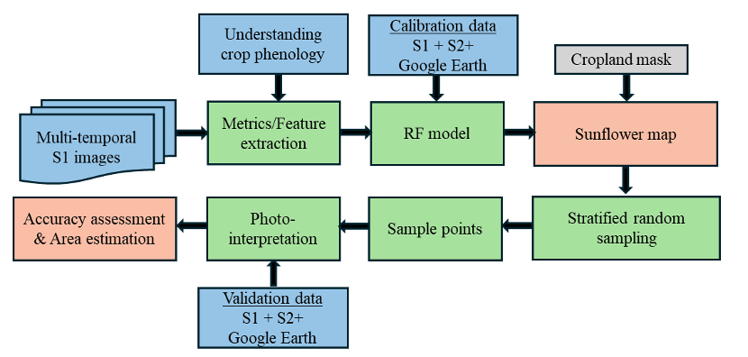
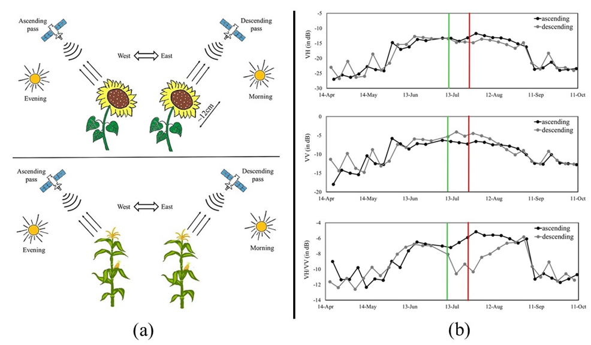
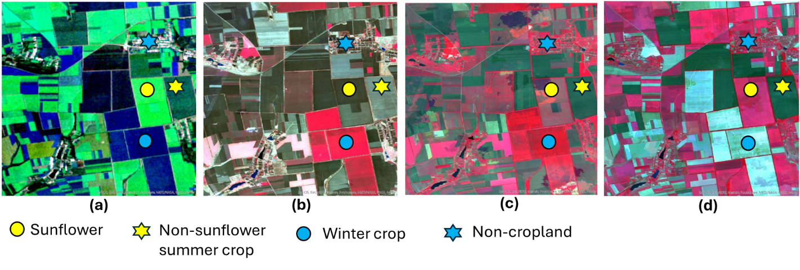

## Introduction

Accurate and timely agricultural production data are crucial for
ensuring global food security. Traditionally obtained through
agricultural censuses and field surveys, these data can be effectively
complemented by open-access satellite Earth observations, which offer a
cost-efficient means to monitor crops consistently across large spatial
and temporal scales. However, precise crop-type identification (e.g.,
sunflower) from satellite imagery remains challenging in large,
heterogeneous agricultural regions characterized by diverse crop types
and variable field sizes [@Song2017].

Producing reliable national-scale crop maps requires high-quality
satellite data, representative ground-truth samples for training,
probabilistically selected validation datasets, and high-performance
computing infrastructure. Traditionally, statistical area estimation and
satellite-based crop mapping have been operated as independent
processes. However, even highly accurate satellite-derived maps are
unsuitable for area estimation due to biases introduced by
misclassifications and mixed pixels. In contrast, sample-based
ground-reference data provides unbiased estimators with quantifiable
uncertainty. Recent studies have demonstrated the benefits of
integrating these approaches to generate consistent crop area estimates
at the national scale, for eg, soybean in the United States, Argentina,
and South America; wheat in Pakistan; and Sunflower in Ukraine [@Qadir2024a].
This integration not only enhances the reliability of agricultural
statistics but also supports timely decision-making for food security
and disaster response. However, obtaining high-quality field-based
observations remains a major challenge, as ground surveys are often
costly, time-consuming, and, in some cases, infeasible due to conflict,
government restrictions, or logistical issues.

Therefore, the primary objective of this study is to estimate the
national-scale sunflower planted area across Ukraine-controlled
territories in 2023 using photo-interpreted labels derived from
satellite imagery without field visits. Monitoring sunflower in Ukraine
is critical because Ukraine is one of the largest producers and is also
the most profitable crop. Furthermore, sunflower production has a
significant impact on soil degradation due to the violation of crop
rotation policies [@Qadir2023]. This study further demonstrates how the
integration of synthetic aperture radar (SAR) data, machine learning
algorithms, and statistically sound sampling frameworks can support
operational sunflower monitoring in data-limited environments.

## Methods

The overall flowchart of the proposed methods is shown in @fig-1-crop-area
and is based on the methodology proposed in Qadir et al. 
[@Qadir2023, @Qadir2024a, @Qadir2024]. 
The proposed approach consists of four major modules: 1)
Understanding sunflower phenology using S1 SAR sensor; 2)
Photointerpretation of S1 to obtain calibration and validation data; 3)
Developing a Random Forest (RF) based model using S1 for sunflower
mapping; 4) Sample-based unbiased sunflower area estimation.

```{r}
#| echo: FALSE
#| label: fig-1-crop-area
#| out-width: 90%
#| fig-cap: |
#|  Workflow for sampling-based sunflower mapping and crop area estimation. 
#| fig-align: center

```

### Understanding sunflower phenology using S1 sensor

Sunflower's distinctive architecture, characterized by broad leaves,
yellow capitula, facilitates its discrimination from other summer crops
such as maize and soybean when observed using C-band SAR sensor [@Qadir2023].
Another key feature of sunflower is heliotropism, the solar tracking of
young leaves and buds. The plant follows the Sun from east to west
during the day and reorients eastward at night through its circadian
rhythm. Once flowering begins, this movement ceases, and the flower
heads remain permanently oriented eastward (@fig-2-crop-area), imparting a
directional effect to the canopy.

Sentinel-1 (S1) operates at C-band (∼5.6 cm wavelength), which is
comparable to the characteristic size of the sunflower flower head. Its
sun-synchronous, right-looking antenna is
capable of monitoring sunflower phenology and directional effects. Over
Ukraine, Sentinel-1 descends from north to south at approximately 04:00
UTC (07:00 local time) (@fig-2-crop-area). Once flowering begins, the heads become
permanently oriented eastward, facing the descending pass 
(fig-2-crop-area (a)).
This eastward orientation (directional effect) introduces a strong
scattering component, leading to increased VV backscatter and a
corresponding decrease in the VH/VV ratio in C-band SAR observations
(@fig-2-crop-area (b)). This phenomenon, unique to sunflower, enhances the
separability of sunflowers from other summer crops like maize and
soybean resulting in better performance with S1 data acquired in the
descending orbit.

```{r}
#| echo: FALSE
#| label: fig-2-crop-area
#| out-width: 90%
#| fig-cap: |
#|  (a) Directional behavior as observed in the sunflower due to the large flower head facing east permanently in comparison to the maize crop (bottom) over Ukraine, for descending and ascending pass. (b) Temporal behavior of radar median backscattering (in dB) for VH, VV and VH/VV for both ascending and descending orbit from a sunflower field.
#| fig-align: center

```

### Photointerpretation of S1 to obtain calibration and validation data

Sunflower photo-interpretation was based on its distinct backscattering
signature relative to other summer crops, particularly maize and
soybean, during peak flowering. The directional behavior of the
sunflower, captured by S1, is described above. To identify
sunflower fields, seasonal median composites were generated from
descending orbit data for three key crop-growing periods in Ukraine:
spring (March-May), summer (June-August), and autumn
(September-November). These composites were visualized by assigning red,
green, and blue channels to VV backscatter from spring, summer, and
autumn, respectively [@Qadir2024a, @Qadir2024]. Sunflower exhibits high VV backscatter
during summer (June-August) in the descending orbit compared to other
summer crops. This results in dominant greenish tones for summer
cropland (@fig-3-crop-area (a), yellow star), with sunflower fields appearing as
bright neon green (@fig-3-crop-area (a), yellow circle).An example of the
photointerpretation process used to label sunflower, non-sunflower, and
non-cropland areas is shown in @fig-2-crop-area and also provided in the attached
[Google Earth Engine (GEE) application](https://ra-work.users.earthengine.app/view/photo-interpretation-for-mapping-sunflower-in-ukraine). 

To identify other summer and winter crops as well as non-cropland areas,
we integrated S1 with Sentinel-2 (S2) and high-resolution Google Earth
data. For S2, bi-monthly median composites were created using the
Near-Infrared (B8), Red (B4), and Green (B3) bands, assigned to red,
green, and blue channels, respectively, for March-April, May-June, and
July-August (@fig-3-crop-area b-d). The March-April composites are dominated by
winter crops, May-June by both winter and spring crops, and July-August
by summer crops, including sunflower. Crops during the peak growth
stages gives high reflectance in the NIR band, resulting in dominant
reddish tone and hence assist in identifying the specific winter or
summer cropland. Non-cropland classes such as urban, water bodies,
wasteland, and forest/plantation were identified using their stable
spectral and backscattering signatures across the S1, S2, and
high-resolution time series imagery.

```{r}
#| echo: FALSE
#| label: fig-3-crop-area
#| out-width: 100%
#| fig-cap: |
#|  S1 and S2 false color median composite for visual interpretation. The S1 VV RGB composites is represented by Red: March-May, Green: Jun-Aug, Blue: March-May in (a). The S2 RGB composites are represented by Red: NIR, Green: Red, Blue: Green in (b-d). For S2, bi-monthly median composites are generated for March-April (b), May-June (c), July-August (d), respectively.
#| fig-align: center

```

In the end, each pixel was interpreted as sunflower, non-sunflower, and
non-cropland class and subsequently employed either to train the ML
based RF model or to generate a confusion matrix in terms of area
proportions and subsequently estimate areas and accuracy values along
with corresponding uncertainties as described in the following sections.


## Random Forest model using S1 satellite data for sunflower mapping

The sunflower mapping methodology follows [@Qadir2024] and is based on the
crop's directional behavior. In the first step, we calibrated a Random
Forest (RF) model using S1-derived metrics and photo-interpreted labels
(Section 2). Calibration incorporated 42 multi-temporal metrics derived
from S1 ascending and descending orbit data, which were processed
separately to capture sunflower's directional behavior characteristics.

The RF model was configured with 300 *trees* and default parameters for
*variables per split*, *minimum leaf population*, and *bag fraction*. A
two-phase classification strategy was implemented [@Qadir2024]. In the first
stage, cropland was classified into six classes: sunflower,
non-sunflower summer crops, winter crops, water, forest/vegetation,
urban and barren. In the second stage, all non-sunflower and
non-cropland classes were aggregated into a single class resulting in
binary sunflower and non-sunflower classes. To minimize
misclassification with non-cropland areas, we masked other land cover
types using the land cover map. Isolated pixels were filtered, and the
final sunflower map was projected to the Albers equal area projection
for subsequent analyses.

### Sunflower map validation and area estimation

The experimental design for sample-based sunflower area estimation
followed well-established recommended practices [@Olofsson2014] to derive unbiased
area and uncertainty estimates at the national scale. Ukraine was
divided into three classes: sunflower, non-sunflower cropland, and
non-cropland to generate random samples. These three classes served as
strata in a stratified random sampling design, with 20 × 20 m² pixels as
sampling units. For estimating area and assessing accuracy of sunflower maps,
we follow the recommended best practices for estimating accuracy of LUCC maps, 
using Cochran's method for stratified random sampling [@Cochran1977]
and then producing and area-weighted estimation as described 
in Olofsson et al.[@Olofsson2014]. This estimation is described 
in detail in the ["Map validation and use of maps for area estimation"](https://fao-eostat.github.io/UN-Handbook/th_validation.html) chapter
of this Handbook.

A confusion matrix was constructed from the samples to compute area
proportions, which were then used to estimate overall, user's, and
producer's accuracies and their standard errors. A target user's accuracy 
of 0.85 was set for sunflower. In total, we
selected 500 samples out of sunflower, non-sunflower cropland and
non-cropland were represented by 200, 200 and 100 samples respectively.
A working example of the sampling-based area estimation is provided in
the Excel file described in the section "Code availability" below.

Each sample was labeled independently through photointerpretation of
multi-temporal SAR composites (S1), optical false-color composites (S2)
(shown in @fig-2-crop-area) and also very high-resolution Google Earth 
Engine imagery, as can be see in the link to 
[Google Earth Engine](https://ra-work.users.earthengine.app/view/photo-interpretation-for-mapping-sunflower-in-ukraine).

## Results & Discussion 

We estimated the sunflower planted area in Ukrainian-controlled
territory to be 5.99 ± 0.25 million hectares (Mha) in 2023, compared to
5.66 Mha obtained based on pixel counting. Unlike simple pixel counting
which assumes that each mapped pixel is classified correctly, the area
estimation method incorporates the confusion matrix to adjust for
classification errors, thereby providing unbiased estimates of class
areas and their associated confidence intervals. The sunflower map for
Ukraine in 2023 is shown in 
[Google Earth Engine](https://ra-work.users.earthengine.app/view/sunflower-map-ukraine-2023).

@tbl-conmat shows the confusion matrix in terms of area proportions along with per-class
performance metrics: producer's accuracy (PA) and user's accuracy
(UA). Overall, per-class PA/UA values were close or higher than 90%,
reflecting high classification reliability and supporting robustness of
the sunflower area estimates. Consequently, the sample-based estimation
approach yielded higher precision and greater statistical validity than
the pixel-counting method, which can otherwise underestimate or
overestimate true area extents depending on misclassification rates.


|            |                                 |                                Reference    |                                 |                     |             |             |
|------------|---------------------------------|---------------------------------------------|---------------------------------|---------------------|-------------|-------------|
|     Map    |     Class                       |     Sunflower   2023                        |     Non-sunflower   cropland    |     Non-cropland    |     UA      |     PA      |
|            |     Sunflower   2023            |     0.11                                    |     0.0002                      |     0.00            |     0.97    |     0.91    |
|            |     Non-sunflower   cropland    |     0.01                                    |     0.38                        |     0.04            |     0.88    |     0.96    |
|            |     Non-cropland                |     0.00                                    |     0.01                        |     0.44            |     0.97    |     0.91    |
: Confusion matrix of the sunflower classification maps (cell entries represent proportion of area) {#tbl-conmat}

## Conclusion 

This study demonstrated the operational capability of SAR data for
sunflower area estimation without relying on field observations at the
country level. The directional behavior of sunflowers as detected by S1
data, plays a crucial role in their identification and mapping. By
integrating sampling-based approach in crop area mapping, the disparity
between the sampling-based area and classified area is substantially
reduced.

To create the reference classification for labeling each sampling unit,
a combination of S1 and S2 data from Copernicus open archive, together
with Google Earth provides a source of cost-free reference data
equivalent to field observation required for sunflower identification. 
By combining the multi-source high resolution
optical with SAR, along with Google Earth data ensures the process of
creating the sunflower reference classification is of higher quality
than the sunflower classification-based map-making process and is
aligned to the good practice recommendations.

The proposed method has certain limitations, particularly in regions
where only the S1 ascending orbit is available. Our analysis in [@Qadir2024]
showed that in regions where only ascending orbit data exist, the model
achieved lower accuracy compared to regions with both or only descending
orbit coverage. Additionally, this approach relies on satellite
acquisitions available only until the end of August and therefore cannot
be applied for early-season sunflower identification or area estimation.

Care should be taken when implementing this model to other regions, as
the accuracy of the resulting sunflower maps is affected by the choice
of non-cropland mask. When using land cover/cropland masks, it is
critical to assess their suitability for the specific application,
taking into account the purpose of use, such as broad-scale ecosystem
accounting versus site-specific change detection. Users should also
consider trade-offs between thematic resolution, global versus local
accuracy, and class-specific biases when selecting appropriate land
cover datasets.

Furthermore, photo-interpretation to identify sunflower fields is based
on expert knowledge of both SAR and optical data, which may vary among
interpreters and across regions due to differences in crop cycles, crop
types, and agroecological conditions. Therefore, caution should be
exercised when applying this approach to other regions, particularly in
smallholder farming systems where sunflower is not a dominant crop and
photo-interpretation has its own challenges.

## References {-}

