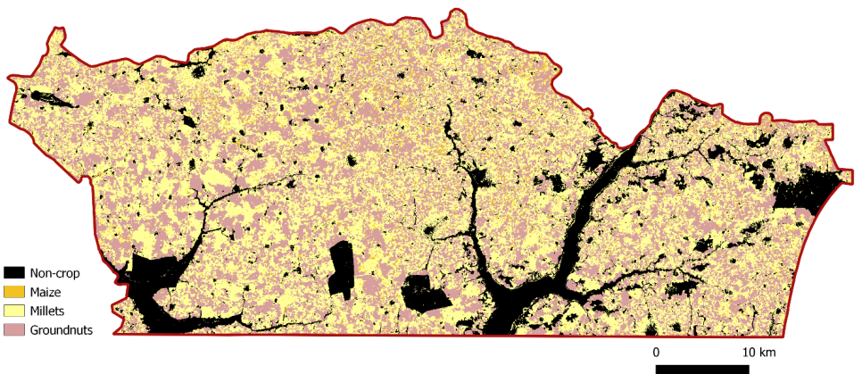

## Introduction

This chapter provides guidance for estimating crop statistics when the sample data 
is organised as a list frame, with one labeled centroid per parcel without 
direct measurement of parcel areas [@Ambrosio2023]. 
In Senegal, the National Statistical Office (NSO) utilizes a list frame
based on census data to select a sample of agricultural holdings. Ground
data on crop types and agricultural practices are collected from parcels
within this sample during the Annual Agricultural Survey (AAS). The
observed crop type at each sampled parcel is linked to the pixel
containing the centroid and recorded in the database. Consequently, the
ground data is not continuous but categorical (crop type) and limited to
a single point per sampled parcel, with no information on parcel area.

## National-level estimators

We define the survey vector as
$$
  \mathbf{y_i} = \begin{pmatrix}y_{i1}\\ y_{ik} \\ .. \\y_{iK} \end{pmatrix}, 1 \leq k \leq K
$${#eq-survey}

where $y_{ik}$ is 1 if the crop covers pixel $i$ and 0 
otherwise. The total number of crop categories is $K$ is so that
$$
  \sum_{k=1}^{K} y_{ik} = 1
$${#eq-sumy}

We focus on high-resolution satellite images where the population
size $N$ is the total number of pixels in the study area $A = aN$, and each pixel
represents a fixed land area $a$.

The population total of the survey vector is 
$$
  \mathbf{y_N} = \sum_{i=1}^{N} \mathbf{y_i} = \begin{pmatrix} \sum_{i=1}^{N}y_{i1} \\ .. \\ \sum_{i=1}^{N}y_{ik}  \\ .. \\ \sum_{i=1}^{N}y_{iK} \end{pmatrix} = \begin{pmatrix} y_{N1} \\ .. \\ y_{Nk} \\ .. \\ y_{NK} \end{pmatrix}, 1 \leq k \leq K
$${#eq-poptotal}


where $y_{Nk}$ is the number of pixels covered by crop $k$. 
Assuming each pixel is covered by only one crop
(or mixed classes are defined), the area covered by crop $k$ is $A_k = a*Y_{Nk}$ and the total area is
$$
  A = \sum_{k=1}^{K} A_k
$${#eq-area}
Our goal is to estimate the total $\mathbf{y_N}$ or the mean value
$$
  \overline{\mathbf{y}}_N = \frac{1}{N}\sum_{i=1}^{N}\mathbf{y_i} = \begin{pmatrix} \frac{y_{N1}}{N}\\ .. \\ \frac{y_{Nk}}{N} \\ .. \\ \frac{y_NK}{N} \end{pmatrix}, 1 \leq k \leq K
$${#eq-meany}


where $y_{Nk}/N$ is the proportion of pixels covered by class $k$.

We assume the survey vector $\mathbf{y_i}$ follows a multinomial distribution
$$
\mathbf{y_i} \sim MN(1,\boldsymbol{\mu_i})
$${#eq-multinom}

where
$$
  \boldsymbol{\mu_i} = \begin{pmatrix}\mu_{i1}\\ .. \\ \mu_{ik} \\ .. \\\mu_{iK} \end{pmatrix}, 1 \leq k \leq K
$${#eq-muvec}
and $\mu_{ik}$ is the probability that unit $i$ belongs to category $k$, i.e., the
probability $y_{ik} = 1$ of and $y_{ik'} = 0, \forall k' \neq k$, subject to the constraint
$$
  \sum_{k=1}^{K}\mu_{ik} = 1.
$${#eq-summu}


The probabilities $\mu_{ik}$  are estimated using a sample of pixels 
$\{(\mathbf{y_i}, \mathbf{x_i}), i = 1, 2, ..., N_s\}$ whose total number is $N_s$
selected with known inclusion 
probabilities $\pi_i$, together with the associated RS data vector
$$
  \mathbf{x_i} = \left(\begin{array}{c} x_{i1}, .., x_{il}, .., x_{iL} \end{array}\right), 1 \leq l \leq L.
$${#eq-xrow}

To link $\mu_{ik}$ with remote sensing data, we use a multinomial logit model 
$$
  \boldsymbol{\mu_{ik}} = \frac{exp(\mathbf{x_i}\boldsymbol{\beta_k})}{\sum_{k=1}^{K}exp(\mathbf{x_i}\boldsymbol{\beta_k})}
$${#eq-multimu}

where 
$$
  \boldsymbol{\beta_k} = \begin{pmatrix}\beta_{k1}\\ .. \\ \beta_{kl} \\ .. \\\beta_{kL} \end{pmatrix}, 1 \leq l \leq L
$${#eq-betavec}

is the parameter vector for crop $k$. To estimate the probability $\mu_{ik}$ that the cover of pixel $i$ is crop $k = 1, 2, ..., K$ it is sufficient to acquire estimates of $\boldsymbol{\beta_k}$ for $k = 1, 2, ..., K-1$. The probability of category $K$ is 
$$
  \mu_{iK} = 1 - \sum_{k=1}^{K-1}\mu_{ik}
$${#eq-muk}
which can be computed using the estimates $\boldsymbol{\hat{\beta}}_{nk}$ for $k = 1, 2, ..., K-1$. 

The design-based estimator 
$$
  \mathbf{\hat{B}_n} = \begin{pmatrix} \boldsymbol{\hat{\beta}}_{n1} \\ .. \\ \boldsymbol{\hat{\beta}}_{nk} \\ .. \\ \boldsymbol{\hat{\beta}}_{nK-1} \end{pmatrix}, 1 \leq k \leq K-1 
$${#eq-design}
is design-consistent for the maximum likelihood estimator of $\boldsymbol{\beta}$, expressed as
$$
  \boldsymbol{B} = \begin{pmatrix}\boldsymbol{\beta}_{1}\\ .. \\ \boldsymbol{\beta}_{k} \\ .. \\ \boldsymbol{\beta}_{K-1} \end{pmatrix}, 1 \leq k \leq K-1
$${#eq-mlest}

based on the available population data $\{(\mathbf{y_i}, \mathbf{x_i}), i = 1, 2, ..., N\}$, under the assumption that the population behaves like a simple random sample from
the multinomial model. Estimation is performed iteratively using
weighted likelihood equations based on inclusion probabilities
$$
  \mathbf{\hat{B}}_{\pi}^{(m+1)} = \mathbf{\hat{B}}_{\pi}^{(m)} + \left[ \sum_{i = 1}^{N_s}\frac{\mathbf{H}(y_i,\boldsymbol{\beta})}{{\pi_i}} \Bigg|_{\boldsymbol{\beta} = \mathbf{\hat{B}}_{\pi}^{(m)}} \right]_{}^{-1} \sum_{i = 1}^{N_s}\frac{\mathbf{b}(y_i,\boldsymbol{\beta})}{{\pi_i}}\Bigg|_{\boldsymbol{\beta} = \mathbf{\hat{B}}_{\pi}^{(m)}}
$${#eq-wlike}
where 
$$
  \mathbf{b}(y_i,\boldsymbol{\beta}) =  col_{1 \leq k \leq k-1}row_{1 \leq l \leq K -1}\Bigl[ (y_{ik} - \mu_{ik})x_{il} \Bigr]
$${#eq-blike}
and
$$
  \mathbf{H}(y_i,\boldsymbol{\beta}) = col_{1 \leq k \leq k-1}row_{1 \leq l \leq K -1 }\Bigl[(\delta_{kl}\mu_{ik} - \mu_{ik}\mu_{il})\otimes \mathbf{x}_{i}^\top\mathbf{x}_{i}\Bigr]
$${#eq-hlike}
with $\delta_{kl} = 1$ if $k = l$ and $\delta_{kl} = 0$ otherwise.

A design-consistent estimator of the total number of pixels covered by
each crop
$$
  \mathbf{y}_{N} = \begin{pmatrix}y_{N1}\\ .. \\ y_{Nk} \\ .. \\y_{kL} \end{pmatrix}, 1 \leq k \leq K
$${#eq-pixcrop}
is given by
$$
  \mathbf{\hat{y}}_{N} = \sum_{i=1}^{N}\boldsymbol{\hat{\mu}_i} + \frac{N}{\hat{N}_p} \sum_{i=1}^{N_s}\frac{\mathbf{y}_i - \boldsymbol{\hat{\mu}_i}}{\pi_i}
$${#eq-estpixcrop}
In @eq-estpixcrop, $\boldsymbol{\hat{\mu_i}}$ is a column vector, expressed as
$$
    \boldsymbol{\hat{\mu}}_i = \begin{pmatrix} \hat{\mu}_{i1}\\ .. \\ \hat{\mu}_{ik} \\ .. \\ \hat{\mu}_{iK-1} \end{pmatrix}, 1 \leq k \leq K
$${#eq-estmu}
For classes $k=1,..., k-1$, each of the terms of $\boldsymbol{\hat{\mu_i}}$ in @eq-estpixcrop is estimated by 
$$
 \hat{\mu}_{ik} = \frac{exp(\mathbf{x}_i\mathbf{\hat{B}}_{\pi,k})}{ 1 + exp(\mathbf{x}_i\mathbf{\hat{B}}_{\pi,k})}, \quad k = 1,2, ..., K-1
$${#eq-estmu1}
For class $k=K$, the estimator of $\boldsymbol{\hat{\mu_i}}$ is
$$
 \hat{\mu}_{iK} = 1 - \sum_{k=1}^{K-1}\hat{\mu}_{ik}.
$${#eq-estmu1}
In @eq-estpixcrop, the normalization factor $\hat{N}_p$ is given by
$$
  \hat{N}_p = \sum_{i=1}^{N_s}\frac{1}{\pi_i}.
$${#eq-estnp-hat}
Based on the above, we can compute the estimator of the total number of pixels covered by crop $k \le K$, given by
$$
    \hat{y}_{Nk} = \sum_{i=1}^{N}\hat{\mu}_{ki} + \frac{N}{\hat{N}_p} \sum_{i=1}^{N_s}\frac{y_{ki} - \hat{\mu}_{ki}}{\pi_i}, \quad k = 1,2, ..., K-1
$${#eq-pixcrop1}

and for crop $K$ the estimator is 
$$
  \hat{y}_{NK} = N - \sum_{k=1}^{K-1} \hat{y}_{Nk}.
$${#eq-pixcrop2}

The sampling covariance matrix of $\mathbf{\hat{y}}_{NK}$ is approximated by
$$
  \mathbf{V\hat{y}}_N = N^2\mathbf{V}\frac{1}{\hat{N}_p}\sum_{i=1}^{N_s}\frac{\mathbf{\hat{y}}_i - \boldsymbol{\mu}_i}{\pi_i}
$${#eq-sampcov}
which can also be expressed as
$$
  \mathbf{V\hat{y}}_N = col_{1 \leq k \leq k-1}row_{1 \leq k' \leq K -1 }\Bigl(N^2Cov(\hat{y}_{rk}, \hat{y}_{rk'}) \Bigr)
$${#eq-sampcov2}
To compute the covariance matrix for elements $\hat{y}_{rk}$ in @eq-sampcov2, we consider that
$$
  \hat{y}_{rk} = \frac{1}{\hat{N}_p}\sum_{i=1}^{N_s}\frac{y_{ki} - \mu_{ki}}{\pi_i}.
$${#eq-covelem}
Each estimator $\hat{y}_{rk}$ is a function of the estimators of the total number of sampling units of category $k$, given by
$$
  \hat{N}_{pk} = \sum_{i=1}^{N_s}\frac{y_{ki}}{\pi_i}, \quad k = 1,2, ..., K
$${#eq-estnpk}
noting that
$$
  \hat{N}_p = \sum_{k=1}^{K}\hat{N}_{pk}. 
$${#eq-estnp}
The estimators $\hat{y}_{rk}$ also depend on the total residuals of class $k$, 
given by the second term of @eq-covelem
$$
  \mathbf{\hat{r}}_{kN} = \sum_{i=1}^{N_s}\frac{y_{ki} - \mu_{ki}}{\pi_i}
$${#eq-resid}
for each class $k$. 

The diagonal elements of the variance matrix $\mathbf{V\hat{y}}_N$ provide 
the sampling variance $V\hat{y}_{Nk}$ for each crop class $k = 1,2,..., K-1$. Let the 
row vector $\mathbf{\hat{G}}_k$ be such that its  $K+1$ components are the estimators 
on which $\hat{y}_{rk}$ depends, and be given by
$$
  \mathbf{\hat{G}}_k = \Bigl[ \mathbf{\hat{r}}_{kN}, \hat{N}_{p1}, \hat{N}_{p2}, ..., \hat{N}_{pK} \Bigr].
$${#eq-ghat}

The $\hat{y}_{Nk}$ sampling variance is approximated by
$$
  V\hat{y}_{Nk} = row_{1 \leq j \leq K+1} \biggl(\frac{\partial\hat{y}_{rk}}{\partial{g_j}}\biggr)\enspace \mathbf{V\hat{G}}_k \enspace  col_{1 \leq j \leq K+1}\biggl(\frac{\partial\hat{y}_{rk}}{\partial{g_j}}\biggr)
$${eq-ysamplvar}
where 
$$
  \mathbf{V\hat{G}}_k = col_{1 \leq j \leq K+1} row_{1 \leq j \leq K+1} \biggl(Cov\bigl(g_j,g_{j'} \bigr) \biggr)
$${eq-designcov}

is the design-based covariance matrix of $\mathbf{\hat{G}}_k$. The
sampling covariance matrix $\mathbf{\hat{y}}_N$ is estimated replacing $\boldsymbol{\mu}_i$ $\boldsymbol{\hat{\mu}}_i$ by in $V\hat{y}_{N}$ [@Fuller2011].

## Crop type maps 

To generate the crop-type map for the Nioro region, a random forest
classifier was applied (see chapter 17 for full details) identifying
four primary crop classes: maize, millet, groundnut, and other crops.
Pixels not associated with these four classes were classified into a
non-agricultural land-use category and excluded from crop-specific
analysis (@fig-nioro-map).

.
```{r}
#| echo: FALSE
#| eval: TRUE
#| label: fig-nioro-map
#| out-width: 90%
#| fig-align: center
#| fig-cap: Crop type map for Nioro, 2021 

```

The map data are encoded according to the Earth Observation (EO) crop
type assigned to each pixel: we use the row vector $\mathbf{x}_i = (1, 0, 0, 0)$ for any pixel $i$ in the EO class maize, $\mathbf{x}_i = (0, 1, 0, 0)$  for any pixel in the EO class millet, $\mathbf{x}_i = (0, 0, 1, 0)$  for any pixel in
the EO class groundnut, and $\mathbf{x}_i = (0, 0, 0, 1)$ for any pixel in the EO class other crops.

## Model parameter estimates

This section focuses on the two main crops observed in the field sample:
millet and groundnut. All other crops (primarily maize) are grouped into
the third category labeled others. The estimated probability for this
residual category is computed as one minus the sum of the probabilities
for millet and groundnut. Table 1 below presents the estimated
coefficients for each crop type, indicating the strength and direction
of association between EO classifications and ground-truth crop types
(Annex 1 contains the R scripts to compute these estimates using the
database provided in Annex 6a).

  
|     Crop         |     EO crop type map                                                                  |
|------------------|-------------------------|--------------------|-------------------|--------------------|
|                  |     Maize               |     Millet         |     Groundnut     |     Other crops    |
|     Millet       |     -0.010655           |     1.47958334     |     0.88931346    |     8.76504093     |
|     Groundnut    |     -0.659204           |     -0.59871700    |     2.89873948    |     1.21898514     |

: Model parameter estimate ($\mathbf{\hat{B}}_{\pi millet}$ and $\mathbf{\hat{B}}_{\pi groundnut} $) {#tbl-parameters}

These coefficients reflect how strongly each EO classification predicts
the presence of a given crop type in the field. The EO classification
"millet" has a strong positive association (1.4796) with the
ground-truth millet class. The EO classification "groundnut" is highly
predictive ( 2.8987) of the ground-truth groundnut class. The "other
crops" EO class shows a strong association with both millet (8.76504093)
and groundnut (1.21898514), suggesting potential overlap or
classification uncertainty.

## Crop acreage estimates 

Crop acreage estimates for millet and groundnut, derived from the
integration of ground and RS data, are shown in Table 2 (Annex 2
contains the R scripts to compute these estimates, using the database
provided in Annex 6a, and Annex 3 contains the R Scripts to compute the
standard errors, coefficients of variation, and confidence intervals,
using the database provided in Annex 6b).


|           Crop   type    |                 Acreage     (Hectare)    |     Uncertainty               |                                       |                                                  |                 |                  |
|--------------------------|------------------------------------------|-------------------------------|---------------------------------------|--------------------------------------------------|-----------------|------------------|
|                          |                                          |           Standard   error    |     Coefficient   of variation (%)    |           Limits   of 95% confidence interval    |                 |                  |
|                          |                                          |                               |                                       |     Lower                                        |     Upper       |     Amplitude    |
|     Millet               |     89215                                |     3661.103                  |     4.11                              |     81978.88                                     |     96330.4     |     14351.52     |
|     Groundnut            |     78815                                |     2923.94                   |     3.71                              |     73089.15                                     |     84550.98    |     11461.82     |


: Crop acreage estimates, Nioro. Senegal, 2021. {#tbl-acreage-estimates}

We compare the results of our design-based approach (shown in @tbl-acreage-estimates)
with estimates directly based on the crop-type map. The comparison is
necessarily limited to the crop acreage estimates because the usual
algorithms used for crop-type map generation do not provide measures of
uncertainty comparable to those of @tbl-acreage-estimates.

Both the number of pixels in EO crop type millet (9470572, i.e.,
94705.72 ha, as a pixel represents 100 $m^2$) and in EO crop type
groundnut (8076448, i.e., 80764.48 ha) are larger than the
design-based number estimates: 8921492 (89214.92 ha) for millet
and 7881468 (78814.68 ha) for groundnut. For millet, the
difference was 5490.8 ha (6.2%) and for groundnut 1949.8 ha
(2.5%). For the former, the difference is greater than the design-based
standard error (3661.10 ha) and the coefficient of variation
(4.11%). For the latter, the difference is smaller than the design-based
standard error (2923.94 ha) and the coefficient of variation
(3.71%). These differences are not statistically significant, since the
estimates directly based on the EO crop-type classes are within the
design-based confidence limits, namely, [81978.88, 96330.4] ha
for millet and [73089.15, 84550.98] ha for groundnut.

However, the comparison must focus not on the results, which are always
uncertain, but on the methods. The methods make the major difference;
whereas the design-based estimators are in the mainstream of official
statistics, the estimators based directly on crop-type maps are not. The
proposed approach provides design-consistent estimates together with the
usual measures of uncertainty (sampling error, coefficient of variation,
and confidence intervals). The two main objections to estimators based
directly on the crop-type map are that (i) they are not
design-consistent and (ii) the usual uncertainty measures are not
available.

## Crop type map relative efficiency

When comparing a set of sampling strategies developed for estimating the
same characteristic in a given population, cost efficiency is a key
criterion. Let $C_{GD}$ be the cost and $V_{GD}$ the sampling error of the current
sampling strategy using only ground data, and let $C_{GD+RS}$  and $V_{GD+RS}$ 
be the cost and
sampling error, respectively, of the strategy integrating ground and RS
data. The cost efficiency  is $C_{GD}V_{GD}$ for the former 
and $C_{GD+RS}V_{GD+RS}$ for the latter.

Although Sentinel images and processing software are freely provided by
ESA, NSOs still incur costs such as expert time and cloud computing
services for data storage and analysis. Additionally, replacing parcel
centroids with georeferenced polygons introduces further operational
costs. Given the difficulty of estimating these additional costs, we
assume in the following that $C_{GD+RS} \approx C_{GD}$ , simplifying the comparison to a focus on criterion relative efficiency.

The sampling variance of the $y_{Nk}$ estimator based on ground data alone is 
$$
  V_{GD} = N^2V\frac{1}{\hat{N}_p}\sum_{i=1}^{N}\frac{y_{ki}}{\pi_i}
$${#eq-vgdsamplvar}

and that based on its integration with RS data is
$$
V_{GD+RS} = N^2V\frac{1}{\hat{N}_p}\sum_{i=1}^{N_s}\frac{y_{ki} - \mu_{ki}}{\pi_i}.
$${#eq-vgdrssamplvar}

The relative efficiency of RS data for estimating the total number of pixels covered
by crop $k$ is
$$
  RE_{RSk} = V\frac{1}{\hat{N}_p}\sum_{i=1}^{N_s}\frac{y_{ki}}{\pi_i}\biggl( V\frac{1}{\hat{N}_p}\sum_{i=1}^{N_s}\frac{y_{ki} - \mu_{ki}}{\pi_i}\biggr)^{-1}.
$${#eq-rers}

We evaluate the RS data efficiency $RE_{RSk}$ for the acreage estimation of millet
and groundnut. Results are in @tbl-efficiency (Annex 3 contains the R scripts to
generate these results using the database provided in Annex 6b).


|  Crop type    | Std errors  of proportion estimators|         |  Relative efficiency of RS data |    
|---------------|--------------------------|---------|----------------------|
|               | Ground data | Ground & RS data |                         |
| Millet        |     3.37    |     1.90    |       3.13             |
| Groundnut     |     3.34    |     1.52    |       4.80             |

: Efficiency of RS data for crop acreage estimation, Nioro, Senegal. {#tbl-efficiency}

The effect of integrating RS data in the ground sample data was a
reduction in the sampling error of millet and groundnut and, as a
result, in the confidence interval of these two crops, without loss of
design-based consistency. In other words, using RS data, the cost of
estimating millet and groundnut acreage could be reduced to less than a
third of the current cost, without loss of accuracy.

## District-level estimates

The total survey value in the domain $R$ is 
$$
  \mathbf{\hat{y}}_{N_{R}} = \sum_{i=1}^{N_R}\mathbf{\hat{y}}_i = col_{1 \leq k \leq K}\biggl( \sum_{i=1}^{N_R} y_{ik}\ \biggr) = \begin{pmatrix}y_{N_R1}\\ .. \\ y_{N_Rk} \\ .. \\y_{N_RK} \end{pmatrix}, \quad k=1,2,...,K.
$${#eq-totalsurvey}


In @eq-totalsurvey, $y_{N_Rk}$ is the number of
pixels in $R$ covered by crop $k$. To estimate $\mathbf{y}_{N_{R}}$, 
we use the sample $s$ of size $N_s$
selected from the population with inclusion probabilities
${\pi_i, i = 1, 2,..., N_s}$
and the estimator 
$$
  \mathbf{\hat{y}}_{N_{R}} = \sum_{i=1}^{N_R}\boldsymbol{\hat{\mu}}_i + \frac{N_R}{\hat{N}_{R_p}}\sum_{i=1}^{n_R}\frac{\mathbf{\hat{y}}_i - \boldsymbol{\hat{\mu}}_i}{\pi_i}
$${#eq-est-region}

The parameter $n_R$ is the number of units in the sample belonging to the
study domain, given by 
$$
  n_R = \sum_{i=1}^{N_s}I_i
$${#eq-nr}
where the indicator variable $I_i$ is 1 if the sample belongs to the region $R$ and 0 otherwise.

and 
$$
  \hat{N}_{Rp} = \sum_{i=1}^{n_R}\frac{I_i}{\pi_i}.
$${#eq-nrp}

The sampling covariance of $\mathbf{y}_{N_R}$ is given approximately by 
$$
  \mathbf{V\hat{y}}_{N_R} = N_R^2\mathbf{V}\frac{1}{\hat{N}_{R_p}}\sum_{i=1}^{n_R}\frac{\mathbf{\hat{y}}_i - \boldsymbol{\mu}_i}{\pi_i}.
$${#eq-sampcov-reg}
also expressed as

$$
 \mathbf{V\hat{y}}_{N_R} = col_{1 \leq k \leq K-1}\enspace row_{1 \leq k' \leq K-1} \enspace \Bigl( N_R^2 Cov(\hat{y}_{Rrk}, \hat{y}_{Rrk'}) \Bigr)
$$


Let 
$$
  \hat{y}_{Rrk} = \frac{1}{\hat{N}_{Rp}}\sum_{i=1}^{n_R}\frac{y_{ki} - \mu_{ki}}{\pi_i}
$$ {#eq-y-rkr}

and
$$
  \mathbf{\hat{G}}_{Rk} = \Bigl[ \mathbf{\hat{r}}_{kN_R}\enspace \hat{N}_{N_Rp1} \enspace  \hat{N}_{N_Rp2} \enspace  ... \enspace \hat{N}_{N_RpK} \Bigr].
$${#eq-grk}
The sampling variance $\hat{Y}_{N_Rk}$ is given approximately by 
$$
  V\hat{y}_{N_Rk} = row_{1 \leq j \leq K+1} \biggl(\frac{\partial\hat{y}_{Rrk}}{\partial{g_{Rj}}} \biggr)\enspace \mathbf{V\hat{G}}_{Rk} \enspace  col_{1 \leq j \leq K+1}\biggl(\frac{\partial\hat{y}_{Rrk}}{\partial{g_{Rj}}}\biggr)
$${#eq-ysamplvarrk}

where
$$
  \mathbf{V\hat{G}}_{Rk} = col_{1 \leq j \leq K+1} row_{1 \leq j \leq K+1} \biggl(Cov\bigl(g_{Rj},g_{Rj'} \bigr) \biggr)
$${#eq-vgrk}
The sampling covariance matrix $\mathbf{\hat{y}}_{N_R}$ is estimated 
replacing $\boldsymbol{\mu}_i$ by $\boldsymbol{\hat{\mu}}_i$in @eq-sampcov-reg.

To illustrate the application of point sampling and multinomial logit
models at sub-national scale, crop acreage estimates were generated for
three districts (Arrondissements) within the Nioro region: Medina Sabakh,
Paoskoto, and Wack Ngouna. The estimates are in @tbl-est-district (Annex 4
contains the R scripts to compute these estimates using the database
provided in Annex 6a, and Annex 5 contains the R Scripts to compute the
standard errors and coefficients of variation, using the database
provided in Annex 6c).


  Arrondissement   Millet           Groundnut                      
  ---------------- ---------------- ------------- ---------------- -------------
                   Acreage (has.)   Error (CV%)   Acreage (has.)   Error (CV%)
  Medina Sabakh    20067.21         8.6           19765.36         7.3
  Paoskoto         38316.02         5.3           35018.23         4.0
  Wack Ngouna      30831.77         11.9          24030.71         10.7
  Total Nioro      89215,00         4.11          78815,00         3.71

: Crop acreage estimates at the district (arrondissement) level, Nioro, Senegal, 2021. {#tbl-est-district}. 

The estimated accuracy at district (arrondissement) level is, as
expected, lower than at the national level. However, the sampling error
is within the standard limit (coefficient of variation $\lt$ 20%) for
labeling as official statistics.

The differences between the number of pixels in the EO crop type millet
and the design-based estimate of the number of pixels covered by millet
are smaller than the sampling error in Medina Sabakh (0.7%) and Paoskoto
(4.1), and larger than the design-based estimate in Wack Ngouna (12.4%).
The differences between the number of pixels in the EO crop type
groundnut and the design-based estimate of the number of pixels covered
by groundnut are smaller than sampling error in the three districts:
Medina Sabakh (3.4%), Paoskoto (2.5%), and Wack Ngouna (1.2%).

## Concluding remarks

We have shown how to integrate RS and categorical ground data collected
in complex samples, selected from non-georeferenced list frames, to
produce agricultural statistics, along with measures of accuracy that
take into account any source of uncertainty, including classification
errors. We developed and tested prototypes for this integration at both
national and district levels in Senegal. These prototypes are based on
the design of a probabilistic scheme to select the sample from which to
collect the ground data and rely on multinomial logit models to
incorporate RS-derived crop-type information. We show how to estimate
the model parameters, and how to use RS data to compute the required
statistics, as well as their accuracy measures. The resulting statistics
are design-consistent and robust, meaning they depend on the sampling
design rather than on the model assumptions.

We also evaluated the efficiency gains from integrating RS data into the
current statistical workflow, and we have found it to be high: using RS
data, the current sample size at the level of large areas could be
reduced between one third and one fifth, without loss of neither
robustness nor accuracy.

## About the authors{-}

Luis Ambrosio Flores (luis.ambrosio@upm.es) is  professor of Statistics. Expert in agricultural and environmental statistics, econometric modeling, climate impact assessment, and EU biodiversity frameworks. Led 30 research projects and served as consultant (ESA, FAO, EU). Key projects: SEN4Stat - Sentinels for Agricultural Statistics;  Global Strategy (GS)-Improving Agricultural & Rural Statistics; Econometric models for assessing climate change impact on agriculture and environment (Spanish Ministry of Science and Technology). Author of 50 publications with 404 citations on Google Scholar.


## References {-}
