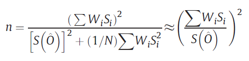
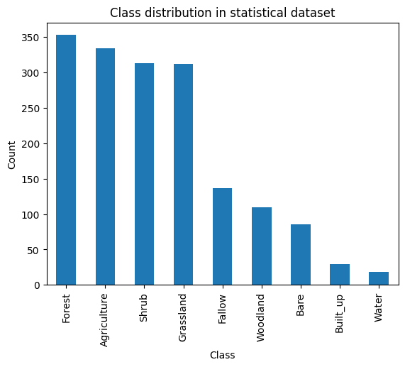
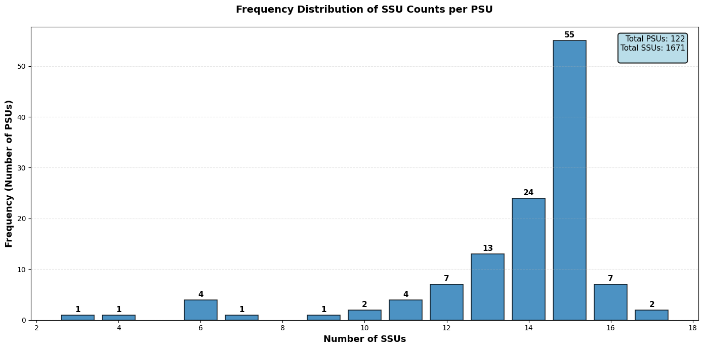
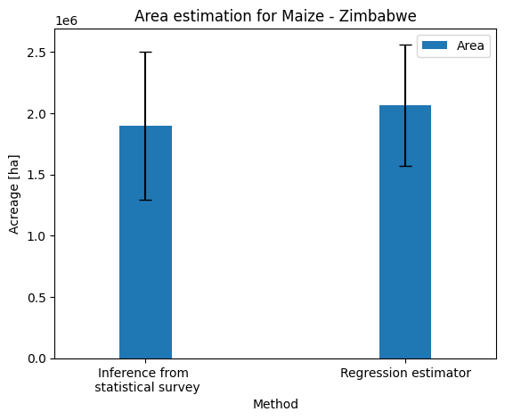

## Introduction 

Producing statistics by counting those pixels classified as a given crop type does not provide unbiased area estimates. Maps are subject to omission and commission errors [@Czaplewski1992], which are linked to the ability of the classification method to distinguish between classes. Regression estimators and calibration estimators have been widely used to correct such biases [@Gallego1993] [@Khan2018] [@Olofsson2014] [@Li2023]. They are traditional ways to combine accurate and possibly unbiased information observed on a limited sample with less accurate and biased information known for the whole population or for a larger sample. Said differently, maps are used to improve an estimator that has been computed from a ground survey on a sample in **preserving as much as possible the properties of the ground survey estimators** (unbiasedness) and **reducing the variance** [@Gallego2004].

This chapter presents an application of such regression approach in Zimbabwe, as implemented in the framework of the EO STAT project.

## Statistical survey

When coupling EO with ground data through a regression approach, two different sets of field data are required. First, a statistical survey needs to be conducted to obtain a statistically valid estimate of the crop of interest acreage. A second dataset needs to be collected, independently or in complement to the statistical survey, to train the classification algorithm and generate the crop map. This second dataset will include a large volume of spatially distributed georeferenced observations across all major land cover and crop types.

As explained in the Chapter [Crop Classification in Zimbabwe](https://fao-eostat.github.io/UN-Handbook/ct_zimbabwe.html), a field campaign was implemented in Zimbabwe in the framework of the FAO EOSTAT project during the summer season 2024. This chapter describes the opportunistic windshield survey which was designed and implemented to acquire the training dataset. The following section will focus on the statistical survey.

### Sampling design {-}

The statistical survey was implemented using a two-stage stratified area sampling frame, where Primary Sampling Units (PSUs) are sampled from an initial population grid and Secondary Sampling Units (SSUs) are sampled within each PSU. The goal of the survey is to estimate the area proportion of the main crop(s) within PSUs to infer a mean proportion across the whole population grid. Knowing the total area covered by the population grid, the mean proportion estimation can be converted to a total acreage estimation.

The initial population was defined as a regular grid of 2 by 2 km square segments overlaid on the area of interest (i.e. the full country), resulting in a population of 98,237 PSUs. The target variable of the survey was the main crops proportions within PSUs with a particular focus on maize.

A stratification was performed with the aim of dividing the population into internally homogeneous subpopulations in terms of cropping intensity. This stratification was based on the ESA WorldCover map. The proportion of cropland within each PSU was calculated (given by the number of cropland pixels divided by the total number of pixels) and the segments were assigned to one of five strata. The strata limits were defined using the Jenks natural breaks classification method [@Jenks1967]. Jenks algorithm determines the best arrangement of values to minimize each class's average deviation from the class mean, while maximizing each class's deviation from the means of the other classes. In other words, the method seeks to reduce the variance within classes and maximize the variance between classes. Blocks having an agricultural intensity value less than 2 were dropped, as these represented areas with no agriculture, or with negligible agricultural surfaces. Results of this stratification are shown in @tbl-cropping-intensity.

```{r}
#| label: tbl-cropping-intensity
#| tbl-cap: "Cropping intensity strata characterization"
#| echo: false
#| eval: true

knitr::kable(
  data.frame(
    strata    = c("Stratum 1", "Stratum 2", "Stratum 3", "Stratum 4", "Stratum 5"),
    nb_blocks = c(11291, 22644, 14742, 8390, 2866),
    area      = c(4516400, 9057600, 5896800, 3356000, 1146400),
    cld_area  = c(165196.4424, 938008.2325, 1305204.32, 1250339.113, 683274.7886),
    agri_int  = c(3.6, 10.3, 22.1, 37.2, 59.6)
  ),
  col.names = c("Strata", "Nb of blocks", "Area (ha)", "Cropland area (ha)", "Agricultural Intensity (%)")
) |>
    kableExtra::kable_styling(full_width = FALSE, bootstrap_options = c("striped", "hover"))
```

SSUs were defined as squares of 10 x 10 meters cell size, which corresponds to the size of one single Sentinel-2 pixel. 25 PSUs were randomly selected from each stratum and in the second stage of sample allocation, 15 SSUs were randomly sampled in each PSU to estimate the proportion of crops. @fig-1 shows the distribution of PSUs across the country and the 5 strata.

```{r}
#| echo: FALSE
#| eval: TRUE
#| label: fig-1
#| out-width: 80%
#| fig-cap: Distribution of PSU (black dots) across the country and strata
#| fig-align: center

```

### Statistical survey data {-}

The statistical survey was implemented during a 2 week-period in February-March 2024. It was conducted by 4 teams (each team being made of one driver and 2 enumerators). The navigation between the PSUs was facilitated by the Path Finder WebGis application and the Survey 123 application was used to collect georeferenced information for each SSU. The repartition of the classes in the collected dataset is shown in @fig-2.

```{r}
#| echo: FALSE
#| eval: TRUE
#| label: fig-2
#| out-width: 70%
#| fig-cap: Land cover classes distribution observed in the statistical dataset
#| fig-align: center

```

A data cleaning step (similar to the one explained in Chapter [Crop Classification in Zimbabwe](https://fao-eostat.github.io/UN-Handbook/ct_zimbabwe.html)) resulted in the removal of a significant number of SSUs that did not match the expected collection requirements. The number of SSUs available within PSUs after this quality control step is displayed in @fig-3. This cleaning step, although necessary, resulted in the number of valid SSUs falling below 15 (out of 25) in half of the PSUs. This will have a significant impact on the error associated with the estimation of the crop proportion within PSUs and therefore on the acreage statistics computation, as shown later.

```{r}
#| echo: FALSE
#| eval: TRUE
#| label: fig-3
#| out-width: 90%
#| fig-cap: Frequency distribution of the number of valid SSUs within PSUs after data cleaning
#| fig-align: center

```

## Maize acreage estimation by regression estimator

The statistical survey and the national summer crop type map generated in the FAO EOSTAT project (see Chapter [Crop Classification in Zimbabwe](https://fao-eostat.github.io/UN-Handbook/ct_zimbabwe.html)) were then used to estimate maize acreage.

First, a mean inference of the stratified sample was computed. The estimated mean $Z_{i}$ and total acreage $\tau_{i}$ of maize within each stratum are given by the following equations (2) and (3).

$$
\hat{\tau_i} = A_i * \hat{z_i}
$$

$$
\hat{z_i} =  \frac{1}{n_i} * \sum_{j=1}^{n_j} z_i
$$

The variance of the acreage estimation within each stratum
$\text{Var}(\tau_{i})$ and total variance are given by equations (4) and
(5):

$$
\hat{V}ar(\hat{\tau}) = \sum_{i=1}^H \hat{V}ar(\hat{\tau_i})
$$
$$
\hat{V}ar(\hat{\tau_i}) = {A_i}^2 * (1 - \frac{n_i}{N_i}) * \frac{1}{n_i(n_j - 1)} * \sum_{j=1}^{n_j} (z_{ij} - \hat{z_i})^2
$$ 
The map was then combined with the statistical survey using a regression estimator, combining spatially exhaustive information from the map with unbiased information from the statistical survey through linear regression.

The variance of the regression estimator was computed and is given by

$$
S_{\hat{y}}^2 = \frac{N -n}{N} \left( \frac{s_y^2(1 - r^2)}{n} + \frac{s_y^2(1 - r^2)(\bar{x} - \mu_x)^2}{(n-1)s_x^2} \right)   
$$

With $N$ the population size, $n$ the sample size, $s_{y}^{2}$ the variance of proportions in the sample in the statistical survey, $s_{x}^{2}$ the variance in the sample in the map [@Gallego1993].

Acreage estimates for maize and their 95% confidence intervals for methods without and with EO data integrated are shown in @fig-4.

```{r}
#| echo: FALSE
#| eval: TRUE
#| label: fig-4
#| out-width: 70%
#| fig-cap: National scale area estimates for maize during the 2024 summer season
#| fig-align: center

```


The integration of EO as auxiliary variable through the regression estimator results in a slight decrease of the confidence interval around the estimated acreage compared to the survey inference. The decrease in magnitude is however lower than expected and this can be attributed to two main factors. First, estimating an area proportion within sampling units based on 15-25 points is a source of uncertainty. This option of point sampling within PSU was selected as the least time-consuming and costly approach. However, it has clear limitations compared to a "pure" area sampling frame which would rely on an exhaustive labelling of parcels within PSUs.

Second, almost half of the PSUs had less than 15 labelled SSUs and were therefore discarded (@fig-3). The proportion estimation was therefore based on only 58 PSUs, instead of the 125 initially foreseen in the sampling design. Since the variance of the regression estimator depends on the sample size, this removal of half the PSUs from the dataset limited the potential precision increase that could have been achieved using remote sensing.

## Lessons learned

This use case demonstrates how EO maps can be combined with a statistical survey to improve the acreage estimation. This was done for maize, which is the dominant summer crop in Zimbabwe. The obtained acreage figure is aligned with the estimation provided by AGRITEX, which is the Department of Agricultural, Technical and Extension Services, responsible for providing technical support and advice to farmers. Although unofficial, the AGRITEX estimation is one of the most reliable estimates available in the country.

This method benefits from being grounded in official statistical surveys carried out by the authority responsible for agricultural statistics (ZIMSTAT in Zimbabwe), which strengthens the legitimacy of the results.

Conversely, it has the drawback of being sensitive to the implementation of these statistical surveys. First, the statistical survey protocol must ensure that georeferenced information is collected at the crop level, rather than solely at the household level. This requirement is quite straightforward in area frame surveys but might require some adjustments in the case of list frame surveys.

Second, the samples allocation within strata must be designed to adequately capture the variability in maize cropping intensity, which was probably not the case here. This limitation stems from the absence of a detailed crop type map in Zimbabwe to support the stratification. Consequently, the stratification was based on the ESA WorldCover product, which differentiates only cropland, thereby reducing its effectiveness. In the future, the stratification can be based on the summer crop type map that was produced as part of the EO STAT project (see Chapter [Crop Classification in Zimbabwe](https://fao-eostat.github.io/UN-Handbook/ct_zimbabwe.html)), which will certainly bring better results.
