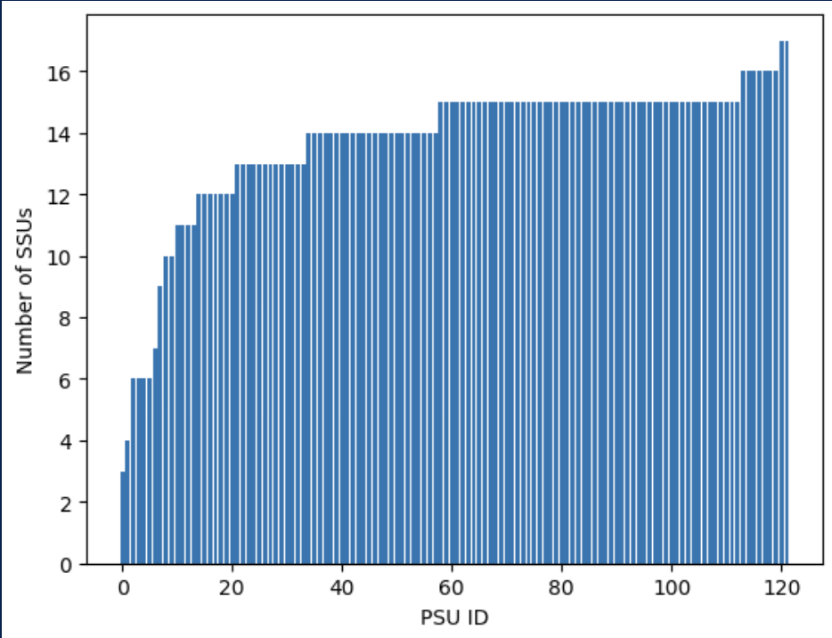
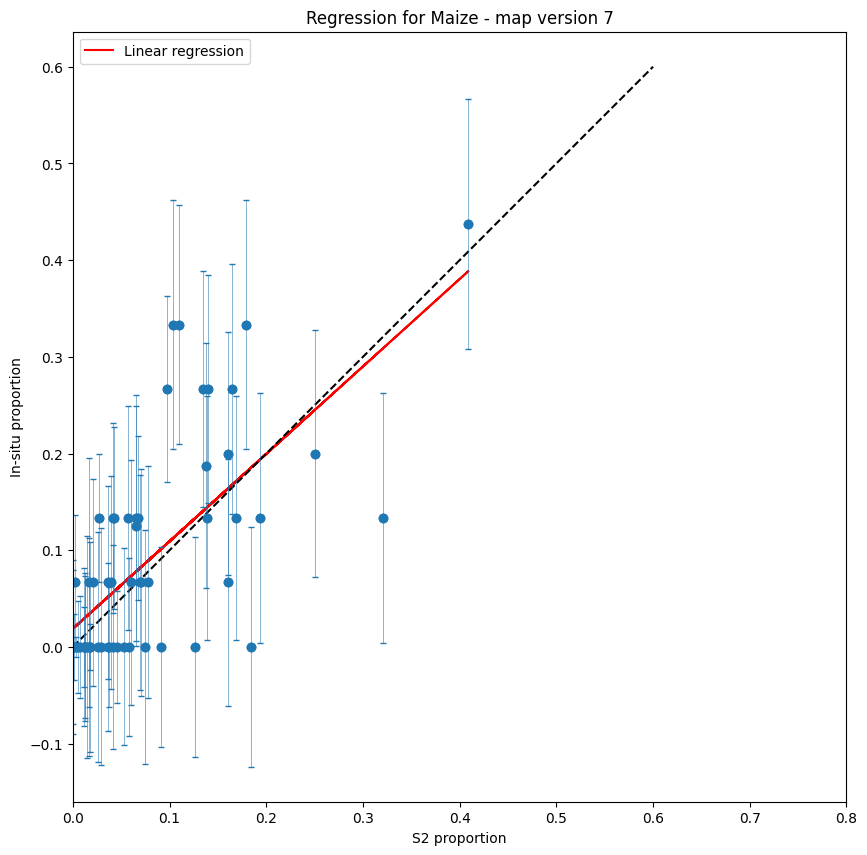
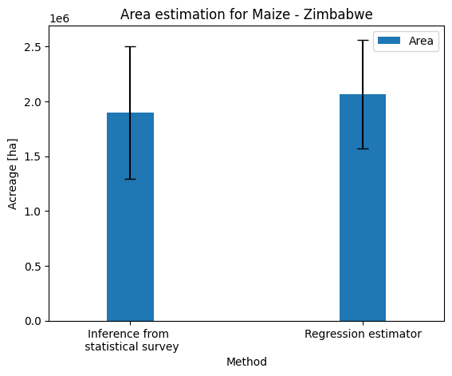

## Introduction 

Producing statistics by counting those pixels classified as a given crop type 
does not provide unbiased area
estimates. Maps are subject to omission and commission errors (Czaplewski, 1992), 
which are linked to the ability of the
classification method to distinguish between classes. Regression
estimators and calibration estimators have been widely used to correct
such biases (F. J. Gallego and Rueda, 1993; Khan et al., 2018; Olofsson
et al., 2014; Li et al.,2023). They are traditional ways to combine
accurate, possibly unbiased, information, observed on a sample with less
accurate, biased information, known for the whole population or for a
larger sample. Said differently, maps are used to improve an estimator
that has been computed from a ground survey on a sample in preserving
as much as possible the properties of the ground survey estimators
(unbiasedness) and reducing the variance (Gallego 2004).

This chapter presents an application of such regression approach in
Zimbabwe, as implemented in the framework of the EO STAT project.

## Statistical survey

As explained in the Chapter [Crop Classification in Zimbabwe](https://fao-eostat.github.io/UN-Handbook/ct_zimbabwe.html), 
a field campaign was implemented in
Zimbabwe in the framework of the FAO EOSTAT project during the summer
season 2024, which consisted in two complementary surveys. On one hand,
a statistical area frame survey was conducted to obtain a statistically
valid acreage estimate of the main crops. On the other hand, an
opportunistic windshield survey was designed to acquire as many
georeferenced observations as possible across all major land cover and
crop types.

The windshield survey has been detailed in the earlier Chapter. Those data
were used to generate the national wall-to-wall crop type map from the
summer 2024. The statistical survey was implemented using a two-stage stratified area
sampling frame, where Primary Sampling Units (PSUs) are sampled from an
initial population grid and Secondary Sampling Units (SSUs) are sampled
within each PSU. The goal of the survey is to estimate the area
proportion of the main crop(s) within PSUs to infer a mean proportion
across the whole population grid. Knowing the total area covered by the
population grid, the mean proportion estimation can be converted to a
total acreage estimation.

Cochran’s formula [@Cochran1977] was used to compute the total number of samples, 
corresponding to the SSUs: 

$$
n = \frac{(\sum{W_iS_i})^2}{[S(\hat{O})^2] + \frac{1}{N}\sum{W_iS_i^2}} \approx{ \left(\frac{\sum{W_iS_i}}{S(\hat{O)}} \right)^2}
$$
where: 

-   $N$ is number of population units in the area of interest
-   $S(\hat{O})$ is the expected standard error of the accuracy estimate, expressed as a proportion
-   $S_i$ is the standard deviation of stratum $i$
-   $W_i$ is is the mapped proportion of area of class $i$
-   $U_i$ is the expected user accuracy of class $i$

Because N is large (over 2397 million pixels), the second term in the
denominator of Eq. (1) can be ignored. A standard error for overall
accuracy of 0.01 was targeted and user accuracy values ≥ 0.70 were
anticipated. The resulting sample size was n = 1836, thus corresponding
to SSUs.

We performed a stratification with the aim of dividing the population
into internally homogeneous subpopulations in terms of cropping
intensity. This stratification was based on the ESA WorldCover map. The
proportion of cropland within each PSU was calculated (given by the
number of cropland pixels divided by the total number of pixels) and the
segments were assigned to one of five strata. The strata limits were
defined using the Jenks natural breaks classification method. The Jenks
algorithm determines the best arrangement of values to minimize each
class\'s average deviation from the class mean, while maximizing each
class\'s deviation from the means of the other classes. In other words,
the method seeks to reduce the variance within classes and maximize the
variance between classes. Blocks having an agricultural intensity value
less than 2 were dropped, as these represented areas with no
agriculture, or with negligible agricultural surfaces. Results of this
stratification are shown in @tbl-strata.

|     Strata        |     Nb of blocks    |     Area (ha)    |     Cropland area (ha)    |     Agricultural Intensity (%)    |
|-------------------|---------------------|------------------|---------------------------|-----------------------------------|
|     Stratum 1     |     11291           |     4516400      |     165196.4424           |     3.6                           |
|     Stratum 2     |     22644           |     9057600      |     938008.2325           |     10.3                          |
|     Stratum 3     |     14742           |     5896800      |     1305204.32            |     22.1                          |
|     Stratum 4     |     8390            |     3356000      |     1250339.113           |     37.2                          |
|     Stratum 5     |     2866            |     1146400      |     683274.7886           |     59.6                          |
: Cropping intensity strata characterization {#tbl-strata}

SSUs are defined as squares of 10 x 10 meters cell size, which
corresponds to the size of a single Sentinel-2 pixel. Following
recommendations from Stehman [@Stehman2012], an equal number of SSUs was
allocated to each stratum. 25 PSUs were randomly selected from each
stratum and in the second stage of sample allocation, 15 SSUs were
randomly allocated in each PSU resulting in a total of 1875. @fig-stats-zimbabwe-2
shows the distribution of PSU across the country and across the 5
strata.

```{r}
#| echo: FALSE
#| eval: TRUE
#| out-width: 80%
#| label: fig-stats-zimbabwe-2
#| fig-align: center
#| fig-cap: Distribution of PSU (black dots) across the country and strata
knitr::include_graphics("./images/crop_statistics_regression/image2.png")
```

## Statistical survey data

The statistical survey was implemented during a 2 week-period in
February-March 2024. It was conducted by 4 teams (each team being made
of one driver and 2 enumerators). The navigation between the PSUs was
facilitated by the Path Finder WebGis application and the Survey 123
application was used to collect georeferenced information for each SSU.
The repartition of the classes in the dataset is shown in @fig-stats-zimbabwe-3.

```{r}
#| echo: FALSE
#| eval: TRUE
#| out-width: 80%
#| label: fig-stats-zimbabwe-3
#| fig-align: center
#| fig-cap: Land cover classes distribution observed in the statistical dataset.
knitr::include_graphics("./images/crop_statistics_regression/image3.png")
```

A data cleaning step was conducted, which resulted in the removal
of a significant number of SSUs that did not match the expected collection requirements.
The number of SSUs available within each PSUs after this quality control
step is displayed in @fig-stats-zimbabwe-4. This cleaning step, although necessary,
decreased the number of SSUs in half the PSUs to less than 15. This will
have a significant impact on the error associated to the estimation of
the crop proportion within PSUs and therefore on the acreage statistics
computation.

```{r}
#| echo: FALSE
#| eval: TRUE
#| out-width: 80%
#| label: fig-stats-zimbabwe-4
#| fig-align: center
#| fig-cap: Number of SSUs by PSUs after the data cleaning.

```

## Maize acreage by regression estimator

The statistical survey and the national summer crop type map generated
in the FAO EOSTAT project (see Chapter [Crop Classification in Zimbabwe](https://fao-eostat.github.io/UN-Handbook/ct_zimbabwe.html)) 
were then used to estimate maize acreage.

First, a statistical inference of the stratified sample was computed.
The estimated mean $Z_{i}$ and total acreage $\tau_{i}$ of maize within
each stratum are given by the following equations.

$$
\hat{\tau_i} = A_i * \hat{z_i}
$$

$$
\hat{z_i} =  \frac{1}{n_i} * \sum_{j=1}^{n_j} z_i
$$

The variance of the acreage estimation within each stratum
$\text{Var}(\tau_{i})$ and total variance are given by equations (4) and
(5):

$$
\hat{V}ar(\hat{\tau}) = \sum_{i=1}^H \hat{V}ar(\hat{\tau_i})
$$
$$
\hat{V}ar(\hat{\tau_i}) = {A_i}^2 * (1 - \frac{n_i}{N_i}) * \frac{1}{n_i(n_j - 1)} * \sum_{j=1}^{n_j} (z_{ij} - \hat{z_i})
$$ 

The map then was combined in the estimation process using a regression
estimator, combining spatially exhaustive information from the map with
unbiased information from the statistical survey through linear
regression.

The variance of the regression estimator was computed and is given by

$$
S_{\hat{y}}^2 = \frac{N -n}{N} \left( \frac{s_y^2(1 - r^2)}{n} + \frac{s_y^2(1 - r^2)(\bar{x} - \mu_x)}{(n-1)s_x^2} \right)   
$$
With $N$ the population size, $n$ the sample size, $s_{y}^{2}$ the
variance of proportions in the sample in the statistical survey,
$s_{x}^{2}$ the variance in the sample in the map.

```{r}
#| echo: FALSE
#| eval: TRUE
#| out-width: 60%
#| label: fig-stats-zimbabwe-8
#| fig-align: center
#| fig-cap: Regression estimator for the maize between the map and the statistical survey.

```

Acreage estimates for maize and their 95% confidence intervals for both
methods are shown in @fig-stats-zimbabwe-9. 

```{r}
#| echo: FALSE
#| eval: TRUE
#| out-width: 60%
#| label: fig-stats-zimbabwe-9
#| fig-align: center
#| fig-cap: National scale area estimates for maize during the 2024 summer season.

```

The variance has slightly improved when integrating the map in the
estimation process. However, the decrease is lower than expected and
this is mainly due to the error associated with the maize proportions
within PSUs (half of the PSUs with less than 15 SSUs -- see figure 3).
To decrease this uncertainty, only PSUs containing at least 15 SSUs were
used in the regression estimator. However, since the variance of the
regression estimator depends on the sample size, the removal of half the
PSUs from the dataset limited the potential reduction in variance that
could have been achieved using remote sensing.

## Lessons learned

This use case demonstrated how EO maps can be combined with a
statistical survey to improve the acreage estimation. This was done for
maize, which is the dominant summer crop in Zimbabwe. The obtained
acreage figure is aligned with the estimation from AGRITEX (Department
of Agricultural, Technical and Extension Services, responsible for
providing technical support and advice to farmers),which, although
unofficial, is one of the most reliable estimates available.

This method has the advantage of being built upon official statistical
surveys conducted by the NSOs, thus avoiding questions about the
legitimacy of the results. Conversely, it has the drawback of being
sensitive to the implementation of these statistical surveys.

First, the protocols need to make sure that georeferenced information is
collected at the crop-level (not only at the household-level). This is
quite obvious in area frame surveys, but needs some adjustments in case
of list frame.

Second, samples need to be correctly allocated, which was probably not
the case here. As can be seen on Figure 4, the maximum maize proportion
values observed in the statistical survey reach only 0.4, which means
that agriculture intensity stratification based on the ESA WorldCover
product was not efficient. For the future, the stratification can be
based on the EOSTAT summer crop type map, which should bring better
results.

Finally, enumerators need to be trained to collect the data of good
quality (**discuss the quality assessment here**).

## About the authors{-}

## References{-}
