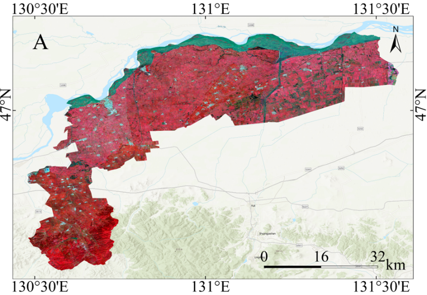
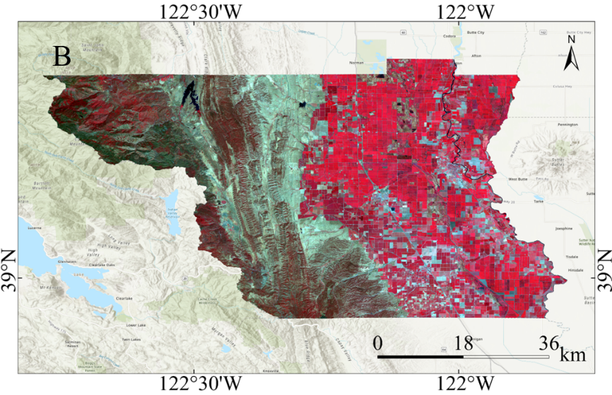
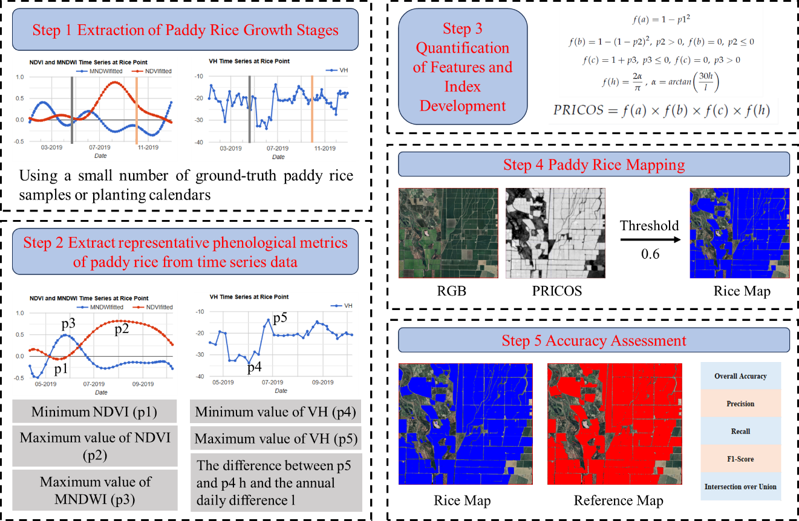
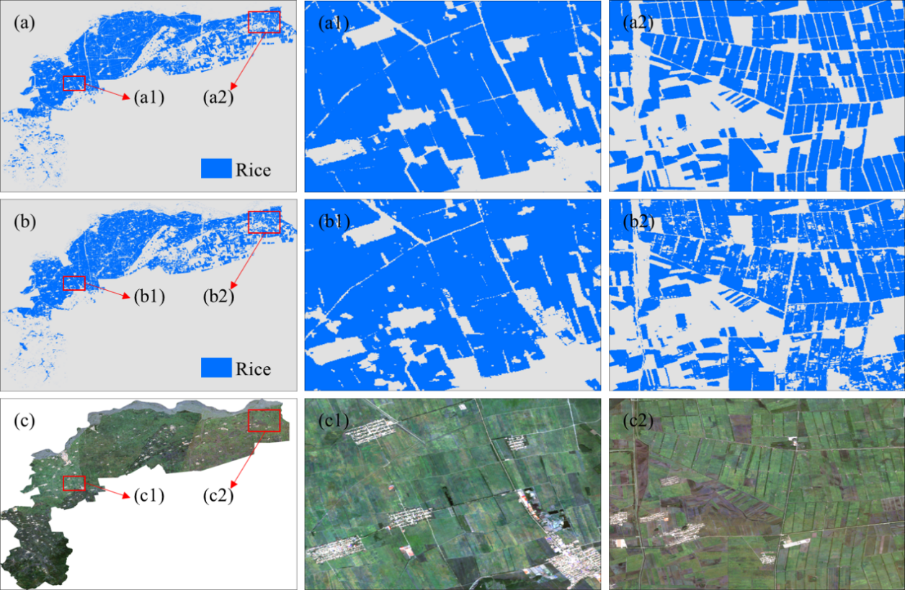
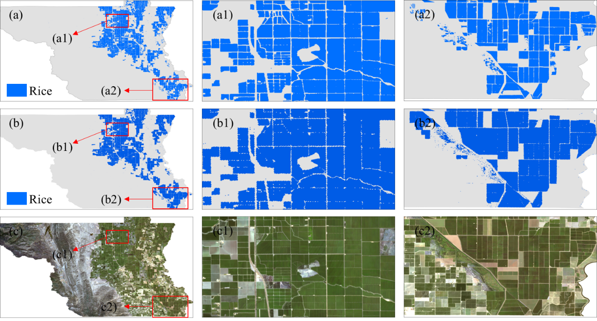

## Introduction

Paddy rice is a key component of global food security, particularly in
Asia, where it serves as the staple food for billions of people and
sustains rural livelihoods [@FAO2021]. However, rice cultivation is resource
intensive, requiring substantial irrigation and contributing
significantly to methane emissions [@Yan2009]. Timely and accurate
information on the distribution of paddy rice is therefore essential for
production monitoring, environmental sustainability, water resource
management, and climate change mitigation [@Carrasco2022].

This section introduces a paddy rice identification index that combines
optical and Synthetic Aperture Radar (SAR) features---PRICOS (Paddy Rice
Index Combining Optical and SAR features) [@Lou2025], which integrates
optical data with Synthetic Aperture Radar (SAR) observations. By
combining these data sources, PRICOS reduces common challenges in remote
sensing, such as cloud cover and speckle noise, thereby improving
classification reliability. Using time-series data from Sentinel-1 and
Sentinel-2, the method identifies key rice phenological stages and can
perform effectively even in areas with limited ground samples. PRICOS
enhances the timeliness, spatial resolution, and reliability of rice
statistics, providing support for agricultural planning and policy
development.

## Experimental Area and Data

PRICOS was validated in two experimental areas, as shown in @fig-1-ct-china and 
@fig-2-ct-china. Site A is Huachuan County, Jiamusi City, Heilongjiang Province, China
(130°16′--131°34′E, 46°37′--47°14′N), with an area of approximately
2,268 km². It is a typical single-cropping rice area in Northeast China.
The terrain is flat, and the region has a temperate continental monsoon
climate, with an average annual temperature of about 3.5 °C and annual
precipitation of around 550 mm. A single-cropping rice system is
practiced, with transplanting usually in mid-May and harvesting in early
October.

Site B is Colusa County, California, United States (121°47′--122°47′W,
38°55′--39°24′N), covering an area of approximately 2,995 km². It is
located in the Sacramento Valley, one of the major rice-producing
regions in the United States. The area has a Mediterranean climate,
characterized by hot, dry summers and mild, wet winters. The average
annual temperature is about 16.5 °C, and annual precipitation is around
400 mm, mainly from November to March. A single-cropping rice system is
also practiced here, with sowing generally from late April to early May
and harvesting from late September to early October.

```{r}
#| echo: FALSE
#| label: fig-1-ct-china
#| out-width: 80%
#| fig-cap: |
#|   Huachuan County, Jiamusi City, Heilongjiang Province, China. Sentinel-2 median composite image using false color synthesis (red: B8, green: B4, blue:B3).
#| fig-align: center

```

```{r}
#| echo: FALSE
#| label: fig-2-ct-china
#| out-width: 80%
#| fig-cap: |
#|   Colusa County, California, United States. Sentinel-2 median composite image using false color synthesis (red: B8, green: B4, blue:B3).
#| fig-align: center

```

The input data for this case study consists of Sentinel-1 Synthetic
Aperture Radar (SAR) images covering the rice-growing season in 2019 and
Sentinel-2 multispectral images from the corresponding period. For
Sentinel-1, data selection was based on the Interferometric Wide (IW)
mode and descending orbit, with only VH polarization retained. Speckle
noise was addressed using local mean and variance within a 7×7
neighborhood, with the signal-to-noise ratio (SNR) calculated as the
ratio of variance to the squared mean. Pixels with SNR greater than or
equal to 1 were masked to suppress high-noise areas, and a Gaussian
kernel was subsequently applied for smoothing. The images were
reprojected to a unified coordinate system and spatial resolution
(Coordinate reference system: WGS 1984 (EPSG:4326). Spatial resolution:
10 m), clipped to the study area, and augmented with a day-of-year (DOY)
band for time-series analysis.

For Sentinel-2 optical imagery, cloud masking was performed using the
cloud probability band (cs_cdf) provided by Google Cloud Score Plus,
retaining pixels with cs_cdf values greater than or equal to 0.5. For
each acquisition, the Normalized Difference Vegetation Index (NDVI) and
the Modified Normalized Difference Water Index (MNDWI) were calculated.
A third-order harmonic regression model was then applied to generate
smoothed NDVI and MNDWI time-series curves.

## Methods

As shown in @fig-3-ct-china, the PRICOS mapping framework consists of five main
steps:

Step 1: Determine the rice growth period based on a limited number of
samples. Specifically, the mean NDVI, MNDWI, and VH time series were
derived from a small set of paddy rice sample points in GEE. By
combining the water signal during the transplanting stage with the
vegetation signal during the maturity stage, the sowing phase was
defined as the 15 days prior to the point when MNDWI exceeded 0 and VH
began to show a rapid decline. Subsequently, the maturity--harvest phase
was defined as the period when NDVI decreased from its maximum value to
0.3. The duration from the onset of sowing to the end of harvest was
defined as the rice growth period. For regions with available rice
cropping calendars, the corresponding period was directly specified in
the code.

Step 2: Extract seven key phenological indicators from the smoothed time
series: the minimum NDVI during the transplanting stage (p1), the
maximum NDVI during the peak growth stage (p2), the maximum MNDWI during
the transplanting stage (p3), the minimum VH during the transplanting
stage (p4) along with its corresponding day of year
(${p4}_{doy}$), and the maximum VH during the
peak growth stage (p5) along with its corresponding day of year
(${p5}_{doy}$).

Step 3: Define four normalization functions---f(a), f(b), f(c), and
f(h)---based on the extracted phenological features, and construct the
PRICOS index through their multiplicative combination. The formulas are
defined as follows:
$$
f(a) = 1 - {p1}^{2}
$$
$$
  f(b) = 1 - (1 - p2)^{2},p2 > 0,\ \ f(b) = 0,\ p2 \leq 0
$$
$$
  f(c) = 1 + p3,p3 \leq 0,\ \ f(c) = 0,\ p3 > 0
$$

  $$
  f(h) = \frac{2\alpha}{\pi},{\alpha = arctan}\left( \frac{30h}{l} \right),h = p5 - p4,l = {p5}_{doy} - {p4}_{doy}
  $$
$$
 PRICOS = f(a) \times f(b) \times f(c) \times f(h)\ 
$$
Step 5: Validate the results using reference datasets from China and the
United States. In China, the 10-meter resolution paddy rice dataset
constructed by Shen et al. \[@Shen2023] was used. In the United States, the
30-meter resolution Cropland Data Layer (CDL,
https://croplandcros.scinet.usda.gov/) served as the reference.
Classification accuracy was evaluated using five commonly adopted
metrics: Overall Accuracy (OA), Precision, Recall, F1-Score, and
Intersection over Union (IoU).

```{r}
#| echo: FALSE
#| label: fig-3-ct-china
#| out-width: 100%
#| fig-cap: |
#|   PRICOS rice mapping workflow.
#| fig-align: center

```

The validation procedure was conducted as follows: first, clip both the
predicted paddy rice map and the reference map using the same
administrative boundary to ensure spatial consistency; next, resample
all data to a uniform spatial resolution of 10 meters; finally, conduct
a pixel-wise comparison (1 for paddy rice, 0 for non-rice) to calculate
the accuracy metrics.

## Results

@tbl-accuracy summarizes the classification accuracy metrics for Sites A and
B, including IoU, OA, Precision, Recall, and F1-Score. The results
indicate that the PRICOS method achieved high classification performance
in both regions. Specifically, IoU values for Sites A and B were 0.8237
and 0.8682, respectively, indicating a high spatial agreement between
the predicted and reference paddy rice distributions. The OA values
reached 0.9678 at Site A and 0.9838 at Site B, showing that over 96% of
pixels were correctly classified, with overall classification errors
being minimal. Regarding Precision, the values of 0.8812 (Site A) and
0.9720 (Site B) suggest that between 88% and 97% of pixels classified as
paddy rice correspond to actual rice areas, implying a low false
positive rate. Recall values were 0.9267 and 0.8905, respectively,
suggesting that 89%--93% of the actual paddy rice pixels were
successfully detected by the model, with a controlled false negative
rate. The F1-Scores were 0.9034 and 0.9295, reflecting a well-balanced
trade-off between Precision and Recall. Comparatively, the
classification results for Site B outperformed Site A, which may be
partly attributed to differences in reference data quality.

|     Experimental area    |     IoU       |     OA        |     Precision    |     Recall    |     F1 score    |
|--------------------------|---------------|---------------|------------------|---------------|-----------------|
|     A                    |     0.8237    |     0.9678    |     0.8812       |     0.9267    |     0.9034      |
|     B                    |     0.8682    |     0.9838    |     0.9720       |     0.8905    |     0.9295      |
: Accuracy evaluation {#tbl-accuracy}

```{r}
#| echo: FALSE
#| label: fig-4-ct-china
#| out-width: 100%
#| fig-cap: |
#|   Comparison of rice extraction results with reference data and Sentinel-2 images in Huachuan County, China: (a) PRICOS results; (b) Reference data; (c) Satellite images.
#| fig-align: center

```

```{r}
#| echo: FALSE
#| label: fig-5-ct-china
#| out-width: 100%
#| fig-cap: |
#|   Comparison of rice extraction results in Colusa County with reference data and Sentinel-2 images: (a) PRICOS results; (b) Reference data; (c) Satellite images.
#| fig-align: center

```

In this study, a threshold
of 0.6 was applied to the PRICOS-derived maps for paddy rice extraction.
Since the PRICOS results represent normalized probabilities of rice
cultivation, with values closer to 1 indicating a higher likelihood of
paddy rice, researchers may adjust this threshold according to specific
mapping requirements.

@fig-4-ct-china and @fig-5-ct-china present the paddy rice distribution maps for Sites A and B extracted using a 0.6 threshold. Compared with the reference maps
and satellite imagery, PRICOS
demonstrated high reliability in both regions. At the field scale, Site
A showed particularly accurate delineation. Although some paddy rice
pixels were missed in Site B, the high spatial resolution of the
satellite imagery allowed for relatively precise depiction of field
boundaries. Specifically, in Site A, PRICOS successfully reconstructed
complete rectangular paddy rice fields with clear boundaries, as shown
in @fig-4-ct-china (a1) and (a2), 
consistent with field features visible in satellite imagery
(@fig-4-ct-china (c1) and (c2)). 
In contrast, the TWDTW-derived reference map exhibited
patchy "gaps" and isolated small areas, with some actual rice fields
omitted (@fig-4-ct-china (b1) and (b2) [@Shen2023]. In Site B, PRICOS captured field
boundaries more accurately in the northern zoomed-in area 
as shown @fig-5-ct-china (a1) and (a2), as
confirmed by both satellite imagery, as per @fig-5-ct-china (c1) and (c2),
and the CDL reference map, shown in @fig-5-ct-china (b1) and (b2).
In the southern zoomed-in area (@fig-5-ct-china (a2)),
some paddy rice pixels were still missed, indicating minor
under-detection in that region.

## Discussion

PRICOS offers significant practical value within agricultural
statistical systems, mainly in the following three aspects:

1. Improving estimation accuracy and adaptability: By integrating
optical and SAR time-series data, PRICOS effectively overcomes common
limitations in remote sensing, such as cloud cover and complex terrain.
Compared with traditional methods, this approach provides a substantial
improvement in overall accuracy. It offers a reliable and efficient
technical solution for large-scale paddy rice area estimation, while
greatly reducing the manpower and time required for field surveys.

2. Promoting standardization and automation of monitoring workflows:
Conventional rice mapping methods often rely on empirical thresholds or
complex parameter tuning, limiting their general applicability. PRICOS
extracts key phenological features using harmonic fitting, ensuring
stable performance across different agricultural landscapes. This
facilitates the establishment of unified national remote sensing
monitoring standards and automated processing workflows, enhancing the
consistency and sustainability of monitoring operations.

3. Supporting resource management and the development of a green
statistical system: Rice cultivation is closely linked to methane
emissions and water resource consumption. With a high spatial resolution
of 10 meters and frequent temporal coverage, PRICOS enables detailed
mapping of dynamic changes in rice-growing areas. It provides critical
data for farmland protection, carbon emission accounting, and irrigation
optimization, laying the foundation for an environmentally oriented
agricultural statistical system.

Extensive validation across multiple regions yielded the following key
findings and suggested future improvements:

1. Multi-source feature fusion enhances classification performance: The
combined use of NDVI, MNDWI, and VH backscatter significantly improved
rice classification accuracy, confirming the effectiveness of
multi-source data integration.

2. Regional differences in SAR feature applicability: SAR-based
indicators performed well in flat terrain but were prone to confusion
with wetland vegetation in complex or fragmented landscapes. Introducing
terrain correction and auxiliary optical validation is recommended to
enhance applicability in heterogeneous environments.

3. Lightweight design suitable for areas with scarce samples: PRICOS
constructs models based on time-series features without requiring
extensive ground samples, ensuring high transferability and robustness.
This makes it particularly suitable for areas with limited samples and
highlights its potential for global rice monitoring.

4. Limitations due to dependence on optical data: The harmonic fitting
process relies heavily on high-quality optical time-series data, which
may be affected in regions with persistent cloud cover. Future research
should explore SAR-dominated alternatives to strengthen all-weather
monitoring capabilities.

5. Adaptive strategies for regions with diverse phenology: In
mountainous or phenologically heterogeneous areas, feature extraction
strategies should be dynamically adjusted based on local cropping
calendars to improve regional adaptability and classification accuracy.

## Conclusions

This study demonstrates that the PRICOS method, which integrates optical
and SAR time-series features, enables efficient and reliable
identification and mapping of paddy rice. In two representative study
areas---Huachuan County, China, and Colusa County, United
States---PRICOS achieved excellent classification accuracy, with IoU
values of 0.8237 and 0.8682, OA values of 0.9678 and 0.9838, and
F1-scores above 0.90. These results indicate that PRICOS provides stable
performance and strong generalization capability. In addition, PRICOS
does not rely on extensive ground samples, offering advantages of being
lightweight and highly transferable, which makes it particularly
suitable for application in regions with limited field data.


## Code and data availability{-} 

The PRICOS code is available in the [GitHub link](https://github.com/JokoLou/A-Paddy-Rice-Index-Combining-Optical-and-SAR-Features-PRICOS). Due to the large amount of input data, only part of Colusa County is shown. In this study, Python 3.12 was used. The main code was developed and
executed in a Windows 11 environment, relying on multiple third-party
libraries for remote sensing image reading, processing, visualization,
and classification accuracy evaluation. To ensure stability and
compatibility in spatial data processing, it is recommended to create a
virtual environment on the Anaconda platform for unified management of
library versions.

The code is also available in [Google Earth Engine (GEE)](https://code.earthengine.google.com/eb4f07a4d990934a55022941e722ec3f). 
Due to GEE memory limitations, only part of Colusa County is shown.

## About the authors{-}

Professor Jingfeng Huang (email: hjf@zju.edu.cn), Zhejiang University, China is dedicated to teaching, research, and applications in agricultural remote sensing. 
His  team has published nearly 400 papers in prominent academic journals.
He has authored a series of scientific monographs on agricultural remote
sensing and information technology,

Yifeng Lou is a researcher at Zhejiang University, China, who
primarily focuses on remote sensing-based estimation and dynamic
monitoring of paddy rice planting area, providing data support for food
security.


## References{-}