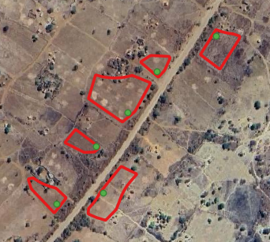
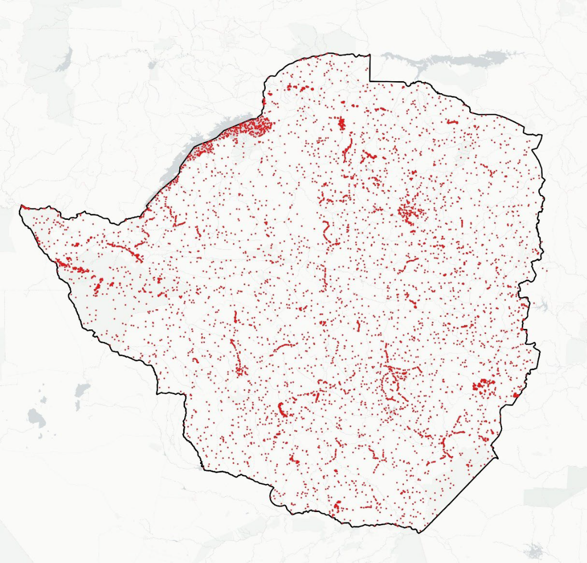
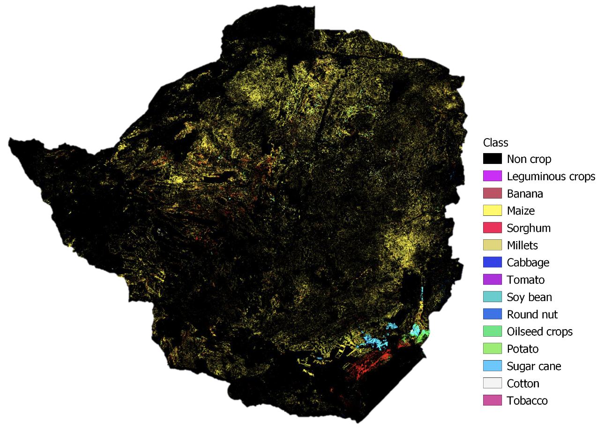
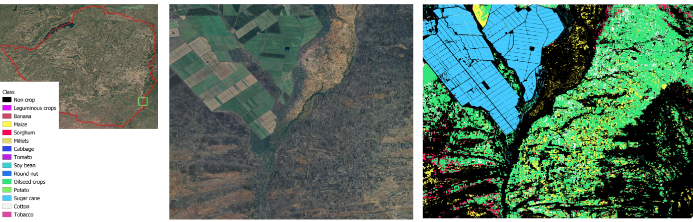
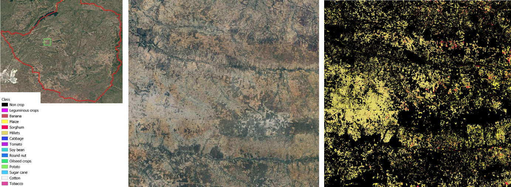
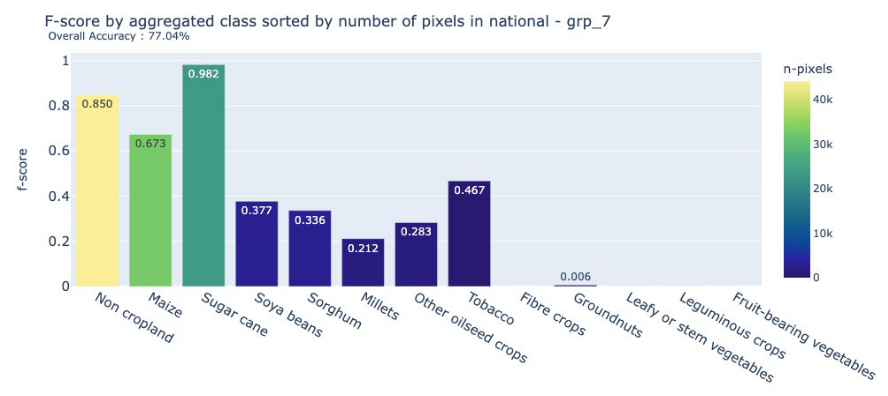
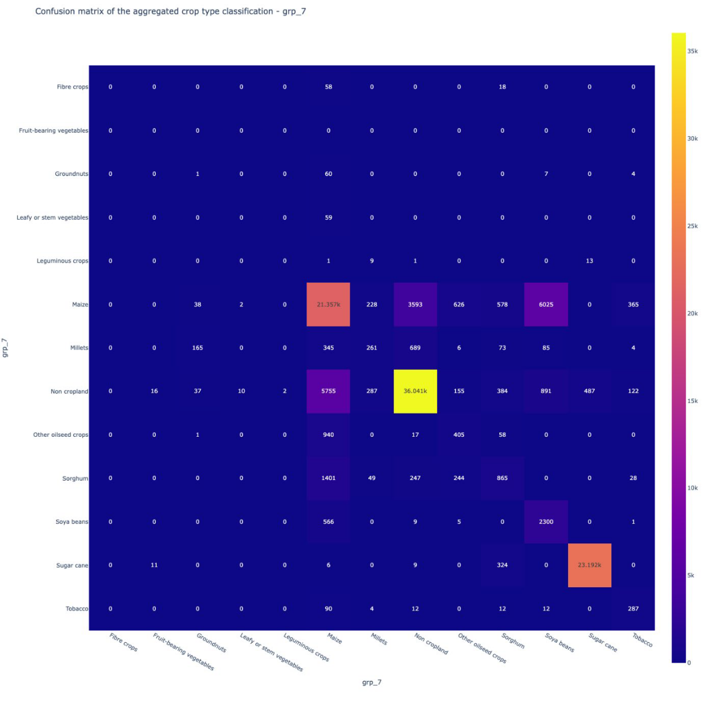

## Outline

This chapter illustrates the operational use of Earth Observation (EO)
for crop classification in Zimbabwe during the 2024 summer season, under
the FAO--EOSTAT project. The exercise demonstrates how the Sen4Stat
toolbox can support large-scale, national crop type mapping using
Sentinel-2 data combined with in-situ observations.

The approach builds on extensive ground data collection campaigns,
complemented with expert photo-interpretation and ancillary non-crop
samples. The final classification map covers the entire country and
includes major crops such as maize, sorghum, millets, soybean, oilseeds,
and sugarcane.

## Data and Methods

The classification exercise was conducted for the entire territory of
Zimbabwe during the 2024 summer agricultural season. This period
represents the country's primary cropping cycle, with maize and other
cereals dominating the central and northern regions, and irrigated
sugarcane estates concentrated in the south-east. The diversity of
production systems across agro-ecological zones made Zimbabwe an ideal
test case for developing a national crop type map.

The analysis relied heavily on Sentinel-2 optical time series imagery at
10--20 m resolution. These data provided the spectral foundation for the
classification, complemented by vegetation indices such as NDVI and
water-related indices such as NDWI. Red-edge indices, which are
particularly sensitive to crop growth stages, were also included to
capture differences in crop phenology across the season.

To calibrate and validate the classification, the suitability of 
existing data collected by national stakeholders was first examined. 
Indeed, crop data is regularly collected by different departments 
inside the Ministry of Lands, Agriculture, Fisheries, Water, and 
Rural Development through scattered field campaign efforts. 
However, these local field campaigns did not allow to have 
a complete view of the crop situation at the national-level. 
The National Statistical Office, ZIMSTAT, is also implemented 
their own survey but without crop geolocalization. 
Therefore, a comprehensive set of ground observations was collected. 
The core of this dataset consisted of approximately 2,910 windshield 
survey points, collected across the country. 

The quality assessment of the data collected concluded in their good
quality; points being located inside parcels and in homogeneous areas.
To strengthen spatial and spectral representativeness, homogeneous areas
were delineated by photo-interpretation around these windshield points,
thus moving from point to polygon and increase the number of pixels
available for calibrating the classification algorithm (@fig-1-zimbabwe).
The photo-interpretation was based on a combination of very
high-resolution (VHR) images and time series of Sentinel-2 images with a
specific focus on classes' spectral homogeneity and purity.

```{r}
#| echo: FALSE
#| label: fig-1-zimbabwe
#| out-width: 90%
#| fig-cap: |
#|   Example of augmented windhsield sample points (in green) delineated into polygons (in red).
#| fig-align: center

```

Non-crop classes were equally important for robust classification. For
this purpose, about 500 samples were extracted from the ESA WorldCover
2020 map, representing stable categories such as forest, water,
shrubland, bare soil, and built-up areas. An additional 700 targeted
samples were collected in more challenging non-crop environments---such
as savannas, dense vegetation, and water margins---where spectral
signatures can easily overlap with cropland under drought or seasonal
stress.

The integration of all these sources produced the final in-situ dataset
used for classification and validation, which is presented in
@fig-2-zimbabwe. This dataset provided the statistical foundation for training the Random Forest model and for assessing the quality of the national crop type map.

```{r}
#| echo: FALSE
#| label: fig-2-zimbabwe
#| out-width: 90%
#| fig-cap: |
#|   Final in-situ dataset for crop type classification for the 2024 summer season.
#| fig-align: center

```

## Crop classification

The crop type classification was carried out using the Sen4Stat toolbox,
which integrates statistical survey data with Earth Observation imagery
through machine learning techniques. The Sen4Stat system is an evolution of the Sen2Agri system, whose performance has been demonstrated and validated in a
variety of contexts [@Defourny2019].


For this case study, a Random
Forest (RF) algorithm was chosen because of its robustness, its ability
to handle high-dimensional datasets, and its proven performance in
agricultural mapping tasks. The model was trained on a 
set of input features derived from Sentinel-2
multi-temporal imagery. These included not only the reflectance values
from the spectral bands but also a series of vegetation and water
indices, such as NDVI, NDWI, and brightness indices, which capture
vegetation vigor and soil--moisture conditions. To further enhance class
separability, the analysis incorporated red-edge indices (e.g. NDRE,
REPI) that are particularly sensitive to crop growth stages. For each of
these time-series indicators, statistical descriptors---including mean,
median, minimum, maximum, and standard deviation---were computed across
the growing season to summarize crop phenological dynamics in compact
but informative variables.

One of the main challenges in the Zimbabwe dataset was the imbalance of
classes, with dominant categories such as maize and non-cropland
strongly outweighing minority crops like sorghum, millets, and oilseeds.
To address this, the Synthetic Minority Oversampling Technique (SMOTE)
was applied during training [@Chawla2002]. 
This procedure generates artificial samples
of underrepresented classes based on their spectral and temporal
properties, improving the ability of the RF classifier to learn
distinctive signatures for minor crops.

The monitoring period was set between 15 November 2023 and 15 July 2024,
which corresponds to the main summer agricultural season in Zimbabwe.
This window was selected to ensure that the temporal profiles captured
the entire cycle, from early planting and vegetative development through
to maturity and harvest. By covering the full growing season and
spanning the country's diverse agro-ecological zones, the approach
maximized the chances of distinguishing crop types based on their
phenological behavior.

## Results

The outcome of the classification process was the production of a
national crop type map for the 2024 summer season, presented in 
@fig-4-zimbabwe. The map provides a spatially explicit representation of Zimbabwe's agricultural landscape, highlighting the dominance of particular crops
and the regional diversity of production systems.

As expected, maize emerged as the most widespread crop, covering large
portions of the central and northern provinces. In contrast, sugarcane,
soybean, and oilseeds appeared more geographically concentrated, with
clear clusters located in the south-eastern part of the country,
particularly in areas with access to irrigation. Sorghum and millets
were also detected across several regions, although their distribution
was less continuous. These cereals posed challenges to the
classification process because of their spectral and phenological
similarity to maize, leading to frequent confusion between the classes.

Overall, the crop type map captures both the broad patterns of
Zimbabwe's cropping systems and the fine-scale structures of fields and
parcels, offering a valuable resource for monitoring agricultural
production at the national scale.

```{r}
#| echo: FALSE
#| label: fig-4-zimbabwe
#| out-width: 90%
#| fig-cap: |
#|   National crop type map of Zimbabwe for the 2024 summer season.
#| fig-align: center

```


```{r}
#| echo: FALSE
#| label: fig-5-zimbabwe
#| out-width: 90%
#| fig-cap: |
#|   Zoom on an irrigated sugarcane farm in Chiredzi district.
#| fig-align: center

```

```{r}
#| echo: FALSE
#| label: fig-6-zimbabwe
#| out-width: 90%
#| fig-cap: |
#|   Zoom on a maize and millets dominated area.
#| fig-align: center

```


## Accuracy assessment

The quality of the national crop classification was evaluated using an
independent validation dataset, consisting of 25 percent of the
windshield observations that had been withheld from model training. This
ensured that the accuracy assessment reflected the classifier's
performance on unseen data, rather than simply reproducing the training
set.

The results yielded an overall accuracy of 77.04 percent, demonstrating
that the methodology was able to capture the main crop types with a
satisfactory level of reliability for national-scale applications. More
detailed insights into class-specific performance are illustrated in the
F-score chart (@fig-7-zimbabwe) and the confusion matrix 
(@fig-8-zimbabwe).

```{r}
#| echo: FALSE
#| label: fig-7-zimbabwe
#| out-width: 90%
#| fig-cap: |
#|   Class-specific F-scores of the national summer crop type map.
#| fig-align: center

```

Performance varied notably across crop types. Sugarcane achieved very
high accuracy, benefiting from its distinctive spectral and spatial
profile in localized irrigated estates. Maize, sorghum, and millets, on
the other hand, proved more difficult to distinguish. Their overlapping
phenological cycles and similar spectral behavior led to frequent
confusion among these cereals. Errors were also observed in the
separation between maize and soybean, and between maize and
non-cropland, resulting in both commission and omission errors.

Despite these challenges, the classification showed a strong ability to
discriminate cropland from non-cropland, an outcome reinforced by the
inclusion of additional non-crop samples in the training dataset. This
level of performance is significant in the Zimbabwean context, where
accurate cropland extent information is critical for agricultural
monitoring and food security planning.


```{r}
#| echo: FALSE
#| label: fig-8-zimbabwe
#| out-width: 90%
#| fig-cap: |
#|   Confusion matrix of the national crop type classification.
#| fig-align: center

```


## Discussion

The Zimbabwe case study demonstrates the operational feasibility of
generating national crop classification maps by combining open-access
Earth Observation data with well-structured in-situ datasets. The 77%
overall accuracy reflects a solid foundation for large-scale
agricultural monitoring, while also highlighting areas for
methodological improvement.

The analysis confirmed that certain crops, such as sugarcane, can be
mapped with very high confidence, thanks to their unique spectral and
spatial characteristics. By contrast, the classification of cereals like
maize, sorghum, and millets proved more challenging. These crops share
similar phenological patterns and spectral signatures, particularly
during key stages of the growing season, leading to notable confusion in
the model outputs.

Another important factor influencing classification performance was the
imbalance in ground data across crop classes. Dominant crops such as
maize were well represented in the training dataset, whereas minority
crops had far fewer samples. This imbalance limited the model's ability
to capture the variability of minor crops, reducing their classification
accuracy.

More samples should have also been targeted in the shrubland and
grassland classes, which were not well discriminated against by
cropland. This might be due to the specific context of the drought in
2024, which significantly reduced the contrast between natural
vegetation and crops, but this type of confusion might be expected even
without drought in smallholder agriculture systems. In the data
collection, moving from points to polygons could also be a
recommendation in the future to increase the number of calibration
pixels.

These findings underscore the importance of designing balanced and
representative in-situ datasets, especially when aiming for
national-scale applications. Targeted sampling in difficult
contexts---such as savannas, grasslands, or drought-affected areas---can
substantially improve the robustness of crop classification models. In
this sense, the Zimbabwe case not only provides a working prototype of
national crop mapping but also offers lessons for the refinement of
sampling strategies and methodological approaches in future
applications.

## Conclusion

The EOSTAT Zimbabwe case study delivered a validated, national-scale
crop type classification for the 2024 summer season, achieving an
overall accuracy of 77%. This result is particularly significant given
the seven crop and non-crop classes included in the analysis, ranging
from dominant crops like maize to minor ones such as soybean, oilseeds,
and millets. As documented in the literature, classification accuracy
generally decreases as the number of crop classes increases, due to
class imbalance and spectral similarity among crops with overlapping
phenological cycles [@Foody2002, @Orynbaikyzy2019]. In fact,
accuracies above 70%--75% are rarely attained in national-scale
classifications with more than five crop classes [@Defourny2019]. 
Against this benchmark, the Zimbabwe outcome can be considered
robust: sugarcane was mapped with high reliability, while confusion
among cereals pointed to known challenges that could be addressed
through more balanced ground data collection and advanced classification
methods. Beyond the technical findings, the exercise highlights the
operational value of the Sen4Stat toolbox, which proved capable of
delivering consistent, policy-relevant outputs. In doing so, the study
established not only a validated national crop type map but also a
prototype framework for a national crop monitoring system in Zimbabwe,
offering a replicable model for other countries modernizing their
agricultural statistics.

## References{-}