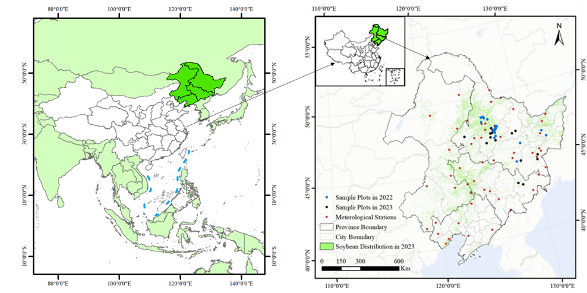
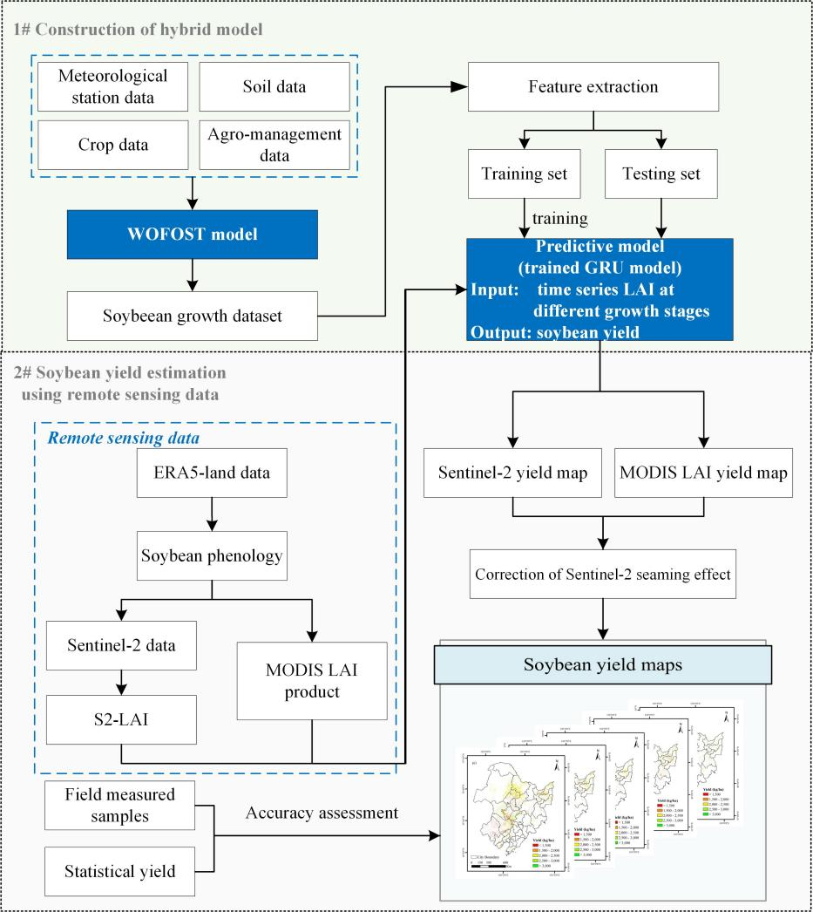
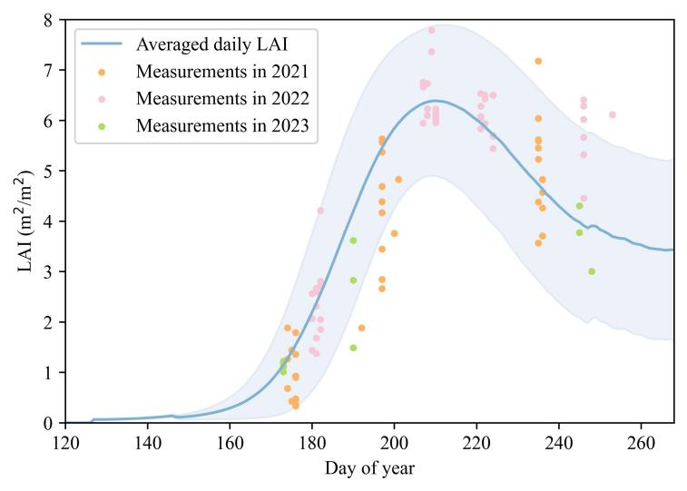
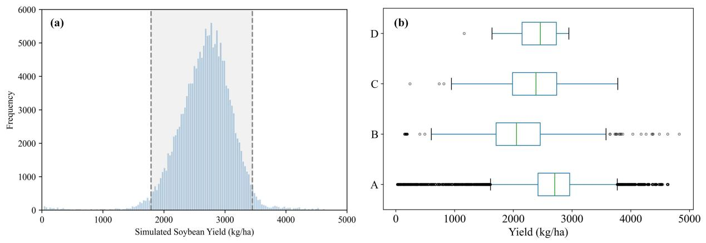
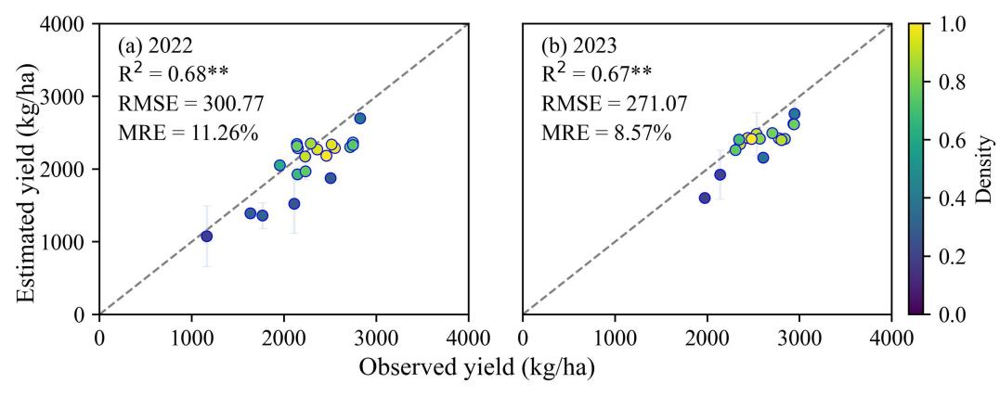
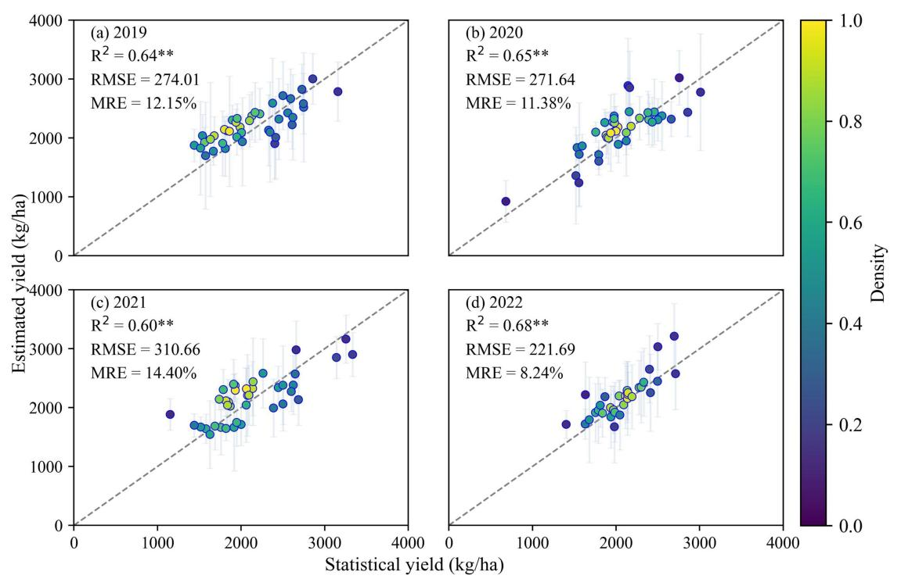
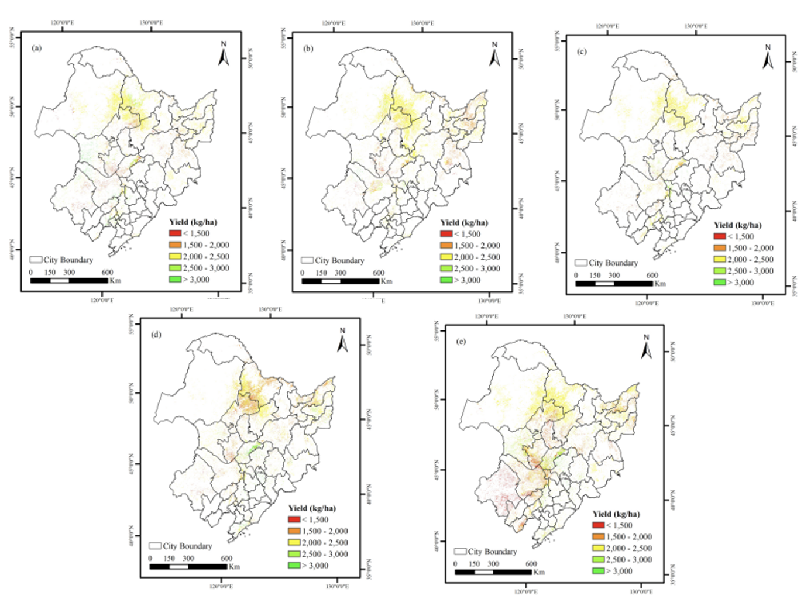

## Introduction

Food security is critical for national stability and sustainable
development. Accurate crop yield monitoring provides essential data for
policy-making, precision agriculture, and agricultural finance. Remote
sensing enables large-scale, dynamic crop monitoring, supporting yield
estimation through vegetation indices and other biophysical parameters.
Traditional methods rely on empirical models using remote sensing data,
while machine learning improves accuracy but faces challenges due to
limited training samples and cloud-affected data. Crop growth models,
based on agronomic mechanisms, offer higher precision but require
complex parameterization processes. Recent advances integrate remote
sensing with crop models via data assimilation, balancing accuracy and
scalability. However, computational complexity and retrieval errors
remain constraints. To address these limitations, this case introduces a
hybrid modeling approach combining machine learning with crop growth
models, enhancing yield estimation accuracy, automation, and
spatiotemporal generalization for soybean production.

## Experimental Area and Data

This case selects the black soil region of Northeast China as the
research area, covering Heilongjiang, Jilin, Liaoning provinces, and the
eastern part of Inner Mongolia Autonomous Region, totaling 40
prefecture-level cities with an area of approximately 1.24 million
square kilometers (@fig-1-cy-china). The Northeast region is the main
soybean-producing area in China, accounting for approximately 64% of the
country's annual production. Around 97% of the soybeans are rain-fed
during the growing season [@Guo2022] [@Yu2020], which
extends from May to late September [@Zhao2021].

```{r}
#| echo: FALSE
#| label: fig-1-cy-china
#| out-width: 90%
#| fig-cap: |
#|   Geographical location of the experimental area.
#| fig-align: center

```

Ground surveys were conducted in 2022 and 2023, collecting soybean yield
data from 21 and 18 sample plots, respectively. Each plot contained nine
randomly placed 1×1m quadrats, with harvested samples oven-dried to
determine yield. Sowing dates were recorded during fieldwork. Leaf Area
Index (LAI) data were obtained from the ground-based CAPLOS platform from
AIR Centre of the Chinese National Academy of Sciences, 
covering three growing seasons (2021-2023). Meteorological data included
variables (temperature, precipitation, wind speed, etc.) from 51 weather
stations (1980-2021) near soybean-growing areas, supplemented with
ERA5-Land reanalysis data for phenology estimation.

Soil data were sourced from the 1:1,000,000-scale digital soil database
of the Institute of Soil Science, Chinese Academy of Sciences [@Shi2004]. 
Remote sensing data included Sentinel-2 and MODIS LAI
products [@Knyazikhin2018] for regional soybean yield
estimation, with MODIS-derived yields used to correct Sentinel-2 biases.
Soybean distribution maps were derived from Zhao et al.'s OIF knowledge
graph and distance-preserving segmentation method (accuracy \>90%) [@Zhao2022]. Historical provincial yield statistics (1980-2022) from
statistical yearbooks were used for model validation and regional-scale
accuracy evaluation.

## Methods

The technical workflow of the hybrid methodology for
soybean yield estimation is shown in @fig-2-cy-china. 
It includes the following key steps: 1)
Generating a training dataset based on the WOFOST model that simulates
soybean growth and yields under various climates, soil, cultivars and
agro-management practices, 2) Training a GRU model to identify the
relationships between simulated LAI and yield, 3) Producing soybean
yield maps under multi-scale using LAI derived from MODIS and Sentinel-2
remote sensing data and 4) Accuracy evaluation using field-measured and
statistical data.

```{r}
#| echo: FALSE
#| label: fig-2-cy-china
#| out-width: 90%
#| fig-cap: |
#|   Overall flowchart of the hybrid method.
#| fig-align: center

```

A process-based WOFOST crop growth model [@vanDiepen1989] was
employed to simulate soybean development and yield formation under
diverse scenarios. By integrating 42-year meteorological data from 51
stations, 4 soil types, 5 soybean varieties, and 4 sowing dates, a
comprehensive dataset of 171,360 simulated scenarios was generated to
support yield estimation.

Deep learning techniques were applied to identify key yield-related
indicators from the simulated dataset. A Gated Recurrent Unit (GRU)
model [@Cho2014] was trained and dynamically optimized [@Acikkar2024]
to establish robust yield prediction relationships.

The experimental area was stratified by accumulated temperature zones to
account for maturity differences. Phenological stages were determined,
and LAI (a critical yield indicator) was retrieved from remote sensing
data using empirical methods [@Pasqualotto2019]. The trained GRU
model was then applied to generate multi-year spatial yield distribution
maps.

Model performance was evaluated using field-measured yield
data and municipal-level statistical yield records, ensuring reliability
across scales.

## Results

To validate the reliability of simulated LAI data, this case compared
field-measured LAI (2021-2023) with 5,000 randomly selected LAI curves
from the multi-scenario simulation dataset (@fig-3-cy-china). The results
demonstrate strong consistency between simulated and observed LAI
trends, with approximately 88% of field samples (n = 83, where n
represents the number of observed samples within the simulation range)
falling within the simulation envelope. This confirms that the WOFOST
model effectively captures soybean growth dynamics, ensuring
high-quality training data for the GRU model.

```{r}
#| echo: FALSE
#| label: fig-3-cy-china
#| out-width: 80%
#| fig-cap: |
#|   Comparison between simulated mean LAI (randomly selected n=5,000) and field-measured LAI in 2021 (n=38), 2022 (n=46), and 2023 (n=10).
#| fig-align: center

```

The simulated soybean yields exhibited a normal distribution with a mean
value of 2675.66 kg/ha, covering a wide spectrum from low to high yield
scenarios. As shown in @fig-4-cy-china, the simulated dataset showed
the most comprehensive yield distribution range when compared with
historical statistical records (1980-2022), documented yields in
literature, and field-measured yields (2022-2023). This comparison
confirms both the inclusiveness of the multi-scenario knowledge base and
the reliability of the simulation framework. The robust and
representative yield dataset provides a solid foundation for developing
high-precision, fine-resolution soybean yield estimation models.

```{r}
#| echo: FALSE
#| label: fig-4-cy-china
#| out-width: 100%
#| fig-cap: |
#|   Comparison of simulated yields (A) with statistical yields (B), documented yields from literature (C), and field-measured yields obtained in this case (D).
#| fig-align: center

```

At the field scale, the yield estimation results demonstrated high
accuracy when validated against field-measured yield data from 2022 and
2023, effectively capturing spatial yield variability. The estimated
values showed strong correlation with observations (R² \> 0.65, p \<
0.01), with more stable performance and lower errors in fields
exhibiting uniform yields. Across both years, the overall estimation
accuracy reached R² = 0.73, RMSE = 287.44 kg/ha, and MRE = 10.02%.
Notably, the highest precision was achieved in 2023 (RMSE = 271.07
kg/ha, MRE = 8.57%), confirming the effectiveness of the dataset for
fine-scale yield estimation.

```{r}
#| echo: FALSE
#| label: fig-5-cy-china
#| out-width: 100%
#| fig-cap: |
#|   Accuracy validation results at field scale.
#| fig-align: center

```

At the regional scale (municipal level), this case aggregated 2019--2022
yield maps to the corresponding administrative units and compared them
with official statistics (@fig-6-cy-china). The estimates demonstrated
strong inter-annual consistency, with correlation coefficients exceeding
0.60 (p \< 0.01) across all years. The overall validation metrics showed
R² = 0.62, RMSE = 272.36 kg/ha, and MRE = 12.08%, with optimal
performance in 2022 (MRE \< 10%). These results confirm that the hybrid
modeling framework maintains robust stability and applicability at the
regional scale.

```{r}
#| echo: FALSE
#| label: fig-6-cy-china
#| out-width: 100%
#| fig-cap: |
#|   Accuracy validation results at regional scale (municipal level).
#| fig-align: center

```

The spatial distribution maps of remotely
estimated soybean yields from 2019 to 2023 are shown in @fig-7-cy-china. 
Overall, the pixel-scale
yield estimation not only captures yield information at a finer
resolution but also demonstrates commendable performance at the
municipal level. Furthermore, this method enables dynamic and flexible
yield estimation based on available data, showing significant potential
for large-scale soybean yield evaluation.

```{r}
#| echo: FALSE
#| label: fig-7-cy-china
#| out-width: 100%
#| fig-cap: |
#|   Spatial distribution maps of soybean yield estimates (2019-2023).
#| fig-align: center

```

## Discussion

The hybrid modeling framework developed in this case demonstrates
significant advantages in improving soybean yield estimation accuracy
and spatiotemporal generalizability. However, several limitations should
be acknowledged. First, the model parameters were not calibrated through
data assimilation, which could lead to relatively larger estimation
errors in topographically complex regions. Second, the GRU model
training process involves redundant information and potential
overfitting issues, affecting its generalizability across years or
regions. Additionally, uncertainties in remote sensing input data (e.g.,
LAI retrieval accuracy, mixed-pixel effects, and downscaling of ERA5
data) could further influence yield estimation precision. To enhance
model applicability, future research should prioritize developing
eco-regionalization frameworks based on climatic, topographic, and
agricultural management factors to optimize parameters and minimize
input redundancy. Additionally, integrating high-resolution
environmental data with advanced data assimilation techniques could
further improve model scalability and robustness in regional
applications.

## Conclusions

This case developed a 20 m-resolution soybean yield dataset for
Northeast China (2019-2023) by integrating the WOFOST crop model with
GRU neural networks and multi-source remote sensing/environmental data.
The yield estimates demonstrated robust accuracy and spatiotemporal
stability across validation scales, achieving a field-level RMSE of
287.44 kg/ha and municipal-scale mean MRE of 11.46%. MODIS data
correction effectively mitigated Sentinel-2 image gaps, enhancing
spatial consistency. The framework provides high-resolution, reliable
support for precision agriculture implementation, regional yield
monitoring, and food security policy-making, showing with the powerful
potential for applications in developing countries lacking earth
observations.

## References{-}