## Introduction

Rice is a staple crop central to food security and national economies, including Colombia’s. Monitoring its spatial–temporal dynamics—particularly phenological stages—enables early production estimates and informs research, environmental assessments, and competitiveness analyses [@Dong_Xiao_rev; @Dong2016]. Timely crop information also supports decisions on imports, price regulation, and sectoral policies, while phenology underpins agronomic management, crop identification, yield estimation, and input optimization [@ZHENG2016131; @Waldini2021].

Obtaining accurate, timely information on cultivated area and phenological stages remains challenging because field surveys are costly and time‑consuming [@mosleh2015application]. In Colombia, heterogeneity further complicates monitoring: irrigated and rainfed systems coexist; field sizes range from <10 to >200 ha; and land preparation spans from leveled paddies to sloped plots [@CENSO_GENERAL].

Remote sensing offers a scalable alternative. Time‑series imagery supports large‑area monitoring and phenology mapping more efficiently than ground surveys [@Waldini2021]. Optical indices such as NDVI are widely used [@palakuru2021exploring], but in Colombia’s rainfed systems persistent cloud cover during the crop season limits optical observations. Synthetic Aperture Radar (SAR) overcomes cloud and illumination constraints [@YANG2021112394]. This work exploits dual‑polarization Sentinel‑1 data via the Dual‑polarimetric Radar Vegetation Index (DpRVI) to track rice phenology; detailed polarimetric rationale and processing appear in the dedicated DpRVI section.

## Dual-polarimetric radar vegetation index (DpRVI)

The Dual-polarimetric Radar Vegetation Index (DpRVI) is an innovative vegetation index designed for monitoring crop growth using dual-polarization SAR data, such as that provided by the Sentinel-1 mission [@mandal2020dual]. It was developed to robustly and sensitively characterize vegetation dynamics, outperforming traditional backscatter-based approaches. Unlike other indices, DpRVI is normalized between 0 and 1, making it easier to interpret, particularly for users without radar expertise [@mandal2021radar].

The DpRVI's effectiveness stems from its fundamental design as a composite metric that captures both polarimetric complexity (degree of polarization, m) and scattering mechanism dominance (β = λ₁/Span) [@mandal2020dual]. Unlike conventional backscatter ratios (σ°VH/σ°VV) or simple polarimetric parameters, DpRVI encodes the complete second-order statistical characterization of the scattering process through the covariance matrix eigenvalue decomposition [@mandal2021radar].

As illustrated in @fig-DpRVI, the preprocessing workflow for Sentinel-1 Single Look Complex (SLC) data follows the approach in [@mandal2019sentinel]. Images were initially split into three subswaths to facilitate processing. Precise orbit files were then applied, followed by radiometric calibration, keeping outputs in complex format as required to form polarimetric matrices [@mandal2020dual]. The DpRVI index was generated using the SNAP software (version 11.0) from the European Space Agency (ESA), which provides advanced support for polarimetric processing and dual-polarization index computation from Sentinel-1 SLC data.

```{r}
#| echo: false
#| cache: true
#| label: fig-DpRVI
#| out-width: 100%
#| fig-cap: Process diagram for generating the DpRVI index
#| fig-align: center

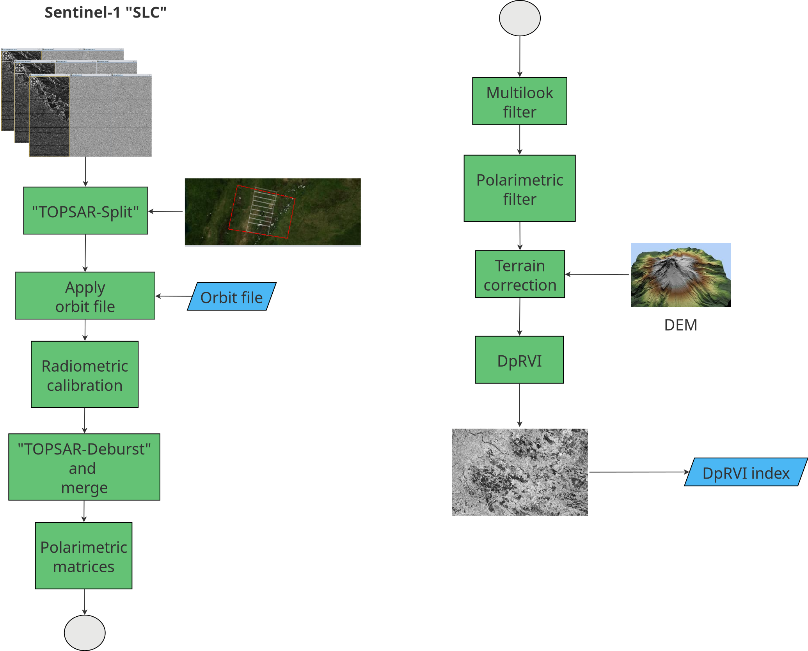
```

Following [@mandal2019sentinel], images were co-registered with sub-pixel accuracy using the Sentinel-1 Back-Geocoding operator and the SRTM 1Sec Grid as DEM. Subswaths were then recombined using TOPS Deburst and Merge. A multilooking step (4×1, range×azimuth) produced square ground-range pixels. Polarimetric matrix elements were derived—limited to the $2\times2$ covariance matrix $[\mathbf{C2}]$ from dual-polarization data—and despeckled using the Refined Lee filter with a $5\times5$ window [@mandal2019sentinel]. The complex-valued representation enables computing $C_{11}$, $C_{22}$, $\Re(C_{12})$, and $\Im(C_{12})$, which are required for DpRVI estimation [@mandal2020dual].

The covariance matrix $\mathbf{C2}$ (@eq-1), is essential for DpRVI and captures second-order statistics of the VV and VH radar channels [@mandal2021radar]:

$$
\mathbf{C2} =
\begin{bmatrix}
C_{11} & C_{12} \\
C_{21} & C_{22}
\end{bmatrix}
=
\begin{bmatrix}
\langle |S_{VV}|^2 \rangle & \langle S_{VV} S_{VH}^* \rangle \\
\langle S_{VH} S_{VV}^* \rangle & \langle |S_{VH}|^2 \rangle
\end{bmatrix}
$$ {#eq-1}

Each term reflects:

-   $\langle |S_{VV}|^2 \rangle$: Power of the co-polarized channel.

-   $\langle |S_{VH}|^2 \rangle$: Power of the cross-polarized channel.

-   $\langle S_{VV} S_{VH}^* \rangle$, $\langle S_{VH} S_{VV}^* \rangle$: Complex cross-correlation between polarizations.

$$\text{DpRVI} = 1 - m\beta$$ where $m$ is the degree of polarization, and $\beta$ the normalized dominant eigenvalue.

For dual‑pol $\mathbf{C2}$, $m$ is computed from the covariance matrix as $m = \sqrt{1 - \dfrac{4\,|\mathbf{C2}|}{\big(\mathrm{Tr}(\mathbf{C2})\big)^2}}$, and $\beta$ is set to $\lambda_1/\mathrm{Span}$ with $\mathrm{Span}=\mathrm{Tr}(\mathbf{C2})$ [@mandal2020dual].


DpRVI jointly captures polarization purity and scattering dominance through $m$ and $\beta = \lambda_1/\text{Span}$ [@mandal2020dual]. This coupling provides a robust link to crop structure and its temporal evolution:

- Bare or smooth surfaces (Bragg-like) exhibit a dominant scattering mechanism with high polarization purity ($m \approx 1$, $\beta \approx 1$), yielding low DpRVI values near 0 [@mandal2020dual].
- Fully developed vegetation canopies behave as partially depolarizing, random media ($m \approx 0$, $\beta \approx 0.5$), producing high DpRVI values near 1 [@mandal2020dual].
- Through the growing season, $m$ and $\beta$ show differential sensitivity: both tend to decrease from early to advanced vegetative stages, and their divergence at later stages enhances the index’s ability to track phenology across crops [@mandal2020dual].
- DpRVI is bounded between 0 and 1 by construction and is invariant to roll and polarization basis rotation, facilitating inter-date comparability and interpretation across acquisition geometries [@mandal2020dual; @mandal2021radar].


Operationally, increasing DpRVI indicates canopy development and structural complexity, whereas persistently low DpRVI is consistent with bare soil or very early growth.

Let $\mathbf{k} = [S_{VV}, S_{VH}]^{\mathrm{T}}$ denote the dual-pol scattering vector. The covariance $\mathbf{C2} = \langle \mathbf{k}\,\mathbf{k}^{\dagger} \rangle$ is estimated after spatial averaging (multilooking and refined Lee filtering), which reduces speckle and stabilizes the computation of $m$ and the eigenvalues used in $\beta = \lambda_1/\text{Span}$ [@mandal2019sentinel; @mandal2020dual]. This second-order characterization is what enables DpRVI to respond consistently to structural changes in the canopy.


ENL (equivalent number of looks) quantifies speckle reduction achieved by spatial averaging; in homogeneous areas it can be estimated as the squared mean‑to‑standard‑deviation ratio of intensity, with larger ENL indicating lower speckle and more stable covariance estimates. Window size therefore controls the trade‑off between speckle suppression and spatial detail. Following [@mandal2019sentinel], a $5\times5$ refined Lee filter yields sufficient ENL to robustly estimate $C_{11}$, $C_{22}$, $\Re(C_{12})$, and $\Im(C_{12})$ while preserving field boundaries. In mosaics with smaller, heterogeneous rice parcels, a $3\times3$ window may better preserve edges, whereas $7\times7$ increases smoothing; here a $5\times5$ window is adopted as a balanced choice for Casanare.

DpRVI exhibits a clear monotonic increase during vegetative development and aligns with annotated phenological transitions in cereal crops [@mandal2020dual]. Compared with simple backscatter ratios ($\sigma^\circ_{VH}/\sigma^\circ_{VV}$) and Radar Vegetation Index (RVI), DpRVI provides a more stable and interpretable temporal trajectory from dual-pol data [@mandal2020dual]. Reported correlations with canopy descriptors such as Plant Area Index (PAI), vegetation water content (VWC), and dry biomass support its sensitivity to structural changes [@mandal2020dual; @mandal2021radar]. Finally, terrain correction was applied using UTM Zone 18N. All outputs were standardized to 14×14 m resolution and clipped to each study area. The final product was a multitemporal DpRVI database.

## Rice crop phenology

Rice phenology refers to the sequence of growth and development stages that the plant undergoes from sowing to harvest. Understanding these stages is essential for managing agronomic practices such as irrigation, fertilization, and harvesting. @tbl-phenology presents the principal phenological stages of rice as defined by the BBCH scale [@meier1997growth]:

| Principal Stage             | Description                                                                 |
|----------------------------|-----------------------------------------------------------------------------|
| Germination                | Dry seed; seed imbibition begins and completes; radicle and coleoptile emerge; imperfect leaf appears |
| Leaf development           | Unrolling of the imperfect leaf; unfolding of successive true leaves        |
| Tillering                  | First tiller detectable; number of tillers increases up to maximum          |
| Stem elongation            | Panicle initiation; internode elongation; flag leaf development             |
| Booting                    | Stem thickening; flag leaf sheath elongates and opens                       |
| Inflorescence emergence    | Panicle gradually emerges from the sheath until fully visible               |
| Flowering (Anthesis)       | Anthers become visible; flowering progresses and completes                  |
| Fruit development          | Grains develop from watery ripe to late milk stage                          |
| Ripening                   | Grains progress from early dough to fully ripe and hard                     |
| Senescence                 | Grains overripe; plant dries and collapses                                  |
: Phenological growth stages of rice {#tbl-phenology}

### DpRVI across rice stages

By analogy with cereals reported in [@mandal2020dual], DpRVI is expected to rise from land preparation and early leaf development (low structural complexity) through tillering and stem elongation, reflecting increasing canopy volume scattering. Around booting to heading, DpRVI typically remains high as the canopy reaches maximum structural complexity, while late‑season senescence may slightly reduce polarization purity and alter scattering balance. This qualitative behavior guides stage interpretation but should be validated with local field observations.

## Workflow

### Data cube creation

For this work, Sentinel-1 SLC images covering the municipality of Nunchía (Casanare, Colombia)—where rainfed rice is predominant—were used (see @fig-dprvi-cube). The Dual‑polarimetric Radar Vegetation Index (DpRVI) was computed from these images.

In line with sits, analyses rely on regular Earth observation data cubes that ensure consistent dimensionality for machine learning: seamless spatial coverage, regular temporal cadence, and no gaps. When ARD collections are irregular in time or space, they must be converted to regular cubes prior to classification; national implementations such as Brazil Data Cube provide regular cubes by default [@Simoes2021; @Ferreira2020; @data4030092; @SITSBOOK]. Unlike single‑tile cube definitions, sits supports cubes spanning multiple tiles, removing tiling restrictions during analysis [@data4030092; @SITSBOOK].

Note: Although DpRVI is derived from Sentinel‑1 SLC data via the $\mathbf{C2}$ workflow described above [@mandal2019sentinel; @mandal2020dual], in practice precomputed DpRVI rasters are loaded into a `sits` cube for analysis. This separation keeps heavy polarimetric processing in SNAP and downstream time‑series analytics in R.

A local data cube was created using the `sits` package in R [@Simoes2021] to enable time-series analysis and support crop monitoring and classification workflows. The `sits` package follows a time-first, space-later paradigm: it classifies per-pixel time series to produce probability cubes, and then applies spatial smoothing to improve map consistency. It also provides tools for training-sample quality control and class noise reduction [@Santos2021a], and interoperates with on-demand EO data cube processing backends such as gdalcubes [@data4030092] and national implementations [@Ferreira2020]. The implementation follows these steps:

To ensure reproducibility in the time‑first workflow, training samples should provide location, temporal range, and label per observation, and their timeline should match the cube’s number of intervals and date range [@SITSBOOK; @Simoes2021].

1. First, load the required libraries for data manipulation and visualization:

```{r}
#| label: load-libraries
#| message: false
#| warning: false
#| eval: false

# Load required packages for data cube creation and analysis
library(sits)      # Satellite time series analysis
library(sf)        # Spatial data handling
library(ggplot2)   # Data visualization
library(reshape2)  # Data reshaping
library(dplyr)     # Data manipulation
library(tidyr)     # Data tidying
library(tibble)    # Enhanced data frames
library(knitr)     # Dynamic report generation
library(caret)     # Validation metrics
```

2. Next, create the DpRVI data cube:

```{r}
#| label: create-dprvi-cube
#| message: false
#| output : false
#| cache: true
#| eval: false

# Define the directory containing DpRVI images
dir_imgs <- "data/cy_colombia/dprvi/dprvi_reg/"

# Create the data cube with sits
cube_dprvi <- sits_cube(
  source = "MPC",
  collection = "SENTINEL-1-GRD",
  bands = c("DPRVI"),
  data_dir = dir_imgs
)
```

This data cube contains DpRVI images with a temporal resolution of 12 days and is organized chronologically from January 04 to July 03, 2025. The timeline of the data cube can be visualized as follows:

```{r}
#| label: caption-dprvi-timeline
#| cache: true
#| eval: false
#| caption: Timeline of DpRVI data cube acquisitions

# Visualize the temporal distribution of images
sits_timeline(cube_dprvi)
```

```{r}
#| echo: false
#| eval: true
#| caption: Timeline of DpRVI data cube acquisitions

# Visualize the temporal distribution of images
timeline <- readRDS("./etc/dprvi_timeline.rds")
timeline
```


@fig-dprvi-cube shows an RGB composite of the last three acquisitions, illustrating temporal variation in DpRVI across rice areas. This view helps identify growth patterns and spatial heterogeneity in vegetation conditions.

```{r}
#| output: true
#| cache: true
#| eval: false
#| out-width: 100%
#| fig-cap: DpRVI cube RGB visualization
#| fig-align: center
# Plot RGB composite visualization of DpRVI data cube
# using the three most recent acquisition dates
plot(cube_dprvi, band = "DPRVI", palette = "Greys", scale = 1.0,
     dates = c("2025-07-03", "2025-06-21", "2025-06-09"))
```

```{r}
#| echo: false
#| cache: true
#| label: fig-dprvi-cube
#| out-width: 100%
#| fig-cap: DpRVI cube RGB visualization using three acquisition dates
#| fig-align: center

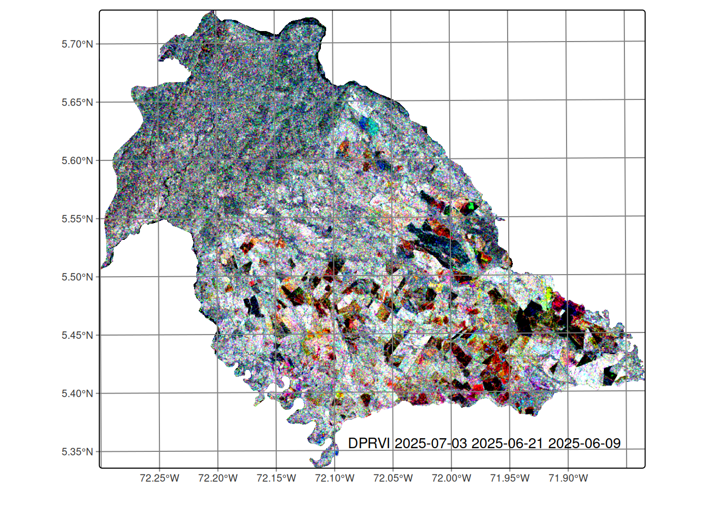
```


### Field data collection

Field data were collected in the municipality of Nunchía (Casanare, Colombia). The campaign ran from May to June 2025, coinciding with peak crop development. In this region:

- Sowing period: March to May
- Land preparation: Precedes sowing
- Average crop cycle: Approximately 120 days

A stratified random sampling approach was implemented to ensure:
1. Representative coverage of different rice phenological stages
2. Adequate sampling of dominant land cover types

Phenological stages were classified using the standardized BBCH scale [@meier1997growth] (see @tbl-phenology).

Data were collected using QField mobile application, which provided Standardized data entry interface, precise georeferencing capabilities and field validation tools. The collected data were stored in a GeoPackage (GPKG) format, containing spatial information, 
associated attributes for each sampling point, and generated polygons representing observation areas. @fig-field-data presents the spatial distribution of the collected field data. The visualization includes training and validation polygons, color-coded by phenological class or land cover category.

```{r}
#| label: load-field-data
#| message: false
#| warning: false
#| eval: false
#| output: false

# Define path to field data
field_data <- "data/cy_colombia/samples/data.gpkg"

# Load the field data
data_train <- st_read(field_data)
```


```{r}
#| echo: true
#| eval: false
#| fig-cap: Spatial distribution of field data samples colored by class
#| out-width: 100%
#| fig-align: center
# Create field data visualization
ggplot() +
  geom_sf(data = data_train, aes(fill = class)) +
  labs(title = "Field Data Distribution") +
  theme_minimal() +
  theme(
    legend.position = "right",
    plot.title = element_text(hjust = 0.5)
  ) +
  scale_fill_brewer(palette = "Set1")
```

```{r}
#| echo: false
#| cache: true
#| label: fig-field-data
#| out-width: 100%
#| fig-cap: Spatial distribution of field data samples colored by class
#| fig-align: center

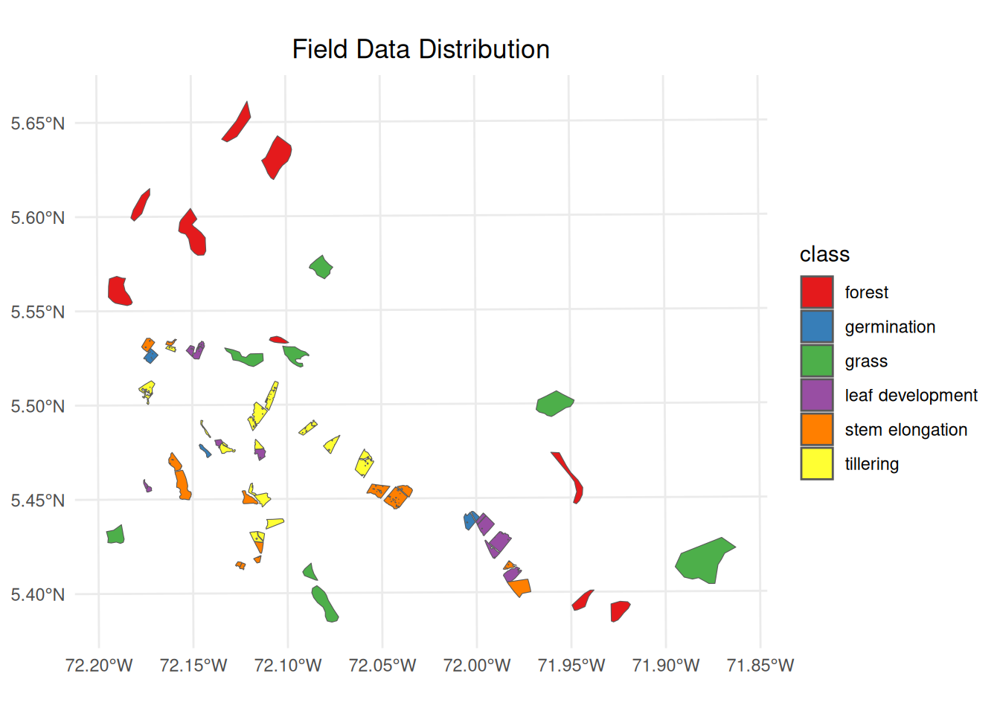
```

### Extracting DpRVI values from the data cube

To extract DpRVI values from the data cube for the field data, the `sits_get_data` function from the `sits` package can be used. This function samples the DpRVI values at the locations specified in the field data. The following code snippet demonstrates how to perform this extraction:

```{r}
#| echo: true
#| output: false
#| eval: false
#| label: caption-dprvi-extraction
# Extract DpRVI values from the data cube for field data samples
# This function samples the DpRVI values at locations specified in field data
# Parameters:
# - cube: DpRVI data cube containing temporal imagery
# - samples: field data with spatial polygons and class labels
# - bands: spectral bands to extract (DPRVI in this case)
# - multicores: number of CPU cores for parallel processing
# - n_sam_pol: number of samples per polygon for training
# - label_attr: attribute containing class labels

training <- sits_get_data(
  cube = cube_dprvi,
  samples = data_train,
  bands = c("DPRVI"),
  multicores = 4,
  n_sam_pol = 100,
  label_attr = "class"
)
```

@fig-dprvi-multitemporal presents temporal DpRVI signatures revealing three biophysically distinct behavioral categories essential for automated discrimination. Perennial vegetation covers exhibit stable, high-value profiles: forest maintains consistent values (~0.60 ± 0.02) with minimal seasonal variation, reflecting persistent volume scattering from mature canopy structure where randomly distributed scattering elements generate high depolarization. The slight decline toward July (~0.49) indicates seasonal changes in foliar moisture content, affecting dielectric properties and consequently the degree of polarization of radar waves.

In contrast, grasslands show slightly higher values (~0.63 ± 0.03) with gradual increase through the observation period. This behavior results from a less complex canopy structure but with sufficient aerial biomass to generate significant depolarization. The temporal increase observed reflects vegetative growth during the rainy season, increasing the anisotropy of the scattering medium and enhancing volume scattering contributions.

Phenological interpretation uses the fact that rice stages exhibit characteristic dynamic patterns aligned with crop development cycles. All stages initiate with elevated DpRVI values (~0.50–0.60) before March, attributed to pre-existing vegetation or crop residues, followed by sharp declines to minimum values (~0.30–0.40) between April and May, corresponding to soil preparation and early sowing phases when surface scattering dominates over bare soils. The high degree of polarization during this phase reflects the absence of depolarizing elements. Subsequent DpRVI recovery (May–July) documents the transition toward volume scattering as rice canopy architecture develops, with each phenological stage showing distinct recovery trajectories that enable machine learning discrimination.

These temporally-offset recovery patterns provide the biophysical foundation for machine learning discrimination: *Germination* shows modest increase (Δ=+0.09 from April–May minimum), reflecting initial emergence with limited structural complexity. *Leaf development* exhibits steeper recovery (Δ=+0.11), consistent with rapid leaf area expansion that increases volume scattering components. *Stem elongation* demonstrates pronounced increases (Δ=+0.15–0.17) reflecting advanced canopy development where multiple scattering layers generate complex depolarization patterns.

*Tillering* exhibits the most complex polarimetric behavior with similar recovery magnitude but intermediate structural characteristics that overlap with adjacent phenological stages, explaining subsequent classification challenges. The emergence of secondary stems creates intermediate scattering complexity between single-stem (leaf development) and mature multi-layered canopies (stem elongation), generating overlapping degree of polarization values that complicate automated discrimination.

```{r}
#| output: true
#| cache: true
#| eval: false
#| out-width: 100%
#| fig-align: center
#| fig-cap: DpRVI multitemporal data by class

# Plot the temporal patterns of DpRVI values for each class
# This creates a multi-panel time series visualization showing
# how DpRVI values change over time for different land cover types
# and rice phenological stages

training |>
  sits_patterns() |>
  plot()
```

```{r}
#| echo: false
#| cache: true
#| label: fig-dprvi-multitemporal
#| out-width: 100%
#| fig-cap: Spatial distribution of field data samples colored by class
#| fig-align: center

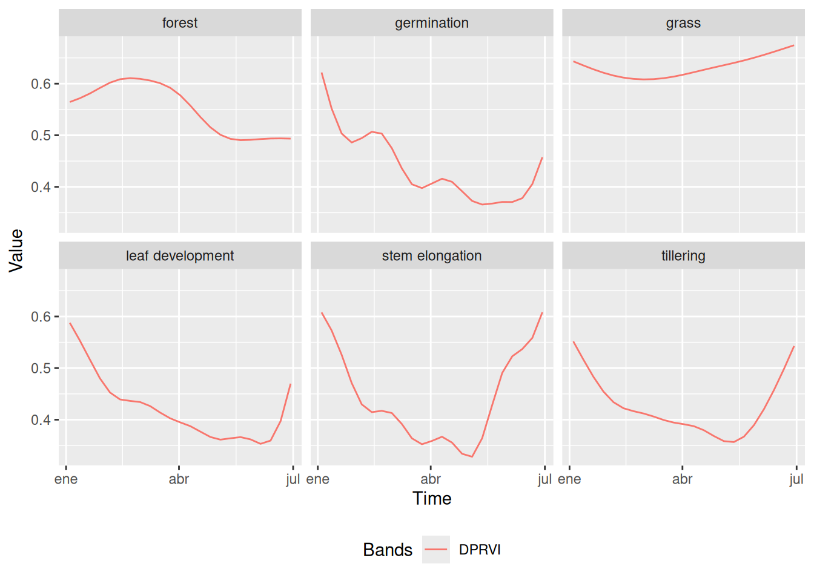
```


### Data quality control

To evaluate the quality of the training samples and detect possible labeling errors in the time series, a methodology combining Self Organizing Maps (SOM) and Bayesian Inference was applied. SOM is an unsupervised neural network technique that groups time series of satellite images according to their similarity, projecting high dimensional multitemporal data onto a two dimensional grid, where each neuron represents a cluster of similar temporal profiles and preserves topological relationships between inputs [@Santos2021a].

Each training sample is assigned to a specific neuron based on its temporal similarity; consistent samples from the same class tend to cluster in neighboring regions of the SOM grid, while noisy samples often appear isolated or in unexpected areas, facilitating the visual detection of anomalies. After constructing the SOM, Bayesian Inference is used within and between clusters to assess the consistency and coherence of the samples, quantifying intra and inter cluster similarity, which allows for the identification of outliers or misclassified samples [@Santos2021a]. This combined approach is efficient and interpretable for validating the quality of the training data and helps reduce the risk of classification errors in subsequent modeling stages.

```{r}
#| output: false
#| eval: false
#| label: caption-som-dtw
# Clustering time series using SOM (Self-Organizing Maps)
# Parameters:
# - training: time series data for different classes
# - alpha: learning rate for SOM training (1.0 = full learning rate)
# - distance: distance metric used for clustering ("dtw" = Dynamic Time Warping)
# - rlen: number of training iterations (20 iterations)

som_cluster <- sits_som_map(training,
  alpha = 1.0,
  distance = "dtw",
  rlen = 20
)
```

@fig-som-plot shows that natural land covers, such as forest and pasture, tend to cluster in specific areas of the SOM grid, reflecting their more homogeneous temporal profiles. In contrast, the phenological stages of rice cultivation are more dispersed throughout the map, due to the rapid and dynamic changes in rice growth. However, some early phenological stages including germination, leaf development, tillering, and stem elongation often appear in adjacent regions of the SOM grid, indicating that growth stages which are temporally close may also share similar temporal growth patterns.

```{r}
#| output: true
#| eval: false
#| out-width: 100%
#| cache: true
#| fig-cap: View of SOM clusters by class
#| fig-align: center
# Plot the SOM clusters
plot(som_cluster)
```

```{r}
#| echo: false
#| cache: true
#| label: fig-som-plot
#| out-width: 100%
#| fig-cap: Spatial distribution of field data samples colored by class
#| fig-align: center

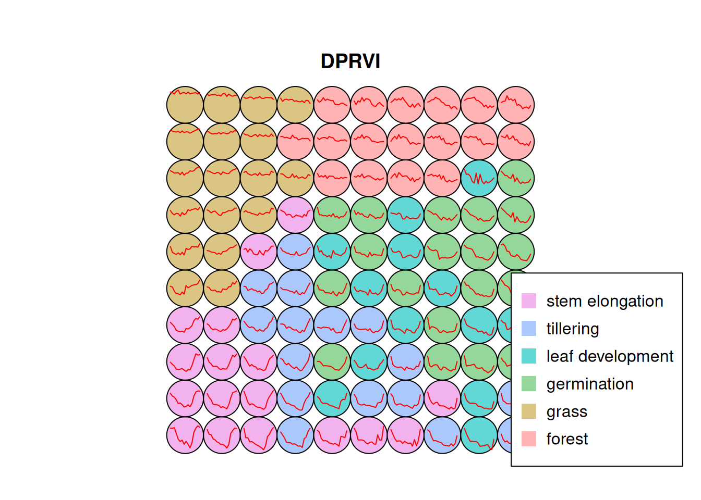
```


@fig-evaluate-clusters illustrates a stacked bar chart showing the distribution of classes within each cluster generated by the model. Each row represents a class, and the colored bars within each row display how the elements of that class are distributed across the different clusters. The ideal goal is for each bar to exhibit a single predominant color, indicating that a class maps almost exclusively to a single cluster.

The forest class showed the highest purity, with 97% of its samples assigned to a single dominant cluster, and only slight confusion with other classes. Similarly, grass had 91% of its samples correctly grouped, although a 5% overlap with forest was observed and a small fraction was erroneously placed as germination. For the stem elongation class, 80% of the samples were correctly assigned, but 14% of the tillering samples were also located in this cluster.

In the case of germination, 76% of the samples were correctly located, although there was 13% from leaf development and 9% from tillering. The confusion with leaf development is reasonable due to their immediate sequence in the crop cycle and the similarity in their temporal DpRVI behaviors. Leaf development presented 74% correct assignments, with errors mainly associated with the presence of tillering (14%) and germination (7%). 

Finally, tillering was the class with the highest level of confusion, with 67% of the samples correctly located. Mixtures were observed with 18% of leaf development and 11% of stem elongation. These confusions are expected given that consecutive phenological stages present similar structural characteristics, which is reflected in similar responses of the DpRVI index due to their radar polarization degree patterns.

```{r}
#| output: true
#| cache: true
#| eval: false
#| fig-cap: Confusion of SOM clusters
#| out-width: 100%
#| fig-align: center
# Evaluate the quality and confusion of SOM clusters
# This function assesses how well the SOM clustering performed by analyzing
# the distribution of classes within each cluster and identifying potential
# misclassifications or overlapping patterns between different classes
evaluate_clusters <- sits_som_evaluate_cluster(som_cluster)
# plot the SOM cluster evaluation
plot(evaluate_clusters)
```

```{r}
#| echo: false
#| cache: true
#| label: fig-evaluate-clusters
#| out-width: 100%
#| fig-cap: Confusion of SOM clusters
#| fig-align: center

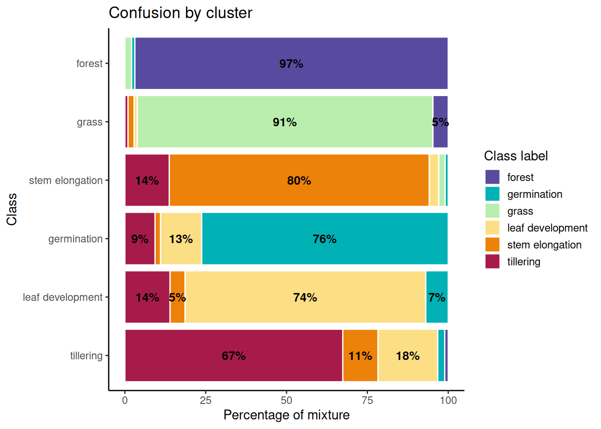
```

### Noisy sample detection

To detect noisy samples within the dataset, a combination of Self-Organizing Maps (SOM) and Bayesian inference techniques was used. Noisy samples are identified using SOM and Bayesian inference techniques. Homogeneous neurons with a high frequency of a single class are considered high quality, while heterogeneous neurons with multiple significant classes likely contain noise [@Santos2021a].

Two probabilities are calculated for each sample:

1. *Prior probability:* Measures the likelihood that a sample’s label is correct based on frequencies within its neuron. 
2. *Posterior probability:* Estimates the likelihood that the label is correct by considering neighboring neurons using Bayesian inference.

Samples are categorized into three groups:

- Noisy (`remove`): Low prior probability.
- Clean (`clean`): High prior and posterior probabilities.
- To analyze (`analyze`): High prior but low posterior probability, indicating inconsistency with neighbors.

It is recommended to remove noisy samples to improve dataset quality, reducing errors in subsequent models. Clean samples are retained, while `analyze` samples should be manually reviewed.

The `sits_som_clean_samples()` function uses `prior_threshold` and `posterior_threshold` thresholds (both with a default value of 60%). Now, noisy samples are removed to improve the quality of the training dataset. @tbl-som-cleaned presents a summary of the samples by label or class after the cleaning process based on SOM evaluation. Forest and grass are the classes with the highest number of samples. Together, they represent almost half of the dataset (0.21 + 0.21 = 0.42 or 42%). This indicates that they are the most frequent categories in the cleaned dataset.

Germination and leaf development have moderate representation, with proportions ranging between 0.17 and 0.11. Stem elongation is also in this middle range, with a proportion of 0.14. Tillering is the class with the smallest number of samples, representing only 0.09 or 9% of the total. This makes it a minority or imbalanced class compared to the others.

```{r}
#| cache: true
#| eval: false
#| tbl-cap: Summary of cleaned samples by class
# Load cleaned samples using SOM evaluation
# This function retains only 'clean' and 'analyze'
# samples from the SOM clustering,
# removing noisy samples to improve training data quality
# Parameters:
# - som_map: SOM clustering results from previous analysis
# - prior_threshold: minimum probability threshold for sample quality (60%)
# - posterior_threshold: minimum probability
# threshold considering neighbors (60%)
# - keep: categories of samples to retain ("clean", "analyze")

new_samples <- sits_som_clean_samples(som_map = som_cluster,
  prior_threshold = 0.6,
  posterior_threshold = 0.6,
  keep = c("clean", "analyze")
)

# Display summary table of cleaned sample distribution by class
# Shows count and proportion of samples for each land cover/phenological class
# after quality control filtering
kable(summary(new_samples))
```

  label                count        prop
  ------------------ ------- -----------
  forest                  94   0.2175926
  germination             76   0.1759259
  grass                   92   0.2129630
  leaf development        50   0.1157407
  stem elongation         80   0.1851852
  tillering               40   0.0925926
  
: Summary of cleaned samples by class {#tbl-som-cleaned}

### Random Forest classification

Random Forest (RF) is a powerful machine learning algorithm that is widely used for classification tasks, including remote sensing applications [@RODRIGUEZGALIANO201293]. It operates by constructing multiple decision trees during training and outputs the mode of the classes (classification) or mean prediction (regression) of the individual trees [@breiman2001random]. RF is particularly effective in handling high dimensional data and can capture complex relationships between features [@James2013]. 

The Random Forest model was trained using the cleaned samples, which were previously validated through SOM evaluation. The model was configured with 500 trees, a common choice that balances performance and computational efficiency. 

```{r}
#| output: true
#| cache: true
#| eval: false
#| fig-cap: Random Forest importance of cleaned samples
#| out-width: 100%
#| fig-align: center

set.seed(123)
# Train the Random Forest model with cleaned samples
# Parameters:
# - samples: cleaned training samples from SOM evaluation
# - ml_method: Random Forest algorithm with 500 trees
probs_cube <- sits_train(samples = new_samples,
                         ml_method = sits_rfor(num_trees = 500))
# Plot the feature importance from the trained Random Forest model
plot(probs_cube)
```

```{r}
#| echo: false
#| cache: true
#| label: fig-importance-cleaned
#| out-width: 100%
#| fig-cap: Random Forest importance of discriminatory variables
#| fig-align: center

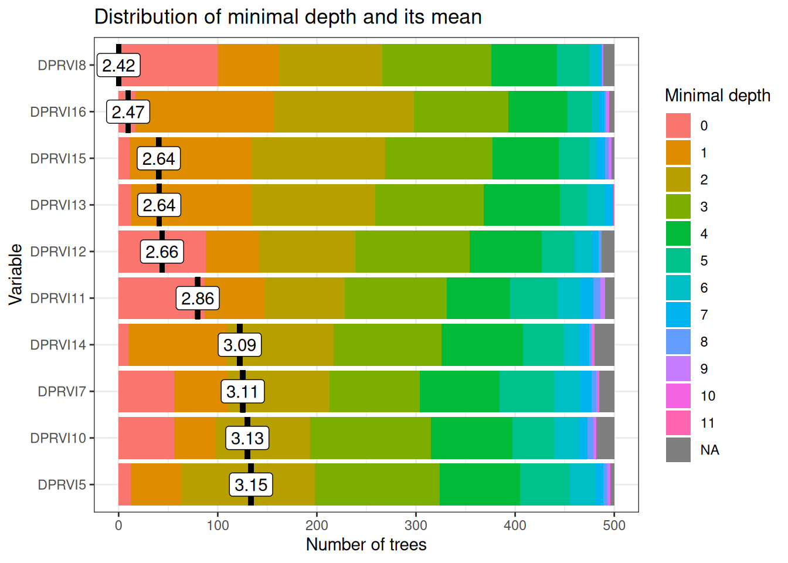
```

Variable importance analysis reveals a temporally coherent hierarchy aligned with critical agricultural management periods (@fig-importance-cleaned). The most influential variables cluster around two key polarimetric discrimination windows that maximize separability between land cover classes based on distinct scattering mechanisms.

Early-season critical period (March): DPRVI8 (March 29, depth=2.42) and DPRVI6 (March 5, depth=2.47) represent the optimal polarimetric discrimination window when land preparation activities create maximum contrast between prepared agricultural fields and natural vegetation covers. During this period, recently disturbed soils exhibit low DpRVI values (~0.3–0.4) due to surface scattering dominance, while established vegetation maintains high DpRVI values (~0.6) from volume scattering, generating clear polarimetric separability essential for subsequent classification accuracy.

Mid-season development window (May–June): Secondary-importance variables DPRVI15 (June 21), DPRVI13 (May 28), and DPRVI12 (May 16) all cluster at depth ~2.64–2.66, capturing the rapid structural transitions during active crop development. These dates correspond to maximum phenological differentiation when tillering, stem elongation, and leaf development stages exhibit distinct canopy architecture patterns detectable through polarimetric radar signatures and varying degrees of polarization.

Temporal specificity validation: The concentration of variable importance during agriculturally meaningful periods (rather than arbitrary calendar dates) provides strong evidence that the Random Forest model identifies genuine biophysical patterns rather than spurious correlations. 

January–February low relevance: Early season variables (DPRVI5–7, depth >3.0) show reduced importance because during the dry season, all vegetation covers exhibit polarimetrically convergent values (~0.5–0.6) due to: (i) reduced water content homogenizing dielectric properties, (ii) minimal structural contrast between classes, and (iii) convergence of degree of polarization across land covers, limiting discriminative power.

This temporal consistency supports model transferability across different growing seasons and validates that DpRVI captures physical polarimetric processes rather than seasonal artifacts.

## Results

### Model performance evaluation

The performance of the Random Forest model was evaluated using k‑fold cross‑validation, a robust technique that helps assess the model's generalization ability [@raschka2019python]. In this case, 10 folds were used: the dataset was split into 10 equal parts, the model was trained on 9 parts and validated on the remaining part, repeating this process 10 times so that each part served as a validation set once.

The results of the k-fold cross-validation are stored in a list, where each element corresponds to the accuracy of the model on each fold. The accuracy is calculated as the proportion of correctly classified samples out of the total number of samples in the validation.

```{r}
#| output: false
#| label: k-fold
#| eval: false
#| caption: K-fold cross-validation results
# Perform k-fold cross-validation to assess model performance
# This validation technique splits the dataset into k folds (10 in this case)
# and trains the model k times, using k-1 folds
# for training and 1 fold for validation
# The process is repeated k times, with each fold serving as validation set once
# create a list to store the results
results <- list()
acc_rfor <- sits_kfold_validate(new_samples,
  folds = 10,
  multicores = 1,
  ml_method = sits_rfor()
)
acc_rfor$name <- "Random Forest"
results[["Random Forest"]] <- acc_rfor
```

Following best practices for satellite image time series classification, the model is evaluated using confusion‑matrix based metrics [@Simoes2021]. The primary indicators are:

- Overall Accuracy (OA): proportion of correctly classified samples across all classes.
- Producer’s Accuracy (Recall/Sensitivity) and User’s Accuracy (Precision): per-class omission and commission perspectives, respectively [@SOKOLOVA2009427].
- F1-score: harmonic mean of precision and recall, summarizing class-wise performance under imbalanced conditions [@SOKOLOVA2009427].
- Cohen’s κ: agreement beyond chance, reported as a complementary global index.

For reporting, OA and κ are provided at map level, with macro‑averaged Precision, Recall, and F1 across classes, alongside per‑class metrics to capture phenology‑dependent variability in separability. Probability outputs are primarily used for smoothing and labeling.

### Validation Protocol

To ensure reliable generalization and avoid information leakage, a field‑level, stratified evaluation protocol is adopted:

- Grouped data split: samples are grouped by agricultural parcel (field ID) and split into train/test partitions so that pixels from the same field do not appear in both sets, mitigating spatial autocorrelation leakage [@Simoes2021]. An 80/20 split is used, stratified by class to preserve phenological-stage proportions.
- Model selection: within the training partition, hyperparameters are chosen via 10-fold stratified cross-validation. This procedure balances bias–variance trade-offs and provides robust estimates for tuning [@James2013].
- Final assessment: the model is refit on the full training partition with selected hyperparameters and evaluated on the independent test partition, reporting OA, κ, and macro-averaged Precision/Recall/F1, together with class-wise metrics [@RODRIGUEZGALIANO201293].
- Probability-based diagnostics: not used in this work; probability outputs were employed to produce probability cubes and for Bayesian smoothing prior to labeling [@Simoes2021; @Santos2021a].

The following metrics are reported using macro-averaging across classes, alongside per-class values where relevant [@SOKOLOVA2009427]:

| Metric     | Definition                                           | Formula (per class c) |
|------------|------------------------------------------------------|-----------------------|
| Precision  | Correct positives among predicted positives          | $\mathrm{Precision}_c = \dfrac{TP_c}{TP_c + FP_c}$ |
| Recall     | Correct positives among actual positives             | $\mathrm{Recall}_c = \dfrac{TP_c}{TP_c + FN_c}$    |
| F1-score   | Harmonic mean of Precision and Recall                | $\mathrm{F1}_c = 2\,\cdot\, \dfrac{\mathrm{Precision}_c\,\mathrm{Recall}_c}{\mathrm{Precision}_c + \mathrm{Recall}_c}$ |
| OA         | Overall proportion of correctly classified samples   | $\mathrm{OA} = \dfrac{\sum_c TP_c}{N}$ |
| Cohen’s $\kappa$  | Agreement beyond chance                       | $\kappa = \dfrac{p_o - p_e}{1 - p_e}$ where $p_o = \mathrm{OA}$ and $p_e$ is expected agreement by chance |

Where TP, FP, FN are computed from the confusion matrix, N is the total number of validation samples. Macro-averaging computes the unweighted mean across classes to balance class imbalance [@SOKOLOVA2009427].

Performance is summarized with a confusion matrix, cross‑tabulating predictions and references to quantify errors and biases [@SOKOLOVA2009427].

```{r}
#| eval: false
#| cache: true
#| echo: true
# Confusion matrix visualization function
# Generates visualization from validation results
create_confusion_matrix_plot <- function(result, model_name) {
  # Extract confusion matrix
  cm_mat <- as.matrix(result$table)

  # Transform to data frame for ggplot
  cm_long <- as.data.frame(as.table(cm_mat))

  # Order Prediction factor levels
  cm_long$Prediction <- factor(cm_long$Prediction,
    levels = unique(cm_long$Prediction)
  )

  # Order Reference factor levels
  cm_long$Reference <- factor(cm_long$Reference,
    levels = unique(cm_long$Reference)
  )

  # Create visualization with ggplot
  p <- ggplot(cm_long, aes(
    x = Reference, y = Prediction,
    fill = Freq
  )) +
    geom_tile(color = "white", size = 1.2) +
    geom_text(aes(label = Freq),
      color = "black",
      size = 4.2, fontface = "bold"
    ) +
    scale_fill_gradient(
      low = "#f1f3f4", high = "#1976d2",
      name = "Cases", trans = "sqrt"
    ) +
    scale_y_discrete(limits = rev(levels(cm_long$Prediction))) +
    theme_minimal(base_size = 14) +
    theme(
      plot.title = element_text(
        hjust = 0.5, size = 16, face = "bold",
        margin = margin(b = 20)
      ),
      axis.text.x = element_text(
        angle = 45, hjust = 1, size = 11,
        face = "bold"
      ),
      axis.text.y = element_text(size = 11, face = "bold"),
      axis.title = element_text(
        size = 13, face = "bold",
        margin = margin(t = 10)
      ),
      legend.title = element_text(size = 12, face = "bold"),
      legend.text = element_text(size = 11),
      panel.grid = element_blank(),
      plot.margin = margin(20, 20, 20, 20)
    ) +
    labs(
      title = paste("Confusion Matrix -", model_name),
      x = "Actual Class (Reference)",
      y = "Predicted Class"
    )

  return(p)
}
# plot the confusion matrix
create_confusion_matrix_plot(results[["Random Forest"]], "Random Forest")
```

```{r}
#| echo: false
#| cache: true
#| label: fig-confusion-matrix-function
#| out-width: 100%
#| fig-cap: Confusion matrix for different crop stages mapped by DPRVI index.
#| fig-align: center

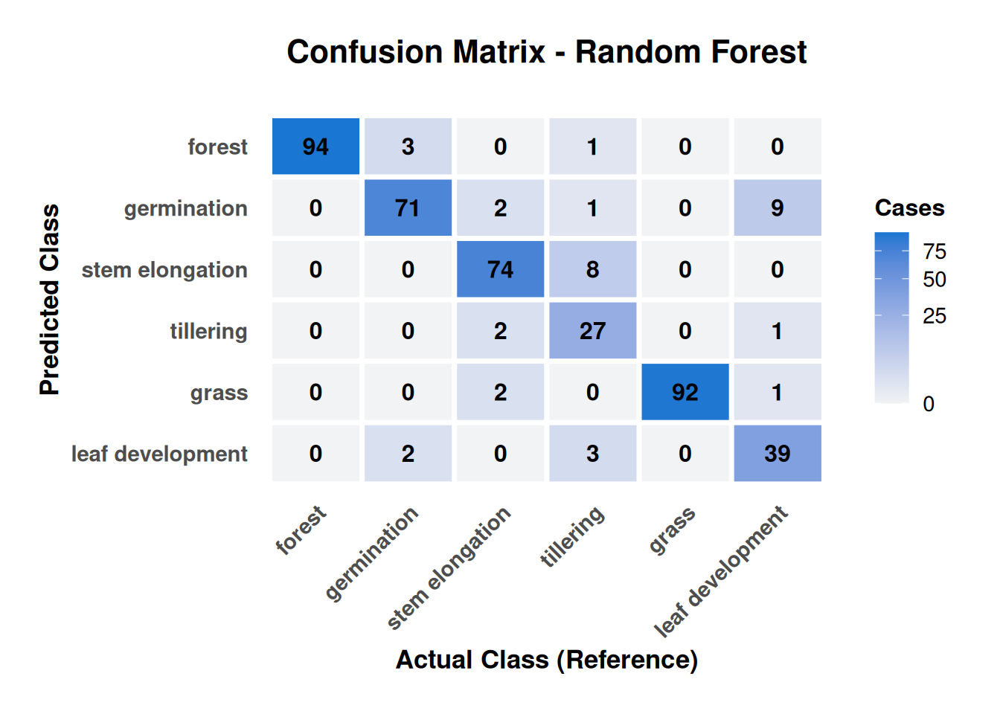
```


@fig-confusion-matrix-function reveals biophysically interpretable error patterns that validate model behavior rather than indicate systematic failures. Classification errors concentrate exclusively between adjacent phenological stages, with no confusions observed between rice crops and permanent vegetation covers (forest/grass), confirming robust discrimination between agricultural and natural land uses based on distinct polarimetric signatures.

Permanent covers demonstrate near-perfect performance: Forest achieves exceptional accuracy (94/98 samples, 96% correct) with only one tillering sample misclassified, while grass shows similar excellence (92/94 samples, 98% correct). The perfect separation between forest–grass and rice stages validates that DpRVI effectively discriminates between stable volume-scattering patterns (permanent covers) and dynamic agricultural signatures.

Phenological confusion patterns follow biological logic: The most critical finding is that all crop stage confusions occur between adjacent phases, reflecting gradual rather than discrete structural transitions. Tillering demonstrates highest confusion (27/38 samples correctly classified, 71% accuracy) with primary errors involving adjacent growth stages: 8 samples confused with stem elongation and 3 with leaf development. 

Polarimetric explanation: The bidirectional confusion between tillering and stem elongation (8 tillering→stem elongation, 2 stem elongation→tillering) indicates overlapping canopy architecture during transition periods. During tillering, increasing tiller density generates volume-scattering patterns similar to early stem elongation, where degree of polarization values overlap (~0.4–0.6) between stages, creating polarimetric ambiguity.

The 68% user accuracy for tillering suggests operational monitoring systems should incorporate temporal context or auxiliary variables (coherence, backscatter) to improve discrimination during this critical phenological window.

```{r}
#| echo: true
#| eval: false
#| output: true
#| tbl-cap: Overall statistics for the Random Forest model
# Print the overall accuracy and kappa statistic
overall_vec <- results[[1]]$overall

overall_long <- data.frame(
  Metric = names(overall_vec),
  Value = as.numeric(overall_vec)
)
# Multiply by 100 to convert to percentage
overall_long$Value <- overall_long$Value * 100
# round the values to 2 decimal places
overall_long$Value <- round(overall_long$Value, 2)
# Visualize the overall statistics as table
kable(overall_long, digits = 2)
```

| Metric      |       Value |
|-------------|------------|
| Accuracy     |      91.90 |
| Kappa         |     90.08 |
| AccuracyLower  |    88.91 |
| AccuracyUpper   |   94.29 |
| AccuracyNull   |    21.76 |
| AccuracyPValue |     0.00 |
| McnemarPValue  |      NaN |

: Overall statistics for the Random Forest model {#tbl-overall-statistic}

@tbl-overall-statistic presents the global performance metrics of the model, which has an overall accuracy of 91.90%, meaning that in almost 92% of cases, the model correctly classified the samples. This is a very high value, indicating excellent performance. Cohen's Kappa coefficient is a more robust metric than accuracy, as it takes into account the possibility that the accuracy is due to chance. A value of 90.08% is considered very strong. It indicates that the model not only performs well, but its performance is significantly better than random classification.

At the aggregate level, macro‑averaged Precision, Recall, and F1 corroborate this global performance, with consistently high values across classes. The remaining variability aligns with class structure: permanent covers yield very stable scores, while transitional crop stages show expected reductions due to phenological overlap.

The exceptional classification performance achieved in this work (91.90% overall accuracy, κ=90.08%) establishes DpRVI as a strong alternative to conventional radar vegetation indices for tropical crop monitoring, demonstrating robustness under conditions of high atmospheric moisture, variable precipitation, and diverse soil conditions.

The AccuracyLower and AccuracyUpper (88.91 and 94.29) represent the 95% confidence interval for the model's accuracy, indicating that the true accuracy lies between 88.91% and 94.29%. The AccuracyNull (21.76) is the accuracy that would be obtained if the model simply predicted the most frequent class in the dataset, meaning the most common class represents approximately 22% of the data. The model's accuracy (91.90%) is much higher than this null accuracy, confirming that the model is learning useful patterns.

The AccuracyPValue (0.00) is the p-value of the hypothesis test that compares the model's accuracy with the null accuracy. A value of 0.00 (p < 0.05) means that the difference between the model's accuracy and the null accuracy is statistically significant. In simple terms, the model is genuinely better than guessing. The model has excellent and statistically significant performance for the classification task, with high accuracy and a strong Kappa coefficient.

@fig-metrics-by-class provides class-wise Precision, Recall (Sensitivity), F1, Specificity, and Balanced Accuracy, highlighting how performance varies by structural stability and phenological transitions:

- Permanent covers (Forest, Grass): F1 ≈ 0.98, Sensitivity ≈ 1.00, Precision ≈ 0.96–0.97, consistent with stable volume‑scattering and minimal confusion with crops.
- Germination: F1 ≈ 0.89 with Precision ≈ 0.86; clear separation from permanent covers and early‑season soil conditions.
- Stem elongation: F1 ≈ 0.91 with Precision ≈ 0.90; robust discrimination due to mature canopy structure.
- Tillering: F1 ≈ 0.77 (Sensitivity ≈ 0.68); lower scores reflect transitional canopy architecture and overlap with adjacent stages.
- Specificity: all rice stages > 0.97, limiting false positives in crop mapping.

These patterns are coherent with the polarimetric interpretation: stable, highly depolarizing canopies (forest/grass) yield consistently high metrics, while transitional crop stages (tillering) show partial overlap in polarimetric responses that reduces separability.

```{r}
#| echo: true
#| warning: false
#| eval: false
#| out-width: 100%
#| fig-align: center
#| fig-cap: Metrics by class (Precision, Recall, F1, Specificity, Balanced Accuracy)

# Function to visualize metrics by class
# Heatmap of performance by class
create_metrics_by_class_plot <- function(result, model_name) {
  # Extract metrics by class
  by_class <- result$byClass

  # Convert to data frame
  by_class_long <- data.frame(
    Class = rownames(by_class),
    by_class
  )

  # Convert to tidy long format
  by_class_long_tidy <- by_class_long %>%
    pivot_longer(
      cols = -Class,
      names_to = "Metric",
      values_to = "Value"
    )

  # Important metrics for visualization
  important_metrics <- c(
    "Sensitivity", "Specificity",
    "Pos.Pred.Value", "Neg.Pred.Value",
    "F1", "Balanced.Accuracy"
  )

  by_class_filtered <- by_class_long_tidy %>%
    filter(Metric %in% important_metrics)

  # Rename metrics for presentation
  metric_names <- c(
    "Sensitivity" = "Sensitivity",
    "Specificity" = "Specificity",
    "Pos.Pred.Value" = "Precision",
    "Neg.Pred.Value" = "NPV",
    "F1" = "F1-Score",
    "Balanced.Accuracy" = "Balanced Accuracy"
  )

  by_class_filtered$Metric <- metric_names[by_class_filtered$Metric]

  # Create heatmap of metrics by class
  p <- ggplot(by_class_filtered, aes(
    x = Metric, y = Class,
    fill = Value
  )) +
    geom_tile(color = "white", size = 1) +
    scale_fill_gradient2(
      low = "#d32f2f", mid = "#fff9c4",
      high = "#388e3c", midpoint = 0.5,
      name = "Value",
      limits = c(0, 1),
      breaks = seq(0, 1, 0.2),
      labels = paste0(seq(0, 1, 0.2) * 100, "%")
    ) +
    geom_text(aes(label = round(Value, 2)),
      size = 3.8,
      fontface = "bold", color = "black"
    ) +
    labs(
      title = paste("Metrics by Class -", model_name),
      x = "Metric",
      y = "Phenological Class"
    ) +
    theme_minimal(base_size = 14) +
    theme(
      plot.title = element_text(
        hjust = 0.5, size = 16,
        face = "bold",
        margin = margin(b = 15)
      ),
      axis.text.x = element_text(
        angle = 45, hjust = 1,
        size = 11, face = "bold"
      ),
      axis.text.y = element_text(size = 11, face = "bold"),
      axis.title = element_text(
        size = 13, face = "bold",
        margin = margin(t = 10)
      ),
      legend.title = element_text(size = 12, face = "bold"),
      legend.text = element_text(size = 11),
      panel.grid = element_blank(),
      plot.margin = margin(15, 15, 15, 15)
    )

  return(p)
}
create_metrics_by_class_plot(results[["Random Forest"]], "Random Forest")
```

```{r}
#| echo: false
#| cache: true
#| label: fig-metrics-by-class
#| out-width: 100%
#| fig-cap: Metrics by class (Precision, Recall, F1, Specificity, Balanced Accuracy)
#| fig-align: center

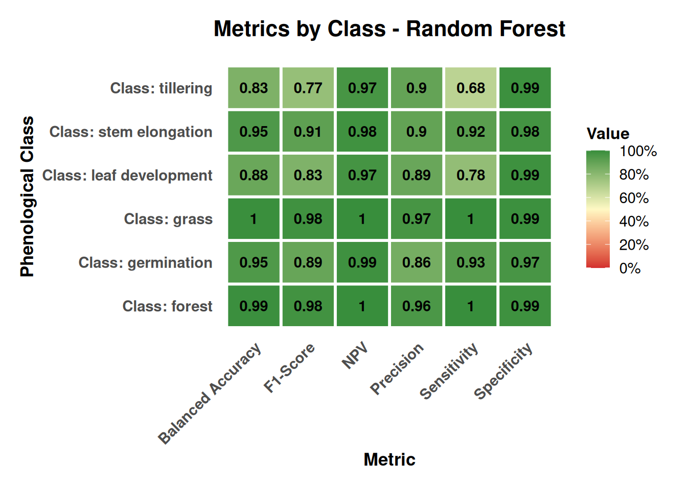
```


### Classification

After training and evaluation of the Random Forest model, the DpRVI data cube is classified. The process is carried out in two stages: first, the model is applied to generate an initial classification (probability cube), and then the results are smoothed using a Bayesian spatial smoothing step to reduce noise and improve spatial coherence [@Simoes2021].

```{r}
#| output: false
#| eval: false
#| echo: true
#| label: caption-classification
# Make an output directory
output_dir <- "data/cy_colombia/results/"
# Create output directory if it does not exist
if (!dir.exists(output_dir)) {
  dir.create(output_dir, recursive = TRUE)
}
rf_classify <- sits_classify(
  data = cube_dprvi,
  ml_model = probs_cube,
  output_dir = output_dir,
  version = "rf-raster",
  multicores = 4,
  memsize = 12
)
```


Bayesian smoothing constitutes an advanced post-processing technique designed to optimize spatial coherence in classifications derived from remote sensing data, which starts from a probability cube generated by the initial classification model. This method systematically addresses the spatial inconsistencies typical of pixel-by-pixel classifications, including isolated pixels, small-scale misclassifications, and fragmented spatial patterns [@Santos2021a].

The implementation of Bayesian smoothing is based on the premise that land cover classes tend to exhibit spatial coherence, where neighboring pixels have a high probability of belonging to the same class or related classes. The algorithm incorporates contextual information from adjacent pixels to refine initial classification probabilities, applying Bayesian inference principles that combine local spectral evidence with spatial neighborhood knowledge [@Santos2021a].

The evaluation of local logit variance constitutes an essential component of the Bayesian smoothing process, providing a quantitative measure of spatial uncertainty in classification predictions. For each pixel and class, this calculation is executed through the analysis of a moving window of specific dimensions (typically 7×7 pixels), where classification probabilities are transformed to logit space using the function $\ln(\frac{p}{(1-p)})$, where $p$ is the probability of belonging to a specific class, and subsequently the variance of these logit values is computed considering only the upper fraction of most similar neighboring pixels (generally 50% with highest spectral similarity) [@Santos2021a]. 

This methodology allows the identification of areas with high spatial uncertainty, where land cover classes present diffuse transitions or mixed edges, facilitating the detection of confusion zones and improving the accuracy of Bayesian smoothing. Local logit variance is used to adjust classification probabilities, prioritizing those areas with lower uncertainty and favoring spatial coherence in final predictions.

```{r}
#| output: false
#| eval: false
#| echo: true
#| label: caption-variance
# Calculate the local logit variance for the classification
# TODO
var_cube <- sits_variance(
  cube = rf_classify,
  window_size = 7,
  neigh_fraction = 0.5,
  multicores = 4,
  memsize = 12,
  output_dir = output_dir
)
```


```{r}
#| output: true
#| echo: true
#| eval: false
#| fig-cap: Variance of forest and grass classes
#| out-width: 100%
#| fig-align: center
# Plot the variance of the classification for forest and grass
plot(var_cube, labels = c("forest", "grass"), palette = "Spectral",
     rev = TRUE, legend_position = "outside")
```

```{r}
#| echo: false
#| cache: true
#| label: fig-variance-forest-grass
#| out-width: 100%
#| fig-cap: Variance of forest and grass classes
#| fig-align: center

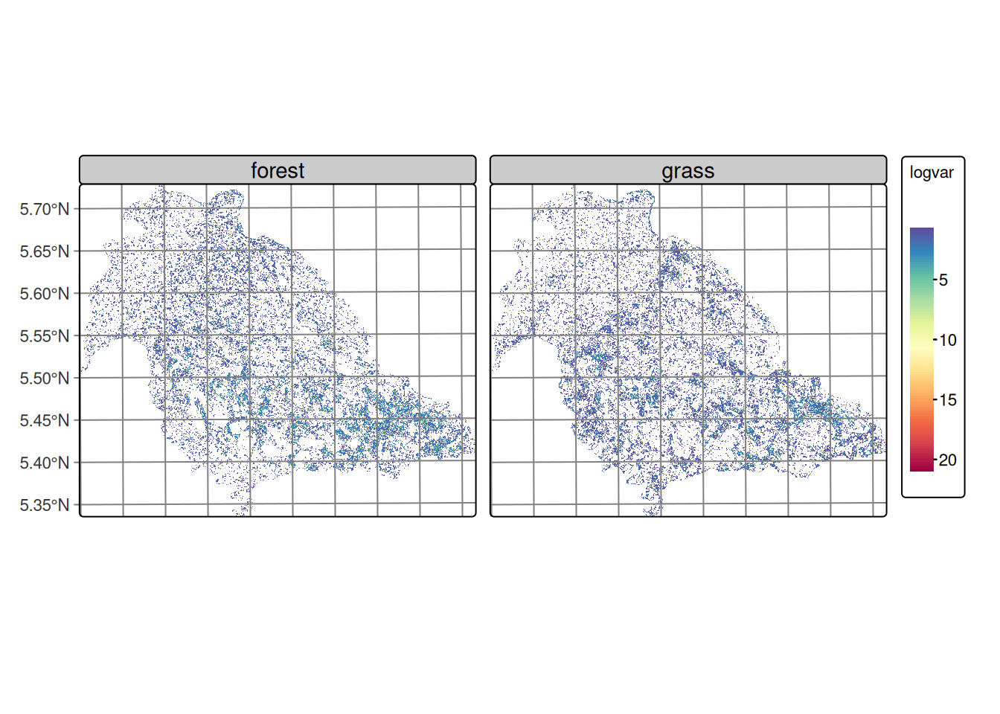
```


@fig-variance-forest-grass shows that the forest and grass classes exhibit relatively homogeneous variance throughout the study area, characterized by the predominance of low values distributed continuously across the territory. This spatial distribution is consistent with the territorial occupation of these covers in the region, where forest and pasture are distributed as extensive and relatively homogeneous areas.

The observed pattern can be attributed to two main factors: the inherent noise characteristic of SAR data, which introduces random variability in the signal, and the nature of transitions between these dominant covers. The absence of marked variance gradients suggests that the boundaries between forest and pasture are not spectrally abrupt in terms of the DpRVI index response, which may indicate gradual transition zones. These covers exhibit temporal stability, remaining constant during the analysis period.

```{r}
#| output: true
#| echo: true
#| eval: false
#| fig-cap: Variance of the phenological stages of rice
#| out-width: 100%
#| fig-align: center
# Plot the variance of the classification for the phenological stages of rice
plot(var_cube, labels = c("germination", "leaf development",
                          "tillering", "stem elongation"),
     palette = "Spectral", rev = TRUE, legend_position = "outside")
```

```{r}
#| echo: false
#| cache: true
#| label: fig-variance-phenology
#| out-width: 100%
#| fig-cap: Variance of the phenological stages of rice.
#| fig-align: center

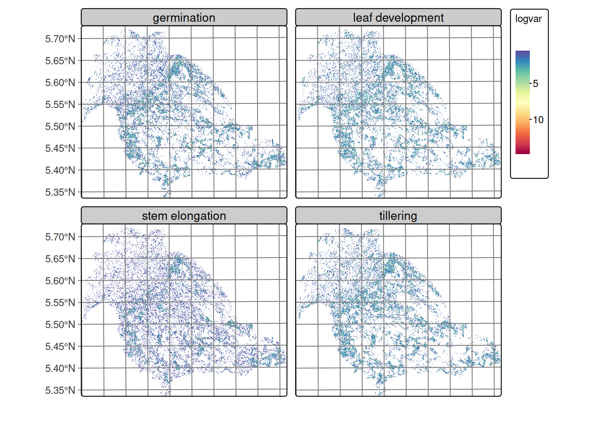
```


@fig-variance-phenology reveals an interesting spatial pattern where, despite the characteristic noise of SAR images, regions of lowest variance are identified that spatially correspond to rice cultivation areas in the lower right portion of the images. These zones of lower variability present defined edges of higher variance toward the boundaries of agricultural plots, suggesting spatial coherence within some of the cultivated parcels. The spatial distribution of variance in rice phenological stages evidences that agricultural management practices, such as uniform land preparation, synchronized sowing, and integrated crop management, generate spatially coherent patterns that facilitate crop differentiation.


```{r}
#| output: true
#| echo: true
#| eval: false
#| label: tbl-variance
#| tbl-cap: Summary of the logit variance
# print variance values
variances <- summary(var_cube)
# print variances
kable(variances)
```

  ----------------------------------------------------------------------------------
           forest   germination     grass            leaf           stem   tillering
                                              development     elongation 
  ------ -------- ------------- --------- --------------- -------------- -----------
  75%        0.71          0.59    0.5800           0.680           0.46        0.64

  80%        0.87          0.76    0.7100           0.902           0.54        0.84

  85%        1.08          1.01    0.8900           1.330           0.67        1.23

  90%        1.44          1.57    1.1900           2.140           0.92        2.11

  95%        2.19          2.81    1.7905           3.000           1.86        3.01

  100%      11.50         11.46   12.3600          11.260          10.40       10.88
  ----------------------------------------------------------------------------------

: Summary of the logit variance {#tbl-variance}

@tbl-variance shows the high quantiles (75–100%) of local logit variance by class, calculated over non‑isotropic neighborhoods, describing the upper part of the distribution, which is the most informative for detecting confusion zones and edges between classes. In all classes, the 75th percentile values are low (≈ 0.46–0.71), indicating that most of the territory consists of compact and homogeneous patches where a single class clearly dominates. Toward the 90–95 percentiles, variances increase, signaling mixed neighborhoods and boundaries between classes.

Regarding patterns by class, the transitional leaf development and tillering classes present the highest tails (P90 ≈ 2.1–2.14 and P95 ≈ 3.0), consistent with the appearance of edges or mixed patches. Germination also shows elevated variance in the tail (P95 ≈ 2.81), above forest (≈ 2.19) and grass (≈ 1.79). In contrast, stem elongation is the most homogeneous, with P75 = 0.46, P90 ≈ 0.92 and P95 ≈ 1.86, suggesting compact patches and less confusion with adjacent classes. The maximum values (100%) are around 10–12 in all classes and correspond to extreme cases or outliers very noisy pixels or singular edges, so they should not guide modeling decisions.

These observations provide a quantitative basis for adjusting variance hyperparameters by class in Bayesian smoothing. The selection of a robust quantile (P90–P95) as reference is methodologically appropriate, considering that classes with greater spatial variability, such as leaf development and tillering, require higher hyperparameters (≈ 2–3) to preserve their intrinsic heterogeneity without incurring over-smoothing that eliminates valid spatial patterns.

In contrast, classes with greater spatial homogeneity (grass, forest, stem elongation) benefit from lower values (≈ 1–2), which reinforces intra-class coherence and prioritizes the most reliable probabilistic assignments. This differentiated strategy allows optimizing the balance between reducing spectral noise characteristic of SAR images and preserving genuine spatial variability associated with each land cover class.

Pixel‑based classification often exhibits local inconsistencies and edge noise. Sits’ empirical Bayesian smoothing is adopted to adjust per‑pixel class probabilities using neighborhood statistics, reinforcing spatial coherence and reducing outliers; this step typically improves class borders and removes isolated misclassifications [@SITSBOOK].

The smoothing is applied with a 7x7 pixel window considering the 50% most similar neighbors, which improves spatial coherence between adjacent classes.

```{r}
#| output: false
#| eval: false
#| label: caption-smoothing
#| echo: true
rf_smooth <- sits_smooth(
  cube = rf_classify,
  window_size = 7,
  neigh_fraction = 0.5,
  smoothness = c(
    "germination" = 2.0,
    "leaf development" = 2.0,
    "tillering" = 2.0,
    "stem elongation" = 1.0,
    "forest" = 1.0,
    "grass" = 1.0
  ),
  output_dir = output_dir,
  version = "rf-raster",
  multicores = 4,
  memsize = 12
)
```

The smoothing process generates a new data cube where classification probabilities are adjusted considering the spatial and temporal context of each pixel, significantly improving the spatial coherence of classification results. @fig-rf-smooth-stages presents the smoothed classification of rice phenological stages, clearly showing spatial coherence between classes and the spatial distribution of cultivation areas consistent with actual field conditions.

```{r}
#| output: true
#| echo: true
#| eval: false
#| fig-cap: Probability of occurrence of phenological stages
#| out-width: 100%
#| fig-align: center
# Plot the legend for the smoothed classification
plot(rf_smooth,
     labels = c("germination", "leaf development",
                "tillering", "stem elongation"))
```

```{r}
#| echo: false
#| cache: true
#| label: fig-rf-smooth-stages
#| out-width: 100%
#| fig-cap: Probability of occurrence of phenological stages
#| fig-align: center

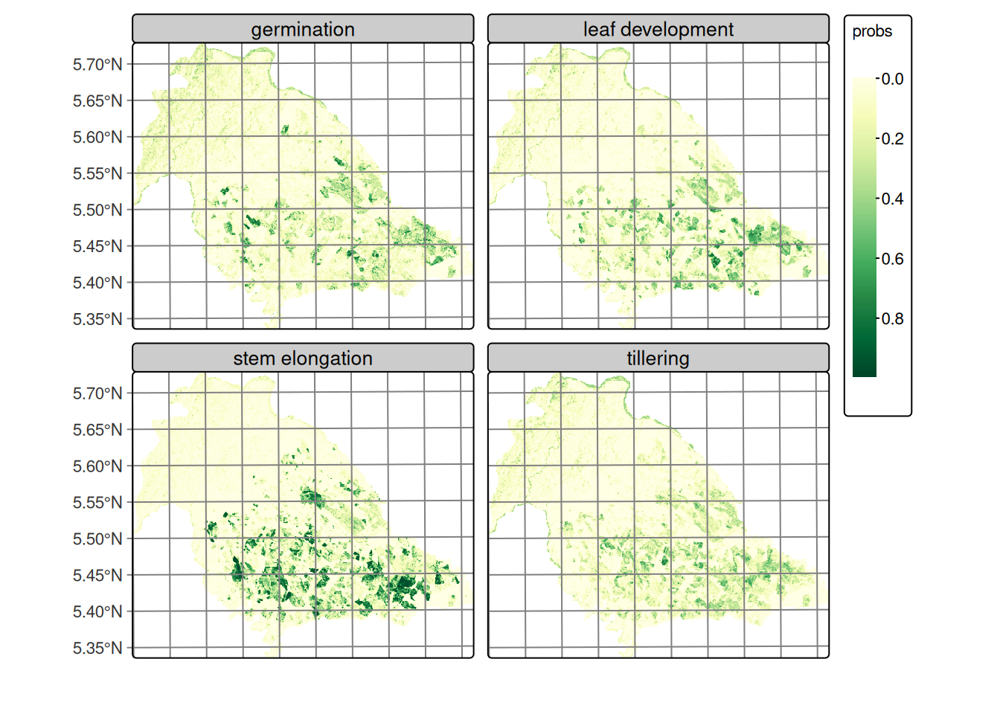
```


Similarly, @fig-rf-smooth-forest-grass displays the smoothed classification for forest and grass covers, demonstrating clear spatial separation between both classes with well-defined homogeneous areas. Using the adjusted probabilities, the labeled map is produced by assigning to each pixel the maximum‑probability class; optional map reclassification rules can enforce cartographic constraints when needed [@SITSBOOK].

```{r}
#| output: true
#| echo: true
#| eval: false
#| fig-cap: Probability of occurrence of forest and grass
#| out-width: 100%
#| fig-align: center
plot(rf_smooth,
     labels = c("forest", "grass"))
```

```{r}
#| echo: false
#| cache: true
#| label: fig-rf-smooth-forest-grass
#| out-width: 100%
#| fig-cap: Probability of occurrence of forest and grassland
#| fig-align: center

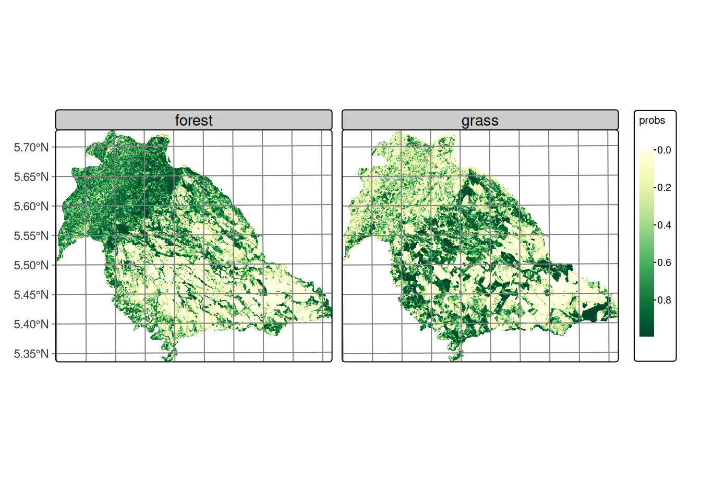
```


```{r}
#| output: false
#| echo: true
#| eval: false
#| label: caption-rf-classification
rf_class <- sits_label_classification(
  cube = rf_smooth,
  multicores = 4,
  memsize = 12,
  output_dir = output_dir,
  version = "rf-raster"
)
```


Following sits’ time‑first, space‑later paradigm, per‑pixel time series are classified to obtain probability cubes (one probability band per class), which then support spatial post‑processing and final labeling [@SITSBOOK; @Simoes2021].

### Final classification results

@fig-rf-classification-plot shows the Random Forest classification over the DpRVI cube, mapping rice phenological stages and land cover in Nunchía (Casanare). The map exhibits spatially coherent patterns consistent with known land use and crop development in the region. The performance metrics are shown in @tbl-metrics.

| Metric                  | Value                |
|-------------------------|----------------------|
| Overall Accuracy (OA)   | 91.90%               |
| Cohen’s κ               | 90.08%               |
| Accuracy 95% CI         | 88.91% – 94.29%      |
: Key performance metrics {#tbl-metrics}

As shown in @fig-metrics-by-class, performance varies with land‑cover stability and structural complexity:

- Permanent covers: consistently high metrics reflecting stable volume‑scattering and minimal confusion with crops.
- Crop stages: germination and stem elongation are well separated; tillering is lower due to transitional canopy structure.
- Specificity: rice stages maintain high specificity, limiting false positives.
- Operational benchmarking: stage‑level F1 values exceed common operational targets (F1 > 0.70).

```{r}
#| output: true
#| eval: false
#| fig-cap: Random Forest classification of the DpRVI data cube
#| out-width: 100%
#| fig-align: center
plot(rf_class, legend_position = "outside")
```

```{r}
#| echo: false
#| cache: true
#| label: fig-rf-classification-plot
#| out-width: 100%
#| fig-cap:  Random Forest classification of the DpRVI data cube
#| fig-align: center

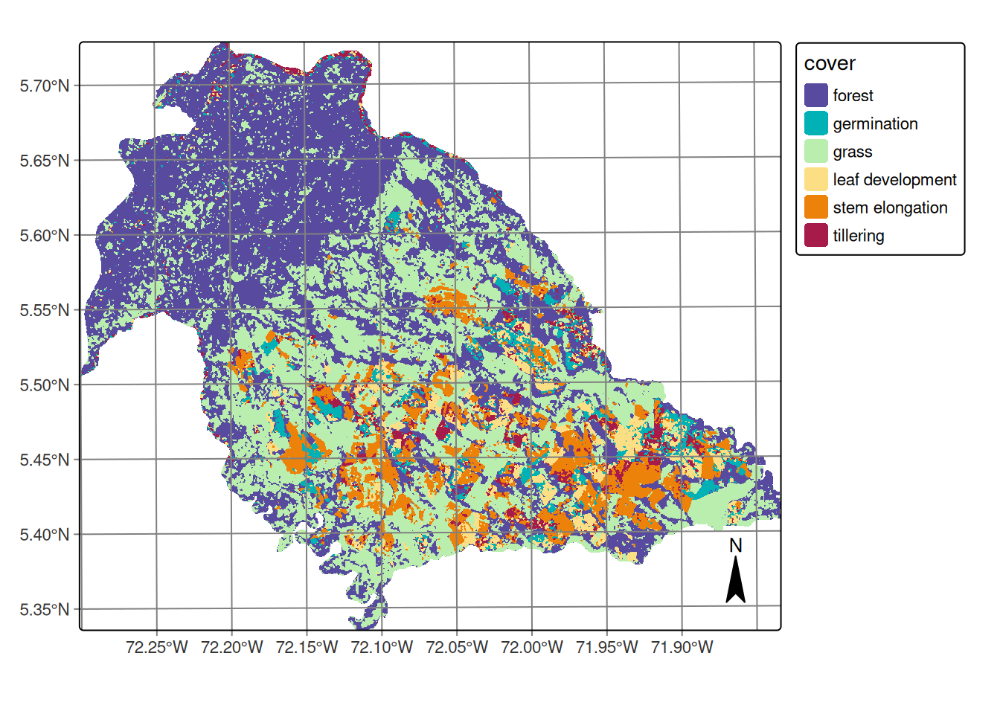
```


## Discussion

The high classification performance supports DpRVI as a strong alternative to conventional radar vegetation indices for tropical crop monitoring, demonstrating robustness under conditions of high atmospheric moisture, variable precipitation, and diverse soil conditions. The DpRVI index integrates polarization purity (m) and scattering dominance (β = λ₁/Span) from the dual‑pol covariance, providing sensitivity to structural change beyond simple backscatter ratios [@mandal2020dual; @mandal2021radar].

During rice phenological development, the progressive transition from surface-dominated scattering (bare soil post-preparation) to volume-dominated mechanisms (developed canopy) manifests as systematic changes in both m and β parameters. The April DpRVI minima (~0.30) observed across all phenological stages correspond to peak soil contribution periods when polarimetric coherence remains high due to limited vegetation interference. The subsequent recovery reflects increasing canopy structural complexity, which enhances depolarization mechanisms and yields higher DpRVI values.

This physical interpretation aligns with theoretical polarimetric scattering models and explains the observed classification success, particularly the effective discrimination between temporally proximate phenological stages (e.g., germination vs. leaf development).

The classification successfully captures the characteristic land use mosaic of the Casanare region:

- Forest distribution: Spatial continuity validates the model's ability to distinguish mature vegetation structure from agricultural systems through consistent volume-scattering signatures and stable DpRVI patterns (~0.6) throughout the observation period.

- Pastoral systems: Grasslands occupy transitional zones between forest and agricultural sectors, representing established cattle ranching systems typical of Colombian Llanos. These areas exhibit moderate DpRVI variability, reflecting less dense vegetation structure than forests but with sufficient biomass to generate detectable depolarization by radar sensors.

- Agricultural concentration: Rice cultivation concentrates in the southeastern sector where topographic conditions (slopes <3%) create optimal conditions for rainfed rice production. This spatial concentration aligns with known agricultural zoning in the region, providing external validation of classification accuracy.

Within agricultural areas, the classification reveals heterogeneous spatial distribution of phenological stages without dominant clustering of any single phase. This pattern reflects:

- Management unit coherence: Despite overall heterogeneity, individual agricultural parcels show internal phenological consistency, indicating synchronized management within farms while maintaining diversity across the landscape. This spatial coherence reflects uniform agricultural practices in soil preparation and early-stage management.

Multitemporal SAR with a 12‑day Sentinel‑1 revisit provides all‑weather, sufficiently frequent observations to capture phenological transitions; polarimetric sensitivity enables discrimination between adjacent crop stages. Stage discrimination at landscape scale (>10,000 ha) demonstrates the scalability of DpRVI‑based monitoring for agricultural surveillance. Increasing canopy complexity elevates depolarization, enabling detection of subtle developmental changes. The observed spatial coherence supports operational use for crop area estimation and early warning where optical systems suffer persistent cloud cover.


These results have significant implications for operational crop monitoring and agricultural management in Colombia:

- National-scale implementation: The methodology can be scaled to support national assessments of sown area, early warning systems, and other agricultural applications where consistent, weather-independent monitoring is essential.

- Decision support: Although this work focused on a specific portion of the rice cultivation cycle and a particular region, it successfully identified six land cover classes including four distinct rice phenological stages, enabling farmers and policy makers to make informed and anticipatory decisions about resource management and allocation.


## Conclusions

The incorporation of supplementary polarimetric variables, such as temporal coherence and multitemporal backscatter from SAR data, could further improve classification accuracy, particularly in areas with complex phenological transitions or mixed pixel environments. The implementation of this SAR-based monitoring approach represents a significant advancement in Colombian agricultural monitoring, offering comprehensive early-season assessments across large areas with consistent quality standards.

This work demonstrates the effective use of multitemporal DpRVI from Sentinel‑1 to monitor rice phenology in Colombian rainfed systems, with high accuracy across six classes (four phenological stages plus permanent covers). Our key findings are:

1. Polarimetric discrimination: DpRVI captures biophysical changes in canopy architecture, enabling separation of adjacent phenological stages.
2. Operational viability: Freely available Sentinel‑1 data and open‑source tooling (sits in R) support cost‑effective implementation.
3. Temporal specificity: Variable importance aligns with agriculturally meaningful periods, reinforcing the physical basis of discrimination.
4. Spatial scalability: Landscape‑scale classification (>10,000 ha) with coherent maps supports national surveillance potential.

This framework advances SAR‑based agricultural monitoring and strengthens rice mapping where cloud cover limits optical data, providing a robust foundation for operational crop monitoring in tropical regions.

Best‑practice validation avoids spatial leakage by splitting train/test at the parcel level and reports OA, κ, and class‑wise Precision/Recall/F1 from the confusion matrix; map‑level accuracy assessment complements cross‑validation where applicable [@Simoes2021; @SOKOLOVA2009427; @SITSBOOK].

## Acknowledgements{-}

The author thanks the Federación Nacional de Arroceros and the Fondo Nacional del Arroz (Fedearroz‑FNA) for their support and collaboration, which were fundamental to the development of this work.

## References{-}