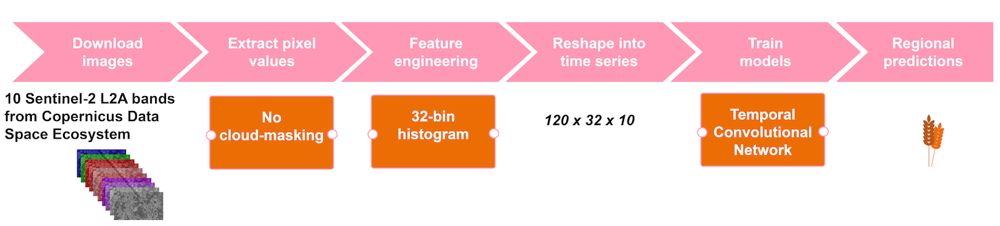
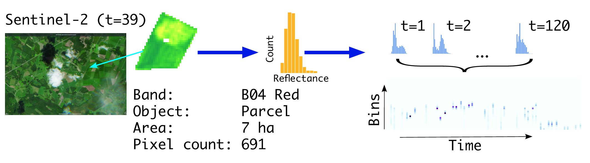
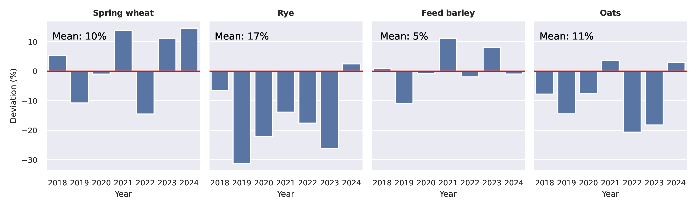

## Introduction

In developing satellite-based crop yield forecasting, our objective was to improve accuracy and higher spatial granularity while minimizing the operational workload. Our pilot project, launched in 2018, culminated in 2024 with the release of in-season crop yield forecasts presented as experimental statistics. The cornerstone of the pilot initiative was the utilization of high-frequency, operational Sentinel-2 L2A imagery. Another key element was the adoption of a data-driven approach supported by a data-rich environment. Under the Common Agricultural Policy of the European Union, farmers report the annual crop types associated with parcel boundaries by the time the spring crops reach ear emergence. Data declarations are exchanged between the Paying Agency and the statistical agency, which enables the first crop yield forecasts at the end of June.

For optimal operational efficiency and accuracy, the methodology is based on temporal convolutional neural networks. The automated pipeline produces forecasts with a one-day lag from the most recent downlink date of Sentinel-2 images. While the operational part of the forecasting is straightforward, the evaluation of the forecasting accuracy is not. First, in a lack of ground truth, in-season yield forecasts can be evaluated against at-harvest yields, which, however, hardly match the in-season yield prospects. Therefore, other published yield forecasts serve as important benchmarks. Secondly, neural networks, unlike canonical statistical or process-based models, lack interpretability due to a complex set of nonlinear functions. While there exists a variety of techniques aimed at interpreting the behavior of a machine learning model, the assessment of the method in relation to the required quality level in statistical production is non-trivial.

We have trained predictive machine learning models for six main crops (winter and spring wheat, malting and feed barley, rye, oats) and five minor crops (pea, faba bean, potato, and turnip and oilseed rape). The resulting crop forecast models cover approximately 50% of the crop production in Finland. Forage grasses, which alone cover 40% of the total area under cultivation, have been excluded, calling for attention in the future.

## Study area

Finland is situated on the northern margins of global food production. In high-latitude agriculture, the growing conditions benefit from long daylight hours, which partially offsets the short growing season and cold temperatures. The length of the growing season (defined as the period with daily mean temperature exceeding 5C) varies from 180 days in the south (60N) to 120 days in the north (70N). According to the Köppen climate classification, the study area predominantly belongs to the cold-summer humid continental climate zone (Dfc). The croplands are geomorphologically characterized by low plateaus and undulating plains, exhibiting high variance in local climatic and soil conditions. The main types of cultivated soils are clay soils (52%), rough mineral soils (38%), and organic soils (10%).

## The EO data and pre-processing

The criteria for the crop yield estimation application encompassed high accuracy and analytical robustness, along with a focus on operational feasibility. We chose to use Sentinel-2 satellite L2A images, downloaded daily with an automated script from the Copernicus Space Data Ecosystem Portal. We utilized the following 10 spectral bands: Band 2 Blue (492nm), Band 3 Green (560nm), Band 4 Red (665nm), Band 5 Red edge (705nm), Band 6 Red edge (740nm), Band 7 Red edge (783nm), Band 8 NIR (842nm), Band 8A Narrow NIR (865nm), Band 11 SWIR (1610nm), and Band 12 SWIR (2190nm). The time-window for observations was set to 120 days (May--August) which typically covers the local growing season for cereal and oil seed crops.

We adopted the object-based approach treating each parcel (in inference) or farm (set of parcels, in training) an object, i.e. a pre-delineated (multi-)polygon. The pixels overlaying an object were masked from the image. Instead of calculating statistical metrics (mean, median, etc.) we chose to turn the pixel set into a histogram, i.e. a discrete approximation of the probability density function of the pixel values. After these preprocessing steps, at the end of the season, each object (parcel or farm) is represented by $120 \times 32 \times 10$ features, i.e. at each time point we have 32-bin histograms from 10 bands. See [@fig-pipeline] for the processing pipeline of the application.

```{r}
#| echo: FALSE
#| eval: TRUE
#| label: fig-pipeline
#| out-width: 100%
#| fig-cap: |
#|   Processing pipeline to predict crop yields from satellite time series data.
#| fig-align: center

```

The benefit of distribution based feature engineering in agricultural applications is that it provides means to compress information where observables are highly varying in shape and size, and yet having relatively uniform pixel content and texture. The underlying assumption is that fields are managed in a uniform way, i.e. managed with similar agricultural practices, sown in approximately the same short period, and growing in similar agroclimatic conditions. [@fig-demo] demonstrates one parcel, one band case in more detail for forming a time series from an observable field parcel.

```{r}
#| echo: FALSE
#| eval: TRUE
#| label: fig-demo
#| out-width: 100%
#| fig-cap: |
#|   Parcel-level approach to forming satellite image time series. As an example, the B04 band of a Sentinel-2 L2A image is used. This band captures information in the red portion of the visible spectrum and has a spatial resolution of 10 m. The selected image was taken on 8 June 2024, corresponding to the 39th day of the growing season. The observational unit is a 7-ha field parcel containing 691 pixels. A histogram is formed by dividing these 691 pixels into 32 discretized intervals (bins). The time series is then formed by stacking all available observations—now represented as 32-bin histograms—across the 120-day growing season. Source: [@YliHeikkil2022]
#| fig-align: center

```

## The in-situ data

The Finnish annual crop production statistics are based on a farmer survey conducted by the Natural Resources Institute Finland (LUKE). We utilized the farmer survey data as a reference data. The sample unit is a farm, and thus, for each crop, we have the average yield at a farm level. Crop productivity can vary significantly across a farm's fields due to climatic factors and edaphic conditions. In addition to the mean being an imperfect measure of yield in cases of large variation, farm-level yield data are often subject to reporting inconsistencies. These include a noticeable tendency to round values and unintentional estimation biases. Despite these limitations, historical farm-level yields remain a valuable resource for empirical models, particularly given the persistent shortage of higher-resolution reference data.

The foundation of our application lies in annual field delineations and croptype masks. The national agricultural registries, administrated by the Finnish Food Authority, are integrated with digital reporting systems, allowing the farmer-reported data become readily accessible for statistical authorities already in early-season (mid-June). Based on our experience, field delineations and croptype masks are highly accurate and reliable.

## Machine learning

Methodologically our application is based on machine learning. Instead of pre-defined theoretical models or assumptions, such as crop growth models, we chose a fully data-driven approach, where satellite images (and cropmasks) are the only source of information, and a machine learner maps these data efficatively into yields on high spatial resolution. Aligned with this logic, we let the neural network--based model to learn not only the yield mappings, but also cloud occlusion in comparison to conventional setting, where cloud masking is considered as a prerequisite.

In order to capture the specific temporal nature of the data, we chose Temporal Convolutional Networks (TCN). Similarly as other Convolutional Neural Networks (CNN), TCN is composed of multiple layers that effectively learn representations of the data. Specifically, TCN consists of a configuration of one-dimensional fully-convolutional network and causal convolutions. TCN was first introduced by [@Lea2017] by adapting CNNs for sequential data, particularly for time-series analysis. [@Bai2018] further advanced TCNs by focusing on architectural improvements. They showed that in comparison to Recurrent Neural Networks (RNN), TCNs can have very long effective history. This makes TCNs a favourable choice for crop monitoring. TCNs also offer the computational benefit of processing convolutions in parallel, unlike RNNs, which process them sequentially. Another practical implication of TCNs is that the use of causal convolutions ensures that the prediction at time only depends on the data at time and earlier, without any information on future. Therefore a single model is needed to produce predictions at any given time of the season.

## Results

### In-season comparison to benchmarks

In-season forecasts lack ground truth but can be evaluated through comparisons with other published forecasts. Our main benchmark forecasts are from the agricultural advisors survey conducted by the Natural Resources Institute Finland (LUKE) and the MARS-Crop Yield Forecasting System (MCYFS) published by the Joint Research Center. We have had mixed results. [@fig-results-1] shows an example of a season when all the forecasts were mostly in agreement, with the exception of the final TCN prediction. [@fig-results-2] displays forecasts on a map. The variation in yields appears to closely align with the variation in soils and local climate conditions, which lends confidence to the spatial reliability of the predictions.

```{r}
#| echo: FALSE
#| eval: TRUE
#| label: fig-results
#| out-width: "85%"
#| fig-subcap:
#|  - Bar plots of the mean farm-level predictions from the prediction model (TCN) and country-level benchmark forecasts published by the Joint Research Center (MCYFS) and the Natural Resources Institute Finland (LUKE), in the growing season 2022. The horizontal blue line shows the true at-harvest yields from the official crop statistics (LUKE). The percentage above the last prediction bar (September 1) shows the share of deviation of the TCN prediction from the true at-harvest yields.
#|  - The yield forecasts of oats in 10km grids (kg/ha) in July 2024. The national total mean yield (kg/ha) is annotated on the graph with the deviation (\%) from the long-term mean yield. The grids having more than 5 oats parcels are included.
#| layout-ncol: 2
#| fig-align: center
knitr::include_graphics(c(
    "./images/cy_finland/cloudy-rye-2021-300dpi.png",
    "./images/cy_finland/Forecast-1400-2024-07-22-10kmgrid-yield.png"
))
```

### In-season comparison to a climate model

Another interesting comparison of the in-season forecasts is shown in [@fig-climate-1]. Here we compare our operational TCN model to a canonical approach in crop forecasting in which the yield is typically explained by various weather variables of the growing season with a linear regression model. Weather variables are related to a growing stage (e.g. sowing, flowering, grain filling). Such models have been common before the widespread use of machine learning, and they are still useful, especially when the model is intended to be interpretable.

[@fig-climate-1] serves to interpret the results of our Sentinel-2 based TCN model vis-à-vis an empirical crop growth model developed at LUKE. While the Sentinel-2 model uses information on past and recent optical images of 10m resolution, the Climate model (Jauhiainen et al., unpublished results) utilizes observed weather station data spatially interpolated to 10km resolution complemented with long-term weather forecasts. The Climate model is based on data from field trials from 1999 to 2022, including 5 to 14 crop-wise trials per year from different cultivation zones. Consequently, the Climate model benefits from a wider range of weather conditions and yield levels, whereas the Sentinel-2 model is based on a shorter period (2018--2024).

In both models the very-early season forecasts are based on the mean assumption. With the increase of evidence along the growing season both models adjust the prediction. Whereas the Sentinel-2 model exhibits continuous variation in predictions, the Climate model includes growth-stage aware submodels, which explains the elbow-like form of the prediction curve. If the input data presents anomalous growing conditions, typically weather-induced plant stressors, there is a shift in the prediction curve. In [@fig-climate-1] the Climate model curve has a steep decrease of yield at the end of June and again in early July, while the Sentinel-2 model has first a slight increase of yield and later a steep increase which coincides with, but is opposite in direction to, the Climate model. [@fig-climate-2] also presents similar opposite trends in the mid of July in 2025. In summary, as both models are reacting at the same time, and the Climate model lends evidence that the Sentinel-2 responses both to the climatic conditions on crop growth and to transitions between growth stages. Furthermore, the magnitude of the shifts in the prediction curves is comparable across both models indicating evidence that the Sentinel-2 model is capable of detecting adverse climatic stressors, although the models did not agree on the direction of the trend in these examples.

```{r}
#| echo: FALSE
#| eval: TRUE
#| label: fig-climate
#| out-width: "85%"
#| fig-subcap:
#|  - The yield forecasts and harvested yield according to the crop statistics of spring wheat in 2024.
#|  - The yield forecasts of spring wheat in 2025. The crop statistics were not yet available by the time of writing.
#| layout-ncol: 2
#| fig-align: center
knitr::include_graphics(c(
    "./images/cy_finland/Timeseries-comparison-1120-2024-yield.png",
    "./images/cy_finland/Timeseries-comparison-1120-2025-yield.png"
))
```

### Accuracy of the at-harvest predictions

The mean total deviation of at-harvest predictions from the country-level true mean across all 11 crops and 6 years (2018--2024) was 10.6%. [@fig-results2] shows the results of the four main crops, where rye is winter crop and the others are spring crops. In some years the deviation from the true mean yields is close to zero (e.g. spring wheat and feed barley in 2020), whereas in other years the model is over- or underestimating the mean yield by as much as 30% (rye in 2019). However, these results contribute to the confidence that the overall level of accuracy of the crop forecasts at country level is acceptable. It remains under discussion what the acceptable level of per-year deviation in at-harvest predictions should be.

```{r}
#| echo: FALSE
#| eval: TRUE
#| label: fig-results2
#| out-width: 100%
#| fig-cap: |
#|   The annual deviations (%) of at-harvest predictions from the country-level true mean yields of the four main crops. The annotated "Mean" on the graphs tells the mean deviation across 6 years.
#| fig-align: center

```

## Discussion

### On modeling

Our crop yield forecasting method utilizes medium-resolution Sentinel-2 images, which enables parcel-level predictions. Due to the density estimation-based approach, the method can be scaled from a single field to farm or regional level. The cloud occlusion inherent to optical remote sensing may cause long data gaps, which can be alleviated by incorporating ground-based weather data or radar remote sensing. However, the added model complexity due to the expanded feature space together with higher operational workload of processing multiple datasets, may offset the potential accuracy gains.

All statistical estimates should include an indication of its accuracy, precision and validity. Consequently, efforts to develop methods for communicating uncertainty have also emerged in official statistics. In the context of machine learning, however, the quantification of uncertainties is a challenge. Unlike classical statistical models, machine learning models do not inherently produce posterior distributions over parameters or predictions. One practical approach is to present prediction intervals, which offer a more informative representation of the variability in early-season predictions e.g. on regional scales. Beyond such a simple visualization approach, more advanced frameworks have been proposed. A prominent example is prediction-powered inference, which enables valid statistical inferences by combining at-harvest predictions with a relatively small set of random-sampled ground-truth observations (see Chapter 28).

### Solution architecture

Our crop forecasting system is a product of various specialized expertise. Setting up and running a satellite remote sensing based crop forecasting system needs understanding of crop production, as well as deep expertise in spatial statistics, geoinformatics, machine learning, and high-performance computing. Above all, the leader of the team needs to have a sound understanding of each of these specialized fields. However, the SITS toolbox customized for statistics production considerably alleviates the uptake of EO.

Ideally, the system would employ 4 full-time equivalent of server technician (SLURM, Bash, high-performance computing), ML engineering (MLOps, CI/CD), geoinformatician, and computer scientist (AI/ML). Since crop forecasting is a seasonal task, the same team could also be involved in other similar EO based statistics. Nevertheless, the team should be permanently engaged to the task.

The system runs on a high-performance computing environment in supercomputer Puhti at CSC. Computing and disk space usage per forecasting season is as follows: For computing we needed 1 Nvidia Tesla V100 GPU, 1 CPU node and at max. 130Gb of memory in that CPU core. For Sentinel-2 images we needed 2Tb disk space covering 37 tiles over a time span of 4 months, which corresponds to one growing season in Finland.

Our system involves machine learning--based modelling and automated processes, making it an example of an MLOps system (machine learning application development, and system deployment and operations). In the course of the project we learnt that training the prediction model involves hundreds of tests and trials. Keeping track of all results is challenging. In addition, although the forecasting pipeline operates autonomously, it still required oversight to ensure its proper functioning. We chose to utilize an open-source tool called MLflow, which offers a range of versatile features for tracking and monitoring machine learning projects. To this end, we recommend to deploy an MLOps system in similar operational tasks.


## Conclusions

In-season forecasts inherently lack direct ground-truth validation, since actual yield outcomes are only known after harvest. This limitation introduces uncertainty and constrains the ability to rigorously assess forecast accuracy at the time of issuance. However, valuable insights can still be gained by comparing early-season forecasts with other published forecasts or benchmark models, as we showed above. For future work, the recently introduced prediction-powered inference method described in Chapter 28 offers a valuable complement to our retrospective analysis, particularly for assessing how the at-harvest predictions align with the ground-truth samples.

Predicting crop yield is a complex and evolving process. While technology and data analysis tools have improved accuracy, it remains challenging to predict yields with absolute certainty due to the influence of many unpredictable factors. However, by integrating various methods and continually refining prediction models, we can improve our understanding of crop production and make more informed decisions.

## Data and code availability {-}

The implementation of the solution presented in this chapter is available on GitHub at <https://github.com/lukefi/cropyield>

## References {-}
