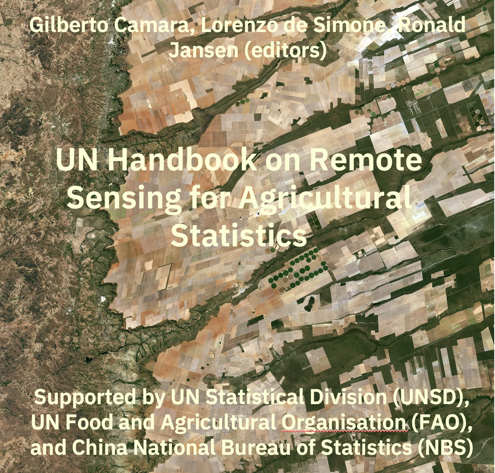

# Welcome {-}

```{r}
#| label: cover
#| echo: false
 
```

Welcome to the age of big Earth observation data! Petabytes of images are now openly accessible in cloud services. Having free access to massive data sets, we need new methods to measure change on our planet using image data. An essential contribution of big EO data has been to provide access to image time series that capture signals from the same locations continually. Time series are a powerful tool for monitoring change, providing insights and information that single snapshots cannot achieve. Better measurement of natural resources depletion caused by deforestation, forest degradation, and desertification is possible. Experts improve the production of agricultural statistics. Analysts can use large data collections to detect subtle changes in ecosystem health and distinguish between various land classes more effectively.  

This handbook is a practical guide on how to use remote sensing for agricultural statistics. It provides readers with the means of producing high-quality maps of agricutural areas and prediction of crop yields. Given the natural world's complexity and huge variations in human-nature interactions, only local experts who know their countries and ecosystems can extract full information from big EO data.

One group of readers that we are keen to engage with is the national authorities on forest, agriculture, and statistics in developing countries. We aim to foster a collaborative environment where they can use EO data to enhance their national land use and cover estimates, supporting sustainable development policies.

## Main Sections and Key Topics {-}

The handbook is divided into several major sections covering both the theoretical foundations and practical applications of remote sensing in agriculture:

The "Foundations" section covers the technical underpinnings of using satellite imagery for agricultural data. It includes a discussion on optical and Synthetic Aperture Radar (SAR) imagery, and covers Earth observation big data sources and the use of data cubes. There are also chapters on land cover and crop classification schemas, quality control of training sets, and the use of machine learning algorithms for image time series, spatial map uncertainty estimation, map validation for area estimation, and using remote sensing in the design of sampling frames.

The "Use Cases in Crop Type Mapping" section provides real-world examples of crop classification across different regions. It features case studies on crop monitoring and classification in Poland, Mexico, Zimbabwe, Chile, and China. It also includes a chapter on agricultural mapping using the Digital Earth Africa program.

The "Crop Yield Estimation" section focuses on using remote sensing data to forecast and map crop yields. It covers topics like early-season crop yield mapping in Finland and mapping rice crop phenology in Indonesia and Colombia. There is also a chapter on yield forecasting in Poland and one in remote sensing estimation of soybean yield based on multi-scenario simulation in China.

The "Extraction of Crop Statistics" part details how to derive meaningful agricultural statistics from the classified maps. It presentes methods Weighted Area Estimators, statistical methods such as regression-based acreage estimation and prediction-powered inference (PPI) for agricultural decision-making.

The "UAV Applications in Agricultural Statistics" section focuses on the use of Unmanned Aerial Vehicles (UAVs) for localized data collection. It covers topics such as field parcel identification and automated monitoring of crop growth index using UAV imagery. There is also a case study on integrating UAV imagery into agricultural statistics in the Cook Islands.

The "Remote Sensing for Agricultural Disaster Response" part addresses how remote sensing can be used for rapid assessment following an agricultural disasters, and includes a specific use case on an automated flood detection in China.

The "Additional Topics" section covers broader initiatives and resources, including the important work on global crop mapping done in the World Cereal initiative. There is also a chapter which describes resources for training in the use of Earth Observation for agricultural statistics.

## Intellectual property rights {-}

This book is licensed as [Attribution-NonCommercial-ShareAlike 4.0 International (CC BY-NC-SA 4.0)](https://creativecommons.org/licenses/by-nc-sa/4.0/) by Creative Commons. The `sits` package is licensed under the GNU General Public License, version 3.0. 

### Version information {-}

This is the first version of the Handbook, launched during the International Seminar on Innovative Application of Methods and Technologies in Agricultural Census, hosted by National Bureau of Statistics of China, and  held in Chengdu, China, December 2025.