```{r}
#| echo: FALSE
#| eval: TRUE
#| message: FALSE
#| warning: FALSE
library(knitr)
library(kableExtra)
```

## Introduction

Earth Observation (EO) technologies are increasingly recognized as
transformative tools for producing timely, granular, and spatially
explicit agricultural statistics. However, the reliability of EO-based
products ultimately depends on the quality of the in-situ data used to
train, validate, and integrate them into national statistical systems.
Poorly designed or inconsistently collected survey data can undermine
the accuracy of crop maps and, by extension, the credibility of official
statistics derived from them.

This chapter therefore focuses on **in-situ** data quality as a
prerequisite for effective EO applications in agriculture statistics**.
Using Senegal as a case study, it examines how survey protocols affect
the accuracy of EO-based crop type mapping and how adjustments to survey
design can substantially improve results. We first introduce FAO's
in-situ quality framework, developed under the EOSTAT and ESA Sen4Stat
projects, which diagnoses the fitness-for-use of survey data for EO
applications. We then contrast two mapping exercises: one based on the
2018 Annual Agricultural Survey (AAS), which produced modest results
(overall accuracy \~78%), and another based on an adjusted protocol
piloted in 2021 in Nioro, which enabled substantially higher accuracies
(\>85%). Finally, we briefly illustrate how improved survey quality also
facilitates the integration of EO with statistical estimators for crop
area, while directing the reader to the dedicated chapter by Ambrosio et
al. (this volume) for a full methodological treatment.

## FAO in-situ quality framework

FAO and Université catholique of Louvain in Belgium (UCLouvain) have been testing and experimenting data quality framework for the collection of in situ data that would ensure fitness for use with EO applications, in particular to combine the national surveys with crop type maps with the finality to improve crop statistics.

Finally in 2025 the experience gained after several field experiments culminated in the publishing of a first in-situ quality framework for assessing the compatibility of field data collected through Surveys and Census operations with EO applications (De Simone et al., 2025).

The framework includes two pillars:

- Survey Design Assessment (@tbl-senegal-1): Evaluates the structural compatibility of sampling protocols with EO needs (e.g., crop observability, georeferencing precision, and metadata completeness).

- EO-Based Post-Hoc Assessment (@tbl-senegal-2): Applies satellite-derived analytics (e.g., Normalized Difference Vegetation Index time series clustering, visual cross-checks) to validate the internal consistency and label quality of field samples.

While the framework does not assign numerical scores, it identifies key design gaps and recommends corrective actions. A dataset is considered unfit if significant gaps in either pillar remain unresolved.

```{r}
#| echo: FALSE
#| eval: TRUE
#| message: FALSE
#| warning: FALSE
table1_data <- data.frame(
    Criteria = c(
        "1 Criteria related to the sampling design:",
        "1.1 Observation timing allowing identification of crop type in the field",
        "1.2 Minimum number of samples for marginal crops to provide balanced datasets",
        "1.3 Local homogeneity of each sample unit to match the satellite observation footprint",
        "2 Criteria related to the response design:",
        "2.1 Georeferenced ground observation at field or point level",
        "2.2 Sample unit size at least matching the satellite observation footprint",
        "2.3 Contextual observation to document sample quality",
        "2.4 Rich labelling beyond crop type (e.g., weeds, water lodging, etc.)"
    )
)

kable(table1_data,
      col.names = NULL,
      align = "l",
      caption = "Assessment framework to qualify the compatibility of an in-situ survey design to leverage EO satellite data for agriculture statistics {#tbl-senegal-1}") |>
    kable_styling(
        full_width = FALSE,
        position = "left",
        font_size = 12,
        bootstrap_options = c("condensed")
    ) |>
    row_spec(c(1, 5), bold = TRUE, color = "black")
```

```{r}
#| echo: FALSE
#| eval: TRUE
#| message: FALSE
#| warning: FALSE
table2_data <- data.frame(
    Criteria = c(
        "3 Criteria for EO-based data quality control:",
        "3.1 Completeness of sample information",
        "3.2 Topology integrity of georeferenced features",
        "3.3 Metadata completeness",
        "3.4 GPS coordinate accuracy visually checked with EO imagery",
        "3.5 Sample purity based on multispectral reflectance values",
        "3.6 Labelling quality based on NDVI time series clustering"
    )
)

kable(table2_data,
      col.names = NULL,
      align = "l",
      caption = "EO-based assessment framework to control the quality of an in-situ dataset from a satellite remote sensing point of view {#tbl-senegal-2}") |>
    kable_styling(
        full_width = FALSE,
        position = "left",
        font_size = 12,
        bootstrap_options = c("condensed")
    ) |>
    row_spec(1, bold = TRUE, color = "black")
```

## Crop mapping based on Annual Agricultural Survey

### Annual Agricultural Survey 2018

The Annual Agricultural Survey (AAS) database from 2018 was shared by DAPSA as a baseline dataset to evaluate its fitness for EO-based crop mapping using FAO’s in-situ quality framework. The AAS database included 16,861 records corresponding to individual parcels cultivated by approximately 4,693 households surveyed across the country. In each holding, farmers are interviewed during the main cropping season and GPS measurements are done in a selection of fields, which are described in terms of crop type and crop practices (@fig-senegal-1). 

```{r}
#| echo: FALSE
#| eval: TRUE
#| out-width: 80%
#| label: fig-senegal-1
#| fig-align: center
#| fig-cap: Household locations covered by the 2018 agricultural survey.
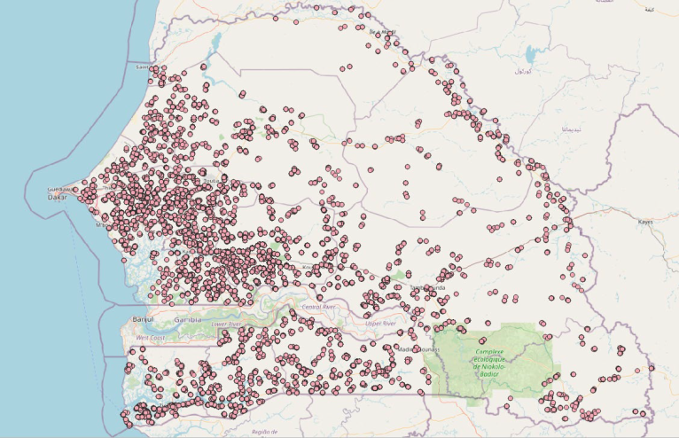
```

Parcels' area is also measured with GPS and this measured area is then reported manually in the survey questionnaire available on the tablet. Unfortunately, the GPS traces are not systematically archived – only a subset of them are kept for quality control by the supervision team at DAPSA. A subset of these traces, mainly located between Touba and Thiès, was also shared by DAPSA (@fig-senegal-2).

```{r}
#| echo: false
#| eval: true
#| label: fig-senegal-2
#| layout-ncol: 2
#| fig-cap: Visualization of data shared by DAPSA.
#| out-width: 100%
#| out-height: 300px
#| fig-subcap:
#|  - "GPS tracks location"
#|  - "Parcels boundaries with GPS point/lines"
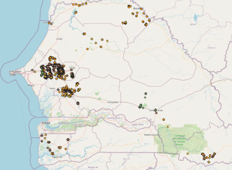
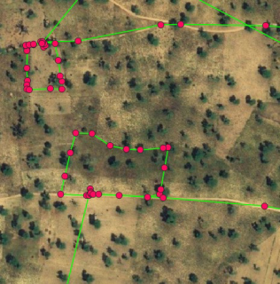
```

To summarize, georeferenced information is available at crop-level, as points (parcels boundaries are not available by-default), for a selection of parcels. Information is collected at the right timing to allow crop identification and additional information.

### Quality control of AAS data

The quality of the 16,861 records as GPS points inside the AAS database was assessed through multiple stages.

First, all points located too close to roads and buildings were removed and points located less than 20 meters apart but associated with different crops are removed. The second stage of the quality control addressed the important challenge of working with GPS points (and not polygons), i.e. checking if the point is located in the middle of the parcel. For the sake of illustration, @fig-senegal-3 shows two situations where (i) point was taken at the middle of the parcels, thus making the parcels easily identifiable (left) and (ii) point was taken on the path along the parcels which makes almost impossible to know which parcel it refers to (right).

```{r}
#| echo: FALSE
#| eval: TRUE
#| out-width: 90%
#| label: fig-senegal-3
#| fig-align: center
#| fig-cap: Challenge to localize the surveyed parcels in the statistical database due to the fact that parcels are localized by geo-points (i.e. a single GPS coordinate)
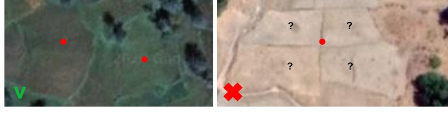
```

In order to avoid manually checking all points, the points were transformed into polygons by applying a 20-m buffer and the homogeneity of these polygons was assessed statistically. The assumption was that if the point was taken in the middle of the parcel, the resulting buffer would be homogeneous. Conversely, a point taken along the edge of the plot would result in a buffer mixing different crop types or including other land cover types such as roads or trees. This assessment was done calculating the standard deviation of the Normalized Difference Vegetation Index standard deviation.

During this step, it was observed that most points labelled as "rice" were located at the edges of the fields (probably because it is difficult to walk to the center of a rice field) and would thus be removed using the above criterion. In order to keep a good representation of rice in the reference database, all points were replaced manually in the middle of the fields thanks to Google Earth imagery.

At this stage, 12,056 polygons out of the 16,861 initial records remain.

### Quality control of GPS traces

The raw GPS traces were converted into usable polygon shapefiles. This process involved removing irrelevant data, correcting naming inconsistencies, and cleaning line artifacts caused by enumerator movement between fields (@fig-senegal-4).

```{r}
#| echo: FALSE
#| eval: TRUE
#| out-width: 80%
#| label: fig-senegal-4
#| fig-align: center
#| fig-cap: GPS traces successfully converted into shapefiles and represented well parcels boundaries
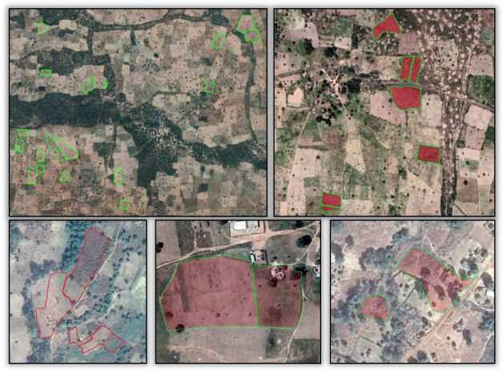
```

The GPS traces needed also to be quality controlled and filtered:

- Traces unrelated to valid records in the AAS database (e.g., invalid file name) were discarded

- Traces including non-boundary movements (e.g., travel paths) were removed (@fig-senegal-5)

- Traces with fewer than 3 points were excluded as they could not form polygon

```{r}
#| echo: FALSE
#| eval: TRUE
#| out-width: 95%
#| label: fig-senegal-5
#| fig-align: center
#| fig-cap: Example of GPS traces that contain more than parcels boundaries
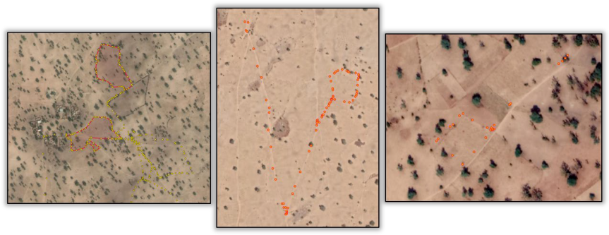
```

Finally, small polygons (the ones that disappeared after a 10-m inside buffer) were removed. Only 1,593 high-quality parcel boundaries remained, concentrated in central and western Senegal and representing 2089 hectares shared unequally into 22 crop type classes (@fig-senegal-6).

```{r}
#| echo: FALSE
#| eval: TRUE
#| label: fig-senegal-6
#| out-width: 90%
#| layout-ncol: 1
#| layout-nrow: 2
#| layout: "[[80], [100]]"
#| fig-align: center
#| fig-cap: Localization of the 1593 crop polygons obtained from the GPS boundaries and distribution of crop polygons superficies according to the crop type
#| fig-subcap:
#|  - "GPS boundaries"
#|  - "Crop type distribution"
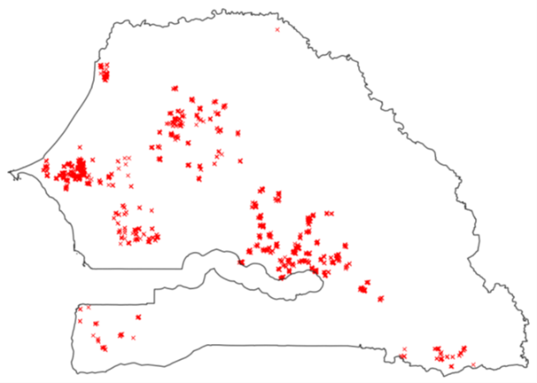
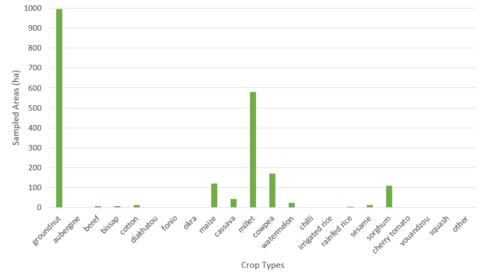
```

These crop data are expected to be the most useful ones because (i) they are polygons, thus including several pixels belonging to the same crop and (ii) the parcels boundaries have been checked manually. Nevertheless, these data don’t contain enough samples in all the crop types and they are not spread over the whole country.

### Crop mapping based on AAS 2018

Before running a classification using satellite imagery, additional non-crop information was collected by visual interpretation of very high spatial resolution Google Earth and Planet imagery. This information is not collected by regular agricultural surveys, which essence focuses on crop areas, but it is needed to train classification algorithms.

The classification was run using both the points and polygons dataset, based on GPS traces. The class imbalance in the dataset was addressed by limiting the number of groundnut samples to a maximum of 400 hectares and of rice samples to 100 hectares.

The amended dataset enabled the generation of a national 10-meter spatial resolution binary cropland / non-cropland mask, with an overall accuracy of 98% and F-Score values of 76% and of 99% for the cropland and non-cropland classes, respectively. A visual inspection of the map revealed that the classification performed relatively well: the discrimination was good between cropland and the natural shrub and tree vegetation, the urban areas and the bare soil. The discrimination with the grassland was however of lower quality and the irrigated perimeters were not well identified as cropland, due to their poor representation in the in-situ data.

A national crop type map was also generated, focusing only on the main crops for which enough samples were available (groundnut, maize, cassava, millet, cowpea, rice and sorghum). The overall accuracy was 78%. The patterns of the fields were generally well identified, showing that the Sentinel-2 10-meter spatial resolution has the capacity of mapping crop types at field-level. However, the map was affected by significant confusion between crops.

A local crop type map was also produced, focusing only on the Sentinel-2 tile where polygons are available, was much more promising, with an overall accuracy increasing to 85% (@fig-senegal-7). The results showed the added-value of working with polygons instead of points and of relying on many more samples to calibrate the algorithm.

```{r}
#| echo: FALSE
#| eval: TRUE
#| out-width: 100%
#| label: fig-senegal-7
#| fig-align: center
#| fig-cap: Sentinel-2 10-meter resolution crop type map over the tile where most of the GPS traces were located
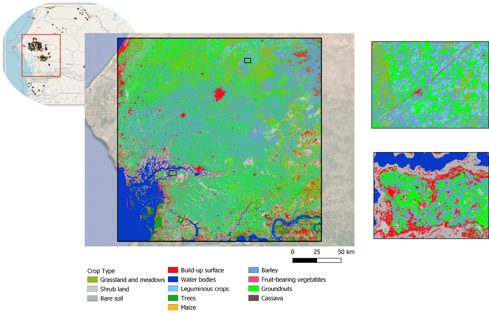
```

The rigorous preprocessing and quality assessment of the AAS and GPS traces data played a pivotal role in achieving this result. However, the AAS protocol in place was not optimal to allow reaching higher mapping accuracy: GPS information is mainly recorded as points, minor crops are under-represented and contextual information was missing (e.g. field heterogeneity, mixed cropping).

## Development and testing of an adjusted AAS protocol in 2021 in the Nioro department

### General description

Building on the lessons from the 2018 AAS, FAO supported a pilot activity in Nioro du Rip district between 2021–2022 to align the agricultural survey protocol with EO requirements. The proposed adjustments primarily targeted the georeferencing of the collected data by (1) transitioning from points to polygons and (2) testing area measurement using a tablet instead of a GPS, in order to simplify protocol implementation and reduce naming errors. It also added contextual and labelling information about crops in the questionnaire.

The pilot protocol discussed with the DAPSA consisted in recording parcels boundaries and no more GPS points for the visited parcels. These boundaries were recorded using two different devices for the sake of comparison: the traditional GPS and the tablet via a data collection application (which was ODK). The ODK application also allowed to collect additional information about crops, such as  crop heterogeneity, weeds level and mixed cropping), as well as non cropland classes. The traditional AAS was implemented in parallel on the tablet as usual. Five teams worked on the field and the data collected were sent daily to a server accessible by all participants.

Simultaneously, the DAPSA and UCLouvain carried out rapid quality control of the data each day in order to adjust the survey in real time if necessary.

### Parcel boundaries with GPS and ODK

A total of 357 Garmin GPS traces were successfully recorded during the field campaign, compared to the 396 plots listed in the AAS database. The discrepancy was explained by two main issues:

- Plot naming inconsistencies: 29 polygons were not correctly linked to AAS data due to manual errors in GPS file naming. However, several polygons could be recovered through careful manual inspection. 
- Loss of GPS traces: some GPS traces were never saved or transferred, preventing linkage with corresponding survey records.

These gaps in AAS–GPS linkage highlight the limitations of relying on manual data entry without real-time synchronization tools.

A total of 231 plots were investigated in the ODK application, out of the 396 plots inventoried by the AAS. This difference was due to a communication error during data collection: taking measurements with two different tools on all parcels complicated the task for the investigators.

Taking the GPS traces as reference, the quality of the field boundaries collected with ODK was quite heterogeneous at the beginning of the field campaign (@fig-senegal-8). This was due to the time required to learn a new tool, and it was gradually resolved over the course of the campaign thanks to the continuous guidance provided by DAPSA and UCLouvain.

::: {#fig-senegal-8 layout="[[46,50], [100]]" fig-cap="Parcel's polygons from Garmin GPS in red and from the tablet's GPS in green."}
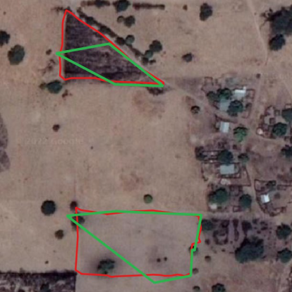

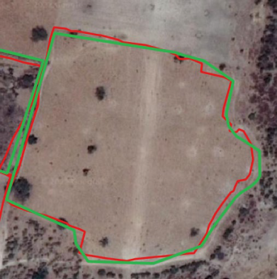

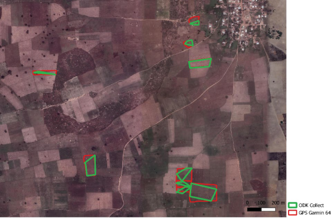
:::

### Comparative analysis of the survey data

The data collected in the field by the tablet in manual mode were compared to the GPS data. @fig-senegal-9 relates the regression line of the tablet dataset to the reference line. The value of the slope is 0.99, close to the value of the reference slope. The position of the regression line and the bias of 0.27 indicates that the tablet data generally underestimated the reference data. This bias is confirmed by a visual analysis of the data.

```{r}
#| echo: FALSE
#| eval: TRUE
#| label: fig-senegal-9
#| out-width: 100%
#| fig-align: center
#| fig-cap: Predicted areas by the ODK app on an Android tab (blue points), the red line is the regression line related to the predicted dataset and the green line, the reference related to the GPS dataset
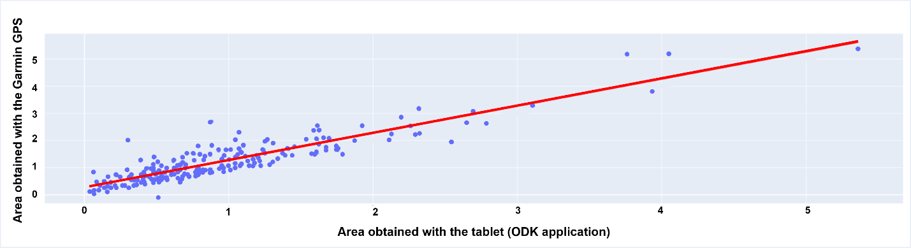
```

Several measurements deviate significantly from the reference, which comes from the use of the manual mode in ODK (i.e. enumerators to manually encode GPS measures at the inflection points of the plot). Errors in the area measurements were caused by:

- errors in encoding the points by the enumerator;
- waiting time: the tablet's GPS takes time to stabilize its position with acceptable accuracy. A shortened waiting time can then lead to an error of up to 30 meters from the position of the investigator;
- recording errors by the tablet: it is possible that the device or application does not record a point correctly or does not record it at all. 

Statistically and visually, the tablet dataset is less accurate than the one recorded with the GPS and has a bias that underestimates the baseline value. The situation is improving when using ODK in automated mode (@fig-senegal-10), but the comparative analysis did not support the claim that a tablet can replace a GPS for area measurement. 

```{r}
#| echo: FALSE
#| eval: TRUE
#| label: fig-senegal-10
#| out-width: 80%
#| fig-align: center
#| fig-cap: Examples of parcel’s delineations by the GPS in red, by the tablet with ODK Collect in manual mode in orange and in automated mode in green
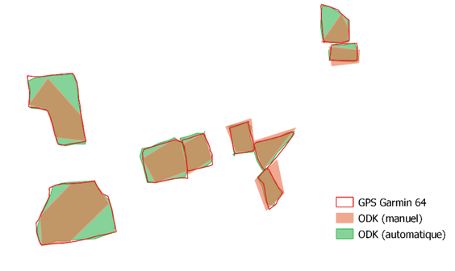
```

### Additional non-crop class data

As part of the pilot, enumerators were instructed to collect data on non-crop land cover classes (e.g., fallow, built-up, water) through the ODK application. However, only a limited number of non-crop polygons were recorded. Several key classes were missing. To fill this gap, additional non-crop features were manually delineated using very high-resolution satellite imagery. In total, 50 non-crop polygons were available for model calibration.

## Crop Classification and area indicators

### Sen4Stat solution

The crop type classification was done using the Sen4Stat system, an evolution of the Sen2Agri system, whose performance has been demonstrated and validated in a variety of contexts [@Defourny2019]

The Sen4Stat toolbox is a standalone operational processing chain which aims at facilitating the uptake of Earth Observation data in the official processes of National Statistical Offices, since the early stages of the agricultural surveys to the production of statistics. It automatically ingests and processes Sentinel-1 and Sentinel-2 time series in a seamless way for operational crop mapping and yield modelling, using ground data provided by national statistical surveys. It generates a set of EO-based products, such as time series of biophysical indicators, crop type maps and yield estimates. These EO products are then integrated with the agricultural survey to improve the statistics. Different types of statistics improvements are targeted by the system: (i) reduction of the estimates error, (ii) disaggregation to smaller administrative units, (iii) provision of timely crop area and yield estimators and (iv) optimization of sampling design by using maps to build or update sampling master frames. EO products are also used to support the quality control of the survey data. 

```{r}
#| echo: FALSE
#| eval: TRUE
#| label: fig-senegal-11
#| out-width: 100%
#| fig-align: center
#| fig-cap: Open-source Sen4Stat toolbox
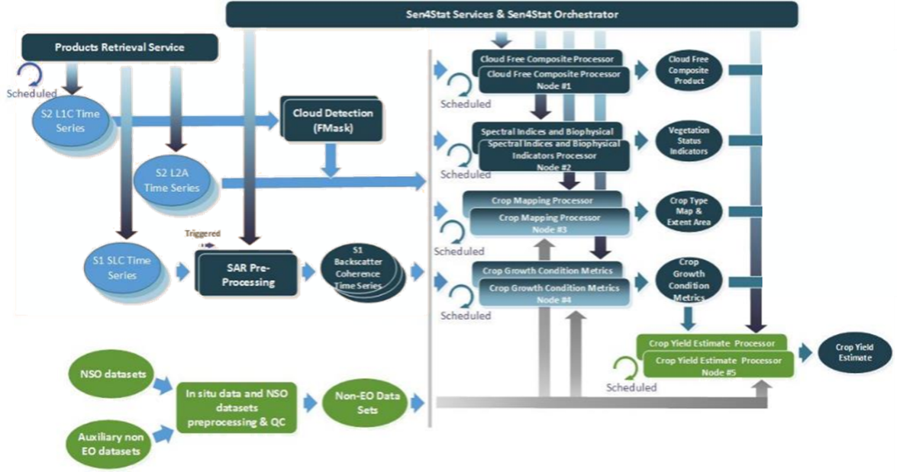
```

The system has been tested and demonstrated in various countries around the world, thus addressing a wide diversity of both cropping systems and agricultural data collection protocols. It is available for download on the Sen4Stat website ([esa-sen4stat.org](https://www.esa-sen4stat.org/)).

### Nioro crop type map 2021

The crop type map was generated at the end of the season from May 1, 2021, to December 31, 2021, using Sentinel-2 time series. The training dataset used contains the 50 non-crop polygons and the 247 crop polygons obtained after joining and cleaning the ODK and GPS dataset (@fig-senegal-12 – calibration polygons). The distribution of observations is very uneven for the different crops and insufficient for maize. 

```{r}
#| echo: FALSE
#| eval: TRUE
#| label: fig-senegal-12
#| out-width: 85%
#| layout-ncol: 1
#| layout-nrow: 2
#| layout: "[[80], [100]]"
#| fig-align: center
#| fig-cap: Distribution of in-situ data into a calibration data set and a validation data set
#| fig-subcap:
#|  - "Statistical distribution"
#|  - "Spatial distribution"
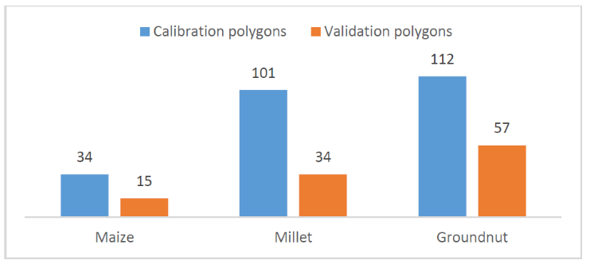
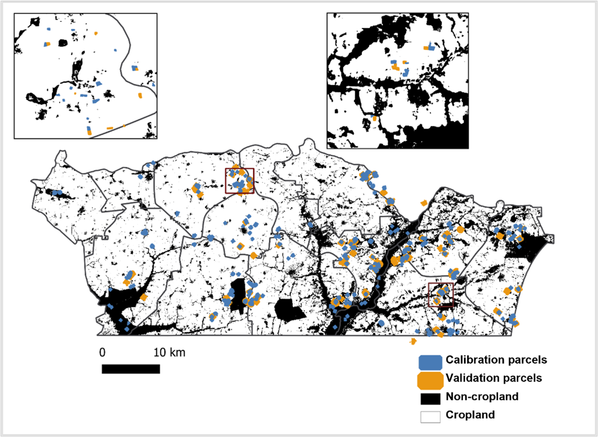
```

The obtained crop type map is shown in @fig-senegal-13

```{r}
#| echo: FALSE
#| eval: TRUE
#| label: fig-senegal-13
#| out-width: 90%
#| fig-align: center
#| fig-cap: Crop type classification of the Nioro department based on satellite imagery from May 1, 2021 to December 31, 2021 
knitr::include_graphics("./images/th_alignment/image19.png")
```

The confusion matrix (@fig-senegal-14) indicates an overall accuracy of 97.1% for the cropland mask and 88.2% for the crop type map. F-score values were 98% for cropland and 95% for non-cropland. For specific crops, F-scores reached 95.2% for groundnut, 83.8% for millet, but only 54.8% for maize, which showed substantial omissions. The representation of the three crops in the dataset was highly unbalanced, and the number of samples is clearly too low to allow a proper maize classification. 

```{r}
#| echo: FALSE
#| eval: TRUE
#| label: fig-senegal-14
#| out-width: 90%
#| fig-align: center
#| fig-cap: Confusion matrix (expressed in number of pixels) for the crop type map, with contamination and omission values for each crop, UA as user accuracy and PA as producer accuracy
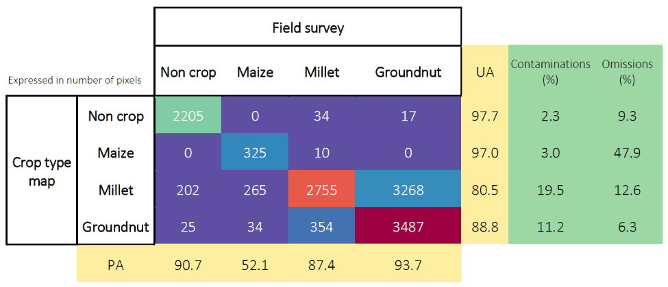
```

### Crop area indicator

Crop area statistics were derived from the crop type map to support EO-based agricultural estimations at the municipality level. @fig-senegal-15 (a) shows an estimation of the areas per crop using only the remote sensing data per municipality in the Nioro du Rip department while the bottom illustration gives an estimation of the area cultivated in each municipality by the same remote sensing approach. The surface areas per crop were calculated by counting classified pixels and applying bias correction using the confusion matrix. 

```{r}
#| echo: FALSE
#| eval: TRUE
#| label: fig-senegal-15
#| out-width: 95%
#| layout-ncol: 1
#| layout-nrow: 2
#| layout: "[[80], [100]]"
#| fig-align: center
#| fig-cap: Estimation of the crop share (a) and cultivated area (b) per municipality in the Nioro du Rip department (in percent), based on remote sensing data 
#| fig-subcap:
#|  - "Estimation of the crop share"
#|  - "Cultivated area"
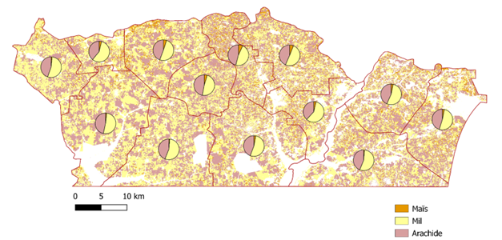
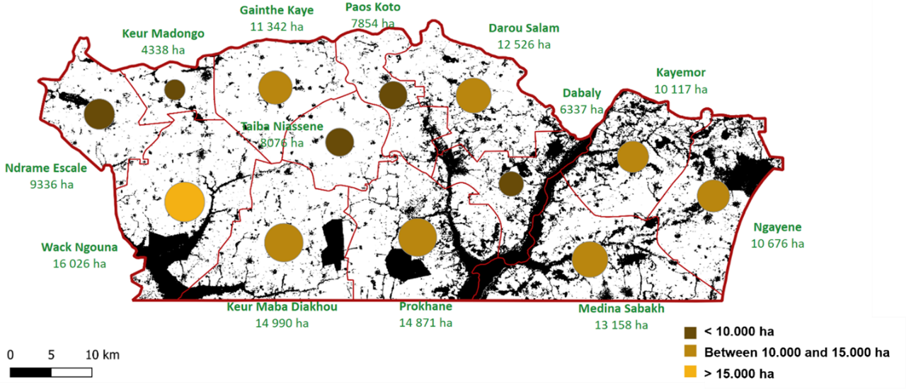
```

### Acreage estimation by integrating survey and EO data

Producing statistics by counting those pixels classified as a given crop type does not provide unbiased area estimates. Maps are subject to omission and commission errors, which are linked to the ability of the classification method to distinguish between classes. Regression estimators and calibration estimators have been widely used to correct such biases [@Gallego1993] [@Olofsson2014] [@Khan2018] [@Tyukavina2025]. They are traditional ways to combine accurate, possibly unbiased, information, observed on a sample with less accurate, biased information, known for the whole population or for a larger sample. Said differently, maps are used to improve an estimator that has been computed from a ground survey on a sample in preserving as much as possible the properties of the ground survey estimators (unbiasedness) and reducing the variance [@Gallego2004].

Because the sampling design in Senegal is a list frame, the integration of remote sensing and ground data cannot be done using linear models, but with multinomial logit models. These multinomial models deal with the uncertainties and generate probabilities that a pixel of a given class in the map is actually this given crop on the ground.  Despite the fact that the map was not perfect, this model successfully demonstrates the added-value of EO data for agricultural statistics estimation.

@fig-senegal-16 presents the crop acreage estimates in the department of Nioro, for the two main crops which are millet and groundnut and shows the efficiency of using the crop type map to support this estimation of crop acreages.

```{r}
#| echo: FALSE
#| eval: TRUE
#| label: fig-senegal-16
#| out-width: 90%
#| layout-ncol: 1
#| layout-nrow: 2
#| layout: "[[80], [100]]"
#| fig-align: center
#| fig-cap: Crop acreage estimates using EO and ground data in Nioro (a) and efficiency of using the crop type map for crop acreage estimation (b)
#| fig-subcap:
#|  - "Crop acreage estimates using EO and ground data in Nioro"
#|  - "Efficiency of using the crop type map for crop acreage estimation"


```

The use of a wall-to-wall map also allows to make acreage estimates available at the “arrondissement” levels with a reasonable error (expressed as the coefficient of variation), as shown in @fig-senegal-17.

```{r}
#| echo: FALSE
#| eval: TRUE
#| label: fig-senegal-17
#| out-width: 80%
#| fig-align: center
#| fig-cap: Crop acreage estimates at the district (arrondissement) level

```

## Conclusions

The Senegal case study demonstrates that the quality of in-situ data is
the decisive factor shaping the performance of EO applications in
agricultural statistics. The comparison between the 2018 and 2021 AAS
protocols highlights how weaknesses in survey design --- reliance on GPS
points instead of polygons, insufficient metadata, and limited
contextual information --- constrained the accuracy of crop type
mapping, with overall accuracy limited to ~78%. By contrast, the
adjusted Nioro protocol, which emphasized polygon delineation, improved
georeferencing, and richer labeling, achieved accuracies exceeding 85%.
This improvement cannot be attributed to EO algorithms alone but to the
stronger foundations provided by high-quality field data.

While this chapter briefly illustrated how survey-integrated approaches
can support crop area estimation, the methodological details are
developed in depth in Ambrosio in Chapter "Estimating crop statistics for list frame data"(this volume). What is clear,
however, is that EO cannot substitute for poor survey data; rather, it
magnifies the importance of well-structured, statistically sound survey
protocols. In practice, robust EO applications require a deliberate
alignment of agricultural surveys with geospatial requirements.

The institutional uptake of the adjusted protocol by DAPSA --- now
extended to six districts --- underscores the operational value of
investing in survey quality. By embedding diagnostic frameworks,
piloting revised protocols, and integrating them into national practice,
Senegal has laid the groundwork for a sustainable, statistically
defensible use of EO in agriculture. This case thus illustrates a
broader lesson: the road to EO-enabled agricultural statistics begins
not with satellite imagery, but with the design and quality of in-situ
data collection.

## About the authors{-}

Luis Ambrosio Flores (luis.ambrosio@upm.es) is  professor of Statistics. Expert in agricultural and environmental statistics, econometric modeling, climate impact assessment, and EU biodiversity frameworks. Led 30 research projects and served as consultant (ESA, FAO, EU). Key projects: SEN4Stat - Sentinels for Agricultural Statistics;  Global Strategy (GS)-Improving Agricultural & Rural Statistics; Econometric models for assessing climate change impact on agriculture and environment (Spanish Ministry of Science and Technology). Author of 50 publications with 404 citations on Google Scholar.


## References{-}
