## Introduction

Over the past few decades, the accessibility of publicly available data from satellite constellations, such as Sentinel and Landsat, has transformed remote sensing (RS) into an indispensable tool for mapping and planning agricultural activities across continents [@Liaghat2010, @Andrimont2023, @Garnot2021}. The ability to map harvest areas and pastures via RS serves as a input for a many applications. These include allocation of agricultural subsidies, adopting of best practices in crop rotation, supporting phenological studies, monitoring environmental impacts, predicting food prices, planning sustainable cultivation strategies, optimizing planting and harvesting dates, and ultimately, enhancing food security [@Liaghat2010, @Garnot2021, @pinto2024tradition, @Gallo2021, @Gallo2023, @Andrimont2023}. Each of these applications benefits from accurate and timely information on agricultural land use and field boundaries. Precise mapping of harvest areas can directly inform decisions on agricultural aid, optimizing resource distribution and preventing wastage. Monitoring crop rotation practices through satellite imagery can help ensure environmental sustainability and compliance with agricultural policies designed to preserve soil health and biodiversity. Phenological studies, which track the lifecycle of plants, become more accurate when precise field boundaries are known, allowing for more granular analysis of crop development stages. Furthermore, understanding the spatial extent of agricultural activity is critical for assessing environmental impacts, such as water usage, land degradation, or the impact of land conversion from natural ecosystems to agricultural fields. Economically, reliable estimates of planted areas contribute to more accurate predictions of food prices, which influence national and international markets. Planning for sustainable planting involves identifying suitable lands and optimizing resource allocation, tasks simplified by detailed field maps. The ability to predict optimal planting and harvesting dates based on regional climatic conditions, as observed through satellite data, can significantly improve agricultural productivity. Ensuring food security at a national level relies on comprehensive data regarding agricultural output, which begins with precise knowledge of where and what is being cultivated.

Manual analysis of large-scale remote sensing data presents a formidable challenge, primarily due to its inherent high cost and labor-intensive nature. A rigorous methodological study involving RS data typically requires specialized professionals, such as cartographers or agronomists, who possess the requisite training to interpret such images. These experts examine vast expanses of land to identify and delineate agricultural fields. This process is slow and prone to inconsistencies due to human fatigue and subjective interpretation. Furthermore, many tasks such as crop classification or yield estimation, cannot be addressed through remote satellite imagery alone; they need complementary information from field visits or the integration of auxiliary data, adding further complexity and cost. Consequently, human intervention is a bottleneck in large-scale satellite imagery studies, hindering the rapid and widespread adoption of remote sensing for agricultural monitoring. The volume of data generated by modern satellite constellations makes manual processing practically impossible for national-scale applications.

Machine Learning (ML) methods offer a promising solution to alleviate the analytical cost associated with large-scale RS data studies. Computational models enable the recognition of patterns relevant to specific tasks, such as land use mapping or the precise segmentation of planting regions. These models, trained on human-annotated data, can be applied to other areas lacking ground truth labels, automating a labour-intensive process. This automation speeds up data processing and ensures consistency and objectivity in the analysis.

Deep Learning (DL) methods are well-suited for such tasks [@Bengio2017]. They have the capacity to learn from available labeled data, optimizing feature extraction and pattern learning. Unlike traditional ML algorithms that often require handcrafted features, DL models can automatically learn hierarchical representations from raw pixel data, capturing patterns and spatial relationships. This ability to learn complex, non-linear relationships makes them effective for field boundary delineation, where variations in terrain, lighting, crop types, and growth stages can influence visual appearance. However, the very characteristic that endows traditional DL models with their pattern recognition prowess—their data-driven nature—also restricts their applicability in real-world scenarios. Such models demand large accurately labeled data sets for effective learning, a requirement that can be a hurdle in many geographical contexts. Consequently, several active areas within ML and DL research are dedicated to reducing the reliance on human-produced labels for model training. These include supervised pretraining followed by transfer learning, domain adaptation, meta-learning, self-supervised learning (SSL), and foundational models in computer vision [@niu2021decade, @Patel2015, @Hospedales2021, @Jing2020, @Balestriero2023, @Awais2023]. Among these, transfer learning and self-supervised learning have emerged as prominent due to their robust performance in remote sensing data, offering pathways to overcome the data scarcity challenge.

This chapter focuses on field boundary delineation, which involves identifying and outlining the perimeters of agricultural parcels. This task is fundamental for official statistical offices, as field boundaries underpin agricultural surveys, resource management, and environmental monitoring at regional and national scales. The following sections will detail the methodologies, practical considerations, and broader implications of automating this ]process through machine learning techniques, providing a roadmap for its implementation in large-scale agricultural monitoring.

## Review of Literature on Semantic Segmenation

### Model Architectures

The core of automated field boundary delineation relies on machine learning models, leveraging deep learning methodologies for the production of agricultural statistics. These computational methods produce detailed thematic maps of agricultural regions, enabling comprehensive area monitoring and crop production estimates.

Traditional machine learning models such as Random Forest, XGBoost and support vector machines are still much used in agricultural statistics. However, for more complex and large-scale applications, deep neural networks  are indispensable. Convolutional Neural Networks (CNNs) [@Krizhevsky2012, @Simonyan2014, @He2016, @Huang2017] and their numerous variations have demonstrated sufficient flexibility and power for solving intricate problems like image segmentation [@Long2015, @Ronneberger2015, @He2017]. CNNs achieve this by learning hierarchical features through stacked convolutional layers, progressively extracting more abstract and meaningful representations from the raw pixel data. 

```{r}
#| echo: FALSE
#| label: fig-cnn-ibge
#| out-width: 100%
#| fig-cap: |
#|   Architecture of a traditional CNN for image classification. This example illustrates how an input image is processed through multiple convolutional blocks to extract features, which are then passed through fully connected layers to generate classification predictions.
#| fig-align: center
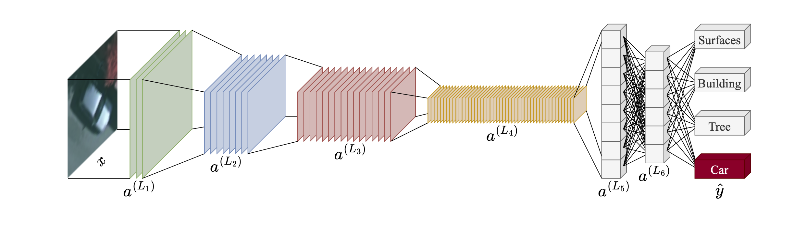
```

More recently, architectures based on the attention mechanism [@Vaswani2017], originally proposed for natural language processing, were adapted for visual pattern recognition [@Dosovitskiy2020, @Liu2021]. These Vision Transformers (ViTs) emerged as alternatives to CNNs by focusing on global relationships within an image. Introduced in 2020, Vision Transformers (ViTs) gained prominence in visual pattern recognition by exploring a global view of images rather than relying solely on the local receptive fields, as is done in convolutional operations. ViTs capture long-range dependencies and contextual information more effectively. Today, CNNs and ViTs are state-of-the-art architectures in computer vision, with their optimal application depending on the specific problem and dataset characteristics. Recent adaptations have also successfully brought ViTs to remote sensing pattern recognition tasks, demonstrating their potential for analyzing satellite imagery [@Tarasiou2023].


```{r}
#| echo: FALSE
#| label: fig-vit-ibge
#| out-width: 100%
#| fig-cap: |
#|   Architecture of a ViT (Vision Transformer) for image classification. The image is initially divided into a sequence of patches, which are then linearly projected and combined with positional embeddings. These tokens are fed into a Transformer Encoder, and the resulting representation for a special class token is used to derive a classification prediction.
#| fig-align: center
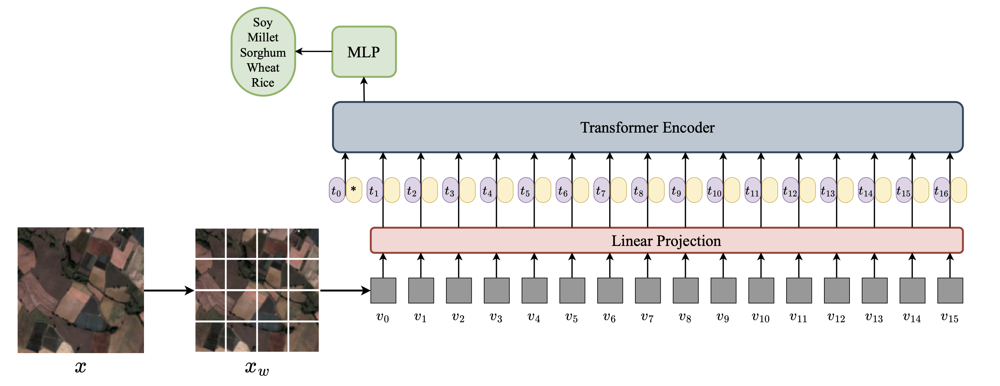
```

For segmentation applications of imagery for parcels delineation, several architectures are relevant, each offering unique advantages:

1. Fully Convolutional Networks (FCNs): These networks replace fully connected layers of traditional CNNs with convolutional layers, enabling end-to-end training and outputting dense pixel-level predictions directly [@Long2015]. A key advantage of FCNs is their inherent ability to use pretrained CNNs (often from image classification tasks) as a base. FCNs enable knowledge transfer from sparse labeling tasks (e.g., object/scene classification) to dense labeling tasks (e.g., semantic segmentation) [@Long2015]. FCNs utilize skip connections to merge high-level semantic information (from deeper layers) with high-resolution spatial details (from shallower layers), leading to more accurate and finely-detailed segmentation boundaries. This architecture ensures that both context and precise localization are considered. 

```{r}
#| echo: FALSE
#| label: fig-fcn-ibge
#| out-width: 100%
#| fig-cap: |
#|   Process of adapting a CNN to an FCN with or without transfer learning. Dense layers (fully connected) are replaced by one or more convolutional layers capable of producing a prediction map for multiple classes, thereby transforming a classification network into a segmentation network.
#| fig-align: center
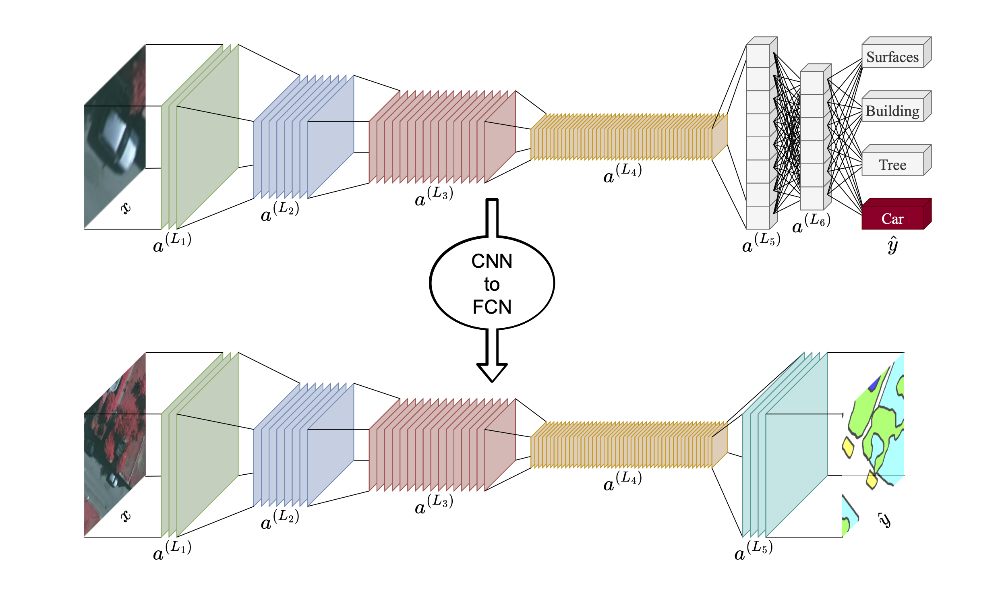
```

2. Encoder-Decoder Architectures: These architectures, including UNet [@Ronneberger2015] and SegNet [@Badrinarayanan2017]  extend the FCN concept with a more structured approach, composed of two distinct sub-modules: an Encoder and a Decoder. The Encoder progressively reduces spatial resolution while simultaneously encoding rich visual information into a large number of feature channels, capturing abstract semantic context. The Decoder then performs the inverse process, recovering spatial resolution and reducing channel resolution to reconstruct the segmentation map. Decoders, often composed of learnable transposed convolution layers, are highly effective at recovering original spatial resolution, frequently leading to higher quality segmentation of detailed objects compared to equivalent FCNs [@Ronneberger2015, @Badrinarayanan2017]. Encoder-Decoder architectures commonly integrate skip connections at various points of their symmetric layers, directly connecting features from the encoder to corresponding layers in the decoder. This fosters the fusion of Global, high-level semantic information is combined with local, high-resolution spatial information. As result, encoder-decoder architectures can segment complex objects with intricate boundaries.

```{r}
#| echo: FALSE
#| label: fig-encoder-ibge
#| out-width: 100%
#| fig-cap: |
#|   Encoder-Decoder architecture for image segmentation. The Encoder path extracts features while reducing resolution, and the Decoder path reconstructs the segmentation map, often using skip connections to pass high-resolution details from the encoder to the decoder.
#| fig-align: center
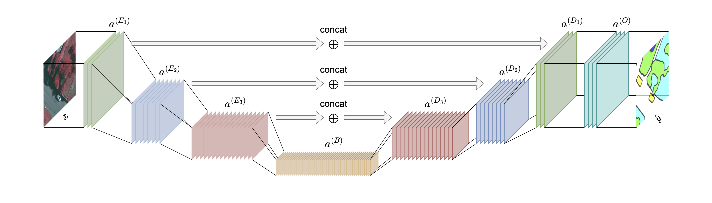
```

3. High-Resolution Network (HRNet): This architecture has proven particularly suitable for field parcel segmentation in extensive exploratory experiments, consistently outperforming  other semantic segmentation architectures [@Wang2020]. Its superior performance stems from three main advantages that are critically important for precise boundary delineation: 

* HRNet preserves high spatial information throughout the entire network rather than reducing it to a low-resolution bottleneck, which is a common characteristic of many other architectures. This design choice is useful for segmenting objects with fine details, such as narrow field boundaries, as it avoids the loss of crucial pixel-level information.

* HRNet operates continuously in a multi-scale mode, simultaneously processing features at different resolutions. This inherent multi-scale processing forces the model to learn both global contextual characteristics and local fine-grained details simultaneously, leading to more comprehensive and accurate feature representations.

* More modern versions of HRNet incorporate attention mechanisms. These mechanisms integrate global context with the local convolutions of the original architecture. By allowing the network to selectively focus on relevant parts of the image and aggregate information from distant pixels, attention further enhances the model's ability to delineate complex field boundaries accurately, even in challenging environments.

```{r}
#| echo: FALSE
#| label: fig-hrnet-ibge
#| out-width: 100%
#| fig-cap: |
#|   Simplified view of (a) a traditional image segmentation architecture containing a spatial bottleneck, where information is compressed and then expanded, and (b) the High-Resolution Network (HRNet) architecture, which maintains high-resolution representations throughout the network. Source: [@Wang2020].
#| fig-align: center
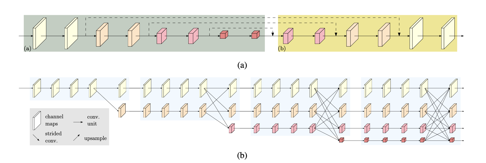
```

### Learning Strategies: Leveraging Self-Supervised Learning

While neural networks are powerful for visual recognition, their inherent reliance on large quantities of accurately labeled data presents a significant limitation [@Jing2020, @Balestriero2023, @Awais2023]. This constraint is particularly pertinent in remote sensing applications where manual annotation of vast geographical areas is expensive and time-consuming, and often infeasible for national-scale mapping. To address this, Representation learning strategies such as self-supervised learning (SSL) address this problem. SSL methods enable models to learn rich, meaningful representations from large volumes of readily available unlabeled data [@Jing2020, @Balestriero2023, @Astruc2024, @wang2022self]. This reduces the bottleneck of human annotation, opening up possibilities for leveraging massive archives of satellite imagery.

SSL pretrains neural networks using pretext tasks that can be derived directly and procedurally from the unlabeled data itself, without requiring explicit human labels [@Jing2020, @Balestriero2023, @Gidaris2018, @Noroozi2016, @Pathak2016]. Instead of directly learning a mapping from input data to human-annotated labels (a process that would demand extensive supervised datasets), an SSL model is initially pretrained to solve these pretext tasks. A model might be trained to predict the angle of rotation applied to an image, to reorder shuffled image patches, or to reconstruct degraded areas of an image. The model learns by generating a representation of the transformed image, which is then fed into a prediction head to produce a pseudo-label for the pretext task. A self-supervised loss function measures the discrepancy between the predicted pseudo-label and the true pseudo-label (derived procedurally from the transformation), guiding the pretraining process and forcing the model to learn semantically meaningful features [@Jing2020, @Balestriero2023, @Caron2020, @Chen2021, @Grill2020, @Bardes2022, @Wang2021].

```{r}
#| echo: FALSE
#| label: fig-ssl-ibge
#| out-width: 90%
#| fig-cap: |
#|   Pipeline of a Self-Supervised Learning (SSL) model. The backbone is pretrained on a pretext task derived from unlabeled data, and then fine-tuned on a downstream target task with a small amount of labeled data.
#| fig-align: center
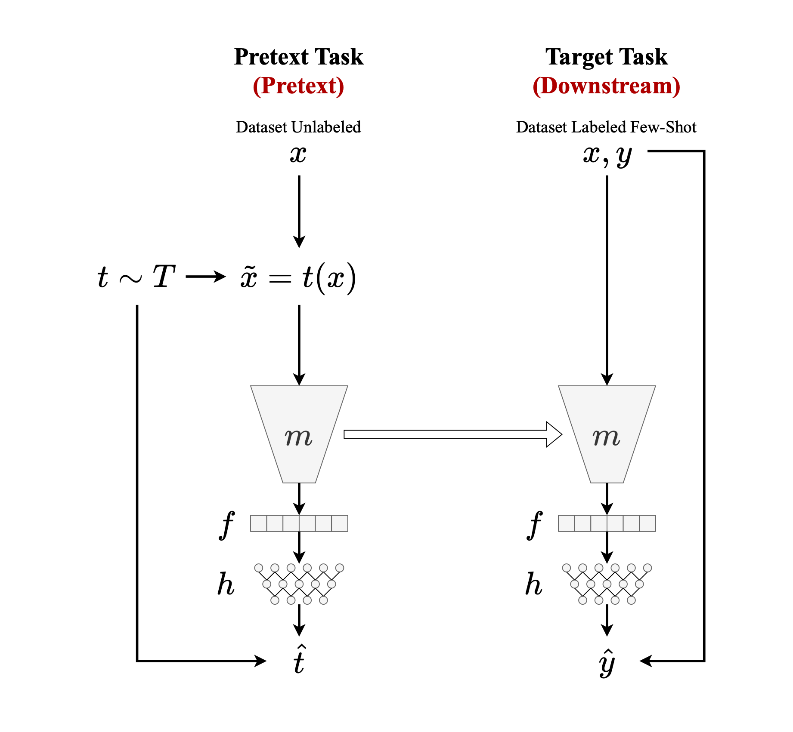
```

Within the realm of SSL, two major families exist: contrastive and non-contrastive similarity-based methods [@Chen2020, @He2020, @Caron2020, @Chen2021, @Grill2020, @Bardes2022]. Contrastive methods typically approximate representations of different transformed views (augmented versions) of the same image as positive pairs, while simultaneously distancing them from views of other images in the same training batch (negative pairs) [@Chen2020, @He2020, @Caron2020}. This process encourages the backbone to generate representations with better discriminatory power between views of the same image (invariance) and views of different images (separability). The effect of this contrastive loss in the feature space is to simplify the separation surface between positive and negative pairs, leading to well-distributed and discriminative embeddings. Contrastive approaches are computationally expensive due to large batch sizes to ensure a sufficient number of negative pairs;  they may sometimes artificially separate samples belonging to the same semantic class if they are too dissimilar in appearance [@wu2018unsupervised, @Harwood2017].

Non-contrastive SSL methods eliminate the need for negative pairs, making them less demanding in terms of GPU memory and generally more stable during training [@Chen2021, @Grill2020, @Bardes2022]. These methods, however, require additional regularization during training to prevent a trivial collaps where the model simply predicts the same representation for all inputs, resulting in meaningless features. Various regularization techniques have been proposed to mitigate this collapse, including bootstrapping latent representations, introducing asymmetry in Siamese network architectures, applying stop-gradient operations, and incorporating variance regularization [@Grill2020, @Bardes2022, @Zbontar2021]. The absence of negative pairs not only reduces memory requirements but also makes these methods less sensitive to the specific choice of data augmentations.

For tasks requiring dense labeling, like image segmentation, specific modifications to general SSL strategies have emerged. While early SSL pretrainings were often optimized for image classification, more recent methods aim to improve performance for segmentation and detection tasks. This has led to the development of methods that focus on learning local representations by encouraging proximity in the internal embedding space between different views (augmentations) of images, recognizing that pixel-level consistency is crucial for dense prediction tasks [@Caron2020, @Bardes2022, @Wang2021].

Wang et al [@Wang2021] proposed a multi-view self-supervised approach to delineate field boundaries. This method learns local representations by integrating concepts from advanced non-contrastive SSL techniques, particularly adapted for image segmentation, being more conceptually related to DenseCL [@Wang2021]. Inspired by successful prior work, this approach has been empirically shown to significantly stabilize and regularize the training process, enhancing the model's ability to learn robust features. 

After this extensive self-supervised pretraining phase, the encoder component of the model, now equipped with semantically rich feature representations, can be fine-tuned using a relatively limited number of human-labeled samples for the specific target segmentation task (e.g., field boundary delineation). This strategy allows for performance levels comparable to fully supervised methods but with significantly less reliance on extensive human annotation, typically requiring only a small percentage (e.g., 1% or 10%) of labeled data [@Chen2020]. Qualitative evaluations demonstrate that representations generated by this self-supervised pretraining exhibit high uniformity within agricultural parcels and across different temporal observations, delineating object boundaries even for elements present in only some timestamps. This indicates the model's robustness to temporal variability and partial data availability.

```{r}
#| echo: false
#| eval: true
#| label: fig-patches-ibge
#| layout-nrow: 2
#| fig-cap: |
#|    Examples of feature channels demonstrating uniformity in object representation for two image patches. Continuous areas, such as agricultural parcels or natural vegetation, are uniformly represented in the learned feature space, reinforcing the quality of the embeddings generated by the self-supervised pretraining and their semantic consistency.
#| out-width: 60%
#| fig-subcap:
#|  - "Patch of Pastis"
#|  - "Patch of AIBoundaries"
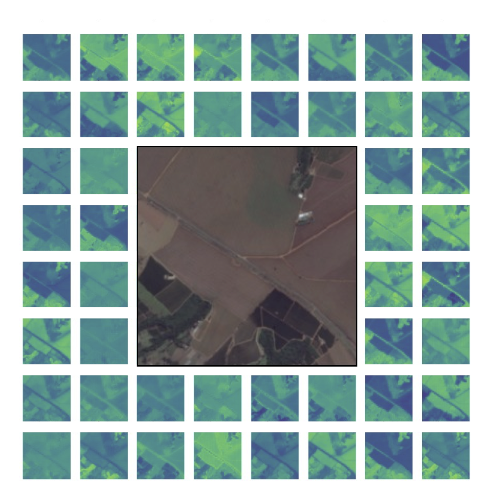
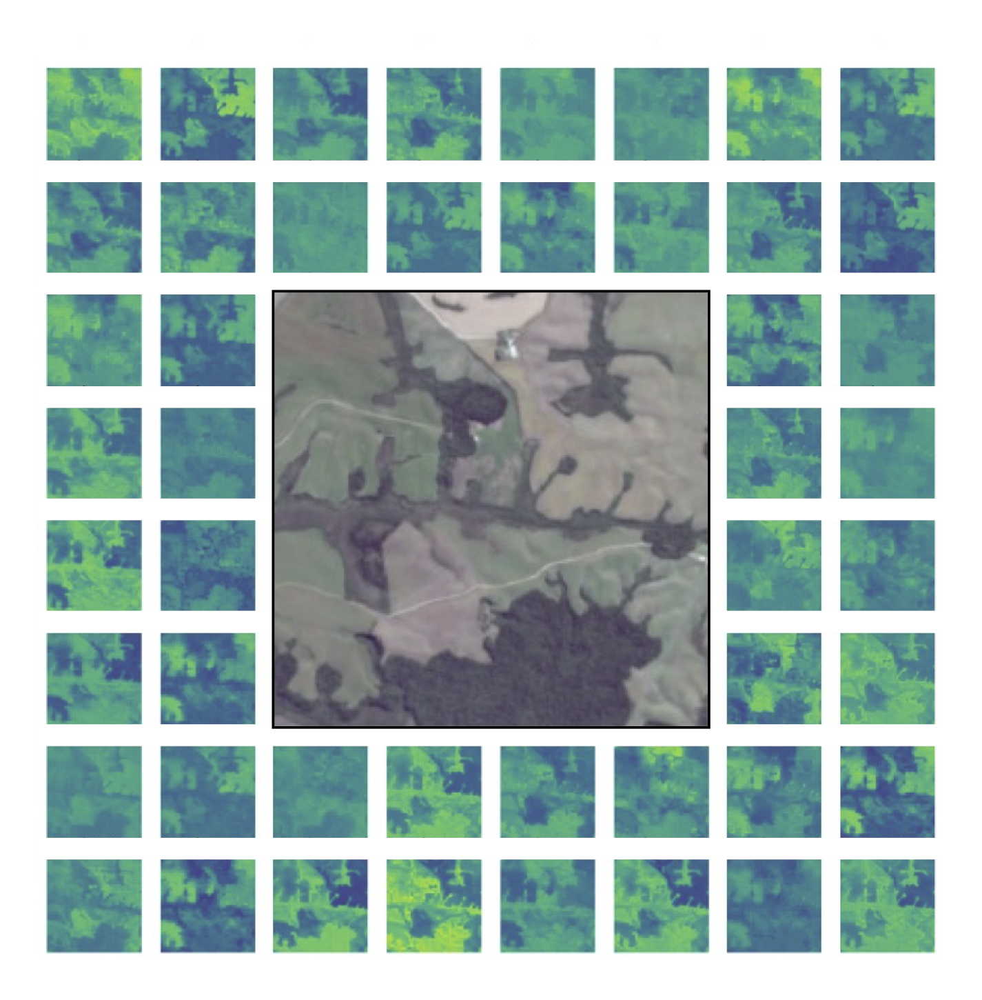
```

This approach has been shown to significantly improve the Average Recall (AR) of agricultural parcel segmentation, meaning fewer actual agricultural parcels are mistakenly classified as natural vegetation or urban areas, as shown in what follows. While this might lead to a marginal increase in false positives (FPs), these are less problematic for downstream applications and can often be filtered out in subsequent post-processing steps using ancillary information, such as time series of vegetation indices like EVI or NDVI. This makes the strategy robust and practical for large-scale agricultural mapping, where capturing all true parcels (high recall) is often prioritized over perfect precision in initial detection [@da2025lightweight].

### Transfer Learning and Multi-Source Training

Neural Networks are notoriously expensive to train, both in terms of cost (e.g., GPU hours) and the indirect temporal cost required for meticulous data annotation [@niu2021decade]. Transfer learning is a widely adopted strategy in computer vision to mitigate these substantial costs by leveraging knowledge gained from training on related visual tasks [@niu2021decade, @Ribani2019]. This typically involves using a pretrained neural network (e.g., a Vision Transformer or CNN) that has already learned general visual features from a very large, generic dataset (e.g., ImageNet [@Deng2009], Pascal VOC [@Everingham2010], MS COCO [@Lin2014]) and then fine-tuning it with a smaller set of labeled samples from a new, target visual domain. Alternatively, the weights of the pretrained network can be used as a visual feature extractor combined with a simpler  classifier (such as a Support Vector Machine [@Cortes1995] or Random Forest [@Breiman2001]). 

While effective in many contexts, supervised pretraining followed by fine-tuning often proves problematic and incompatible with remote sensing images [@Ribani2019]. The number of input channels for a neural network is typically an immutable architectural decision, meaning a network designed to receive only 3-channel RGB images cannot be easily adapted for multispectral images like those from Sentinel-2, which can have 10 or more spectral bands. Even when using only the RGB channels of a multispectral satellite image, the inherent characteristics of natural images (e.g., acquired by smartphones or consumer cameras, which often contain specific object distributions and lighting conditions) fundamentally differ from those of remote sensing images (e.g., top-down view, large-scale geographical features, diverse atmospheric conditions). This discrepancy in visual characteristics between source and target domains can lead to poor transfer learning performance, a phenomenon known as negative transfer, where the pretrained knowledge actually hinders performance on the new task [@Ribani2019].

In remote sensing, transfer learning usually relies on source datasets with publicly available labeled data from tasks that are inherently related to the target task and originate from the remote sensing domain itself. Supervised pretaining uses labeled data from remote sensing data rather than natural images, aiming to transfer the acquired knowledge to agricultural areas within the national territory. Candidate source datasets for this purpose include previously mentioned public datasets such as AI4Boundaries [@Andrimont2023], PASTIS [@Garnot2021], LEM [@oldoni2020lem], and Campo Verde [@Sanches2018a]. These datasets, by virtue of originating from satellite imagery and focusing on agricultural or land cover tasks, provide a more suitable source domain for effective transfer learning.

### Evaluation Metrics

Our experiments suggest that instead of following a sequential transfer learning paradigm (pretrain on source, then fine-tune on target), directly aggregating all available and relevant datasets into a single, comprehensive training set can yield superior segmentations. This multi-source supervised learning approach has demonstrated improved performance not only on data similar to the training domains but also on out-of-distribution data from geographically distinct regions. By exposing the model to a wider variety of landscapes, agricultural practices, and environmental conditions during its primary training phase, it develops more robust and generalizable features. This approach effectively minimizes the domain shift problem, making the trained model more resilient and applicable across diverse agricultural landscapes without the need for extensive, per-region fine-tuning, thereby streamlining the deployment process for national-scale mapping.

To assess the quality and performance of the segmentation models, we employ a range of quantitative metrics, broadly categorized into pixel-level and instance-level metrics. These metrics provide insights into a model's strengths and weaknesses. Instance-level metrics are particularly informative and often prioritized for the context of field boundary delineation, as they analyze individual agricultural parcels, verifying if neighboring parcels are correctly separated and providing insights into over- or under-segmentation compared to human perception [@persello2009novel].

Pixel-Level metrics metrics provide a global assessment of classification accuracy at the pixel level and include the following approaches:

* Accuracy: This is the simplest metric, measuring the proportion of correctly classified pixels (both background and parcel interior) out of the total number of pixels in the image. While intuitive, it can be misleading in cases of highly imbalanced classes.

* Jaccard Index (Intersection over Union - IoU): IoU quantifies the overlap between the predicted segmentation map and the ground truth map. It is a more robust metric for segmentation. There are two options to calculate it:

- Jaccard-Weighted: A weighted average of the Jaccard index calculated for each class, where the weight is typically proportional to the number of pixels in that class. This provides a balanced measure that accounts for class imbalance.

- Jaccard-Binary: The Jaccard index specifically computed for the binary classification task (parcel vs. background). It directly measures the ratio of the intersection area to the union area between the predicted and ground truth masks for the parcel class.

* Area Under the Receiver Operating Characteristic Curve (AUC): The received-operating  curve plots the true positive rate against the false positive rate at various threshold settings. The AUC measures the model's overall ability to distinguish between classes, with higher values indicating better discriminatory power.

While pixel-level metrics serve as proxies for segmentation performance and are useful for rapid iteration, they have a limited utility in distinguishing subtle model differences, especially regarding individual object integrity. They do not directly assess how well individual instances (parcels) are delimited. Instance-level metrics provide a more granular understanding of how well individual parcels are delineated, their shape, and their separation from neighboring objects. They are often more aligned with human perception of segmentation quality for discrete objects like agricultural fields. These metrics include:

* Global Over-Segmentation Score (GOS): GOS measures the general overlap between real (ground truth) and predicted instances. It evaluates how consistently segmented objects are represented, with higher GOS values generally suggesting more correct detections of object boundaries. It reflects how well the model avoids splitting a single true object into multiple predicted segments [@persello2009novel].
    
* Global Under-Segmentation Score (GUS): GUS measures the occurrence of under-segmentation, indicating instances where multiple real parcels are erroneously grouped into a single predicted segment. A lower GUS is highly desirable, as it implies the model is effective at separating distinct fields [@persello2009novel].
    
* Global Total Segmentation (GTS): GTS quantifies the mean squared error calculated using the GOS and GUS errors. The mean of the sum of squared errors can be interpreted as a balanced measure of performance, accounting for both over- and under-segmentation cases. A lower GTS indicates a better balance between these two types of errors, signifying more accurate overall segmentation [@persello2009novel].
    
* Fragmentation Global Total (FGT): FGT quantifies the total error caused by the over-segmentation of instances. This metric is correlated with GOS but takes into consideration the quantity of instances that have a non-empty intersection with the reference instance. A lower FGT is preferable, indicating fewer unnecessary subdivisions of true parcels [@persello2009novel].
    
* Average Precision (AP): AP is a common and robust metric widely used in object detection and instance segmentation benchmarks. It measures the precision of detections across various recall levels, providing a single summary of the precision-recall curve. Higher AP indicates better overall performance in correctly identifying, localizing, and classifying instances.
    
*    Average Recall (AR): AR measures the model's ability to retrieve all relevant instances across different Intersection over Union (IoU) thresholds. A higher AR means fewer true parcels are missed by the model, which is crucial for comprehensive mapping.

For field boundary delineation, false positives (e.g., misclassifying a non-field area as a field boundary, or a small over-segmentation) are less critical for agricultural statistics than false negatives (e.g., missing an actual agricultural field, leading to an undercount). Correcting false negatives is challenging and costly to address in post-processing or subsequent analyses. In this case, the Average Recall (AR) measure is the more informative of instance-level metrics. Models that incorporate advanced representation learning, particularly self-supervised methods, show notable improvements in AR, ensuring that fewer agricultural parcels are erroneously unrecognized. 

## Methods

The development of an automated system for field boundary delineation necessitates a well-defined methodology, encompassing problem modeling, strategic data acquisition and preprocessing, selection of appropriate model architectures, and advanced learning strategies. The primary goal is to achieve accurate and scalable segmentation of agricultural parcels from remote sensing imagery to support national agricultural statistics.

### Binary Semantic Segmentation

Recognizing agricultural parcels is complex, especially when there is a geographical divergence between the regions used for model training and those used for testing or validation. Performing transfer learning across agricultural crops in different global regions is hard. It is challenging for models to generalize across diverse landscapes, climates, and farming practices. Given these complexities, particularly in multiclass segmentation of agricultural crops, we define our task as a binary semantic segmentation problem. The model distinguishes between two classes:

1. Class 0: Background -- representing regions that do not belong to an agricultural parcel. This includes non-agricultural land cover such as urban areas, forests, water bodies, roads, and uncultivated barren land. The variability within this class can be quite high, ranging from natural landscapes to human-made infrastructures.
    
2. Class 1: Interior of Agricultural Parcel -- representing the cultivated area of any crop type. This class aims to capture the core regions where agricultural activities are taking place, regardless of the specific crop planted, growth stage, or agricultural practice.

This binary simplification is chosen for several reasons. It reduces the complexity of the labeling task, making it more feasible to generate large annotated datasets. It also allows models to generalize across diverse agricultural contexts, as the distinction between ``field'' and ``non-field'' is more consistent than specific crop types. This addresses the challenge that detailed crop type labels may not be easily transferable across diverse geographical contexts or may require more specialized and resource-intensive annotation efforts. By simplifying the problem to binary segmentation, publicly available datasets like PASTIS [@Garnot2021] and AI4Boundaries [@Andrimont2023] can be readily binarized and utilized as source datasets for supervised training, enabling subsequent transfer to target regions where detailed crop-specific labels might be scarce or non-existent. This streamlined approach allows for rapid prototyping and deployment of base models.

For the purpose of binarization, instance IDs of parcels from datasets that provide them (e.g., PASTIS [@Garnot2021]) are converted to contain only the background class (Class 0) and a unified ``plantation plot'' class (Class 1) encompassing all crop types. To ensure that neighboring parcels remain distinct, a common challenge in agricultural mapping for fields without clear physical boundaries, a morphological erosion operation is applied to each individual parcel as shown in @fig-parcels-ibge. This process transforms the narrow boundary regions between adjacent parcels into the background class. This explicit separation aids the model in learning clearer distinctions at parcel edges.

```{r}
#| echo: FALSE
#| label: fig-parcels-ibge
#| out-width: 90%
#| fig-cap: |
#|   Representation of the problem modeling for a patch from the PASTIS dataset. The binary labels section shows the simplification to a binary problem (Background vs. Parcel), where parcel boundaries are converted to background pixels.
#| fig-align: center
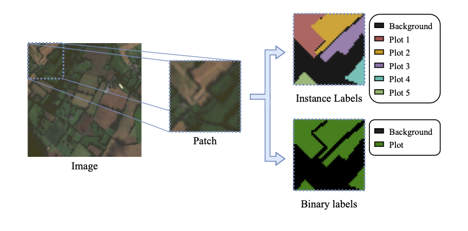
```

Initial experiments with this binary modeling approach, where margins were encoded as background, faced a challenge: models often merged several distinct agricultural parcels into a single Class 1 area, effectively ignoring the subtle boundaries. This issue persisted regardless of hyperparameter choices or training strategies, including adaptive cost function weighting to address class imbalance. This problem is due to the high variability in the ``Background'' class and the challenge of identifying narrow field boundaries when they are part of this diverse background. While our method focuses on binary segmentation, real-world implementations might require further refinements to address boundary complexities. Such refinements include multiclass definitions that enable better differentiation of parcel boundaries from general background areas and robust methods to handle highly fragmented landscapes.

### Data Acquisition, and Imagery Pre and Post-processing

Access to satellite imagery across extensive geographical areas is a determining factor for accurate field boundary delineation. To ensure long-term sustainability and avoid dependency on commercial data vendors, we give preference to free, publicly accessible data sources. Our work uses data from Sentinel-1 (Synthetic Aperture Radar) and Sentinel-2 (Multispectral Optical) satellites. 

To process large collections of Sentinel-1 and Sentinel-2 images, we use cloud-based platforms. Cloud computing platforms are designed for storing and processing vast satellite datasets, offering scalability for geospatial analysis [@Gorelick2017]. User-friendly interfaces provide a convenient environment for interactive data and algorithm development, significantly reducing the computational burden on local machines. Cloud platforms offer image processing capabilities to handle common issues such as cloud cover, atmospheric correction, and radiometric calibration [@Gorelick2017]. This integrated environment enables the efficient acquisition of high-quality images covering entire countries, enabling  large-scale agricultural monitoring.

The initial phase of data collection involves gathering pre-existing datasets to be used in development and validation tasks. These datasets provide diverse geographical and temporal contexts, enriching the model's training:

1. PASTIS: a globally recognized reference dataset specifically designed for panoptic and semantic segmentation of agricultural parcels derived from satellite time series [@Garnot2021]. It includes a significant number of samples within a specific metropolitan territory (e.g., French metropolitan territory), complete with panoptic annotations (instance index + semantic label for each pixel). Each sample is a variable-length time series of Sentinel-2 multispectral images, offering rich temporal dynamics for crop analysis.

2. AI4Boundaries: a publicly available dataset created to improve the detection of agricultural field boundaries using deep learning [@Andrimont2023]. It tackles a major gap in the field by offering standardized images and labels for training and benchmarking models. The dataset includes two types of imagery — 10 m Sentinel-2 satellite composites and 1 m aerial orthophotos — combined with ground-truth data from seven European countries. These represent over 14.8 million field parcels, covering varied landscapes. With over 7,800 image samples and accompanying vector and raster labels, AI4Boundaries helps advance precision agriculture and supports applications like land monitoring and food security analysis.

Additionally, large-scale annual mosaics covering entire states, encompassing hundreds of municipalities and hundreds of gigabytes of image data, can be acquired (e.g., for Goiás state, totaling 246 municipalities and 210GB of data). Given the wide variety of applications related to agricultural statistics, other datasets may be incorporated as algorithms evolve and adaptation needs arise. 

The data acquisition and preparation process follows a three-step workflow to ensure data quality and organization:

1. Mosaic generation: This stage involves precise configurations to define the delimitations of municipalities, often utilizing the official municipal boundaries provided by national geographic institutes. It also includes the selection of specific spectral bands of interest from the Sentinel constellation (e.g., COPERNICUS/S1 GRD and COPERNICUS/S2 collections) and performing necessary pre-processing to minimize the presence of clouds in the final image mosaics. For each municipality, mosaics are extracted for specific temporal intervals (e.g., semi-annual mosaics corresponding to different agricultural seasons), enabling analysis of seasonal variations in agricultural activity. Such processing is done in cloud providers, allowing experts to focus on configuration and quality control for the final mosaic generation.
    
2. Post-processing: Due to file size limitations imposed by servers infrastructure, the mosaics obtained from the provider are fragmented into multiple smaller files. This critical step aggregates these fragments into a single, unified, and ready-to-use raster file for each municipality. In addition, to aid human annotators and visual inspection, we extract separate rasters with different band selections and derived spectral indices. Prominent subsets extracted for visual analysis include those calculated by the indexes shown below.

- BSI (Builtup Area Index): (Red + SWIR) / (NIR + Blue) 
- NDWI (Normalized Difference Water Index): (Green - NIR) / (Green + NIR)
- NDVI (Normalized Difference Vegetation Index): (NIR - Red) / (NIR + Red)
- NDSI (Normalized Difference Snow Index): (Green - SWIR) / (Green + SWIR) 
- RGB (Red, Green, Blue): visible colour composite

3. Highlighting Annotation Areas: For efficient and collaborative manual annotation as shown in @fig-qgis-ibge, large municipalities are systematically divided into smaller, manageable sub-regions (e.g., each with a maximum area of 1000 km$^2$). This modular division facilitates the distribution of annotation tasks  and ensures that no single annotator is overwhelmed by excessively large areas. This approach is beneficial in vast regions of significant economic impact, where precise annotation is critical.

```{r}
#| echo: FALSE
#| label: fig-qgis-ibge
#| out-width: 90%
#| fig-cap: |
#|   Example of the manual labeling process for one plot.
#| fig-align: center
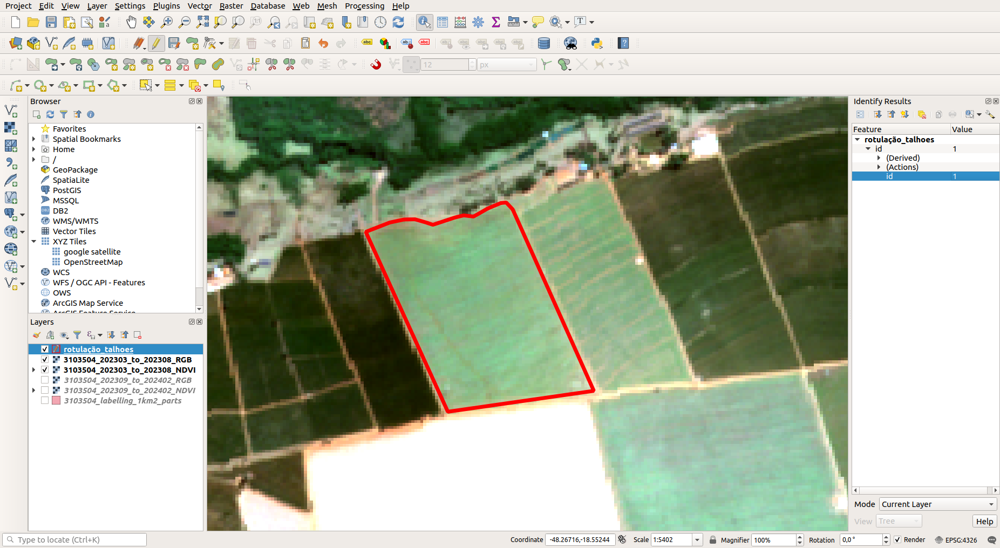
```

At the end of these steps, we produce an output for each municipality of interest containing multiple raster files per temporal mosaic (e.g., 12 files for two temporal mosaics, representing two different seasons, plus 1 additional file related to the division of annotation areas), ready for consumption by annotators and machine learning models.

```{r}
#| echo: FALSE
#| label: fig-qgis2-ibge
#| out-width: 90%
#| fig-cap: |
#|   Example of annotation region division for a municipality, demonstrating how large areas are segmented into smaller, manageable units to facilitate collaborative manual annotation.
#| fig-align: center
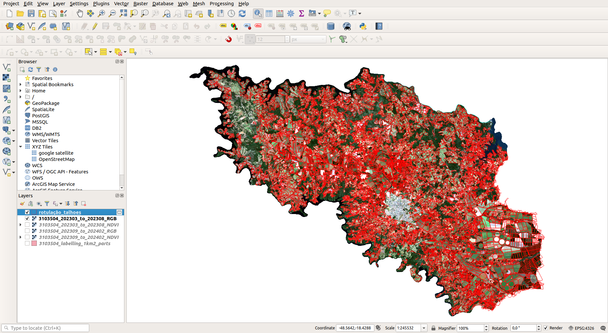
```

For model input, we use three Sentinel-2 derived datasets representing different spectral and temporal characteristics:

1. RGB:  This input consists of a composition of the Blue, Green, and Red bands, which represent the visible spectrum. These data have a spatial resolution of 10 meters per pixel, providing a straightforward visual representation of the Earth's surface.

2. NIR: This input consists of a simple Near Infra-red band. For Sentinel-2 images have a spatial resolution of 10 meters per pixel.

3. Harmonic: This is a more complex input derived from a time series of images. It involves computing the NDVI from the time series and then creating a harmonic model to extract values such as phase and amplitude. These harmonic values, combined with the mean NDVI over the period, are organized into an HSV (Hue, Saturation, Value) space. This approach captures temporal patterns of vegetation growth, which are highly indicative of agricultural activity. 

Temporal series considerations for these inputs are crucial for capturing seasonal variations in agriculture. For instance, RGB data might utilize a specific range (e.g., March to August 2023) to capture a particular growing season, while Harmonic data might consider a broader time span (e.g., January 2022 to March 2024) to capture complete annual cycles and long-term phenological trends.

After model inference, we transform raster outputs (pixel-based predictions) into vector formats (polygon-based representations), which are more suitable for geospatial analysis and database integration. Subsequent filtering steps are then applied to refine these polygons. This includes removing outliers, such as small polygons whose areas are either smaller or larger than twice the standard deviation of other instances; these polygons are often artifacts of the vectorisation process, especially at municipality borders. Overlapping instances are then dissolved to avoid the creation of redundant or multi-part polygons. We remove polygons smaller than a predefined area (e.g., 2000 m$^2$, equivalent to 20 pixels at Sentinel-2 resolution), as they often represent noise or insignificant features. Topological simplification, using algorithms like Douglas-Peucker, is then applied to each resulting instance to reduce the number of vertices and optimize the output vector file size, making the data more manageable for storage and analysis. The result is a consolidated, clean vector file for the entire region, ready for use in agricultural information systems.

### Manual Annotation of Field Plots

The task of manually annotating field plots is essential for improving the performance of the tested models. Incorporating Brazilian annotations—alongside the public datasets led to an IoU (Jaccard index) gain of over 0.2. The creation of a national dataset, representing all Brazilian regions and encompassing plots with varied sizes, shapes, land uses, and management practices across diverse landscapes, significantly enhanced model accuracy. This quality improvement was directly related to the volume and pace of newly added annotations.

As detailed in the Results section, initial testing was conducted using Sentinel-2 imagery with approximately 450,000 manually annotated plots. We have reached approximately 1,150,000 annotated plots (@fig-brazil-ibge) and have begun testing with PlanetScope imagery, which offers a spatial resolution of 5 meters. Preliminary results suggest that smaller plots are now being delineated more effectively, enabling reliable data acquisition even for plots smaller than 1 hectare.

```{r}
#| echo: FALSE
#| label: fig-brazil-ibge
#| out-width: 70%
#| fig-cap: |
#|   Label distribution throughout Brazilian territory (in yellow).
#| fig-align: center
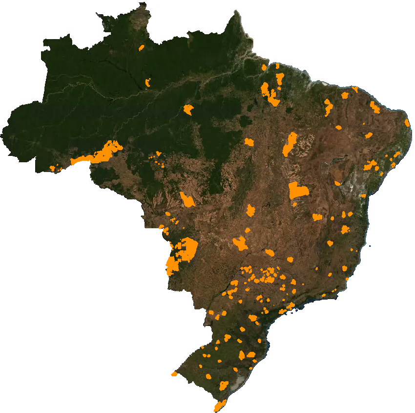
```

### Effort, Cost, and Workforce Dynamics

A critical factor to consider is the cost and labor required to carry out this task. In regions with regular polygon shapes, the annotation process proceeds more efficiently, with individual annotators achieving over 300 annotations daily. However, in areas with irregular polygons—such as floodplains, mountainous terrain, or smallholder properties—this rate drops to approximately 100 polygons per day. Thus, the annotation pace varies significantly depending on the mapped region. Annotating over 1.15 million plots required a dedicated team of 35 to 40 professionals working over a span of 11 months.

The annotation work relied on a infrastructure integrating GeoServer with a relational database and QGIS. The annotation team primarily consisted of professionals with a high school education, trained and supported by experts from various domains. The support staff included agronomists, IT specialists, and professionals in geoprocessing and cartography. Each annotator operated through secure network credentials and was authenticated to work remotely across more than 30 cities in Brazil—covering nearly all federative units. Local knowledge was recognized as a key advantage in ensuring annotation quality, alongside the strategic involvement of regional IBGE offices. This decentralized approach highlights the importance and relevance of mapping efforts for agricultural statistical production.

Given the institutional significance and high demands of this undertaking, active engagement and prioritization by participating institutions were crucial. Only through such coordinated effort was it possible to reach the volume of annotations necessary for the models to achieve the required level of accuracy to support targeted statistical operations.


## Results

### Practical Aspects of Implementation

The successful implementation of automated field boundary delineation on a large scale requires careful consideration of practical aspects, ranging from computational infrastructure to data annotation and model fine-tuning. 

### Computational Infrastructure

A robust and scalable infrastructure is absolutely essential for the efficient collection, processing, and storage of the massive volumes of geospatial data inherent in large-scale agricultural mapping projects. For centralized archiving and long-term retention of large volumes of processed data, Network-Attached Storage (NAS) systems play a crucial role. NAS systems need scalable capacity to accommodate the continuous growth of geospatial databases. In the long term, integrating more expansive and resilient cloud storage solutions is advisable. This ensures efficient and durable data persistence, eliminates the need for physical NAS hardware maintenance, and potentially reduces significant costs associated with large data volumes and on-premise infrastructure upkeep. To streamline data movement and reduce manual intervention, automated scripts are vital for seamless data synchronization, optimizing the overall workflow and minimizing the risk of human error.

For the intensive task of model training, significant computational power is a prerequisite. A capable consumer-grade setup might include an Intel Core i7-5930K CPU, an Nvidia Titan XP with 12GB VRAM, and 64GB of RAM. While such a setup can be functional, it is modest compared to modern, purpose-built deep learning configurations. Even with such hardware, models like the YOLOv11 [@yolo11_ultralytics] (utilized in related work for object detection and segmentation tasks) can balance performance speed and prediction efficacy. For large-scale and high-throughput training, more powerful, professional-grade GPUs are necessary. Examples include the NVIDIA RTX 4090 (24 GB VRAM, 16384 CUDA cores) or, more optimally, an NVIDIA DGX A100 (80GB VRAM). The DGX A100, in particular, offers superior performance, accelerating both training and inference processes and enabling scaling for larger and more complex experiments.

To further optimize training efficiency and make the most of available hardware, advanced software strategies are employed. For instance, Automatic Mixed Precision (AMP) in PyTorch is used to save GPU memory by employing 16-bit floats (fp16) for weights, tensors, and gradients whenever possible, instead of the standard 32-bit floats (fp32). This strategy not only improves memory efficiency (allowing for larger batch sizes) but also leverages the fact that modern GPUs are highly optimized to perform matrix/tensorial operations on fp16 data, achieving higher Floating Point Operations Per Second (FLOPs) than the same operations in fp32.

### Training Times

The duration of model training varies significantly depending on the model architecture, the size and complexity of the dataset, and the computational resources available. Supervised HRNet models, designed for direct supervised learning, tend to be comparatively lighter in terms of computational requirements than certain self-supervised counterparts. When trained across multiple public and private datasets (e.g., AI4Boundaries [@Andrimont2023], PASTIS [@Garnot2021], and labeled data from 24 cities), the entire dataset, along with its quaternary masks, can be stored in approximately 40 GB of memory, pre-loaded to avoid disk access bottlenecks during training. Each training iteration with a batch size of 18 typically takes about 0.4 seconds. Consequently, a comprehensive training routine spanning 600 epochs for a supervised HRNet model can be completed in approximately 17 hours.
    
For self-supervised models, early iterations initially proved to be more computationally intensive, primarily due to inefficient pixel sampling strategies during pretraining. An iteration using a batch size of 10 could take around 1.5 seconds. This resulted in a longer pretraining duration, with approximately 39 hours required for 300 epochs. A critical optimization in the pixel sampling was transitioning from random point selection to a more efficient grid-based sampling approach within the self-supervised method. This approach  reduced the computational cost of pretraining. With this improvement, each pretraining iteration for a batch size of 10 dropped to approximately 0.7 seconds. This optimization reduced the total pretraining time to around 18 hours for 300 epochs, making the self-supervised approach considerably more practical for large-scale applications.
    
The fine-tuning process, which adapts the pretrained models to specific downstream tasks using a smaller labeled dataset, incurs similar computational costs per iteration to supervised training. This means the fine-tuning phase is relatively quick compared to the initial self-supervised pretraining, capitalizing on the learned representations.


### Inference Times

The computational cost of model inference (the forward pass of the model to generate predictions) remains the same once the model is trained. For large-scale inference, such as covering an entire state or national territory, the area is systematically divided into smaller, overlapping patches (e.g., 768x768 pixels with 50% overlap) that can fit into GPU memory. An erosion operation (e.g., using a 4x4 kernel) is applied per instance prediction to mitigate detection overlaps, especially near parcel borders.

The total inference time exhibits a near-linear relationship with the territorial extension of the area being processed, implying that doubling the area roughly doubles the processing time. For instance, on a high-end consumer GPU like an NVIDIA RTX 4090, processing smaller regions like Sergipe (approx. 22,000 km$^2$) takes about 2.39 hours. Scaling up, the inference for the entire national territory (approx. 8.5 million km$^2$) is estimated to take around 925.88 hours, or approximately 38.58 days. On a more powerful, professional-grade GPU such as an NVIDIA DGX A100, these times are significantly reduced due to superior processing capabilities; Sergipe would take about 0.45 hours, and the entire national territory could be processed in approximately 172.90 hours, or about 7.20 days. This difference highlights the importance of selecting appropriate hardware for large-scale production deployments.

```{r}
#| echo: FALSE
#| label: fig-4090-ibge
#| out-width: 80%
#| fig-cap: |
#|   HRNet inference times for 24 cities, using an NVIDIA RTX 4090. The x-axis represents city size in km$^2$, and the y-axis shows total inference times in seconds. The black line represents the best linear fit for this relationship, demonstrating the scalability of inference with area.
#| fig-align: center
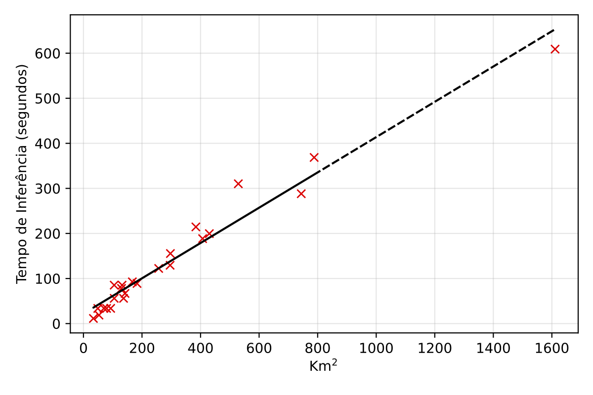
```

```{r}
#| echo: FALSE
#| label: fig-A100-ibge
#| out-width: 80%
#| fig-cap: |
#|   HRNet inference times for 24 cities, using an NVIDIA DGX A100. The graph illustrates the significantly reduced processing times compared to the RTX 4090, emphasizing the benefits of professional-grade hardware for large-scale operations.
#| fig-align: center
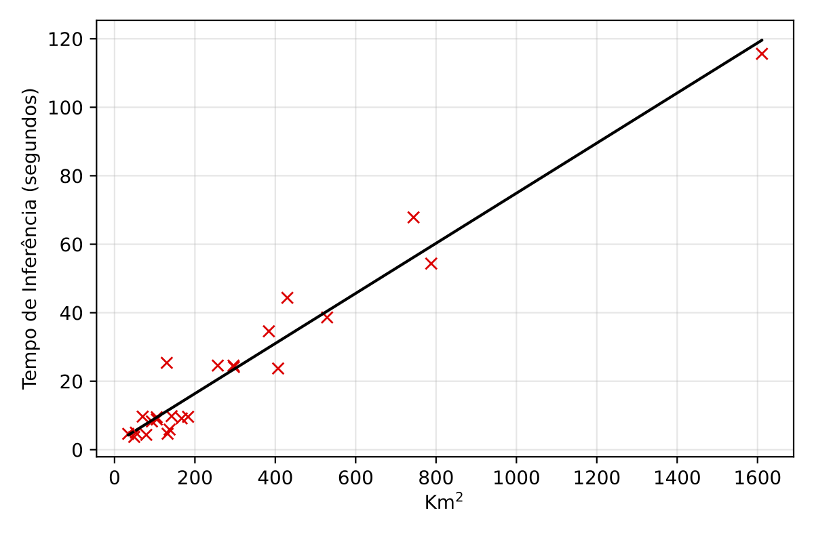
```

| Region            |  Area (km$^2$)  | Est. Time~(h) | Est. Time~(days) |
|-------------------|:---------------:|:-------------:|:----------------:|
| Sergipe           |         22,000  |      2.39  |       0.10       |
| Santa Catarina    |         96,000  |     10.42     |       0.43       |
| Ceará             |        149,000  |     16.20     |       0.68       |
| Paraná            |        199,000  |     21.69     |       0.90       |
| São Paulo         |        248,000  |     27.01     |       1.13       |
| Rio Grande do Sul |        282,000  |     30.66     |       1.28       |
| Bahia             |        560,000  |     60.92     |       2.54       |
| Minas Gerais      |        588,000  |     64.02     |       2.67       |
| Brazil            |       8,500,000 |     925.88    |       38.58      |
: Execution time estimates for large-scale inferences across different territorial extensions using an RTX 4090 GPU {#tbl-4090}


| Region            |  Area (km$^2$)  | Est. Time~(h) | Est. Time~(days) |
|-------------------|:---------------:|:-------------:|:----------------:|
| Sergipe           |       22,000  |      0.45     |       0.02       |
| Santa Catarina    |       96,000  |      1.95     |       0.08       |
| Ceará             |      149,000  |      3.03     |       0.13       |
| Paraná            |      199,000  |      4.05     |       0.17       |
| São Paulo         |      248,000  |      5.04     |       0.21       |
| Rio Grande do Sul |      282,000  |      5.72     |       0.24       |
| Bahia             |      560,000  |     11.38     |       0.47       |
| Minas Gerais      |      588,000  |     11.95     |       0.50       |
| Brazil            |     8,500,000 |     172.90    |       7.20       |
: Execution time estimates for large-scale inferences across different territorial extensions using a DGX A100 GPU. {#tbl-A100}

For large-scale predictions (state or national level) and production deployment, further optimizations are highly recommended beyond the current setup. These include:

* Quantization: Converting the trained models' weights and activations to lower precision (e.g., 8-bit integers) can reduce model size and accelerate inference without substantial loss in accuracy.
    
* ONNX (Open Neural Network Exchange): Exporting models to the ONNX format provides an open standard for representing machine learning models, enabling interoperability across different deep learning frameworks and hardware, thus streamlining deployment.
    
* PyTorch Lightning: High-performance computational strategies provided by frameworks like PyTorch Lightning can further optimize training and inference pipelines, particularly for complex and large-scale deep learning models.

These are considered industry standards for deploying neural network models in production and would ensure the system is both robust and efficient for continuous operation.

### Sample Production and Annotation

The precision and generalization capabilities of field boundary delineation models are directly dependent on the quality and quantity of their training data. Manual annotation of remote sensing images, though resource-intensive, is a critical step in producing these high-quality labeled datasets that serve as ground truth for model training. This task is typically performed by trained professionals responsible for annotating data from various regions. These regions are selected based on the annotators' existing geographical knowledge, familiarity with the local landscape and agricultural practices, and typical field sizes. Areas of high economic impact in the agribusiness sector are chosen for annotation due to the relative ease of identifying and delimiting planting areas, allowing for more precise annotation, which ultimately yields high-quality training data.

The labeling process combines geospatial software (such as QGIS) and pre-processed raster images. To observe temporal changes in vegetation, various timestamps are loaded, using  RGB (Red, Green, Blue) composites and NDVI images. RGB images offer a familiar visual representation of the Earth's surface, while NDVI provides quantitative insights into vegetation health, density, and vigor. These spectral indices aid annotators in their visual inspection, helping them to distinguish cultivated areas from other land covers.

After loading the imagery, the map is prepared for delimiting agricultural parcels using vector editing tools within the software. Annotators draw polygons that correspond to cultivation areas. It is crucial to delimit the parcel boundaries with extremely high precision, avoiding external areas such as roads, urban structures, natural forests, or non-cultivated vegetation. Such inclusions could introduce noise and inaccuracies into the training data, interfering with subsequent model learning and leading to erroneous predictions. The objective is to ensure that the separation of agricultural areas from non-agricultural ones is consistent with the reality observed in the imagery.

During the annotation process, NDVI images are particularly valuable as they offer a clear and quantitative view of vegetation health and density. This makes it significantly easier for annotators to identify the precise limits of agricultural parcels, especially when visual cues from RGB imagery are ambiguous (e.g., due to similar soil colors). RGB images, on the other hand, complement this analysis by providing a more intuitive visual representation of the landscape, making it easier to identify and exclude artificial structures (like buildings and roads) and non-vegetated areas that should not be part of the agricultural parcels.

Once parcels are delimited, annotators review and adjust polygon boundaries to ensure no inconsistencies or overlaps exist. The annotated parcels will serve as the ground truth for machine learning model training. The more accurately the data is labeled, the better the model will perform in real-world agricultural parceling scenarios, leading to higher confidence in its predictions.

The labeled dataset needs to be exported in a standardized format suitable for consumption by machine learning models. Before exporting, all non-essential information fields in the labeling data are removed, retaining only a unique identifier for each labeled polygon. This simplification is necessary as the primary objective is to convert the vector (polygon) result into a raster (pixel-grid) file for model training. 

Information on the number of rows and columns (width and height in pixels) from the original reference images (e.g., RGB layers) are extracted. These dimensions are essential to ensure that the resulting raster file, which represents the labeled parcels, maintains the exact same spatial scale and proportion as the input imagery. This alignment is critical for accurate pixel-to-pixel correspondence during model training.

When converting the annotated polygons from vector to raster format, their unique `id` field is employed to assign the values of each polygon to corresponding pixels in the rasterization process. During this step, the width and height of the output raster image are set based on the previously extracted measures, ensuring that the final raster accurately reflects the municipality's spatial extent. A data type like `UInt16` (unsigned 16-bit integer) is typically selected as the standard for the output image. This choice ensures efficient encoding of numerical polygon identifiers, providing a good balance between precision (allowing for many unique IDs) and storage economy, making it highly suitable for representing labeled agricultural areas in a computationally efficient manner.

Manual annotation is inherently resource-intensive. A trained annotator produces an average of 100-200 labelled polygons per day. Building labeled datasets necessary training high-performance field boundary models at a national scale requires time and effort. This work directly contributes to the model's accuracy, as evidenced by its impact on evaluation metrics like Mean Intersection over Union (mIoU) and F1-score. Incorrectly delineated parcel borders or the accidental inclusion of non-agricultural elements, like roads or buildings, significantly reduce mIoU. Inadequate or inconsistent labeling lower the model's precision and recall. Therefore, precise extraction of image dimensions and detailed, high-quality parcel labeling are paramount; they ensure that models are trained with accurate data. Good quality labels lead to improved generalization and reliability in real-world agricultural scenarios.

### Effort for Fine-Tuning Models

Fine-tuning is an efficient strategy to adapt pretrained models to specific target domains where extensive labeled data might be scarce or too costly to acquire [@niu2021decade, @Patel2015]. Unlike training a deep learning model from scratch, which requires massive computational resources and time to learn fundamental features, fine-tuning leverages a model that has already acquired general visual representations from a large source dataset (e.g., publicly available remote sensing datasets or vast amounts of unlabeled national imagery pretrained through self-supervised learning) [@Ribani2019]. This makes it an efficient approach for applying general models to new geographical regions or specific agricultural contexts where only a small fraction of labeled samples is available, thereby reducing the annotation burden for new areas of interest.


### Effectiveness of Using SSL Pre-Training

The fine-tuning process typically involves taking a neural network's pretrained weights and making small, iterative adjustments to these weights using the new, smaller labeled dataset from the target domain. This can involve training only the final layers of the network (feature extractor approach) or training the entire network with a very low learning rate (end-to-end fine-tuning). For segmentation tasks, it is common practice to re-initialize the final segmentation head of the pretrained model with random weights and then train for a relatively short number of epochs (e.g., 60 epochs) with a learning rate that is significantly lower than that used during the initial pretraining phase. This strategy ensures that the model leverages its already learned robust and generalizable features while adapting to the specific characteristics and label distributions of the new region.

The computational effort for fine-tuning pretrained models is much lower than that required for the initial self-supervised pretraining or training from scratch. While the optimized self-supervised pretraining could take around 18 hours on a high-performance GPU, the fine-tuning phase is considerably quicker, often completed in a fraction of that time. Fine-tuning is a scalable and cost-effective method for applying field boundary delineation across various sub-regions or specific agricultural types within a national territory. It facilitates the continuous refinement and specialization of models, allowing for rapid deployment and adaptation to local conditions without the prohibitive cost of extensive new large-scale annotation efforts for every new area. This iterative adaptation is key to maintaining high performance in dynamic and diverse agricultural landscapes.

@tbl-results shows the results using public and private data for agricultural plot segmentation with: 1) supervised learning without SSL (wo/ SSL); and 2) SSL pre-training followed by fine-tuning (w/ SSL). In all cases, both AP and AR improved when SSL pre-training was incorporated. SSL pre-training proved effective for both pixel-level and instance-level metrics, achieving considerably higher values than the SSL-free baseline across all 5 cities. Therefore, the results presented in @tbl-results are conclusive in favor of SSL pre-training as a valid strategy for large-scale mapping.


| City         | State |  Method |  AUC  |  J-w  |  J-b  |  GOS  |  GUS  |  GTS  |   AP  |   AR  |
|--------------|-------|:-------:|:-----:|:-----:|:-----:|:-----:|:-----:|:-----:|:-----:|:-----:|
| Cândido      | SP    | wo/ SSL | .9236 | .4084 | .8726 | .0649 | .0643 | .0738 | .2177 | .3383 |
| Cândido      | SP    |  w/ SSL | .9447 | .6161 | .9185 | .0521 | .0426 | .0540 | .4063 | .5793 |
| Pitangueiras | SP    | wo/ SSL | .9551 | .6449 | .8709 | .0890 | .0757 | .0888 | .5643 | .6533 |
| Pitangueiras | SP    |  w/ SSL | .9689 | .7576 | .9148 | .0490 | .0505 | .0557 | .7416 | .7876 |
| U. Paulista  | SP    | wo/ SSL | .9207 | .5374 | .8620 | .1099 | .0732 | .0990 | .3892 | .4988 |
| U. Paulista  | SP    |  w/ SSL | .9443 | .6945 | .9150 | .0483 | .0511 | .0561 | .5607 | .6778 |
| Colorado     | PR    | wo/ SSL | .9470 | .5131 | .8509 | .1201 | .0697 | .1072 | .3540 | .6062 |
| Colorado     | PR    |  w/ SSL | .9635 | .6043 | .8801 | .1107 | .0503 | .0931 | .4789 | .7390 |
| Chorozinho   | CE    | wo/ SSL | .8038 | .0756 | .8509 | .0762 | .0680 | .0800 | .0066 | .0162 |
| Chorozinho   | CE    |  w/ SSL | .8537 | .1393 | .8824 | .0186 | .0615 | .0501 | .0193 | .0474 |
: Quantitative results achieved for some Brazilian municipalities, comparing the results obtained using SSL pretrained models with models trained from scratch. AUC: area under the curve; J-w: Jaccard-Weighted; J-b: for Jaccard-Binary; GOS: global over-segmentation score; GUS: global under-segmentation-score; GTS: global total segmentation; AP: average precision. {#tbl-results}

@fig-candido-ibge to @fig-choro-ibge present visual segmentation results for the 5 cities used to evaluate models pre-trained with SSL. In addition to the original image and annotations shown in the top row, the bottom row displays the predictions from the model without SSL model and the predictions from the model with SSL. 

```{r}
#| echo: FALSE
#| label: fig-candido-ibge
#| out-width: 80%
#| fig-cap: |
#|   Visual results for Cândido (SP).
#| fig-align: center
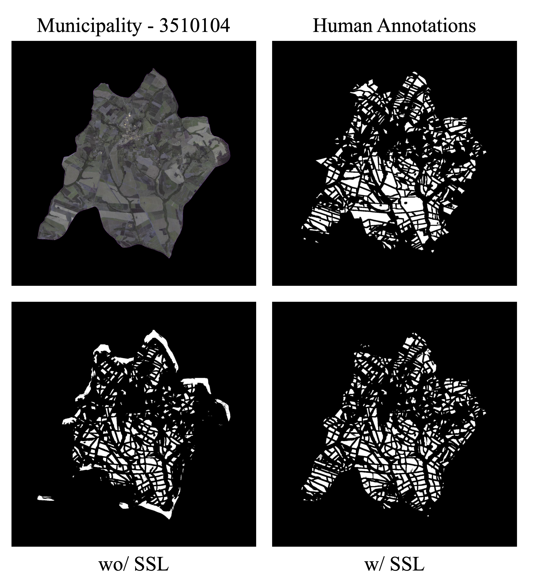
```

```{r}
#| echo: FALSE
#| label: fig-pitan-ibge
#| out-width: 80%
#| fig-cap: |
#|   Visual results for Pitangueiras (SP).
#| fig-align: center
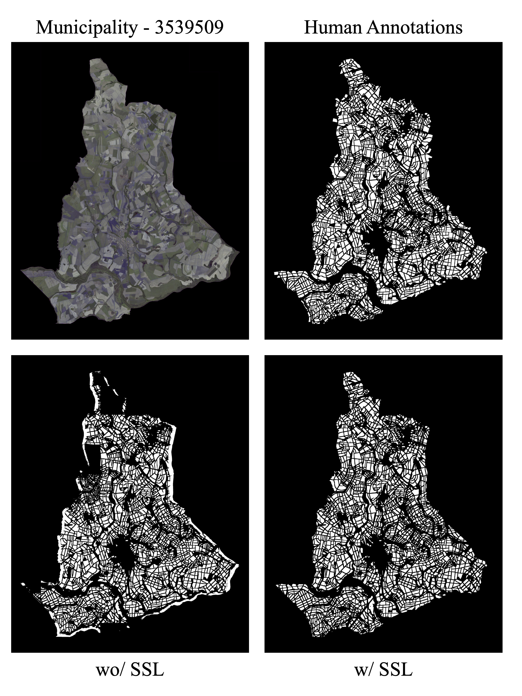
```

```{r}
#| echo: FALSE
#| label: fig-uniao-ibge
#| out-width: 80%
#| fig-cap: |
#|   Visual results for União Paulista (SP).
#| fig-align: center
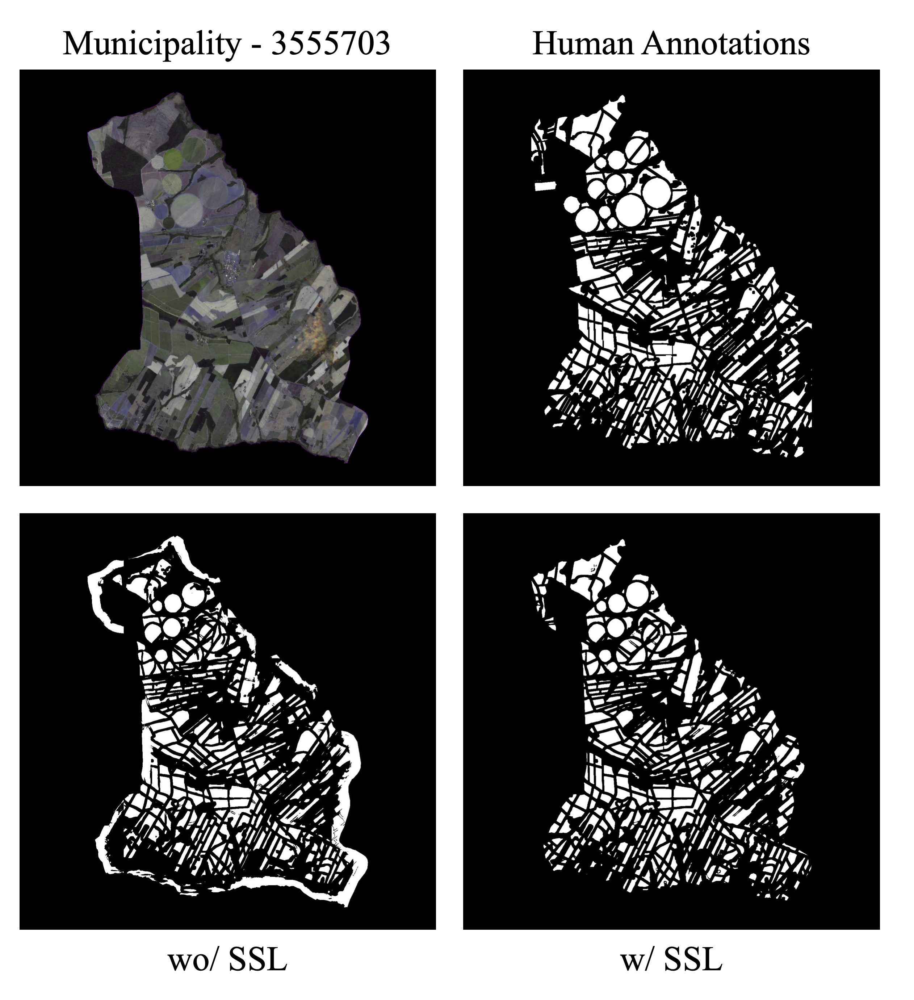
```

```{r}
#| echo: FALSE
#| label: fig-colorado-ibge
#| out-width: 80%
#| fig-cap: |
#|   Visual results for Colorado (PR).
#| fig-align: center
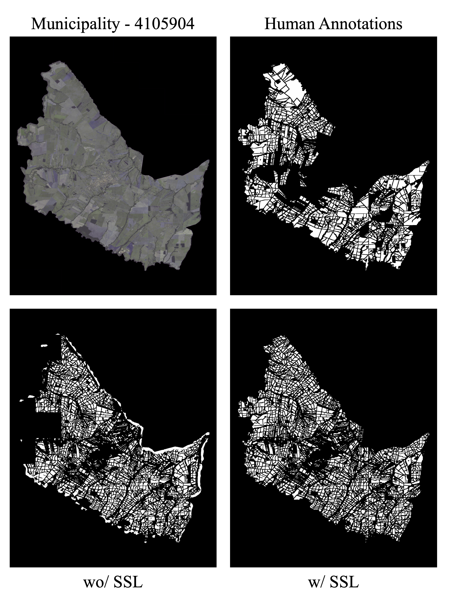
```

```{r}
#| echo: FALSE
#| label: fig-choro-ibge
#| out-width: 80%
#| fig-cap: |
#|   Visual results for Chorozinho (CE).
#| fig-align: center
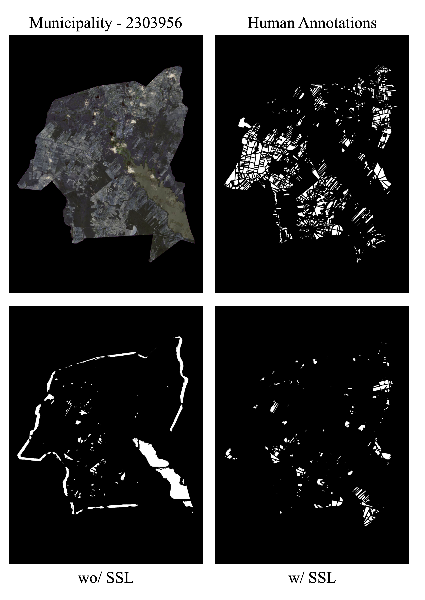
```
The model without SSL is susceptible to artifacts at the city borders due to missing data (black areas in the images) during the prediction process. These artifacts appear across all predictions without SSL, but are especially noticeable in the following cities: Cândido/SP (top of the predictions), União Paulista/SP (bottom-right and top corners), and Chorozinho/CE (around the city boundaries). SSL-based models, due to the pre-training process that encompassed a much larger portion of the national territory and a greater variety of regions and types of native vegetation, produced more robust results without artifacts. 

When zoomed in, it is possible to observe the better capacity of SSL-trained models to separate neighboring plots, which are often incorrectly merged in the non-SSL model. SSL also enables the model to generate fewer ambiguous zones, allowing for more assertive and therefore accurate predictions after thresholding, with better adherence to plot boundaries. Another observable improvement is the SSL-enhanced ability to correctly identify more agricultural plots, boosting the model's recall. This can be noticed in Cândido/SP (bottom-right portion of the city), Pitangueiras/SP (top portion), and Colorado/PR (left side). 

These visual results are supported by the higher AR values shown in @tbl-results. In some cases, SSL use led to improvements in metrics AP and AR. In the city of Cândido (SP), for example, AP and AR increased from 0.2177 and 0.3383 to 0.4063 and 0.5793 with SSL. This difference may be significant for implementing large-scale plot delineation operations, as illustrated in @fig-candido-ibge.


```{r}
#| echo: false
#| eval: true
#| label: fig-sslseg-ibge
#| layout-nrow: 2
#| fig-cap: |
#|    Plot segmentation results in regions of two Brazilian cities from the dataset obtained by IBGE. In addition to the images (a,d), the segmentation results are presented without (b,e) and with (c,f) pre-training using the Self-Supervised Training developed. The ellipses across the image highlight areas where there were considerable differences in plot segmentation with and without the use of developed method as pre-training. Zooming is recommended for image analysis.
#| out-width: 90%
#| fig-subcap:
#|  - "Jaíba (MG) municipality"
#|  - "Without pre-training"
#|  - "Pre-trained"
#|  - "Campo Novo do Parecis (MT) municipality"
#|  - "Without pre-training"
#|  - "Pre-trained"
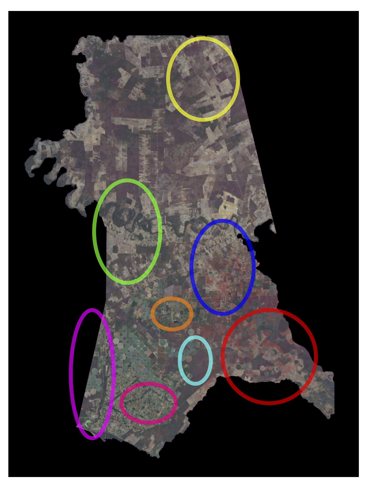
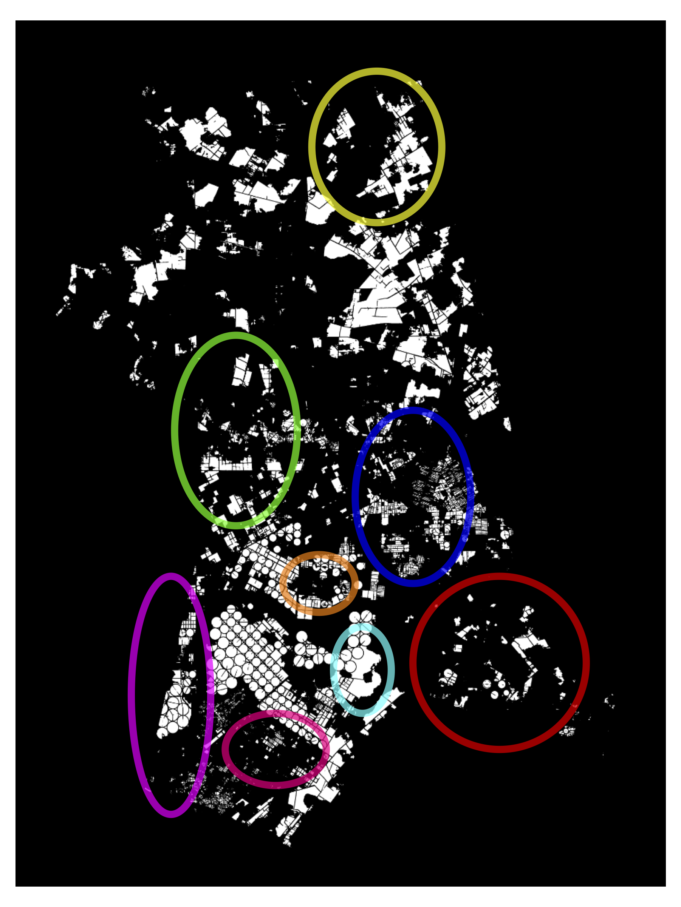
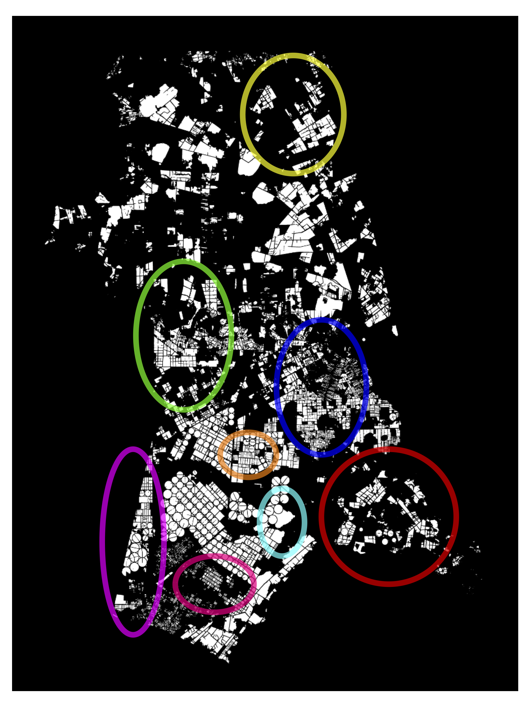
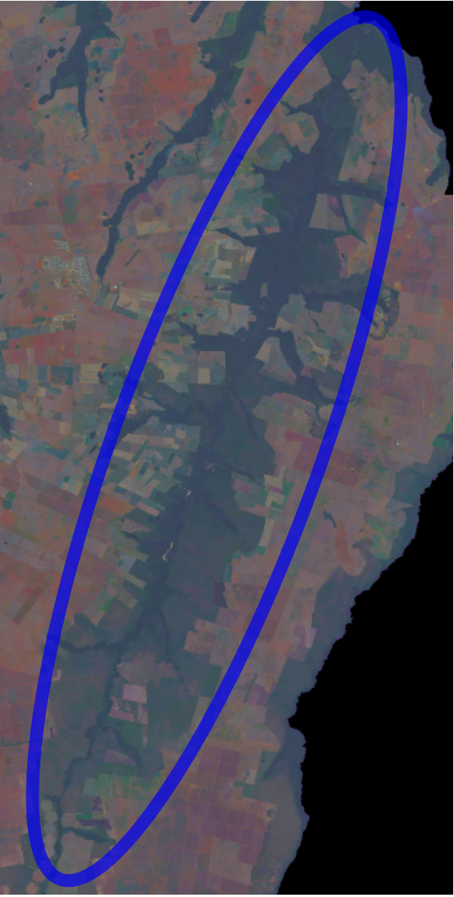
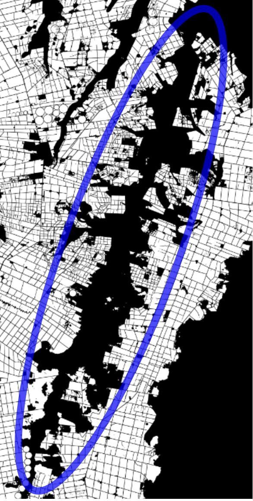
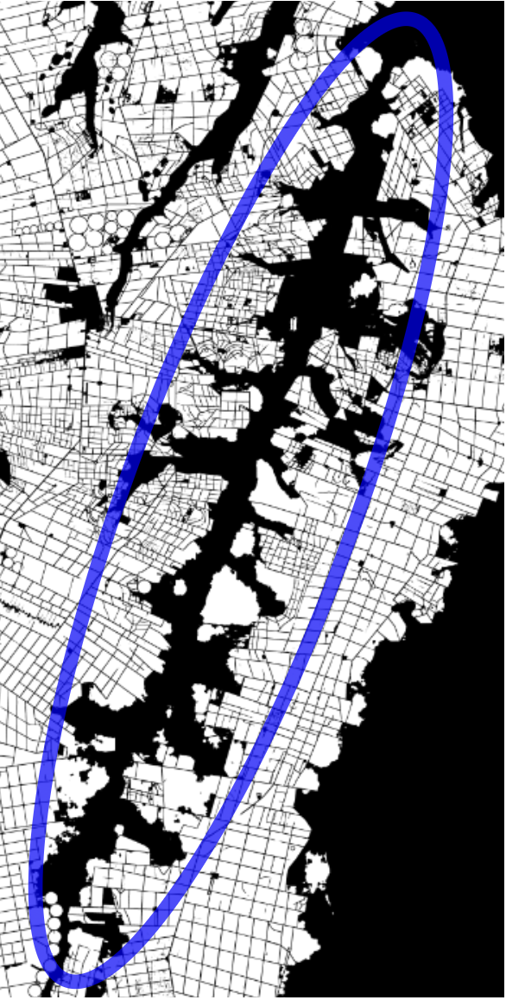
```

## Implications for National Agricultural Statistical Offices

The automated delineation of field boundaries using remote sensing and machine learning offers profound implications for national agricultural statistical offices (NSOs), enabling more precise data collection, enhanced monitoring capabilities, and better-informed policy decisions. This technological shift promises to revolutionize how agricultural statistics are compiled and utilized, moving from traditional, often labor-intensive, methods to dynamic, data-driven approaches.

### Crop Mapping and Land Use Classification

Automated field boundary delineation directly facilitates the creation of detailed thematic maps of agricultural regions. These maps are importanr for accurately identifying and differentiating various land uses and specific crop types across the national territory. By continuously updating these maps, official institutes can track granular changes in agricultural landscapes, monitor the expansion or contraction of cultivated areas, and assess the prevalence of different crops over time. This dynamic mapping capability provides a foundational layer for numerous agricultural statistics and planning activities, transforming static census data into a living, evolving record of agricultural activity. Key applications include:

* Agricultural Census Support: The highly accurate and frequently updated agricultural maps generated through this process can serve as a public reference for national agricultural mapping. They provide baseline data for upcoming agricultural censuses, enhancing their accuracy and efficiency. These maps can inform the census planning process by offering valuable, pre-survey insights into the density and distribution of agricultural properties. This spatial intelligence aids in the efficient allocation of human resources for fieldwork, directing surveyors to areas with high agricultural concentration by census sector, city, district, or enumeration areas. Furthermore, by identifying regions with concentrations of larger parcels versus those with smaller, more fragmented agricultural fields, these maps can serve as a powerful proxy for distinguishing areas dominated by large-scale commercial farming (latifundia) versus those characterized by family farming, providing critical socio-economic context for agricultural policies.
    
*   Land Use Change Detection: The inherent ability to monitor temporal changes in land use over recent years allows for significantly improved estimation and detection of shifts in cultivation practices, land conversion from natural areas to agriculture, and the overall dynamics of agricultural land use. This is vital for understanding environmental impacts, such as deforestation or land degradation directly linked to agricultural expansion. It also allows for tracking the adoption of new crops or changes in crop rotation patterns.

*  Policy Making and Resource Allocation: Accurate and frequently updated land use maps provide evidence-based data for policymakers. Such maps enable the development of targeted agricultural programs, better management of natural resources (e.g., water, soil), and the allocation of subsidies or support to farmers based on verified land use, agricultural activity, and environmental compliance.

Our results show that traditional supervised models struggle to generalize effectively to challenging areas with highly irregular parcels, complex interfaces with urban environments, or dense native vegetation. This is due to the inherent domain shift between their training data and new, unseen geographical contexts. Self-supervised learning strategies, as discussed in the methodology section, considerably improve the generalization capabilities of segmentation models. By enabling models to learn from vast amounts of unlabeled remote sensing imagery, these techniques allow for their application as a robust large-scale pretraining across broad portions of the national territory. This initial pretraining, followed by supervised fine-tuning on specifically annotated regions, offers a highly resilient and effective strategy for agricultural mapping in future agricultural censuses and ongoing national surveys.

## Crop Yield Estimation and Production Projection

While field boundary delineation is primarily a segmentation task focused on defining spatial units, it serves as a precursor for other kinds of analyses, including crop yield estimation and production projection. By precisely defining the boundaries of individual fields, agricultural institutes can unlock many downstream analytical capabilities:

* Area-Based Yield Calculation: With field area measurements derived from delineation, statistical and machine learning models can combine these area figures with other crucial data, such as real-time weather patterns, detailed soil types, historical yield records, and even satellite-derived vegetation indices. This approach allows estimating crop production with enhanced accuracy compared to traditional survey methods that rely on aggregated area data. This capability provides an input for national food security assessments, informing strategic food reserves, and for market analyses that guide import/export decisions.
    
* Production Projection: A robust understanding of the exact extent of planted areas at various points in the growing season allows for more reliable and timely projection of future harvests. This information is invaluable for national economic planning, enabling governments and agricultural industries to manage food supply chains more effectively, anticipate potential surpluses or shortages, and thus mitigate market fluctuations. Early and accurate projections can prevent price volatility and ensure stable food availability.
    
* Integration with Crop Type Information: A complete agricultural monitoring system needs to combine field boundary delineation with information on the crop types for each parcel during a given period. The literature highlights the effectiveness of using time series data and various spectral vegetation indices (e.g., Enhanced Vegetation Index (EVI), Normalized Difference Vegetation Index (NDVI)) combined with machine learning models, particularly those based on the attention mechanisms [@Yuan2022, @Srisailam2024, @Xu2024, @Silva2024a]. These models, trained on the temporal patterns derived from multispectral satellite data (e.g., Sentinel-2), can  classify the crop within each field. This integration transforms static boundary maps into dynamic tools for comprehensive agricultural monitoring, providing not just where fields are, but also what is being cultivated in them.

### Continuous Monitoring and Early Warning Systems

The automation of agricultural parcel recognition supports monitoring of agricultural activity at a temporal resolution unattainable through manual methods. This shift from periodic surveys to ongoing observation offers several advantages for national agricultural and geosciences institutes:

* Timely Detection of Changes: Continuous monitoring enables detection of subtle and significant changes in planting patterns, precise tracking of harvest progress, and early identification of agricultural anomalies. These anomalies could include emergence of crop diseases, onset of climate-induced stress (e.g., drought, excessive rainfall), or damage from pests. Early detection allows for rapid response and mitigation strategies, minimizing potential losses.
    
*  Support for Sample Surveys: Precisely delineated parcels, available in a digital and georeferenced format, can serve as a robust sampling frame for targeted agricultural surveys. Parcel boundaries improve the efficiency of surveys, ensuring consistency of data collection efforts and reducing the logistics of field sampling. Surveys can be more accurately stratified based on detected field characteristics.
    
* Early Warning for Food Security: By integrating parcel data with real-time crop type information and other relevant environmental variables (such as precipitation, temperature, and soil moisture data), NSO can develop early warning systems. These systems can predict potential food shortages or surpluses, allowing for proactive interventions in food policy, trade, and aid distribution. This capability moves national food security planning from reactive to anticipatory.

By transitioning to continuous, automated monitoring of parcels, NSOs can improve their data collection and information systems, thus being able to respond to challenges and opportunities in the agricultural sector.

### Addressing Limitations and Future Directions

Despite advancements in field boundary delineation, the current strategies, while effective, still possess limitations that require research and development to improve performance and achieve widespread applicability:

* Generalization Across Diverse Regions: The generalization capacity of the neural networks used is constrained by the representativeness of their source data [@xu2022eyes]. Models trained on data from one geographical region or agricultural system may perform sub-optimally when applied to another distinct region due to differences in environmental conditions, farming practices, soil types, or even satellite sensor characteristics. To mitigate this effect, it is important to add different regions to the self-supervised pretraining. The subsequent supervised fine-tuning stage should also incorporate data from a wide array of annotated regions. Including training data from a diversity of geographical regions improves the models making them robust to variations encountered nationwide.
    
* Detection of Small and Narrow Parcels: The spatial resolution of commonly used satellites like Sentinel-2, while adequate for large and medium-sized agricultural areas, has limitations in discerning narrow agricultural fields. This problem worsens in highly fragmented landscapes, typical of certain agricultural systems (e.e., family farming), or where residual natural vegetation or infrastructure overlap with small fields. To overcome this, NSO can use high-resolution data sources, such as Planet imagery (3-5 meters resolution) or other commercial satellite data. These higher-resolution inputs allow for more accurate delineation of smaller parcels. Specialized fine-tuning on subsets of data containing a higher proportion of small parcels could help models learn to recognize and segment these challenging features more effectively.
    
* Filtering False Positives and Negatives: The output of segmentation models may  contain spurious artifacts or false positive (FP) predictions (e.g., non-agricultural areas mistakenly identified as fields) and false negatives (FNs), where actual fields are missed. Morphological operations (e.g., opening, closing) can remove very small FPs, which are common byproducts of pixel-level semantic segmentation and are often noise. More sophisticated and context-aware filtering can be achieved by leveraging vegetation indices (e.g., EVI, EVI2, NDVI). By analyzing the temporal profile of these indices for detected parcels, one can identify and remove areas erroneously classified as positive if their vegetation patterns do not align with typical agricultural cycles. For false negatives, which are often more critical as they represent missed agricultural production, advanced data mining techniques like hard negative mining can be employed. These strategies incorporate hard examples (those the model performs poorly on) into the training process, thereby correcting collection biases [@Kalantidis2020, @Robinson2020].
    
* Enhancements in Classification: Using complementary sources such as Planet or Synthetic Aperture Radar (SAR) can further increase detection precision. Incorporating multiple sources in the training set improves the model's ability to identify subtle patterns in challenging areas. Augmented data sets can improve separation of small agricultural areas from similar-looking natural vegetation. Integrating advanced machine learning algorithms into the analysis pipeline, such as self-supervised learning methods, can further enhance segmentation accuracy and reduce errors. This approach, especially when combined with robust cross-validation and fine-tuning, allows for significant improvements in system precision at the cost of some additional processing time.

* Reduction of Noise and Errors: Applying spatial and temporal filters can reduce false positives and minimize classification errors. Spatial filters discard small, isolated segmented areas that are not consistent with agricultural patterns. Temporal filters validate land cover changes over time, reducing the probability of including transient events like shadows, cloud edges, or atmospheric interference. Adjustments in the processing pipeline also help to reduce errors. This includes improvements in calibration of input data, validation of intermediate results at various stages, and automation of critical steps to ensure consistency throughout the workflow. Identifying artifacts in image mosaics from providers can prevent unreliable predictions. These improvements should be implemented iteratively, ensuring that the process evolves in response to observed challenges and new insights.
    
*    Alternative Data Sources: For long-term resilience and adaptability, NSOs could consider integrating sources beyond Sentinel-2 and Planet data. These could include older, publicly available datasets like Landsat, which are useful for historical analyses and serves as complement in areas of lower complexity. Commercial high-resolution data, while costly, offers sub-meter spatial resolution; these data sets can be employed in situations that demand superior precision, such as detailed mapping of specific small farms (potentially even using drone imagery for hyper-local applications). The recently launched Sentinel-1C, part of the Copernicus program, or Sentinel-1 SAR (Synthetic Aperture Radar) elevation data, can also be valuable, especially in regions with persistent cloud cover or high structural complexity (e.g., areas with dense vegetation or complex topography) where optical data is limited. Diversifying data sources and processing tools ensures continuity and quality of analyses even in scenarios of unavailability or limitations of the primary data sources.

## Conclusions

The technologies and methodologies developed for field boundary delineation offer a robust foundation for various phases of agricultural research and operational activities within national statistical and geosciences institutes. This outlines a strategic pathway for their sustained application and evolution:

* Short-Term Use (Immediate Application): The models developed can be immediately applied for large-scale agricultural mapping in regions that feature clearly delineated and relatively uniform agricultural parcels. This rapid deployment can provide quick and valuable insights for current agricultural surveys.
    
*  Medium-Term Use (Pre-Census Planning and Refinement): The proposed models can serve as a base for pre-segmentation during the planning stages of upcoming agricultural censuses. They offer insights into the density and spatial distribution of agricultural properties, which  aid in the allocation of human resources for fieldwork. By incorporating additional annotated areas, the model's performance can be improved and refined into a production-ready version. Inclusion of geographically diverse labeled data should considerably enhance the model's generalization capabilities, especially for challenging regions with irregular agricultural parcels, bridging the gap between current performance and optimal nationwide coverage.
    
* Long-Term Vision (Continuous Monitoring and Automation): The advanced strategy developed can be refined and scaled through future improvements in machine learning algorithms. This continuous refinement enables the proposed field segmentation pipeline to be integrated into an automated process for agricultural monitoring. This long-term vision includes the potential to incorporate metadata from sample surveys on agricultural production directly into the automated system. Once precise parcel delineation is paired with accurate information on crop types (which can be derived from subsequent classification models), it becomes feasible to monitor the planting, growth, and harvest of major agricultural crops at an unprecedented temporal frequency. This can leverage both publicly available satellite data (e.g., Sentinel-2) and/or higher-resolution private imagery (e.g., from Planet satellite constellations), providing dynamic, near real-time insights into agricultural dynamics.

This holistic approach ensures that the developed methodologies and models evolve to meet the dynamic and increasingly complex needs of agricultural statistical production and national monitoring efforts, supporting sustainable agriculture and food security.

## About the authors{-}

Hugo Oliveira is a Computer Science professor at Universidade Federal de Viçosa (UFV). He holds a B.Sc. and M.Sc. degree from Universidade Federal da Paraíba (UFPB), and a Ph.D. from Universidade Federal de Minas Gerais (UFMG). His research areas include Machine/Deep Learning, Computer Vision, Few-Shot Learning, Meta-Learning, Self-Supervised Learning, Foundational Models for Computer Vision, Generative Models, and Open-Set Recognition. These computational methods are applied to imaging domains such as remote sensing, medical imaging, and natural images.

Ian Monteiro Nunes is a Data Scientist and Researcher with a technical background in Data Processing, a B.Sc. in Computer Engineering, an M.Sc., and a Ph.D. in Computer Science from PUC-Rio, specializing in semantic segmentation of remote sensing images. He serves as Leader in Data Intelligence and Innovation for Agricultural Statistics at IBGE, where he coordinates the methodological modernization of the Official Agricultural Statistics. He develops AI-based solutions for crop mapping, field operation optimization, and multimodal data analysis.

Octavio Costa de Oliveira is an Agricultural Engineer from the Federal Rural University of Rio de Janeiro (UFRRJ, 1988), with a master's degree (1994) and PhD (2000) in Agronomy, specialized in Soil Sciences (UFRRJ). Since 2002, has been a Technologist in Geographic and Statistics Information at the Brazilian Institute of Geography and Statistics (IBGE). Worked in the planning of the Agricultural Censuses (2006, 2017 and 2027). Head of the Livestock division at IBGE (2006-2015) and Coordinator of Agricultural Statistics (2016-2025).

Edemir Ferreira de Andrade Junior has PhD in Computer Science (UFMG, 2023), with a Master’s (2016) and a Bachelor’s in Computational Mathematics (2014). Experienced in visual pattern recognition, deep learning, and machine learning, he currently works as a data science consultant focused on statistical and geoscientific applications, while pursuing research in computer vision. With a solid background as a technical lead in computer vision R&D projects and publications in international conferences, he combines academic rigor with practical expertise to develop innovative AI solutions. His goal is to advance research and applied technologies in computer vision, bridging the gap between scientific knowledge and real-world impact.

## References{-}