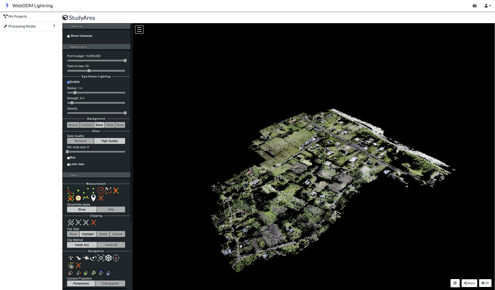

## Introduction

Accurate land area estimates form the foundation of reliable agricultural statistics, providing critical inputs for estimating crop production, calculating yield, and informing key agricultural policy decisions. Traditional ground surveys where these data are collected, however, face significant resource constraints, especially in the Pacific Islands, where environmental conditions, physical distances between islands, and natural barriers often make data collection cost-prohibitive.

In 2022, the Asian Development Bank (ADB), in collaboration with the Cook Islands Ministry of Agriculture (MOA), conducted a post-enumeration survey on the island of Rarotonga to validate agricultural area estimates using global positioning systems (GPS) reported in the 2021 Cook Islands Census of Agriculture. The study revealed that farmers generally underestimated their agricultural land areas by approximately 13% relative to objective GPS measurements, with larger plots (\>2,000 square meters) more likely underestimated and smaller plots slightly overestimated[@AsianDevelopmentBank2024]. This discrepancy highlights the significance of non-sampling errors, specifically measurement error, that can systematically bias national agricultural production estimates.

In a follow-up activity conducted in 2023, the ADB team, together with the MOA, employed unmanned aerial vehicles (UAVs) to capture high-resolution imagery and measure agricultural land areas, aiming to reduce the resource intensity of field surveys in environmentally challenging terrain. While initial resource requirements may be higher, high-resolution imagery captured by UAVs enables precise plot boundary delineation and accurate area measurements. UAVs proved particularly suitable for the Pacific context, where frequent cloud cover, fragmented land plots, and difficult terrain require flexible, localized, and detailed data collection methods.

Drawing on the 2023 Cook Islands UAV survey of a census enumeration area on Rarotonga, this chapter has two aims: (i) to provide a reproducible, end-to-end workflow in R — from loading orthophotos and vector boundaries, harmonizing coordinate reference systems (CRS), and visualizing imagery to computing plot-level zonal statistics — and (ii) to demonstrate, through a worked case study, how very high-resolution data (≈1.6-centimeter GSD) enables agricultural statistics that are difficult or impossible with 10–30 meter (m) satellite sensors. Using red, green and blue (RGB) and multispectral imagery, we quantify plot areas and derive vegetation indicators such as Normalized Difference Vegetation Index (NDVI) (mean, min–max, and within-plot coefficient of variation), revealing fine-scale patterns in crop vigor and heterogeneity that are obscured at coarser resolutions. We then contrast these plot-level metrics with Sentinel-2 and Landsat-8 views to illustrate mixed-pixel effects and the implications for area estimation, monitoring, and operational decision-making.

By the end of this chapter, you will be able to:

- Understand the UAV imagery workflow from flight planning to mapping output

- Load and visualize RGB (true-color) and NDVI UAV imagery in R

- Load and manage vector data in R

- Extract plot-level zonal statistics from UAV imagery

- Compare the spatial resolutions of UAV imagery versus publicly available satellite imagery

## Study Area

The study area comprises a single census enumeration area located on the northeastern coast of Rarotonga island in the Cook Islands encompassing 17.6 hectares. This area was selected to enable cross-validation with area estimates from the 2021 Agriculture Census and 2022 post-Agriculture Census enumeration survey. The terrain in the study area is characterized by flat topography extending from inland residential areas to the beach and ocean along the eastern boundary. Land use is mixed, including residential, sports facilities (i.e., rugby field), and fragmented agricultural plots scattered throughout the area.

## UAV Image Acquisition and Processing

UAV imagery of the study area was captured on 28 August 2023 at midday. Two flight missions were conducted: the first using an RGB (Red, Green and Blue) camera captured 347 aerial images (@fig-1), while the second, using a multispectral sensor captured 318 images. Flight missions were planned using DJI Flight Planner software, where operators specified resolution requirements by setting flight height (\~100 meters) and image overlap percentages (\~80 percent) to ensure adequate coverage.

```{r}
#| echo: FALSE
#| eval: TRUE
#| label: fig-1
#| out-width: 100%
#| fig-cap: Position of 347 RGB aerial images
#| fig-align: center
knitr::include_graphics("./images/uav_agriculture_cook_islands/flight-path.png")
```

The processing of these raw aerial images was conducted in [OpenDroneMap](https://opendronemap.org), a free and open-source photogrammetry software that stitches overlapping raw UAV images into a geometrically corrected single image known as an orthophoto. The software first applies a Structure-from-Motion (SfM) method (@Valorie2023), which identifies thousands of common feature points across the aerial images to reconstruct the camera's position for each photo and build an initial three-dimensional model of the terrain and its features (@fig-2).

```{r}
#| echo: FALSE
#| eval: TRUE
#| label: fig-2
#| out-width: 100%
#| fig-cap: 3D model of Study Area constructed from RGB aerial images
#| fig-align: center

```

Prior to the flights, operators surveyed the area to establish 23 Ground Control Points (GCPs), a centimeter-level precision point geographic coordinates distributed throughout the study area. The coordinates of these markers were measured using high-precision Global Navigation Satellite System receivers. During processing in OpenDroneMap, these GCPs are overlaid in the UAV imagery. The software then warps the 3D model to fit these known coordinates, correcting geometric distortions and ensuring the final orthophoto is accurately georeferenced. This step is critical for reliable area calculations, as it ensures the orthophoto is not biased by any distortions within the image.

The combination of the three-dimensional model and ground control points produces of an orthophoto, a geometrically corrected single image of the study area. This process is repeated for both RGB and multispectral imagery, resulting in two orthophotos of the same study area captured by two camera sensors.

In addition to orthophotos, OpenDroneMap was also used to calculate crop health indicators. The platform calculates 23 spectral indices from the multispectral orthophoto (@fig-3), as documented on the OpenDroneMap github repository [here](https://github.com/OpenDroneMap/WebODM/blob/master/app/api/fields.py). These indices include the NDVI, which assesses plant vigor and photosynthetic activity. Additional indices enable detection of water stress, estimation of biomass, and soil reflectance in fallow areas.

```{r}
#| echo: FALSE
#| eval: TRUE
#| label: fig-3
#| out-width: 100%
#| fig-cap: Crop Health Algorithms in OpenDroneMap
#| fig-align: center
#| fig-show: hold
# Read the images
base_image_dir <- fs::path("./images/uav_agriculture_cook_islands/spectralindices/")

img1 <- magick::image_read(base_image_dir / "Slide1.jpeg")
img2 <- magick::image_read(base_image_dir / "Slide2.jpeg")

# Combine images
image <- magick::image_append(c(img1, img2),  stack=TRUE)

# Save results
image_path <- base_image_dir / "slides-combined.png"
magick::image_write(image, image_path)

# Show merged image
knitr::include_graphics(image_path)
```

## Agricultural Plot Delineation

Using the RGB orthophoto as a basemap, a subject matter expert from the MOA manually digitized plot boundaries as polygon features in QGIS based on visual inspection of land use and plot boundaries of areas cultivated for crops. This digitization process produced 36 individual agricultural plot polygons.

## Study objectives

This chapter provides an analytical framework for working with UAV imagery in R to produce agricultural statistics. Specific objectives include importing and harmonizing raster layers (RGB and NDVI orthophotos) and vector boundaries (study area and plot polygons) to a common CRS, extracting agricultural statistics through zonal analysis of NDVI values for individual plots, calculating plot areas, and comparing spatial resolution across UAV, Sentinel-2, and Landsat-8 imagery to quantify the mixed-pixel effect and its implications for area estimation accuracy

## Data and Software Requirements

The analysis utilizes four primary datasets:

-   **RGB Orthophoto**: A true-color raster image stitched using OpenDroneMap from 347 images captured on 28 August 2023 with a DJI Matrice 210.

-   **NDVI Orthophoto**: A raster image with the NDVI (values from -1 to 1) stitched and calculated in OpenDroneMap from 318 multispectral sensor images captured on 28 August 2023.

-   **Study Area Boundary**: A vector shapefile representing the boundary of a census enumeration area in Rarotonga, Cook Islands. The boundary covers an area of \~ 17.6 hectares.

-   **Plot Boundaries**: 36 individual agricultural plot polygons digitized by a subject matter expert from the MOA using the RGB Orthophoto as a basemap.

To implement the examples in this chapter we use:

-   **R** (version 4.0+) and **RStudio**

-   **R packages**: `terra (1.8-70)`, `sf 1.0-21`, `ggplot2 4.0.0`, `tmap 4.2`, `dplyr 1.1.4`

-   **Data files**: RGB orthophoto, NDVI raster, boundary shapefiles (provided as an R project)

<!-- **Important**: Open the provided files as an R project in RStudio to ensure proper file paths and organization. -->
<!-- All exercises include complete code examples. Basic R familiarity is helpful but not required.  -->

## Results

### Environment Setup and Data Loading

To work with both raster and vector data in this chapter, we will use the **terra** package for raster analysis (UAV imagery) and **sf** for vector data (boundary and plot polygons). For data manipulation and visualization, we will use **dplyr**, **ggplot2**, and **tmap**.

```{r}
#| echo: FALSE
#| output: false
library(terra)    # Raster data analysis
library(sf)       # Vector data (shapefiles, polygons)
library(ggplot2)  # Data visualization
library(tmap)     # Thematic mapping and cartography
library(dplyr)    # Data manipulation
library(knitr)    # Table formatting
```

Next, we load the 2023 Cook Islands UAV survey data. The files for this exercise are provided in an R project file, which automatically sets the working directory to the project folder upon opening.

```{r}
#| echo: FALSE
#| output: FALSE
# Load the RGB orthophoto
rgb <- rast("data/uav_agriculture_cook_islands/uav-images/Map1_Orthomosaic_export_WedAug30060354143404.tif")

# Load the NDVI orthophoto
ndvi <- rast('data/uav_agriculture_cook_islands/uav-images/ndvi.tif')

# Load the study area boundary
study_area <- st_read("data/uav_agriculture_cook_islands/shapefiles/AOI_EA1102.shp")

# Load plot boundaries
plots <- st_read("data/uav_agriculture_cook_islands/shapefiles/PLOT_DRONE.shp")
```

Let's begin with the `rgb` UAV orthomosiac image

```{r}
print(rgb)
```

The `print(rgb)` output shows the RGB orthophoto contains 33,927 rows and 43,962 columns across 4 layers (red, green, blue, and alpha transparency). The resolution of 1.503361e-07 degrees per pixel corresponds to approximately 1.6 centimeters ground sample distance. The data uses the World Geodetic System (WGS) 84 geographic coordinate system (EPSG:4326) with coordinates in decimal degrees.

Now print the `ndvi` raster details. What differences do you observe compared to the `rgb` raster?

Next, examine the `plots` vector file.

```{r}
print(plots)
```

The `print(plots)` output shows the shapefile contains 36 individual agricultural plots, each stored as polygon geometry with one attribute field (`id` or plot ID). The bounding box indicates the geographic extent in decimal degrees, and the data uses the WGS 84 coordinate system consistent with the orthophoto.

Now examine the `study_area` shapefile using the same approach.

```{r}
print(study_area)
```

### Coordinate Reference System Harmonization

Before conducting any further analysis, all layers must use a compatible CRS. Mismatched coordinate systems may result in misaligned layers and incorrect area calculations.

First, verify that all layers use the same CRS:

```{r}
# Check coordinate reference systems
crs(rgb, describe=TRUE)$code      # rgb (raster)
crs(ndvi, describe=TRUE)$code     # ndvi (raster)
st_crs(study_area)$epsg           # study area (vector)
st_crs(plots)$epsg                # agriculture plots (vector)
```

Notice the NDVI raster uses WGS 84 / Universal Transverse Mercator (UTM) Zone 4S (EPSG:32704) with units in meters, while other layers use WGS 84 geographic coordinates (EPSG:4326) with units in degrees. It is recommended to first reproject all layers to UTM Zone 4S. This coordinate system is recommended for the Cook Islands because the islands fall within the geographic boundaries of this zone in the Universal Transverse Mercator coordinate system, and for the purposes of this analysis, distance measurements are provided in meters.

```{r}
#| eval: false
#| echo: true
# Define target projection
target_crs <- "EPSG:32704"

# Transform vector data to UTM Zone 4S
study_area <- st_transform(study_area, target_crs)
plots <- st_transform(plots, target_crs)

# Transform RGB and NDVI raster to UTM Zone 4S
rgb <- project(rgb, target_crs, method="bilinear")
ndvi <- project(ndvi, target_crs, method="bilinear")
```

```{r}
#| eval: true
#| echo: false
# Define target projection
target_crs <- "EPSG:32704"

rgb <- rast("data/uav_agriculture_cook_islands/uav-images/Map1_Orthomosaic_export_WedAug30060354143404-reprojected.tif")
ndvi <- rast("data/uav_agriculture_cook_islands/uav-images/ndvi-reprojected.tif")
```

After reprojection, the resolution of the RGB orthophoto is expressed in meters (approximately 0.016 m) and spatial extents use UTM coordinates in meters rather than degrees.

### Initial Visualization

To confirm spatial alignment of the RGB raster and vector files, we first create a map displaying all data layers. This visualization verifies that the orthophoto, plot boundaries, and study area boundary are properly aligned following reprojection to the common CRS:

```{r}
#| label: fig-ortho-rgb
#| out-width: 100%
#| fig-cap: |
#|   RGB Orthophoto showing the study area boundary (yellow) and individual agricultural plot boundaries (white).
#| fig-align: center
plotRGB(rgb) # Add RGB orthophoto

plot(st_geometry(plots), add = TRUE, border = "white", lwd = 1) # Add Plots
plot(st_geometry(study_area), add = TRUE, border = "yellow", lwd = 2) # Add Study Area

sbar(200, type = "line", xy = "bottom", divs = 8, below = "meters", col = "black")
north(type = 1) # Add scalebar and compass
```

### Area of Study and Plot boundaries

To quantify the extent of the study area and plot boundaries, we calculate their areas:

```{r}
# Calculate study area size
study_area_m2 <- st_area(study_area)
study_area_ha <- study_area_m2 / 10000  # Convert to hectares
```

Next, calculate the area for each of the 36 digitized plot boundaries in square meters, examine summary statistics across all plots, and visualize the distribution of plot sizes using a histogram:

```{r}
#| label: fig-hist-sizes
#| out-width: 100%
#| fig-cap: Distribution of plot sizes (square meters) in study area
#| fig-align: center
# Calculate area for each plot in square meters
plots$area_m2 <- as.numeric(st_area(plots))

# Summary statistics in square meters
summary(plots$area_m2)

# Figure: Visualize distribution of plot sizes
hist(plots$area_m2, 
     breaks = 15,
     main = "Distribution of Plot Sizes",
     xlab = "Area (square meters)",
     col  = "lightblue",
     border = "white")
```

### Visualization of NDVI values

We now turn to the NDVI raster of the study area. NDVI ranges from -1 to 1, where values below 0 typically indicate water or bare soil, values between 0.2 and 0.4 indicate sparse or stressed vegetation, values between 0.4 and 0.6 indicate moderate vegetation vigor, and values above 0.6 indicate dense, healthy vegetation. Monitoring NDVI enables identification of crop stress from water deficits, nutrient deficiencies, pests, or diseases. It distinguishes vegetated areas from bare soil, water, or built structures, and monitoring changes over time reveals agricultural cycles, drought impacts, deforestation, or vegetation regrowth patterns.

Higher NDVI values, however, do not necessarily indicate better crop health, as dense weeds, overgrown vegetation, or mature crops can also produce higher NDVI values. Interpreting NDVI requires careful consideration of local conditions and validation with ground observations. It is not a standalone measure of crop health and can be misleading without contextual information about land use, crop types, and agricultural practices.

Next, create a map using the NDVI raster as the basemap to visualize vegetation health patterns. The color gradient transitions from red (low vegetation/bare soil) to green (high vegetation vigor), with plot boundaries (white) and study area boundary (black) overlaid.

```{r}
#| label: fig-ortho-ndvi
#| out-width: 100%
#| fig-cap: NDVI Orthophoto Showing Plot Boundaries and Study Area
#| fig-align: center
# Create NDVI color scheme
ndvi_colors <- colorRampPalette(c(
  "#8B0000",  # Dark red (very low NDVI)
  "#FF0000",  # Bright red (low NDVI)
  "#FF6B00",  # Orange (low-medium NDVI)
  "#FFFF00",  # Yellow (medium NDVI)
  "#9ACD32",  # Yellow-green (medium-high NDVI)
  "#228B22",  # Forest green (high NDVI)
  "#006400"   # Dark green (very high NDVI)
))(100)

# Figure: NDVI Orthophoto Showing Plot Boundaries and Study Area
plot(ndvi, 
     col=ndvi_colors,
     main="NDVI Orthophoto Showing Plot Boundaries and Study Area")

plot(st_geometry(plots), add = TRUE, border = "white", lwd = 1)
plot(st_geometry(study_area), add = TRUE, border = "black", lwd = 2)

sbar(200, type = "line", xy = "bottom", divs = 8, below = "meters", col = "black")
north(type = 1)
```

### Calculating Plot-Level NDVI Statistics

With the NDVI map, we can calculate statistics based on NDVI pixel values within each plot using zonal statistics functions. Satellite and UAV sensors divide the landscape into a grid of pixels, each representing a specific area on the ground. Problems arise at boundaries between land uses where pixels straddling these edges capture information from both surfaces. Instead of recording pure crop reflectance, these boundary pixels record a blend of signals from the crop and the adjacent features such as roads. To minimize edge effects from mixed pixels at plot boundaries, a 0.5-meter negative buffer is applied to each plot polygon before extraction. Mixed pixels occur at boundary edges where a single pixel captures reflectance from multiple land cover types, such as roads and vegetation, or different crop types. The negative buffer shrinks each polygon inward by 0.5 meters, excluding these edge pixels from analysis and ensuring that extracted NDVI values represent only the interior of each agricultural plot:

```{r}
#| message: false
#| warning: false
# Apply negative buffer to reduce edge contamination
plots_buffered <- st_buffer(plots, dist = -0.5)
```

Next, calculate NDVI statistics for each plot, including mean, standard deviation, minimum, maximum, and coefficient of variation.

```{r}
#| eval: false
#| echo: true
# Extract mean NDVI for each buffered plot
plot_ndvi <- terra::extract(ndvi, plots_buffered, fun=mean, na.rm=TRUE)
plots$ndvi_mean <- plot_ndvi[,2]

# Calculate additional summmary statistics (min, max, sd) for each buffered plot
plot_ndvi_sd <- terra::extract(ndvi, plots_buffered, fun=sd, na.rm=TRUE)
plot_ndvi_min <- terra::extract(ndvi, plots_buffered, fun=min, na.rm=TRUE)
plot_ndvi_max <- terra::extract(ndvi, plots_buffered, fun=max, na.rm=TRUE)

plots$ndvi_sd <- plot_ndvi_sd[,2]
plots$ndvi_min <- plot_ndvi_min[,2]
plots$ndvi_max <- plot_ndvi_max[,2]

# Calculate coefficient of variation (CV)
plots$ndvi_cv <- (plots$ndvi_sd / plots$ndvi_mean) * 100
```

```{r}
#| eval: true
#| echo: false
plots <- readRDS("data/uav_agriculture_cook_islands/stats/plots-ndvi-statistics.rds")
```

Now that summary statistics have been calculated for each plot, we will visualize the mean NDVI values across plots in the study area. Plots with consistently low NDVI (red-orange) may indicate recently harvested areas, fallow land, or crop stress, while high NDVI plots (green) indicate dense vegetation. Examine the map to identify which plots exhibit the lowest and highest NDVI values.

```{r}
#| label: fig-ndvi-mean
#| out-width: 100%
#| fig-cap: Mean NDVI by Plot
#| fig-align: center
tm_shape(plots) +
  tm_fill(fill = "ndvi_mean", 
          fill.scale = tm_scale(values = "brewer.rd_yl_gn"), 
          fill.legend = tm_legend(title = "Mean NDVI")) +
  tm_text(text = "id", size = 0.5) +
  tm_scalebar(position = c("center", "bottom")) +
  tm_compass(position = c("right", "top")) +
  tm_title("Mean NDVI by Plot")
```

Next, visualize the CV for each plot. The CV map highlights plots with high internal NDVI variability (yellow-green) versus uniform plots (red-orange). High variability may indicate mixed cropping systems, uneven crop growth, patchy vegetation coverage, varying soil conditions within a plot, or potential issues with plot boundary delineation, while low CV suggests more uniform vegetation across the plot.

```{r}
#| label: fig-cov-plot
#| out-width: 100%
#| fig-cap: Coefficient of Variation by Plot
#| fig-align: center
tm_shape(plots) +
  tm_fill(fill = "ndvi_cv", 
          fill.scale = tm_scale(values = "brewer.rd_yl_gn"), 
          fill.legend = tm_legend(title = "CV (%)")) +
  tm_text(text = "id", size = 0.5) +
  tm_scalebar(position = c("center", "bottom")) +
  tm_compass(position = c("right", "top")) +
  tm_title("Coefficient of Variation by Plot")
```

### Resolution Comparison: UAV vs. Satellite Imagery

An advantage of UAV imagery for agricultural statistics is its spatial resolution compared to publicly available satellite sources. This section demonstrates these differences by comparing the same study area captured at three resolutions: UAV imagery at 1.6 centimeters (cm), Sentinel-2 satellite imagery at 10 m, and Landsat-8 satellite imagery at 30 m resolution. Understanding these resolution differences is necessary for selecting appropriate imagery sources for agricultural monitoring tasks, particularly in landscapes with small, fragmented plots.

However, higher resolution is not always better and involves important tradeoffs. UAV and high-resolution commercial satellite imagery require greater financial investment, larger storage capacity, and more computational resources for processing. The appropriate tool depends on the analytical objective and spatial scale.

Satellite imagery is well-suited for large-scale regional or national agricultural monitoring where broad area coverage and frequent temporal revisits are priorities. UAVs are more appropriate for targeted interventions requiring detailed plot-level analysis, validation of satellite-based estimates, or monitoring of small, fragmented agricultural landscapes where coarser resolution would produce unacceptable mixed-pixel effects.

Let's begin by loading the satellite imagery from Sentinel-2 (10 meters), and Landsat-8 (30 meters) into R.

```{r}
# Load satellite imagery
sen2 <- rast("data/uav_agriculture_cook_islands/satellite-images/sentinel2_10m_Oct.tif")
landsat8 <- rast("data/uav_agriculture_cook_islands/satellite-images/landsat8_30m_Oct.tif")

# Reproject to common CRS using bilinear interpolation
sen2 <- project(sen2, target_crs, method = "bilinear")
landsat8 <- project(landsat8, target_crs, method = "bilinear")
```

#### Sentinel-2 (10 m resolution) {-}

Sentinel-2 provides 10-meter resolution, which is suitable for larger agricultural fields but struggles with small, fragmented plots. While broad agricultural patterns are visible, plot-level detail is limited. At this resolution, each pixel covers 100 square meters, which exceeds the size of many individual plots in the study area, making accurate boundary delineation and individual plot identification difficult.

```{r}
#| label: fig-s2-tc
#| out-width: 100%
#| fig-cap: Sentinel-2 True Color Image (10 meters)
#| fig-align: center
plotRGB(sen2, r = 1, g = 2, b = 3, stretch = "lin", main = "Sentinel-2 True Color Image")

plot(st_geometry(plots), add = TRUE, border = "white", lwd = 1)
plot(st_geometry(study_area), add = TRUE, border = "yellow", lwd = 2)

sbar(200, type = "line", xy = "bottom", divs = 8, below = "meters", col = "yellow")
north(type=1)
```

#### Landsat-8 (30 m resolution)  {-}

Finally, compare the same area against Landsat-8's 30-meter resolution (900 square meters per pixel). At this scale, individual plotdelineation is impractical, though the imagery remains useful for identifying broad agricultural zones and land-use patterns across larger regions.

```{r}
#| label: fig-l8-tc
#| out-width: 100%
#| fig-cap: Landsat-8 True Color Image (30 meters)
#| fig-align: center
plotRGB(landsat8, r = 1, g = 2, b = 3, stretch = "lin", main = "Landsat-8 True Color Image")

plot(st_geometry(plots), add = TRUE, border = "white", lwd = 1)
plot(st_geometry(study_area), add = TRUE, border = "yellow", lwd = 2)

sbar(200, type = "line", xy = "bottom", divs = 8, below = "meters", col = "yellow")
north(type = 1)
```

### Quantifying Resolution Differences

To objectively demonstrate the resolution differences between sensors, we will count the number of pixels that fall within each agricultural plot for each imagery source.

```{r}
#| eval: false
#| echo: true
# Count pixels per plot for each sensor
pixel_counts_rgb <- terra::extract(rgb[[1]], plots, na.rm=TRUE)
plots$pixel_count_rgb <- as.numeric(table(pixel_counts_rgb$ID))

pixel_counts_sen2 <- terra::extract(sen2[[1]], plots, na.rm=TRUE)
plots$pixel_count_sen2 <- as.numeric(table(pixel_counts_sen2$ID))

pixel_counts_landsat <- terra::extract(landsat8[[1]], plots, na.rm=TRUE)
plots$pixel_count_landsat <- as.numeric(table(pixel_counts_landsat$ID))

# Calculate resolution in appropriate units
UAV_res_m <- res(rgb)[1]
UAV_res_cm <- UAV_res_m * 100

# Create comparison data frame
comparison <- data.frame(
  Sensor = c("UAV RGB", "Sentinel-2", "Landsat-8"),
  Resolution = c(
    paste(round(UAV_res_cm, 2), "cm"),
    "10 m",
    "30 m"
  ),
  Min_Pixels = c(
    min(plots$pixel_count_rgb, na.rm=TRUE),
    min(plots$pixel_count_sen2, na.rm=TRUE),
    min(plots$pixel_count_landsat, na.rm=TRUE)
  ),
  Mean_Pixels_per_Plot = c(
    mean(plots$pixel_count_rgb, na.rm=TRUE),
    mean(plots$pixel_count_sen2, na.rm=TRUE),
    mean(plots$pixel_count_landsat, na.rm=TRUE)
  ),
  Max_Pixels = c(
    max(plots$pixel_count_rgb, na.rm=TRUE),
    max(plots$pixel_count_sen2, na.rm=TRUE),
    max(plots$pixel_count_landsat, na.rm=TRUE)
  )
)

comparison
```

```{r}
#| label: tbl-sensors-pixels
#| tbl-cap: "Comparison of Pixel Counts per Plot Across Different Sensors"
#| echo: false
#| eval: true
comparison <- readRDS("data/uav_agriculture_cook_islands/stats/comparison-pixels.rds")

knitr::kable(comparison,
      format = "html", 
      digits = 1,      
      col.names = c("Sensor", "Resolution", "Min Pixels", "Mean Pixels", "Max Pixels")) |>
        kableExtra::kable_styling(full_width = FALSE, bootstrap_options = c("striped", "hover"))
```

This table illustrates differences in pixel density between sensors. UAV imagery provides thousands of pixels per plot, enabling detailed analysis and supporting advanced machine learning applications, such as convolutional neural networks for object detection. Sentinel-2 provides tens to hundreds of pixels per plot, while Landsat-8 provides only a few pixels per plot.

### Mixed Pixel Problem

A major source of error in satellite-based area measurement is the mixed pixel problem, which occurs when a single pixel covers multiple land cover types. For example, a 30-meter Landsat pixel at a field edge might contain crop, bare soil, and pathway within the same pixel. This creates significant challenges for area estimation, particularly in Pacific Island contexts where agricultural landscapes are dominated by small, irregularly shaped plots. Classifying a mixed pixel as crop overestimates crop area, while classifying it as non-crop underestimates it. These classification errors introduce systematic uncertainty and bias into agricultural area statistics.

Selecting appropriate imagery depends on the scale, budget, and objectives of the agricultural monitoring task. The table below compares key characteristics of satellite and UAV imagery to help determine suitability for different agricultural statistics applications. Satellite imagery excels in large-scale regional monitoring with frequent temporal coverage, while UAV imagery is optimal for targeted plot-level analysis where boundary precision is critical.

```{r}
#| label: tbl-sensor-characteristics
#| tbl-cap: "Sensor characteristics and applications"
#| echo: false
#| eval: true
data <- data.frame(
  Characteristic = c(
    "Spatial resolution","Spectral resolution","Temporal resolution",
    "Coverage area","Geometric accuracy","Radiometric quality",
    "Cloud cover","Cost","Data volume","Processing complexity",
    "Use cases","Advantages","Limitations"
  ),
  `Satellite Imagery` = c(
    "Commercial: ~30 cm<br/>Public: 10 m (Sentinel-2) to 1 km (MODIS)",
    "Multispectral, SAR (radar)<br/>Sentinel-2: 13 bands (visible to SWIR)<br/>Landsat-8: 11 bands",
    "Sentinel-2: 5 days<br/>Landsat: 16 days<br/>MODIS: daily",
    "Large area coverage<br/>(e.g., Sentinel-2: 290 km swath)",
    "Sentinel-2: ~10-20 m absolute<br/>Landsat-8: ~12-30 m absolute<br/>Commercial: ~3-5 m",
    "High (well-calibrated, multi-date consistent)<br/>Surface reflectance products available",
    "Major limitation in tropical regions<br/>May wait weeks for cloud-free scenes",
    "Public sources: free<br/>Commercial: $10-30/km²",
    "Moderate per unit area<br/>Sentinel-2 scene: ~1 GB",
    "Low to moderate<br/>Pre-processed products available",
    "National/regional crop mapping<br/>Temporal monitoring<br/>Broad land use classification<br/>Change detection",
    "Broad coverage<br/>Regular monitoring<br/>Historical archives (40+ years)<br/>Consistent calibration",
    "Coarse resolution for small plots<br/>Cloud interference<br/>Fixed revisit schedules<br/>Coarse for sub-field patterns"
  ),
  `UAV Imagery` = c(
    "1-5 cm (dependent on flight altitude and sensor)",
    "RGB (standard); multispectral (5-10 bands), thermal, LiDAR possible with specialized sensors",
    "User-controlled (on-demand)<br/>Practical frequency: 2-4 flights/season due to cost/logistics",
    "Limited: 5-50 hectares per flight<br/>Battery-constrained: 15-25 min per flight",
    "With GCPs: ±5-10 cm<br/>With RTK: ±2-5 cm<br/>Without GCPs: ±2-5 m",
    "Variable (requires calibration panel)<br/>Sensitive to illumination conditions",
    "Flies below clouds (300-400 m typical cloud base)<br/>Sensitive to wind/rain",
    "Initial investment: $2,000-$40,000<br/>Operational: ~$500-2,000 per survey day",
    "Very large: RGB 3 GB, multispectral 1.7 GB raw per survey<br/>Orthophotos: 2-3 GB total",
    "Moderate to high: requires photogrammetry expertise<br/>3-8 hours on consumer laptop",
    "Plot delineation<br/>Ground truthing<br/>High-detail crop assessment<br/>Infrastructure mapping",
    "Very high detail<br/>Flexible timing<br/>Below-cloud operations<br/>Multi-sensor integration possible",
    "Limited coverage<br/>Weather sensitive<br/>Regulatory constraints<br/>Processing intensive<br/>Requires field operations"
  ),
  check.names = FALSE
)

knitr::kable(
    data,
    format = "html",
    escape = FALSE
) |>
  kableExtra::kable_styling(full_width = FALSE, bootstrap_options = c("striped", "hover"))
```

## Discussion

While UAV imagery offers substantial advantages for agricultural monitoring in fragmented landscapes, successful integration into operational statistical systems requires careful consideration of practical constraints and strategic implementation approaches. This section examines operational challenges associated with UAV deployment and proposes strategies for effective integration into agricultural statistics workflows.

### **Operational Challenges using UAV for agricultural statistics**

**Limited scalability**: Consumer-grade rotary UAVs are constrained by battery capacity and line-of-sight regulations requiring visual contact with the UAV. Multiple batteries and extended field time are needed for larger areas, increasing logistical burden and operational costs.

**High costs**: Beyond UAV hardware, agencies must budget for accessories (batteries, sensors, ground control equipment), software licenses, operator training, insurance, and maintenance.

**Regulatory barriers**: Operations are subject to national aviation and privacy laws, which vary significantly. Common requirements include operator licenses, altitude limits, visual line-of-sight rules, and restrictions near sensitive locations.

**Privacy concerns**: Community engagement and transparent communication about flight paths and coverage areas are essential, even where operations are legally permitted.

**Technical capacity gaps**: Operating UAVs and processing imagery requires skilled personnel—licensed operators for flight operations and trained analysts for data processing and interpretation.

### **Strategies for Effective Integration of UAV imagery into agricultural statistics**

**Build local analytical capacity**: Start with small-scale applications using free, open-source software. Leverage publicly available satellite imagery first to understand its capabilities and limitations before investing in UAV technology.

**Match UAV use to operational scale**: UAVs are best suited for applications requiring high spatial detail over small areas, validation exercises, or monitoring specific zones. Full coverage mapping across large dispersed areas may be impractical due to flight time, battery limits, and processing demands.

**Use sample-based validation**: Focus on statistically selected units rather than complete coverage. UAV-based measurements can validate farmer-reported data to assess bias, verify crop types, or identify stressed vegetation indicating lower yields.

**Follow local regulations**: Understand national UAV regulations and establish clear operating protocols. Coordinate with civil aviation authorities, develop field safety procedures, and implement community engagement protocols.

**Document methodologies**: As UAV technologies and analytical techniques evolve, documenting use cases supports broader adoption, encourages innovation, and improves data quality.


## Conclusion

This study highlights the potential of UAV imagery for modernizing agricultural statistics. A primary barrier to widespread adoption by national statistics offices has been the lack of documented, end-to-end use cases on the use of the technology. By providing a reproducible workflow in R using a case study from Rarotonga, Cook Islands, this work addresses that gap. Practical demonstrations are essential for establishing standards and methodologies required to integrate UAV-derived data into official agricultural statistics production. More specifically, the findings demonstrate that UAV technology provides a solution to persistent challenges of accurate area estimation in landscapes with small, fragmented agricultural plots, where traditional ground surveys are resource-intensive and satellite imagery too coarse for reliable plot-level measurement.

The key findings underscore the potential of this approach. First, the centimeter-level resolution (\~1.6 cm) of the UAV imagery effectively reduces the mixed-pixel problem compared to coarser satellite sensors like Sentinel-2 (10 m) and Landsat-8 (30 m). By capturing thousands of data points within even the smallest plots, UAVs enable precise boundary delineation and reduce the measurement error that can bias national production estimates. Second, our analysis demonstrated the extraction of detailed, plot-level vegetation metrics, including mean NDVI and its coefficient of variation, which reveal fine-scale patterns of crop health and heterogeneity that are invisible at satellite resolutions. These metrics provide agricultural stakeholders with actionable insights for monitoring and management that were previously unattainable.

By presenting this workflow using free and open-source tools like R and OpenDroneMap, we demonstrate a reproducible and cost-effective framework for use of UAV imagery for the production of agricultural statistics, and ultimately more reliable agricultural data for evidence-based policy, improved food security, and sustainable resource management in the Pacific and beyond.
