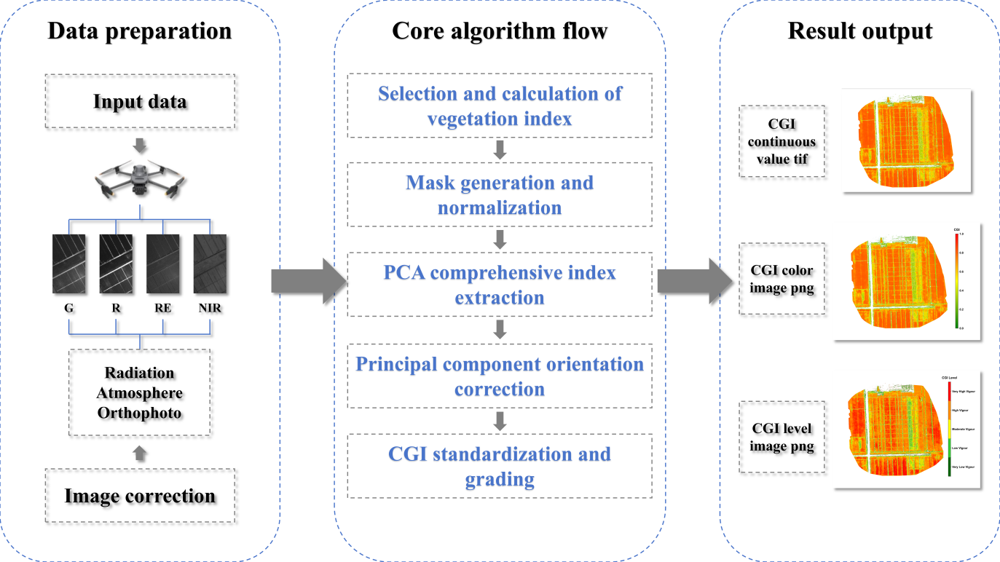
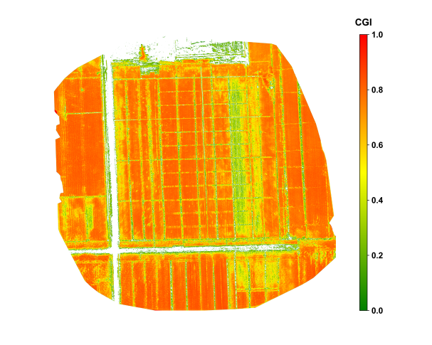
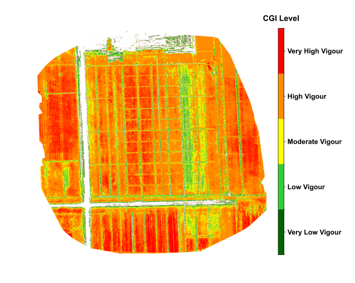
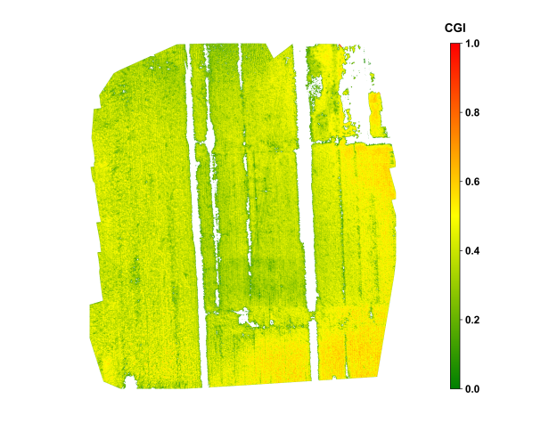
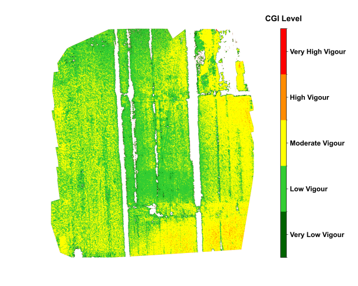
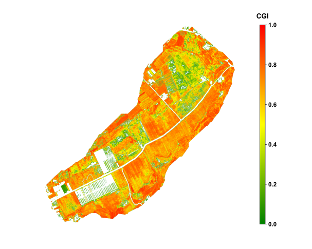
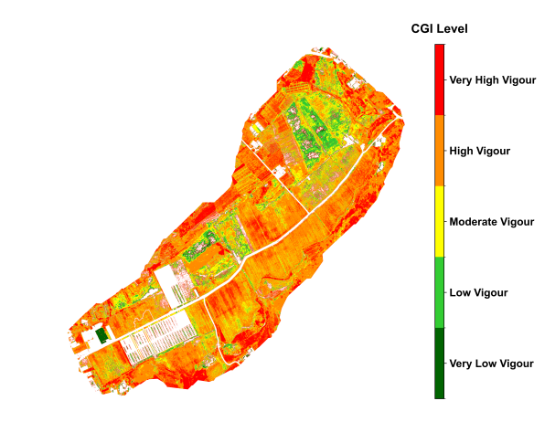

## Introduction

Crop growth monitoring is a fundamental component of modern precision
agriculture and plays a crucial role in ensuring food security and
optimizing agricultural production. Unmanned aerial vehicle (UAV)
imaging has become a key technology for efficient and non-destructive
monitoring of crop growth [@Colomina2014]. This section
introduces a method for automatically monitoring crop growth using
UAV-based multispectral imagery, named Crop Growth Index (CGI). The CGI
integrates multispectral vegetation indices through normalization and
principal component analysis (PCA), enabling effective fusion of
multi-band information to improve the accuracy and stability of growth
monitoring [@Hirosawa1996]. The method emphasizes automated data
processing and intuitive visual expression of results, supporting rapid
generation of continuous CGI values and growth grade maps, which are
valuable for field-level decision-making.

## Experimental Area and Data

To evaluate the method's applicability and robustness, three different
crop types across various regions in China were selected for algorithm
testing. These cases cover diverse growth stages of crops and offer
broad representativeness. The details of each case are as follows:

1. Xinji City, Hebei Province, China --- Winter wheat; data acquired
on May 12, 2024, during the grain-filling stage. The area belongs to a
warm temperate semi-humid climate with intensive farmland cultivation,
suitable for wheat growth.

2. Xinxiang City, Henan Province, China --- Maize; data acquired on
August 25, 2024, during the grain-filling stage. The area is
characterized by flat terrain, high agricultural mechanization and
large-scale maize cultivation.

3. Shiping County, Yunnan Province, China --- Tobacco crop; data
acquired on July 25, 2024, during the vigorous growth stage. Located in
a subtropical plateau monsoon climate zone, the area is known for
high-quality tobacco and complex growing conditions.


All experimental data were acquired using a DJI Mavic 3 Multispectral
UAV equipped with a four-band camera (Green, Red, Red Edge, Near
Infrared) [@Deng2018]. To ensure data quality, flights followed
pre-planned routes at altitudes of 80--120 m, with both forward and side
overlaps set to 75%--80%, guaranteeing complete field coverage and
high-quality image mosaicking. Data collection was conducted under
clear, cloudless with uniform illumination to minimize interference from
shadows and clouds [@Cao2019]. After each flight, raw images and
POS data were immediately exported, and a metadata record sheet was
established, including the acquisition date, crop type, growth stage,
meteorological conditions, and flight parameters.

The raw images were processed using DJI Terra software, including
radiometric correction (to ensure spectral consistency among images),
atmospheric correction (to eliminate illumination and aerosol
interference), and orthorectification (to ensure geometric accuracy).
The outputs were four-band orthophotos (in GeoTIFF format) with a
spatial resolution of approximately 5--10 cm. For subsequent automated
processing, the band order was standardized as Green (G), Red (R), Red
Edge (RE), Near Infrared (NIR), and all images were projected to the
WGS84/UTM Zone coordinate system corresponding to the experimental
region. All pre-processed images were stored in folders named
"Region_Crop_Date," ensuring traceability and batch management of data
across different regions and time periods.

##  Methods

The CGI algorithm uses UAV multispectral imagery as input and enables
quantitative monitoring of crop growth through a series of automated
processing steps. The technical workflow includes: (1) selection and
calculation of vegetation indices; (2) masks generation and indices
normalization; (3) extraction of composite indicators based on principal
component analysis (PCA); (4) adjustment of principal 
component directions to ensure positive
correlation with growth status; (5) mapping of continuous CGI values to
the 0--1 range and classification; and (6) output of standardized result
products. The following sections elaborate these six steps in detail.

```{r}
#| echo: FALSE
#| label: fig-1-uav-crops
#| out-width: 90%
#| fig-cap: |
#|  Technical flowchart of the methods used in the work. 
#| fig-align: center

```

The input consists of multispectral orthophotos that have undergone
radiometric, atmospheric, and geometric correction, supporting either
four-band (G, R, RE, NIR) or five-band (B, G, R, RE, NIR) structures.
The code first determines the number of bands and unpacks them according
to the prescribed order. On a per-pixel basis, five vegetation indices
are then calculated: Green Normalized Difference Vegetation Index
(GNDVI), Leaf Chlorophyll Index (LCI), Normalized Difference Red Edge
Index (NDRE), Normalized Difference Vegetation Index (NDVI), and
Optimized Soil-Adjusted Vegetation Index (OSAVI).

These indices have been extensively validated in previous studies as
being highly sensitive to critical physiological parameters such as
chlorophyll content, photosynthetic capacity, and nitrogen status (Huete
et al., 2002), making them effective indicators of crop growth and thus
serving as the core inputs to CGI. To prevent division-by-zero errors, a
small constant (ε = 1e − 10) is added to all denominators; for example,
OSAVI is implemented as 1.16 × (NIR − R) / (NIR + R + 0.16 + ε).

Once calculated, the five indices are stacked into an array of shape (5,
H, W) for subsequent masking and normalization. If index values fall
outside the reasonable range (approximately −1 to 1), users should first
verify whether the band order is consistent with the prescribed
sequence, followed by checking the upstream correction procedures.

|     Vegetation Index                                            |     Calculation Formula                            |     Indicative Significance for   Crop Growth                                                                                  |
|-----------------------------------------------------------------|----------------------------------------------------|--------------------------------------------------------------------------------------------------------------------------------|
|     NDVI     (Normalized Difference     Vegetation Index)       |     (NIR − Red) /     (NIR + Red)                  |     Reflects chlorophyll   content and vegetation vigor; higher values indicate healthier crops [@Tucker1979].       |
|     GNDVI     (Green NDVI)                                      |     (NIR − Green) /     (NIR + Green)              |     More sensitive to   chlorophyll concentration, useful for assessing nitrogen status [@Gitelson1996].             |
|     NDRE     (Normalized Difference     Red Edge)               |     (NIR − RedEdge) /     (NIR + RedEdge)          |     Effective for monitoring   canopy structure and stress, especially in mid-to-late growth stages [@Eitel2011].    |
|     LCI     (Leaf Chlorophyll     Index)                        |     (RedEdge − Red) /     (RedEdge + Red)          |     Directly correlates with   leaf chlorophyll levels, indicating photosynthetic activity [@Clevers2013].           |
|     OSAVI     (Optimized Soil-Adjusted     Vegetation Index)    |     1.16 × (NIR − Red) /     (NIR + Red + 0.16)    |     Reduces soil background   influence, suitable for sparse vegetation or early growth stages [@Rondeaux1996].      |
: Vegetation indices and their significance {#tbl-1-uav-crop}

A binary mask (valid_mask) is generated using NDVI > 0.3 as the
threshold to exclude non-vegetation areas such as bare soil, shadows,
and water [@Ahmed2023]. The threshold can be slightly adjusted
depending on crop type and growth stage but must remain consistent
within a single batch to ensure comparability. The five vegetation
indices are then reshaped into a two-dimensional matrix of size (N
pixels, 5 indices). Normalization is applied only to pixels within the
mask: each column (i.e., each index) is scaled to a 0--1 range using
MinMaxScaler, based on the minimum and maximum values of valid pixels.
This "mask first, normalize later" order is consistent with the code
logic and prevents non-vegetation pixels from skewing the scale. The
normalized results are not written to disk but passed directly to the
PCA step.

The normalized matrix (N × 5) is input into PCA with n_components = 1 to
extract the first principal component (PC1). The code applies PCA
directly to the valid-pixel matrix and produces a single column
*cgi_valid* (length N). At the same time, the explained variance ratio of
PC1 is recorded to quantify its contribution to the overall variation,
with the terminal printing "Explained variance of PC1" as a quality
control check. Since all indices have been standardized (0--1) prior to
PCA, PC1 captures the integrated pattern of relative variation among
indices, reducing the risk of bias from any single index. At this stage,
outputs remain in memory.

Because PCA component signs are not fixed, alignment with biological
meaning is required. The code uses the normalized NDVI values
as reference and calculates the Pearson correlation
coefficient (PCC). If PCC < 0, the sign of
*cgi_valid* is reversed to ensure that CGI is positively correlated with
NDVI (and thus crop vigor). After direction correction, the
one-dimensional array is mapped back into the full two-dimensional grid,
with invalid pixels filled as NoData = −9999 and valid pixels retaining
*cgi_valid* values. For visualization, *cgi_valid* is further normalized to
[0,1] based on valid pixels, generating *cgi_valid_norm*, which is
written back into the CGI raster for display.

## Results

@fig-2-uav-crops shows the results for wheat in Xinji, Hebei, during the
grain-filling stage in early May. The four-band imagery acquired 
by the DJI Mavic 3 Multispectral UAV was
processed and used for vegetation index computation. The resulting CGI
effectively identified high-growth areas within the wheat canopy.
Regions with better crop performance were mainly located in the central,
western, and southern parts of the fields, where CGI values approached
0.8, indicating vigorous plant growth with high chlorophyll content and
adequate nitrogen supply. In contrast, relatively low CGI values
appeared in the eastern-central part of the field under low water and
nitrogen treatments, reflecting localized growth limitations. The
spatial distribution of CGI closely matched field-sampled data on
chlorophyll content and leaf area index, confirming the reliability of
the proposed method.

```{r}
#| echo: FALSE
#| layout-ncol: 2
#| label: fig-2-uav-crops
#| fig-cap: |
#|  Spatial distribution of wheat growth in Xinji, Hebei, during the grain-filling stage in early May. 
#| fig-subcap: 
#|    - "CGI values"
#|    - "vigour based on CGI"
#| fig-align: center


```

@fig-3-uav-crops shows the spatial distribution of maize in Xinxiang, Henan, during the grain-filling stage in late August. During the critical grain-filling and maturation stage of the maize
crop, the CGI imagery revealed notable intra-field variability in growth
conditions. High CGI values, approaching 0.6, were concentrated in the
southeastern portion of the field, indicating well-developed plants with
strong photosynthetic activity. In contrast, the south-central area
exhibited lower CGI values around 0.3, which is attributed to soil
compaction and localized water stress. The CGI imagery was further
divided the growth status into five levels, visually illustrating the
spatial distribution of growth conditions and providing a practical
reference for implementing differentiated fertilization and irrigation
strategies.

```{r}
#| echo: FALSE
#| layout-ncol: 2
#| label: fig-3-uav-crops
#| fig-cap: |
#|  Spatial distribution of maize in Xinxiang, Henan, during the grain-filling stage in late August. 
#| fig-subcap:
#|    - "CGI values"
#|    - "vigour based on CGI"
#| fig-align: center


```

@fig-4-uav-crops shows the spatial distribution of tobacco in Shiping, Yunnan, during vigorous growth stage, in late July. During the vigorous growth stage of the tobacco crop, the CGI imagery
displayed relatively uniform growth across the field, with most areas
classified as having relatively good growth, indicating overall crop
health. Localized zones with lower CGI values were mainly observed near
certain drainage channels, likely influenced by uneven soil moisture and
potential pest or disease stress. The classified CGI map distinctly
delineated five levels of crop growth, enabling rapid identification of
potential risk areas. When combined with historical weather data and
field management records, the CGI monitoring results provided a basis
for field management and yield forecasting of tobacco.

```{r}
#| echo: FALSE
#| label: fig-4-uav-crops
#| layout-ncol: 2
#| fig-cap: |
#|  Spatial distribution of tobacco in Shiping, Yunnan, during vigorous growth stage, in late July. 
#| fig-subcap:
#|    - "CGI values"
#|    - "vigour based on CGI"
#| fig-align: center


```

The above results demonstrate that the CGI algorithm, based on the
fusion of multispectral vegetation indices, effectively captures spatial
variability of crop growth across different crop types and growth
stages. The outcomes show strong agreement with field observations,
indicating high applicability and potential for broader adoption.

## Discussion

The CGI algorithm proposed in this study uses UAV multispectral imagery
as its data source and employs an automated workflow of "multi-index
calculation → threshold masking → normalization → PCA integration →
direction correction → standardized output." This framework effectively
addresses the limitations of traditional growth monitoring methods that
rely on a single index and are vulnerable to noise interference.
Compared with NDVI alone, CGI integrates information from multiple
sensitive indices, including GNDVI, LCI, NDRE, NDVI, and OSAVI, thereby
mitigating the effects of soil background variability, changes in light
conditions, and saturation of single bands. After PCA integration, the
continuous CGI values show strong consistency with field-measured
parameters such as chlorophyll content and leaf area index, and reliably
capture growth differences across crops and growth stages (Breunig et
al., 2020).

From an application perspective, the automated implementation of CGI
offers two key advantages. First, the entire workflow is built upon
open-source tools (e.g., NumPy, Rasterio, scikit-learn) and can be
efficiently executed on standard research workstations without expensive
hardware. Second, the outputs include three types of products,
continuous-value GeoTIFFs, color-rendered maps, and classified maps,
that can be directly integrated into GIS systems alongside other
agricultural factors (e.g., fertilization zones, soil properties,
meteorological data) for visualization and field decision-making.

It should be noted, however, that the accuracy of CGI remains influenced
by illumination conditions, canopy structure, and soil heterogeneity. In
fields with shadows, sloped terrain, or high bare-soil ratios,
supplementary data such as time-series imagery or multi-source
observations (e.g., SAR, thermal infrared) are recommended to enhance
robustness and transferability (Berger et al., 2022). Furthermore,
classification standards vary across crops and regions; thus, for
cross-field or cross-year comparisons, it is essential to adopt
consistent thresholds and protocols within a unified batch-processing
framework to avoid classification drift.

## Conclusions

In summary, the CGI algorithm achieves automated, standardized, and
visualized monitoring of crop growth from UAV multispectral imagery
through the integration of multiple vegetation indices and PCA
extraction. Case studies demonstrate that this method consistently
captures growth differences across wheat, maize, and tobacco, at
different growth stages and under diverse climatic conditions, while
showing strong agreement with field measurements. The continuous CGI
products provide a quantitative basis for researchers, whereas the
classified CGI maps allow farmers to quickly identify areas of weak or
vigorous growth, thereby supporting precision fertilization,
differentiated irrigation, and pest and disease management.

Built upon the Python open-source system, this method supports batch and
pipeline processing, enabling rapid large-scale farmland monitoring on
standard research workstations. This significantly enhances the
efficiency of smart agriculture monitoring and the scientific basis of
decision-making. Future work can further integrate time-series UAV
imagery with multi-source satellite data and explore spatiotemporal
modeling approaches based on deep learning, aiming to achieve
higher-frequency and larger-scale dynamic monitoring of crop growth.
Such advancements would provide more timely and broadly applicable
technical support for regional food security evaluation and agricultural
management.

## Code and data availability{-}

The code for this work is available in [Github](https://github.com/Songbeibeibei/CGI)


## References{-}