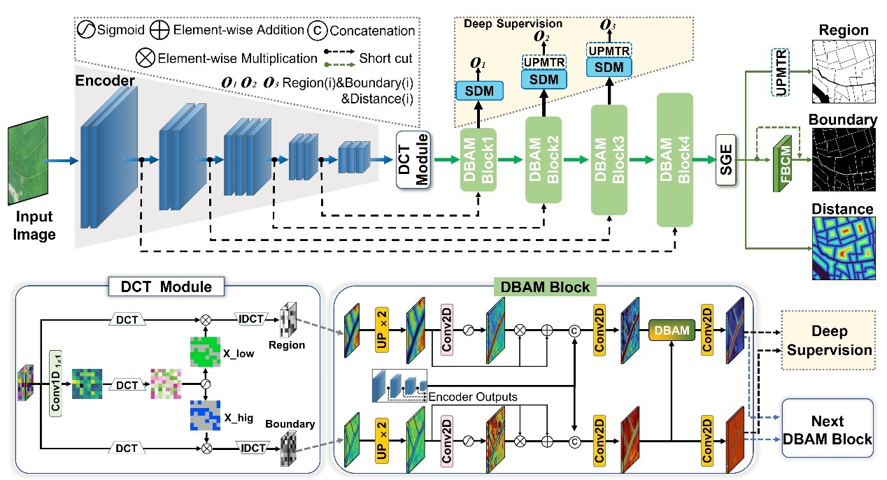
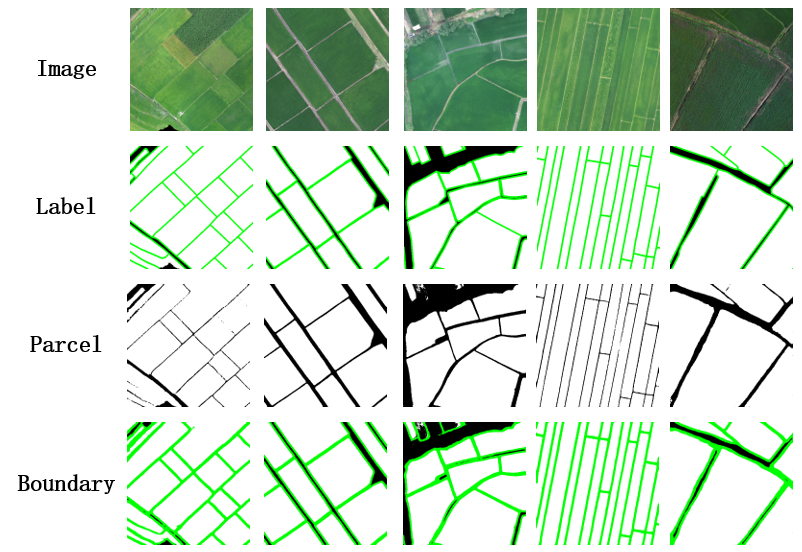
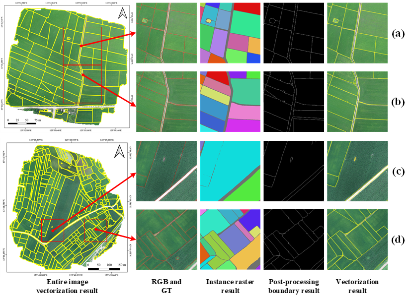

## Introduction

Agricultural Cultivation Field Parcels (CFP) refer to areas within a
specific land boundary where a single type of crop is cultivated during
each agricultural production cycle. They are the smallest units for
farmers to carry out agricultural activities such as sowing, management,
and harvesting, and also serve as the fundamental units for implementing
precision agriculture. In theory, they should be regarded as the minimum
units for crop area statistics and yield estimation. Traditional CFP
mapping primarily relies on field survey methods to collect location
information followed by manual digitization, which is costly and
inefficient. With the rapid development of remote sensing technology,
especially the widespread application of high-resolution data and
continuous advancements in imagery interpretation techniques, the
efficient and automated extraction of CFP information has become
increasingly feasible. However, previous studies have mainly depended on
pixel-level classification methods and object-level analysis techniques
based on imagery segmentation (such as superpixel regions), which
generally lack agricultural semantics and are difficult to achieve a
one-to-one correspondence with actual CFP. An end-to-end boundary-field
multi-task learning CFP vectorization framework (Cultivated Parcel
Vectorization Framework, CPVF) proposed based on ultra-high-resolution
imagery not only enables precise correspondence with real CFP but also
addresses current research challenges in finer CFP extraction
(especially from aerial imagery).

## Experimental Area and Data

Jilin Province is located in the northeast region of China (between
121°38′ to 131°19′ E and 40°50′ to 46°19′ N), characterized by a
temperate continental monsoon climate with four distinct seasons, an
annual precipitation ranging from 400 to 900 mm, an annual average
temperature of 2--6 ℃, and average summer temperatures exceeding 23 ℃.
The topography generally slopes from southeast to northwest, with the
main landform types including mountains in the east and plains in the
central and western regions, where the plains are primarily represented
by the Songnen Plain and the Liaohe Plain. The major grain crops in
Jilin Province include maize, rice, soybean, and wheat. Among them,
maize is mainly cultivated in the central and western regions, with a
sowing period from late April to early May and a harvesting period in
mid-to-late September; rice is primarily cultivated in areas such as
Jilin City and Yanbian Prefecture, generally transplanted in mid-to-late
May and harvested in mid-to-late September; soybean is an important
grain crop in the western regions of Jilin Province, usually sown from
late April to early May and reaching maturity from late September to
early October.

The steps involved in data processing are the following:

1. Data preparation. Acquire UAV imagery datasets and prepare vector
parcel samples for label generation.

2. Data resampling. Resample the original imagery from 0.05 m
resolution to 0.2 m, and then convert the digitized vector parcel data
into raster format consistent with the resampled imagery, including both
parcel regions and parcel boundaries: on the one hand, shrink the vector
parcel polygons inward to generate parcel region masks and rasterize
them to obtain region labels; on the other hand, convert the vector
polygons into line data, buffer them with a width of 0.4 m to form
boundary bands, and rasterize them to obtain boundary labels.

3. Image--label pair generation. Apply a sliding-window algorithm with
a stride of 128 pixels to crop the original imagery into 1024 ×
1024-pixel patches, producing a total of 14,034 image--label pairs. For
imagery from other provinces, due to smaller data volumes, adopt
non-overlapping cropping at 512 × 512 pixels. Meanwhile, to ensure data
validity, remove image patches in which parcel area proportion is less
than 10%, and exclude large numbers of no-value regions at the UAV image
edges.

4. Euclidean distance map generation. Based on the above labels,
generate Euclidean distance maps to represent the distance from each
interior pixel of a parcel to the nearest boundary, thereby constructing
four-tuple label sets of image--parcel region--parcel boundary--distance
map.

The dataset constructed in this case is shown in @tbl-1-fields. Among
them, Jilin Province serves as the main region for training and
evaluation, while nine other provinces (Hebei, Tianjin, Henan, Shanxi,
Anhui, Zhejiang, Yunnan, Guangxi, and Hainan) are used to test the
model's generalization capability. Zhejiang includes summer
middle-season/late rice samples (Zhejiang 1) and early spring
early-season rice samples (Zhejiang 2), collectively covering diverse
parcel morphologies, crop types, boundary characteristics, and
topographic--climatic conditions. In addition, 360 independent UAV
images not involved in training or validation are selected as a separate
test set to ensure objectivity and reliability in model evaluation. The
relevant parameters of the UHR-CFP dataset are detailed in @tbl-1-fields.

|     Area         |     Size    |     Resolution（Meter）    |     Account    |     Train/Validation/Test    |     Date      |
|------------------|-------------|----------------------------|----------------|------------------------------|---------------|
|     Jilin        |     1024    |     0.2                    |     14034      |     8530/2131/3553           |     2023.7    |
|     Hebei        |     512     |     0.2                    |     310        |     0/0/310                  |     2023.7    |
|     Tianjin      |     512     |     0.2                    |     396        |     0/0/396                  |     2024.8    |
|     Shanxi       |     512     |     0.2                    |     267        |     0/0/267                  |     2024.7    |
|     Jiangsu      |     512     |     0.2                    |     251        |     0/0/251                  |     2022.8    |
|     Yunnan       |     512     |     0.2                    |     174        |     0/0/174                  |     2024.7    |
|     Guangxi      |     512     |     0.2                    |     151        |     0/0/151                  |     2023.8    |
|     Henan        |     512     |     0.2                    |     139        |     0/0/139                  |     2022.4    |
|     Anhui        |     512     |     0.2                    |     100        |     0/0/100                  |     2022.6    |
|     Hainan       |     512     |     0.2                    |     93         |     0/0/93                   |     2023.9    |
|     Zhejiang1    |     512     |     0.2                    |     452        |     0/0/452                  |     2022.8    |
|     Zhejiang2    |     512     |     0.2                    |     1800       |     1200/240/360             |     2023.3    |
: Dataset parameters {#tbl-1-fields}

## Methods

This section describes the steps for generating CFPs
using the CPVF method. Based on the dataset preparation method 
described in the previous
section, we builtimage--parcel region--parcel boundary--distance map
quadruple label sets for the study area. Then, we trained the 
PVF model to extract parcel regions and boundaries.
The DCP-MTL model (Drone-Based Cultivation Parcel Extraction
Multitask Learning, DCP-MTL) is employed to accurately extract the
regions and boundaries of CFPs from UAV imagery. Subsequently, a
Universal Vectorization Module (UVM) is utilized to generate vectorized
instances of CFPs, thereby achieving the Ready-To-Use (RTU) application
objective.

```{r}
#| echo: FALSE
#| label: fig-1-uav-fields
#| out-width: 90%
#| fig-cap: |
#|  Architecture of the DCP-MTL model. 
#| fig-align: center

```

In the DCP-MTL model, a Discrete Cosine Transform (DCT) module is
introduced for frequency-domain feature extraction, specifically
decoupling high-frequency features to enhance the representation
capability of parcel boundaries. Then, combined with deep supervision
techniques, a Dual-Branch Attention Module (DBAM) and an Uncertainty
Perception Module for Transition Regions (UPMTR) are designed to address
issues in multi-scale CFPs, such as incomplete extraction of large
parcels, failure to separately extract small or fragmented parcels, and
adhesion between parcels. Finally, together with the Field Boundary
Connectivity Module (FBCM), they form an integrated decoding module
aimed at enhancing the connectivity of blurred parcel boundaries and
improving the separability of densely adhered parcel regions.

After running DCP-MTL, we perform inference on the test sets using the trained model. 
Then, we converted the raster data of regions and boundaries obtained from the
DCP-MTL model into vector parcel data through post-processing, in order
to obtain RTU (Ready-to-Use) data.

## Results

@tbl-2-fields presents the quantitative evaluation results of the DCP-MTL
model on the UHR-CFP dataset, including pixel-level accuracy for both
parcel regions and parcel boundaries. In the table, P denotes Precision, R
denotes Recall, F1 represents the F1 score, IoU refers to the
Intersection over Union, mIoU indicates the mean IoU, BF1 represents the
boundary F1 score, BIoU refers to the boundary IoU, and BmIoU denotes
the mean boundary IoU. The results demonstrate that the DCP-MTL model
achieves satisfactory identification performance on both parcel regions
and parcel boundaries, confirming that compared to single-task semantic
segmentation approaches, modeling parcel region segmentation and parcel
boundary segmentation as two interrelated tasks within a multitask
framework can significantly enhance the overall performance of the
model.

|      Method      |      Region     |                |                 |                  |                   |      Boundary     |                   |                    |
|------------------|-----------------|----------------|-----------------|------------------|-------------------|-------------------|-------------------|--------------------|
|                  |      P (%)      |      R (%)     |      F1 (%)     |      IoU (%)     |      mIoU (%)     |      BF1 (%)      |      BIoU (%)     |      BmIoU (%)     |
|      DCP-MTL     |      95.09      |      94.11     |      94.33      |      92.88       |      82.72        |      70.57        |      60.94        |      78.15         |
: Accuracy results of DCP-MTL model for regions and boundaries. {#tbl-2-fields}

@tbl-3-fields presents the accuracy evaluation results of the DCP-MTL
model at both pixel-level and object-level. Here, GUC denotes the Global
Under-Classification error, GTC denotes the Global Total-Classification
error, and GOC denotes the Global Over-Classification error. The results
show that the DCP-MTL model achieves satisfactory performance across all
pixel-level evaluation metrics, demonstrating a clear advantage in
parcel boundary identification. The improved boundary accuracy
facilitates the separation of adjacent, previously conjoined parcels,
thereby enhancing the object-level identification outcomes.

|     Method     |     Pixel-class    |              |               |                |                 |                 |                 |     Object-class    |                |                |
|----------------|--------------------|--------------|---------------|----------------|-----------------|-----------------|-----------------|---------------------|----------------|----------------|
|                |     Region         |              |               |                |                 |     Boundary    |                 |     Region          |                |                |
|                |     P (%)          |     R (%)    |     F1 (%)    |     IoU (%)    |     mIoU (%)    |     BF1 (%)     |     BIoU (%)    |     GOC (%)         |     GUC (%)    |     GTC (%)    |
|     DCP-MTL    |     95.09          |     94.11    |     94.33     |     92.88      |     82.72       |     70.57       |     60.94       |     17.5            |     20.7       |     19.2       |
: Accuracy results of DCP-MTL model for pixels and objects {#tbl-3-fields}

@fig-2-uav-fields illustrates the identification details of the DCP-MTL
model. The first row shows the true color imagery, the second row
displays the ground truth labels, the third row presents the parcel
identification results, and the fourth row shows the boundary
identification results. The results indicate that in scenes where the
interior of the parcels is relatively homogeneous and the boundaries are
clear, the DCP-MTL model achieves accurate parcel area identification.
Although the boundary extraction performance is moderate, the
discontinuity of the boundary lines---especially when the boundary width
is narrow---often leads to boundaries being misclassified as parcel
areas, resulting in noticeable adhesion, which is particularly evident
in the first and third columns. In scenes where the parcels are narrow,
densely distributed, and have blurred boundaries (as in the fourth
column), both parcel and boundary identification perform relatively
better. The imagery in the fifth column is darker, with complex
background regions and heterogeneous parcel interiors, yet the DCP-MTL
model still achieves satisfactory identification results. Overall,
across diverse scenes, the outputs of the DCP-MTL model closely
approximate the ground truth, exhibiting excellent performance in both
parcel area accuracy and boundary detail extraction.

```{r}
#| echo: FALSE
#| label: fig-2-uav-fields
#| out-width: 90%
#| fig-cap: |
#|  Visualization of DCT-MTL model results. 
#| fig-align: center

```

@fig-3-uav-fields shows the vector parcel results of two complete images
(vector data shown in yellow). In each UAV image, two typical subregions
were selected as examples. The results of individual parcels were
obtained by performing connectivity analysis on the region data
generated by the DCP-MTL model. In subregions (a) and (b), parcels are
independent and exhibit no adhesion; whereas in subregions (c) and (d),
varying degrees of parcel adhesion occur---adhesion in (c) is mainly
caused by incomplete boundary extraction, while in (d) it results from
missing boundaries.

To further resolve issues of parcel adhesion or unclosed boundaries,
boundary refinement is applied through post-processing algorithms,
thereby obtaining complete and closed vector parcel data. Compared with
raster results, the vectorized results are smoother and more regular,
effectively reducing over-segmentation and under-segmentation problems
caused by blurred or broken parcel boundaries.

```{r}
#| echo: FALSE
#| label: fig-3-uav-fields
#| out-width: 90%
#| fig-cap: |
#|  Field parcels detected by vectorization. 
#| fig-align: center

```

## Conclusions

The CPVF approach enables end-to-end acquisition of vectorized
instance-level CFP results from ultra-high spatial resolution imagery,
without being constrained by specific geographic regions, terrain types
(such as plains, hills, or mountains), or parcel distribution density,
thus demonstrating applicability across various complex farmland scenes.

The DCP-MTL model innovatively incorporates a DCT module for
frequency-domain feature extraction, and its integrated sub-decoder
module constructed with deep supervision exhibits generalizable feature
learning and multi-task synergy capabilities. Notably, the DBAM and
UPMTR modules enhance fine-grained boundary representation and improve
the separability of parcel areas, which can be extended to various
instance-level object extraction tasks characterized by blurred
boundaries or adhered targets. The Universal Vectorization Module (UVM)
contributes to improved boundary continuity and enables efficient RTU
vectorized delineation, making it suitable for vectorization scenes that
require preserving the geometric regularity and topological independence
of objects, beyond just CFP extraction.

Experimental results on the UHR-CFP dataset have validated the
superiority of the DCP-MTL model, while its stable performance across
different farmland scenes further demonstrates that the core concept of
the CPVF approach can adapt to ultra-high spatial resolution imagery
acquired by various sensors. This provides a universally applicable and
complete solution for efficient instance-level object extraction and
vectorization. Such generality underscores its significant application
value and broad prospects for promotion in the fine-scale management of
agricultural, land, ecological, and other domains.

## Code and data availability 

The code for the model and experiment is available in [Github](https://github.com/BNU-RS/UHR-CFP).


