## Introduction


Leaf Area Index (LAI) is defined as the total leaf area of crop foliage
per unit of land surface. It is a key parameter that governs
photosynthesis, respiration, and transpiration processes within the
vegetation canopy. As one of China's most important grain crops, winter
wheat requires timely, accurate, and efficient monitoring of LAI for
assessing crop growth, guiding irrigation and fertilization, and
supporting yield forecasting. Traditionally, LAI measurements for winter
wheat have relied on destructive sampling methods---harvesting plant
specimens and manually calculating leaf area. While these methods yield
accurate results, they are time-consuming, labor-intensive, and costly,
making them unsuitable for large-scale, real-time agricultural
applications. Remote sensing has emerged as a powerful, non-destructive
technique for monitoring crop growth parameters. In particular,
low-altitude remote sensing using Unmanned Aerial Vehicles (UAVs) has
developed rapidly in recent years. UAV-based sensing systems offer high
spatial resolution, rapid data acquisition, low cost, and flexible
deployment without requiring airspace approvals. These advantages help
bridge the limitations of both ground-based observations and satellite
remote sensing in multi-scale, dynamic monitoring of crop growth, and
have enabled broad applications in various aspects of precision
agriculture.

## Experimental Area and Data

The experiment was conducted during the 2017-2018 growing season at the
Regional Experimental Station in Xindian Town, Yancheng District, Luohe
City, Henan Province, China (113°53′1″E, 33°41′60″N). The experimental
study area is shown in Figure 1. The soil in the study area contained
13.33 g/kg of organic matter, 1.02 g/kg of total nitrogen, 92.33 g/kg of
alkali-hydrolyzable nitrogen, 54.02 mg/kg of available phosphorus, and
299 mg/kg of available potassium. Four winter wheat varieties were
tested: Zhoumai 27 (ZM27), Yumai 49-198 (YM49-198), Xinong 509 (XN509),
and Aikang 58 (AK58). Four nitrogen application levels were set: 0, 120,
225, and 330 kg/hm², denoted as N0, N8, N15, and N22, respectively. The
experiment followed a split-plot design with three replications,
comprising 44 plots in total. Each plot measured 144m² (16 m×9 m).
Nitrogen fertilizer was applied in a 6:4 ratio between the base and
topdressing stages. The base fertilizer was applied before sowing, and
the topdressing was applied at the jointing stage. Sowing was conducted
by machine on October 23, 2017, with a seeding rate of 180 kg/hm². All
other cultivation and field management practices followed those typical
of high-yielding wheat fields. The layout of the experimental design is
illustrated in @fig-1-uav-wheat.

```{r}
#| echo: FALSE
#| label: fig-1-uav-wheat
#| out-width: 90%
#| fig-cap: |
#|   Experiment layout.
#| fig-align: center
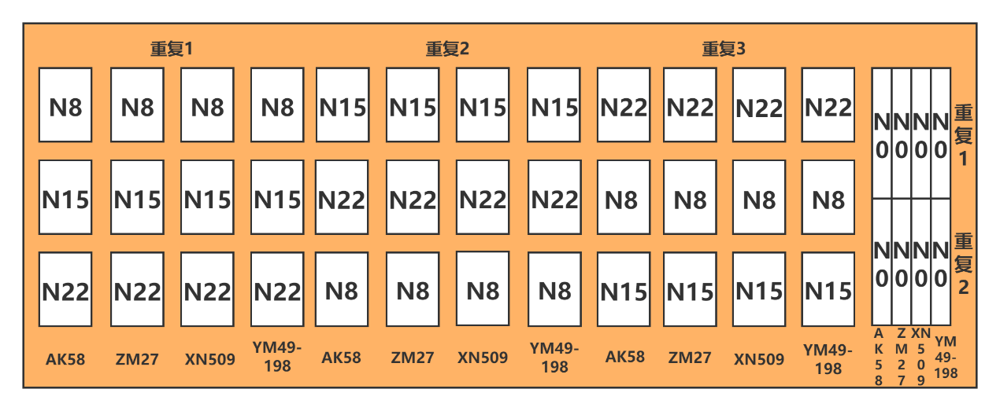
```

Experimental data were collected at three critical growth stages of
winter wheat in 2018, namely, the jointing stage (March 11), the booting
stage (April 8), and the grain-filling stage (May 12). During each
stage, UAV-based hyperspectral imagery, ground-based hyperspectral data,
and LAI measurements were acquired simultaneously.

The UAV remote sensing platform consisted of an AZUP-T8 octocopter
produced by Zero UAV (China), equipped with a UHD185 hyperspectral
imaging sensor developed by Cubert GmbH (Germany). The sensor covered a
spectral range of 450-950 nm, with 125 spectral bands, a spectral
sampling interval of 4 nm, and a spectral resolution of 8 nm. Data
acquisition was conducted under clear, cloud-free conditions with low
wind speed. Prior to each flight, the UHD185 sensor was radiometrically
calibrated using a reference panel. The UAV was flown at a speed of 6
m/s and an altitude of 50 meters, with 80% forward overlap and 60% side
overlap between flight lines.


Ground hyperspectral data were collected using an ASD FieldSpec 4
portable spectrometer prior to UAV flights. The spectral range of the
ASD device was 350-2500 nm, with a sampling interval of 1.4 nm for
350-1000 nm and 2 nm for 1000-2500 nm, and a spectral resolution of 3 nm
and 2 nm, respectively. The field of view was 25 degrees. During data
acquisition, the probe was maintained at a vertical distance of
approximately 1 meter above the crop canopy. For each plot, three
representative locations with uniform growth were randomly selected. At
each location, ten spectral measurements were taken and averaged as the
spectral reflectance of the winter wheat canopy. Standard white panel
calibration was performed before and after each measurement. The
geographic coordinates (latitude and longitude) of each sampling point
were recorded using a handheld differential GPS device.

LAI samples were collected at the same locations as the ground spectral
measurements, where 10 representative samples were taken from each
location and immediately brought back to the laboratory in sealed bags
for stem and leaf separation.

## Methods

A total of 132 samples were collected during the experiment. After
removing 8 samples due to experimental errors, 124 samples were retained
for integrated data analysis. Among them, replicates 1 and 3 were used
as the modeling dataset (80 samples), while replicate 2 was served as
the validation dataset (44 samples). The statistical characteristics of
LAI in each dataset are presented in @tbl-1-uav-wheat.


|     Sample type        |     Sample Number    |     Maximum Value    |     Minimum Value    |     Mean Value    |     Standard Deviation    |     Coefficient of Variation    |
|------------------------|----------------------|----------------------|----------------------|-------------------|---------------------------|---------------------------------|
|     Total Sample       |     124              |     8.38             |     1.78             |     5.43          |     1.70                  |     0.32                        |
|     Calibration set    |     80               |     8.38             |     1.78             |     5.33          |     1.74                  |     0.33                        |
|     Validation set     |     1.78             |     8.24             |     3.10             |     5.62          |     1.62                  |     0.30                        |
: Statistical characteristics of LAI of winter wheat {#tbl-1-uav-wheat}

Based on the above data, the feature band extraction was carried out
using the following methods: first-order differentiation (FD),
successive projection algorithm (SPA), competitive adaptive reweighted
sampling (CARS), and competitive adaptive reweighting algorithm combined
with successive projection algorithm (CARS_SPA). Using both the selected
feature bands and the full spectral range, three machine learning
algorithms were employed to construct LAI prediction models: Partial
Least Squares Regression (PLSR), Support Vector Machine Regression
(SVR), and Extreme Gradient Boosting (XGBoost). The UAV data processing
and analysis workflow is shown in @fig-2-uav-wheat.

```{r}
#| echo: FALSE
#| label: fig-2-uav-wheat
#| out-width: 90%
#| fig-cap: |
#|  Flow chart of winter wheat LAI model estimation method.
#| fig-align: center
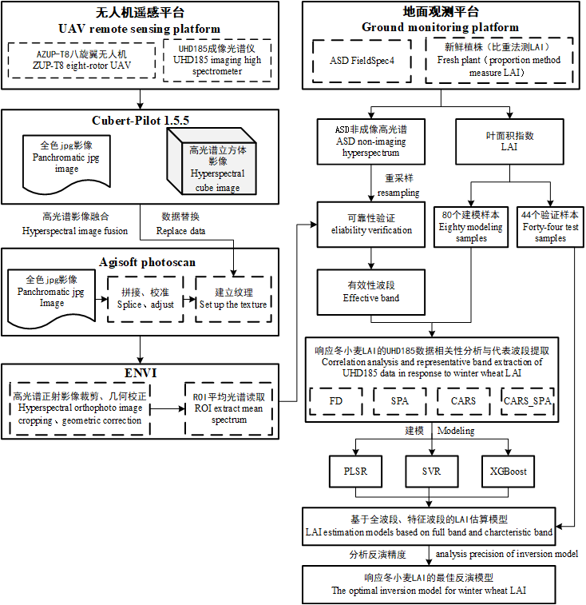
```

### Spectral Signature Extraction Algorithms

First-order differentiation (FD) is a first-order derivative transformation applied to hyperspectral data to effectively eliminate background noise caused by linear or
near-linear spectral trends. This enhances spectral contrast and
improves the differentiation of spectral features.

Successive Projection Algorithm (SPA)  selects a subset of wavelengths 
from the spectral matrix with
minimal redundant information, thereby minimizing multicollinearity
among variables. This substantially reduces the number of input
variables required for modeling, simplifies the model structure, and
improves both the stability and accuracy of the prediction model.

Competitive Adaptive Reweighted Sampling (CARS) is a 
novel variable selection algorithm based on the principle of
"survival of the fittest." It iteratively eliminates variables with
lower absolute regression coefficient weights in the PLSR model by using
an Exponential Decay Function (EDF) and Adaptive Reweighted Sampling
(ARS) technique. Through cross-validation, the optimal subset of
variables is identified by selecting the subset with the lowest Root
Mean Square Error of Cross-Validation (RMSECV) among the N repeated
selections.

The Combined CARS and SPA Method (CARS_SPA) integrates the strengths of both the CARS and SPA
algorithms. By combining their complementary advantages, it maximizes
the reduction of spectral redundancy while also minimizing the
interference of irrelevant bands in the SPA computation process.

### Machine Learning Algorithms

Partial Least Squares Regression (PLSR) is a multivariate regression 
method that models multiple dependent
variables against multiple independent variables. It integrates the
advantages of Principal Component Analysis (PCA), Canonical Correlation
Analysis (CCA), and Multiple Linear Regression (MLR), which can
effectively address multicollinearity among predictors and is
particularly suitable for modeling with small sample sizes.

Support Vector Machine Regression (SVR) is a regression algorithm 
derived from Support Vector Machines (SVM)
that uses Lagrange multipliers to construct the regression function. It
is particularly effective for small sample learning and handles
nonlinear problems by transforming them into linear problems in a
higher-dimensional space through kernel functions. Gaussian kernel
function (RBF kernel function) is used as the kernel function in this
study. The GridSerachCV function is used to find the optimal parameters:
penalty coefficients cost and gamma.

Extreme Gradient Boosting (XGBoost), proposed by Tianqi Chen [@Chen2016], 
is an efficient and scalable ensemble
learning algorithm that improves upon traditional Gradient Boosting
methods. It applies a second-order Taylor expansion of the objective
function to enhance optimization flexibility and applicability, thus
enabling the use of custom loss functions. XGBoost also incorporates
strategies similar to those used in Random Forests, supports data
sampling, and leverages multi-core CPU parallelism to significantly
boost computational efficiency and predictive accuracy. The main
hyperparameters optimized in the XGBoost model include: n_estimators
(number of boosting rounds), max_depth (maximum tree depth),
min_child_weight (minimum sum of instance weight in a child node), gamma
(minimum loss reduction required to make a further partition), subsample
and colsample_bytree (sampling ratios for rows and features), and
learning_rate (shrinkage factor for step size).

### Model Evaluation Metrics

To assess the reliability of the winter wheat LAI estimation models,
three commonly used statistical indicators were selected: the
coefficient of determination (R²), root mean square error (RMSE), and
mean absolute error (MAE). R² measures the goodness of fit; 
a value closer to 1 indicates a
stronger correlation between the measured and predicted values. RMSE
evaluates the average magnitude of prediction errors. A smaller RMSE
indicates higher predictive accuracy. MAE calculates the average of the
absolute errors, providing an intuitive measure of the actual prediction
deviation.

## Results

To verify the reliability of hyperspectral data acquired by the
UAV-mounted UHD185 sensor, canopy spectra of winter wheat collected by
the ASD FieldSpec spectrometer were first resampled to match the
spectral bands of the UHD185. The average reflectance of the resampled
data was then calculated for comparison.

Overall, the spectral trends obtained from the UHD185 and ASD sensors
showed a high degree of consistency in the 458-830 nm range. Notably,
both exhibited similar characteristics in the green peak region and
red-edge region. In the 830-950 nm range, the reflectance captured by
the UHD185 gradually declined, showing a downward trend, while the ASD
spectra remained relatively stable. This discrepancy is due to the fact
that the 830-950 nm range lies near the edge of the UHD185 sensor's
detection range, where signal noise tends to be higher (see @fig-3-uav-wheat).

Furthermore, a correlation analysis was conducted between the UHD185
data and the resampled ASD spectra within the 458-830 nm range. The
results showed a strong correlation, with the coefficient of
determination (R²) exceeding 0.99, as shown in @fig-3-uav-wheat.

These findings indicate that the UHD185 hyperspectral data in the
458-830 nm range (corresponding to bands 3-96) are reliable and suitable
for use in the estimation of winter wheat LAI.

```{r}
#| echo: FALSE
#| layout-ncol: 2
#| label: fig-3-uav-wheat
#| fig-cap: |
#|  Comparison of UHD185 and resampling ASD.
#| fig-subcap:
#|    - Comparison between spectral curves.
#|    - Correlation between spectral reflectance.
#| fig-align: center
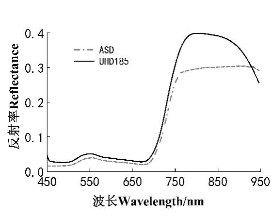
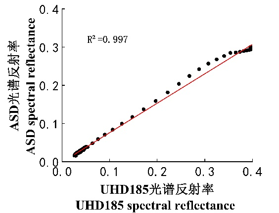
```


Correlation analysis was conducted between the measured LAI of winter
wheat and both the original canopy spectral reflectance and the FD
spectra within the 458-830 nm wavelength range. The variation curves of
the correlation coefficients are shown in @fig-5-uav-wheat.

As shown in the figure, in the analysis using the original spectral
data, the maximum negative correlation between LAI and reflectance
occurred at 654 nm with a coefficient of R = -0.80, while the maximum
positive correlation was observed at 802 nm with R = 0.49. For the FD
spectra, the correlation coefficients exhibited larger fluctuations. In
this case, the maximum negative correlation was observed at 546 nm
(R = -0.74), and the maximum positive correlation occurred at 774 nm
(R = 0.83). Wavelength regions with a correlation coefficient absolute
value greater than 0.6 included: 498-506, 542, 546, 738-786, and 830 nm.

```{r}
#| echo: FALSE
#| label: fig-5-uav-wheat
#| out-width: 70%
#| fig-cap: |
#|  Correlation between UHD185 hyperspectral data and wheat LAI.
#| fig-align: center
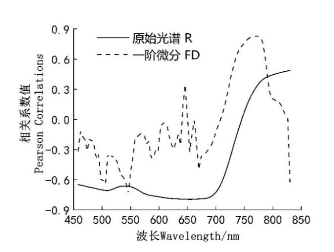
```

Four methods---FD, SPA, CARS, and the combined CARS_SPA---were employed
to select hyperspectral bands relevant to the LAI of winter wheat.
From the correlation curve between LAI and the first-order derivative
spectral reflectance (@fig-5-uav-wheat), feature bands were selected based
on local maxima at inflection points. To avoid selecting multiple highly
correlated bands within narrow spectral intervals, only the most
prominent bands were retained. A total of four feature bands were
selected using the FD method, all with correlation coefficients greater
than 0.6, accounting for 4.25% of the total number of bands. These
selected bands were 506, 546, 774, and 830 nm.

@fig-6-uav-wheat shows the variable selection process 
using the SPA
algorithm. During SPA execution, the minimum number of selected bands
was set to 5, and the maximum to 94. As shown in @fig-6-uav-wheat, the
minimum RMSE of 1.049 was obtained when the number of variables reached
the optimal band count. @fig-7-uav-wheat displays the 28 optimal feature
bands selected by SPA, accounting for 29.8% of all spectral variables.
These bands were: 458, 466, 474, 482, 498, 502, 506, 510, 518, 526, 530,
534, 542, 546, 558, 566, 570, 574, 610, 626, 650, 658, 686, 698, 710,
762, 814, and 830 nm.

```{r}
#| echo: FALSE
#| layout-ncol: 2
#| label: fig-6-uav-wheat
#| fig-cap: |
#|  SPA variable filtering process
#| fig-subcap: 
#|    - number of model variables.
#|    - variable indexes.
#| fig-align: center
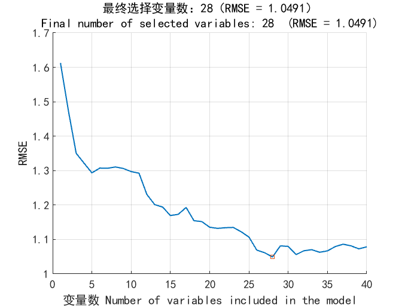
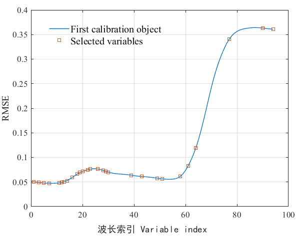
```


@fig-8-uav-wheat illustrates the feature band selection process using the
CARS (Competitive Adaptive Reweighted Sampling) method. As shown in the top
part (a), with the increase in CARS iterations, the number of
retained wavelengths gradually decreases, and the rate of reduction
slows down over time. The middle part (b) of @fig-8-uav-wheat presents the 
trend of RMSECV as the number of sampling
iterations increases. Initially, RMSECV decreases slightly and remains
relatively stable; however, after 47 iterations, RMSECV begins to
increase sharply, indicating that some important spectral information
was eliminated, leading to a decline in model performance.

The bottom part (c) of @fig-8-uav-wheat
displays the variable stability plot, where each curve
represents the selection frequency trend of a specific variable across
iterations. The iteration at which RMSECV reached its minimum value
(0.9674) occurred at 24 iterations, as indicated by a red asterisk in
the figure. At this point, a total of 13 feature bands were selected,
accounting for 13.8% of the total number of spectral bands. These
selected bands were: 566, 586, 602, 610, 634, 682, 698, 710, 730, 734,
790, 802, and 814 nm.

```{r}
#| echo: FALSE
#| label: fig-8-uav-wheat
#| out-width: 100%
#| fig-cap: |
#|  Variable selection process by CARS: (a) Variation trend of variables; (b) 10-fold RMSEV values; (c) Variable regression coefficient. 
#| fig-align: center
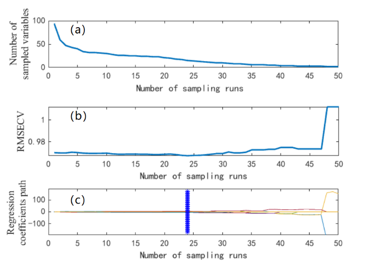
```

@fig-9-uav-wheat illustrates the feature band selection process using the
CARS_SPA algorithm. After the feature bands were initially selected
using the SPA algorithm, the number of variables reduced from 94 to 28.
Due to the complexity of the SPA calculation process, and the
possibility that some irrelevant wavelengths were selected, the CARS
algorithm was applied for a secondary feature selection. This
effectively removed wavelengths with lower weights, resulting in a more
refined set of variables closely related to LAI. When the CARS algorithm 
was run for 15 iterations, the RMSECV reached
its minimum value (RMSECV=0.9718), and 9 feature bands were selected,
accounting for 9.57% of the total variables. These selected bands were:
466, 474, 518, 526, 610, 658, 710, 814, and 830 nm.

```{r}
#| echo: FALSE
#| label: fig-9-uav-wheat
#| out-width: 100%
#| fig-cap: |
#|  Variable selection process by CARS-SPA (a) Variation trend of variables; (b) 10-fold RMSEV values; (c) Variable regression coefficient. 
#| fig-align: center
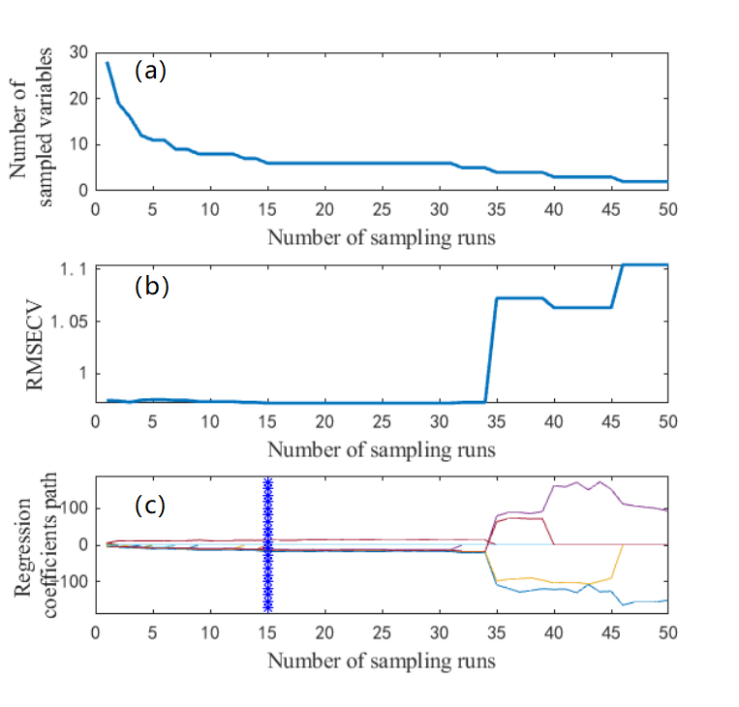
```


@fig-10-uav-wheat shows the distribution of LAI-related feature bands
selected by the four different variable selection methods. While some
feature bands overlapped, others varied depending on the selection
algorithm used.

```{r}
#| echo: FALSE
#| label: fig-10-uav-wheat
#| out-width: 100%
#| fig-cap: |
#|  Distribution of characteristic bands with different variable selection methods. 
#| fig-align: center
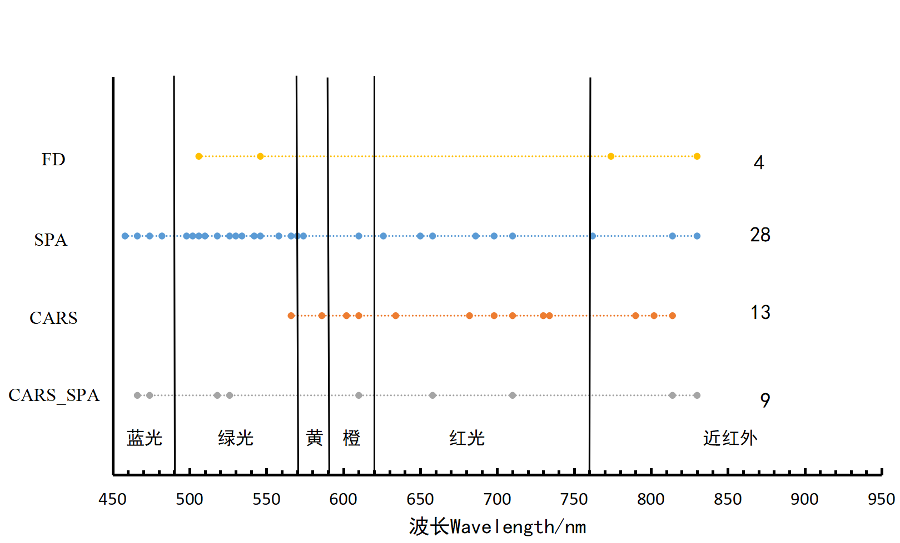
```


Based on the winter wheat LAI feature bands selected by different
variable selection methods and full spectral information, three modeling
methods were used to construct LAI estimation models, which were then
validated using independent samples. The results are shown in @tbl-2-uav-wheat. 
In the PLSR model, the model constructed using the 9 feature bands
selected by CARS_SPA showed minimal difference between the training R²
and the validation R², with both values being relatively close.
Additionally, the RMSE and MAE values were low, indicating that the
model was stable. The model performance for the training and validation
datasets was as follows: R²=0.83, RMSE=0.73, and MAE=0.59 for the
training set, and R²= 0.83, RMSE=0.74, and MAE=0.57 for the validation
set. The model constructed using the 28 feature bands selected by SPA
performed the worst, with R²=0.79, RMSE=0.81, and MAE=0.66 for the
training set, and R²=0.78, RMSE=0.81, and MAE=0.61 for the validation
set.

|     Modelling method          |     Variable     Extraction     Selection Method    |     Selection     Number of   Wavelengths    |     Modelling Calibration    |                  |                  |     Validation    |                  |             |
|-------------------------------|-----------------------------------------------------|----------------------------------------------|------------------------------|------------------|------------------|-------------------|------------------|-------------|
|                               |                                                     |                                              |     R²                       |     RMSE         |     MAE          |     R² RMSE       |     RMSE         |     MAE     |
|     PLSR                      |     Full_band                                       |     Full_band                                |     0.79                     |     0.81         |     0.81         |     0.81 0.66     |     0.79         |     0.58    |
|                               |     FD                                              |     4                                        |     0.81                     |     0.77         |     0.63         |     0.81          |     0.75         |     0.60    |
|                               |     SPA                                             |     28                                       |     0.79                     |     0.81         |     0.66         |     0.78          |     0.81         |     0.61    |
|                               |     CARS                                            |     13                                       |     0.80                     |     0.79         |     0.63         |     0.81          |     0.81 0.78    |     0.59    |
|                               |     CARS_SPA                                        |     9                                        |     0.83 0.73                |     0.83 0.73    |     0.73 0.59    |     0.83          |     0.74         |     0.57    |
|     SVR                       |     Full_band                                       |     0.83 0.74 0.57 SVR Full_band             |     0.80                     |     0.79         |     0.79         |     0.63 0.77     |     0.79         |     0.59    |
|                               |     FD                                              |     4                                        |     0.80                     |     0.78         |     0.59         |     0.80          |     0.72         |     0.57    |
|                               |     SPA                                             |     28                                       |     0.81                     |     0.75         |     0.59         |     0.79          |     0.76         |     0.56    |
|                               |     CARS                                            |     13                                       |     0.79                     |     0.79         |     0.63         |     0.77          |     0.79         |     0.61    |
|                               |     CARS_SPA                                        |     9                                        |     0.82                     |     0.75         |     0.58         |     0.58 0.84     |     0.65         |     0.47    |
|     XGBoost                   |     Full_band                                       |     0.93                                     |     0.50                     |     0.50         |     0.50         |     0.40          |     0.79         |     0.63    |
|                               |     FD                                              |     4                                        |     0.88                     |     0.65         |     0.53         |     0.81          |     0.75         |     0.66    |
|                               |     SPA                                             |     28                                       |     0.84                     |     0.73         |     0.61         |     0.76          |     0.82         |     0.64    |
|                               |     CARS                                            |     13                                       |     0.82                     |     0.82         |     0.66         |     0.82          |     0.84         |     0.64    |
|                               |     CARS_SPA                                        |     9                                        |     0.89 0.63                |     0.63         |     0.63 0.51    |     0.51 0.89     |     0.55         |     0.46    |
: Regression analysis of characteristic bands and winter wheat LAI {#tbl-2-uav-wheat}

In the SVR models, the evaluation metrics of all models were similar.
Among them, the model constructed using the 9 feature bands selected by
CARS_SPA and SVR performed the best, with the following results:
R²=0.82, RMSE=0.75, and MAE=0.58 for the training set, and R²=0.84,
RMSE=0.65, and MAE=0.47 for the validation set.

In the analysis of the models built using the XGBoost method, the model
constructed with the 28 feature bands selected by SPA performed the
worst, with R²=0.84, RMSE=0.73, and MAE=0.61 for the training set, and
R²=0.76, RMSE=0.82, and MAE=0.64 for the validation set. The best
performance was observed with the model constructed using the 9 feature
bands selected by CARS_SPA, with R²=0.89, RMSE=0.63, and MAE=0.51 for
the training set, and R²=0.89, RMSE=0.55, and MAE=0.46 for the
validation set.

After a comprehensive analysis of both the training and validation
results, the model constructed using the 9 feature bands selected by
CARS_SPA showed the best performance when combined with different
modeling methods. This can be attributed to the fact that the 9 feature
bands selected by CARS_SPA are evenly distributed across the spectral
range of 458-830 nm, thus capturing spectral information that is highly
relevant for LAI inversion. The next best results were achieved using
the 4 feature bands selected by FD. Compared to the full spectral bands,
the four LAI models built using the CARS_SPA selected feature bands
outperformed the models constructed using the full spectral data. The
performance of other models, built using different variable selection
methods, varied in comparison with the full-spectrum models.

From the results above, it can be seen that by selecting feature
variables, we can significantly reduce the number of variables used in
modeling, lower the model complexity, and improve modeling efficiency
while maintaining accuracy. Among the three machine learning methods,
the XGBoost model performed the best, followed by PLSR and SVR. The best
modeling and validation results are shown in @fig-11-uav-wheat 
and @fig-12-uav-wheat.

```{r}
#| echo: FALSE
#| label: fig-11-uav-wheat
#| out-width: 70%
#| fig-cap: |
#|  Wheat LAI inversion and validation based on Model LAI_CARS_SPA_XGBoost: (a) Scattergram of calibration. 
#| fig-align: center
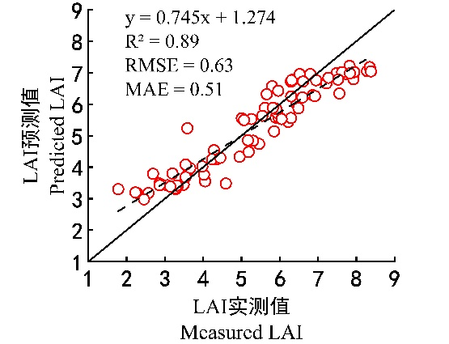
```

```{r}
#| echo: FALSE
#| label: fig-12-uav-wheat
#| out-width: 70%
#| fig-cap: |
#|   Wheat LAI inversion and validation based on Model LAI_CARS_SPA_XGBoost: (b) Relationship between measured and predicted LAI. 
#| fig-align: center
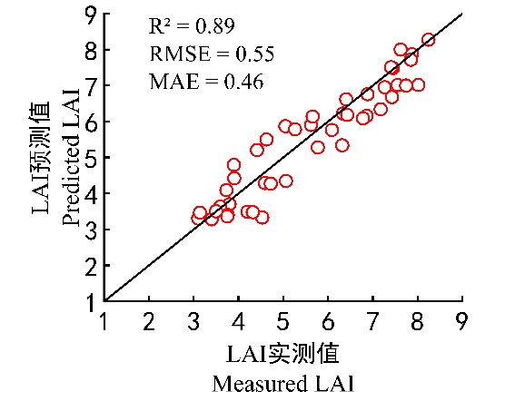
```

## Conclusions

Based on different nitrogen treatments and field experiments,
hyperspectral images and LAI at key growth stages of winter wheat were
obtained by the UAV platform equipped with hyperspectral imaging sensor.
Four algorithms were used to extract characteristic bands related to
LAI, and three ML methods were used to construct models for estimating
winter wheat LAI. We compared the reliability and accuracy of these
models, and found out that the XGBoost model constructed based on 9
characteristic bands selected by CARS_SPA algorithm exhibited the
highest accuracy. In this model, the R2, RMSE, and RPD of the
calibration set were 0.89, 0.63, and 2.51, respectively, and those of
the validation set were 0.89, 0.55, and 2.92, respectively. The
combination of CARS_SPA algorithm and Xgboost modeling method can reduce
input variables, improve the operation efficiency of the model, and
ensure a higher accuracy. Our results provide a reference for the
nondestructive and rapid acquisition of winter wheat LAI by UAV remote
sensing.

## About the authors

Xingming Ma (email: xinmingma@126.com) is a researcher at the College of Agronomy, Henan Agricultural University, Zhengzhou, China. 

Juanjuan Zhang is a researcher at the College of Agronomy, Henan Agricultural University, Zhengzhou, China.

Tao Cheng is a researcher at College of Information and Management, Henan Agricultural University, Zhengzhou, China.

## Reference